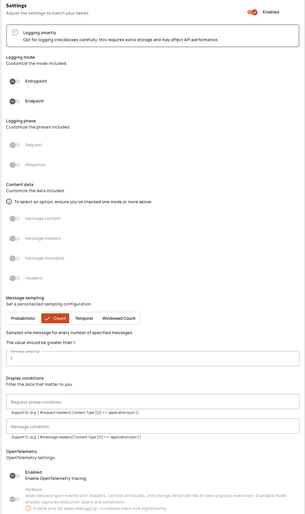

# Configure API-level Logs

## Overview

You can collect runtime logs for v4 proxy APIs and v4 message APIs, and webhook logs for v4 message APIs that use a webhook entrypoint.&#x20;

v4 message APIs that use a webhook entrypoint can have both runtime logs and webhook logs. These are different types of logs that must be explicitly enabled and configured, and are accessible from different pages in the APIM Console.

The following sections describe how to configure the logs for v4 APIs.&#x20;

## Configure v4 proxy API runtime logs


Select logging options carefully to optimize the value of recorded data against the potential for impact to API performance.


To enable and configure runtime logging for a v4 proxy API, complete the following steps:

1. Select **APIs** from your APIM Console's navigation menu.
2. Select the API for which you want to enable or modify logging.
3. From your API's menu, click **Logs**.
4.  Click **Configure Reporting**.

    <figure><figcaption></figcaption></figure>
5.  To enable logging, turn on the **Enabled** toggle.

    <figure><figcaption></figcaption></figure>
6. To configure which information is recorded, select from the following options:
   * **Logging mode:** Select from **Entrypoint** and **Endpoint** to customize which modes are logged.
   * **Logging phase:** Select from **Request** and **Response** to customize which phases are logged.
   * **Content data:** Select from **Headers** and **Payload** to customize which data is logged.
   * **Display conditions:** You can filter data based on a **Request phase condition**. This field supports the use of [Gravitee Expression Language](../../gravitee-expression-language.md).
   * **OpenTelemetry:** You can enable **OpenTelemetry** tracing to capture execution spans and conditions, and optionally **Verbose** tracing to capture detailed span events.

## Configure v4 message API runtime logs


Select logging options judiciously to optimize the value of recorded data against the potential for impact to API performance. Sampling is used to avoid excessive resource consumption and is only relevant to v4 message APIs.


To enable and configure runtime logging for a v4 message API, complete the following steps:

1. Select **APIs** from your APIM Console's navigation menu.
2. Select the API for which you want to enable or modify logging.
3. From your API's menu, click **Logs**.
4.  Click **Configure Reporting**.

    <figure><figcaption></figcaption></figure>
5.  To enable logging, toggle **Enabled** to ON.

    <figure><figcaption></figcaption></figure>
6. To configure which information is recorded, select from the following options:
   * **Logging mode:** Select from **Entrypoint** and **Endpoint** to customize which modes are logged.
   * **Logging phase:** Select from **Request** and **Response** to customize which phases are logged.
   * **Content data:** Select from **Message content**, **Message headers**, **Message metadata** and **Headers** to customize which data is logged.
   * **Message sampling:** Select an option to customize the sampling configuration.
     * **Probabilistic:** Messages are sampled based on a specified probability value between 0.01 and 0.5.
     * **Count:** When the message count reaches the specified value, that message is sampled, and then the message count resets.
     * **Temporal:** Messages are sampled based on a specified time duration value that conforms to ISO-8601 format.
     * **Windowed count:** A specified number of consecutive messages are sampled during a sliding time window, which conforms to an ISO-8601 duration. Once the message count is reached, no new messages are logged until the window closes and a new window begins.
   * **Display conditions:** You can filter the message data based on a **Request phase condition** and a **Message condition**. Each of these fields supports the use of [Gravitee Expression Language](../../gravitee-expression-language.md).
   * **OpenTelemetry:** You can enable **OpenTelemetry** tracing to capture execution spans and conditions, and optionally **Verbose** tracing to capture detailed span events.

## Configure v4 message API webhook logging


Select logging options judiciously to optimize the value of recorded data against the potential for impact to API performance. Sampling is used to avoid excessive resource consumption and is only relevant to v4 message APIs.


You can configure webhook logging i.e callback HTTP request/response, for v4 message APIs that use the webhook entrypoint. To enable and configure webhook logging for a v4 message API, complete the following steps:

1. Select **APIs** from your APIM Console's navigation menu.
2. Select the API for which you want to enable or modify logging.
3. From your API's menu, click **Webhooks**.
4.  Click **Configure Webhook Reporting**.

    <figure><figcaption></figcaption></figure>
5.  To enable logging, toggle **Enabled** to ON.

    
<figure><figcaption></figcaption></figure>

6. To configure which optional information is recorded, select from the following options:
   * Request body
   * Request headers
   * Response body
   * Response headers
7. Click **Save**.
