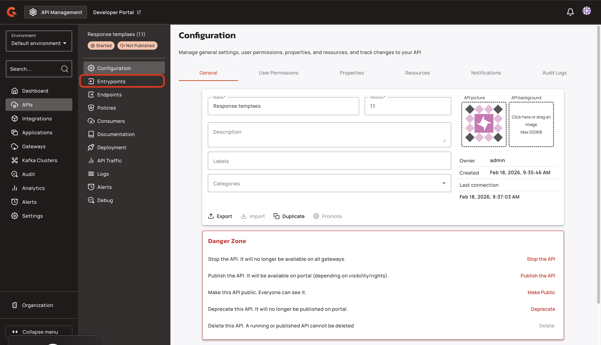
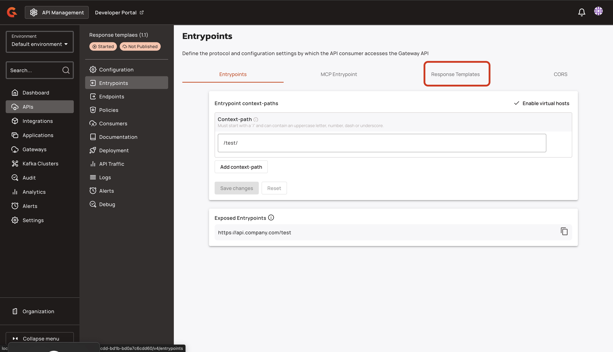
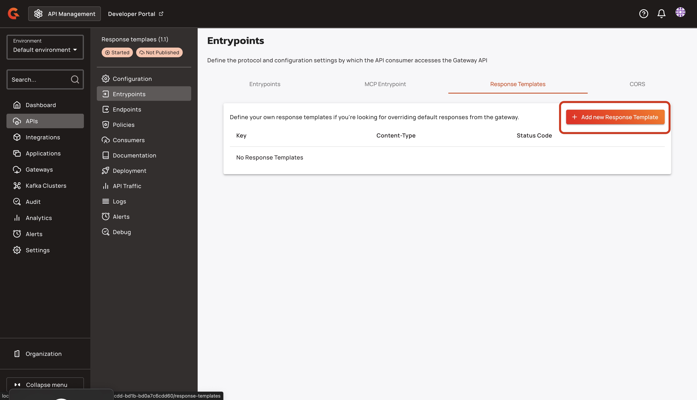
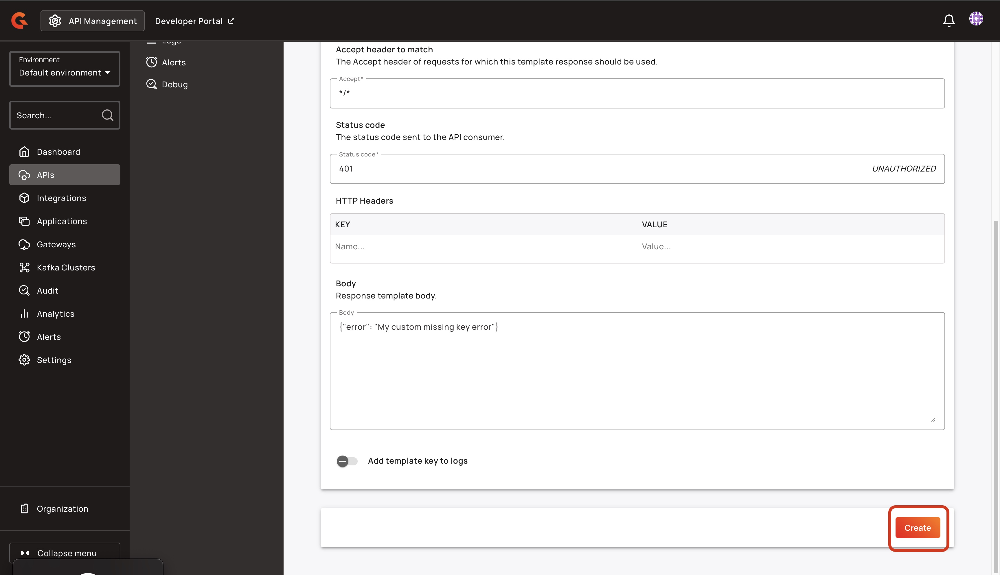
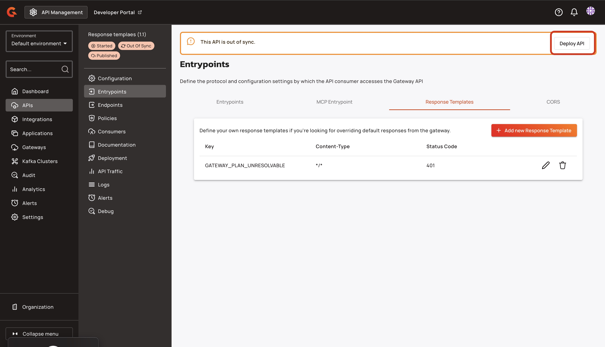

# Response Templates

## Overview


Response templates cannot override message-level errors or be applied to TCP proxy entrypoints.


You can change the default values in the response to an API call using response templates. Response templates are triggered by template keys. Response templates define the new values to be returned for one or more status codes when the template is triggered. You can implement response templates for the following v4 API HTTP entrypoints:

* HTTP GET
* HTTP POST
* HTTP proxy
* SSE
* Webhook
* WebSocket

You can apply response templates to a response if the error is associated with a policy or endpoint whose error keys can be overridden. For more information about template keys, see [#template-keys](response-templates.md#template-keys "mention").

When you create response templates, you can define templates in the following ways:

* Multiple templates for one API. You can configure response templates for multiple policies or multiple error keys that are sent by the same policy.
* Multiple template definitions for the same error key in a response template. You can configure response templates for different content types or status codes.

## Prerequisites

* A v4 API with the policy or endpoint that you want to set the response template for. For more information about creating a v4 API, see [create-an-api.md](../../getting-started/create-and-publish-your-first-api/create-an-api.md "mention").

## Create a response template

1.  From the **Dashboard**, click **APIs**. <br>

    <figure><figcaption></figcaption></figure>
2.  Select the API that you want to configure response templates for.<br>

    <figure><figcaption></figcaption></figure>
3.  From the API's menu, click **Entrypoints**.<br>

    <figure><figcaption></figcaption></figure>
4.  Click **Response Templates**.<br>

    <figure><figcaption></figcaption></figure>
5.  Click **+ Add new Response Template**.<br>

    <figure><figcaption></figcaption></figure>
6. Create the response template. To create the response template, complete the following sub-steps:
   1.  From the **Template key** dropdown menu, select the Template key that you want to apply to the API. For example, `GATEWAY_PLAN_UNRESOLVABLE`. For more information about Template Keys, see [#template-keys](response-templates.md#template-keys "mention").<br>

       <figure><figcaption></figcaption></figure>
   2. In the **Accept header to match** field, enter the request header or request headers that trigger the response template. The default value is `*/*`.
   3. In the **Status Code** field, add the status code that you want to associate with the response template. For example, `401`.&#x20;
   4. (Optional) In the **HTTP Headers** field, enter the `KEY` and `VALUE` for the response.&#x20;
   5.  (Optional) In the **Body** field, enter the body of response that you want to return to the consumer. For example, `{"error": "Custom Missing Key Message"}`.<br>

       <figure><figcaption></figcaption></figure>
7.  Click **Create**. <br>

    <figure><figcaption></figcaption></figure>
8.  In the **This API is out of sync** pop-up banner, click **Deploy API**.<br>

    <figure><figcaption></figcaption></figure>
9.  In the **Deploy your API** pop-up menu, click **Deploy**.<br>

    <figure><figcaption></figcaption></figure>

## Verification

To verify if the complete the following steps:&#x20;

1.  Verify that the response templates appears in the **Response Templates** tab of the **Entrypoints** screen.<br>

    <figure><figcaption></figcaption></figure>
2.  Call your API to trigger your the error response. For example, if you set an API key plan for your API, call your API without the API key like the following example:<br>

    ```
    curl -i "http://<gateway-domain>:<gateway-port>/<api-context-path>" \
      -H "X-Gravitee-Api-Key: <your-api-key>"
    ```

    * Replace `<gateway_url>` with the URL for your Gateway.
    * Replace `<context_path>` with the context path for your API.

    \
    You receive the following message in the response:&#x20;

    ```bash
    {"error": "My custom missing key error"}% 
    ```

## Template Keys&#x20;

Here are the template keys that you can override by configuring response templates.

### Global Gateway Keys

The following template keys apply across all gateway-level operations and can be overridden regardless of which policy or endpoint triggered the error.

| **Template key**                | **Description**                                                                                                                                    |
| ------------------------------- | -------------------------------------------------------------------------------------------------------------------------------------------------- |
| `GATEWAY_OAUTH2_ACCESS_DENIED`  | <p>No valid subscription can be found for the <code>clientid</code>. </p><p></p><p>This template works for only for JWT or OAuth2 plan.</p><p></p> |
| `GATEWAY_OAUTH2_INVALID_CLIENT` | No clientld found in the Execution context.                                                                                                        |
| `GATEWAY_PLAN_UNRESOLVABLE`     | The Gateway cannot resolve or authenticate a request using any available security plan and must challenge the client for authentication.           |
| `GATEWAY_POLICY_INTERNAL_ERROR` | An internal error occurs during Policies execution.                                                                                                |
| `REQUEST_TIMEOUT`               | A `http.requestTimeout` is configured to be `> 0` with and the request is not finished before that time.                                           |

### Policy-Specific Template Keys

The following template keys are scoped to individual policies. Use these keys to define custom error responses for the specific policy responsible for the failure.

#### API Key

The following template keys are triggered when the API Key policy rejects a request due to a missing or invalid key.

| **Template key**  | **Description**                    |
| ----------------- | ---------------------------------- |
| `API_KEY_MISSING` | No API Key found in the request.   |
| `API_KEY_INVALID` | The API Key is revoked or expired. |

#### Callout HTTP

The following template keys are triggered when the Callout HTTP policy encounters an error condition or when a downstream callout request fails.

| **Template key**        | **Description**                                                                  |
| ----------------------- | -------------------------------------------------------------------------------- |
| `CALLOUT_EXIT_ON_ERROR` | The policy configuration `errorCondition` is evaluated to true.                  |
| `CALLOUT_HTTP_ERROR`    | The policy is configured with `exitonError=true` and the call out request fails. |

#### HTTP Signature

The following template key is triggered when the HTTP Signature policy fails to validate the cryptographic signature on an incoming request.

| **Template key**                   | **Description**                             |
| ---------------------------------- | ------------------------------------------- |
| `HTTP_SIGNATURE_INVALID_SIGNATURE` | The validation of the signature has failed. |

#### JSON Validation

The following template keys are triggered when the JSON Validation policy detects that a request or response payload fails schema validation or cannot be parsed.

| **Template key**                | **Description**                             |
| ------------------------------- | ------------------------------------------- |
| `JSON_INVALID_PAYLOAD`          | The request payload validation has failed.  |
| `JSON_INVALID_FORMAT`           | The request payload cannot be parsed.       |
| `JSON_INVALID_RESPONSE_PAYLOAD` | The response payload validation has failed. |
| `JSON_INVALID_RESPONSE_FORMAT`  | The response payload cannot be parsed.      |

#### JWT

The following template keys are triggered when the JWT policy cannot locate a token in the request or when token validation fails.

| **Template key**    | **Description**                           |
| ------------------- | ----------------------------------------- |
| `JWT_MISSING_TOKEN` | The token cannot be found in the request. |
| `JWT_INVALID_TOKEN` | The token's validation has failed.        |

#### OAuth2

The following template keys are triggered by the OAuth2 policy when access token introspection fails, the required scopes are insufficient, or the authorization server is unavailable.

| **Template key**                  | **Description**                                                                       |
| --------------------------------- | ------------------------------------------------------------------------------------- |
| `OAUTH2_MISSING_SERVER`           | No OAuth2 resource is found.                                                          |
| `OAUTH2_MISSING_HEADER`           | The Authorization header is not present in the request.                               |
| `OAUTH2_MISSING_ACCESS_TOKEN`     | The token extract is empty.                                                           |
| `OAUTH2_INVALID_ACCESS_TOKEN_KEY` | The introspection of the access token is not successful.                              |
| `OAUTH2_INVALID_SERVER_RESPONSE`  | The token introspection result does not have a valid payload.                         |
| `OAUTH2_INSUFFICIENT_SCOPE`       | The scope checking is enabled and the token's scopes do not meet the required scopes. |
| `OAUTH2_SERVER_UNAVAILABLE`       | The request to introspect of the access token fails.                                  |

#### Quota Limiting

The following template keys are triggered when the Quota Limiting policy detects that a consumer has exceeded their allocated request quota or encounters an internal processing error.

| **Template key**                | **Description**                                                                              |
| ------------------------------- | -------------------------------------------------------------------------------------------- |
| `QUOTA_TOO_MANY_REQUESTS`       | The quota policy detects that the limits has been exceeded.                                  |
| `QUOTA_SERVER_ERROR`            | The rate limit service plugin is not found.                                                  |
| `QUOTA_BLOCK_ON_INTERNAL_ERROR` | An error occurs during quota processing and the error strategy is `BLOCK_ON_INTERNAL_ERROR`. |

#### Rate Limiting

The following template keys are triggered when the Rate Limiting policy detects that a consumer has exceeded the configured request rate or encounters an internal processing error.

| **Template key**                        | **Description**                                                                                   |
| --------------------------------------- | ------------------------------------------------------------------------------------------------- |
| RATE\_LIMIT\_TOO\_MANY\_REQUESTS        | The ratelimit policy detects that the limits has been exceeded.                                   |
| RATE\_LIMIT\_SERVER\_ERROR              | The rate limit service plugin is not found.                                                       |
| RATE\_LIMIT\_BLOCK\_ON\_INTERNAL\_ERROR | An error occurs during rate limit processing and the error strategy is `BLOCK_ON_INTERNAL_ERROR`. |

#### Spike Arrest

The following template keys are triggered when the Spike Arrest policy detects a traffic spike that exceeds the configured threshold or encounters an internal processing error.

| **Template key**                       | **Description**                                                                            |
| -------------------------------------- | ------------------------------------------------------------------------------------------ |
| `SPIKE_ARREST_TOO_MANY_REQUESTS`       | The spike-arrest policy detects that the limits has been exceeded reached.                 |
| `SPIKE_ARREST_SERVER_ERROR`            | The rate limit service plugin is not found.                                                |
| `SPIKE ARREST_BLOCK_ON_INTERNAL_ERROR` | An error occurs during the processing and the error strategy is `BLOCK_ON_INTERNAL_ERROR`. |

#### Request Content Limit

The following template keys are triggered when the Request Content Limit policy detects that an incoming request body exceeds the configured size limit or is missing the required `Content-Length` header.

| **Template key**                        | **Description**                                          |
| --------------------------------------- | -------------------------------------------------------- |
| `REQUEST_CONTENT_LIMIT_TOO_LARGE`       | The request content is higher than the limit configured. |
| `REQUEST_CONTENT_LIMIT_LENGTH_REQUIRED` | The request does not have `Content-Length` header.       |

#### Request Validation

The following template key is triggered when the Request Validation policy determines that the incoming request does not conform to the defined validation rules.

| **Template Key**             | **Description**                    |
| ---------------------------- | ---------------------------------- |
| `REQUEST_VALIDATION_INVALID` | The request validation has failed. |

#### Resource Filtering

The following template keys are triggered when the Resource Filtering policy blocks a request because the HTTP method is not permitted or the requested path is forbidden.

| **Template Key**                        | **Description**                                          |
| --------------------------------------- | -------------------------------------------------------- |
| `RESOURCE_FILTERING_METHOD_NOT_ALLOWED` | The policy rejects the usage if the HTTP METHOD is used. |
| `RESOURCE_FILTERING_FORBIDDEN`          | The policy rejects the access to that path.              |

#### Role-Based Access Control

The following template keys are triggered when the RBAC policy cannot find the required user roles, or when the resolved roles do not match the policy's access rules.

| **Template Key**          | **Description**                                                                                            |
| ------------------------- | ---------------------------------------------------------------------------------------------------------- |
| `RBAC_INVALID_USER_ROLES` | User roles are found but are incorrect. For example, they are not a list or a string.                      |
| `RBAC FORBIDDEN`          | User roles are present and valid, but do not match the required roles defined in the policy configuration. |
| `RBAC_NO_USER_ROLE`       | No user roles can be found in the execution context.                                                       |

***

### Endpoint-Specific Template Keys

The following template keys are scoped to specific message broker and streaming endpoints. Use these keys to define custom error responses when an endpoint connection fails or an unknown error is encountered.

#### Kafka

The following template keys are triggered when the Kafka endpoint fails due to an invalid configuration, a closed connection, or an unexpected error during message processing.

| **Template key**                         | **Description**                        |
| ---------------------------------------- | -------------------------------------- |
| `FAILURE_ENDPOINT_CONFIGURATION_INVALID` | The endpoint configuration is invalid. |
| `FAILURE_ENDPOINT_CONNECTION_CLOSED`     | The kafka connection has been closed.  |
| `FAILURE_ENDPOINT_UNKNOWN_ERROR`         | An unknown error is caught.            |

#### Solace

The following template keys are triggered when the Solace endpoint fails to establish a connection or encounters an error during message subscription or publication.

| **Template key**                      | **Description**                                 |
| ------------------------------------- | ----------------------------------------------- |
| FAILURE\_ENDPOINT\_CONNECTION\_FAILED | The connection to Solace cannot be established. |
| FAILURE\_ENDPOINT\_SUBSCRIBE\_FAILED  | An error occurs during message consumption.     |
| FAILURE\_ENDPOINT\_PUBLISH\_FAILED    | An error occurs when message publication.       |

#### MQTT

The following template keys are triggered when the MQTT endpoint cannot establish or maintain a broker connection, or when an unhandled error occurs during messaging.

| **Template key**                     | **Description**                               |
| ------------------------------------ | --------------------------------------------- |
| `FAILURE_ENDPOINT_CONNECTION_FAILED` | The connection to MQTT cannot be established. |
| `FAILURE_ENDPOINT_UNKNOWN_ERROR`     | When an unknown error is caught.              |
| `FAILURE_ENDPOINT_CONNECTION_CLOSED` | The connection to MQTT has been closed.       |

#### RabbitMQ

The following template keys are triggered when the RabbitMQ endpoint cannot establish a connection to the broker or encounters an unhandled error during message processing.

| **Template key**                     | **Description**                                 |
| ------------------------------------ | ----------------------------------------------- |
| `FAILURE_ENDPOINT_CONNECTION_FAILED` | The connection to Rabbit cannot be established. |
| `FAILURE_ENDPOINT_UNKNOWN_ERROR`     | When an unknown error is caught.                |
