# Customize the navigation

## Overview

In the New Developer Portal, you can customize the navigation of your Developer Portal by using the **Navigation items** section of the New Developer Portal settings.

You can create the following elements for your navigation:

* **Pages**: Content of your New Developer Portal documentation.
* **Folders**: Use these to group related pages together into sections.
* **Links**: Connect your documentation to external sites or other internal resources.
* **APIs**: List your APIs in the New Developer Portal documentation.

When you add a new page, you can customize the page with Gravitee Markdown, which is standard Markdown enriched with dynamic components. For more information about Gravitee Markdown, see[gravitee-markdown-components.md](gravitee-markdown-components.md "mention").


In releases earlier than APIM 4.10.5, navigation items aren't shown to unauthenticated users of the New Developer Portal. If anonymous visitors don't see public navigation items, upgrade to APIM 4.10.5 or later. AsyncAPI page rendering in the New Developer Portal requires APIM 4.10.7 or later.


### Default navigation items

By default, some pages are already created for you with content. These pages are published and public by default. Here are the following folders, pages, and links that are created by default:

* A folder named Guides, which contains a Getting Started page.
* A folder Core concepts, which contains a page that describes making your first API call and a page that describes authentication.
* A link to Docs that brings you to the Gravitee documentation.

#### Console view

<figure><figcaption></figcaption></figure>

#### Developer portal view

The default navigation appears on your New Developer Portal

<figure><figcaption></figcaption></figure>

Welcome page in the Developer Portal:

<figure><figcaption></figcaption></figure>

## Prerequisites

* Enable the New Developer Portal. For more information about enabling the New Developer Portal, see [configure-the-new-portal.md](configure-the-new-portal.md "mention").

## Customizing your navigation

With the New Developer Portal, you can customize your navigation in the following ways:

* [Add a page](customize-the-navigation.md#pages)
* [Add a folder](customize-the-navigation.md#folders)
* [Add a link](customize-the-navigation.md#links)
* [Add an API](customize-the-navigation.md#api)

1.  From the **Dashboard**, click **Settings**. 

    <figure>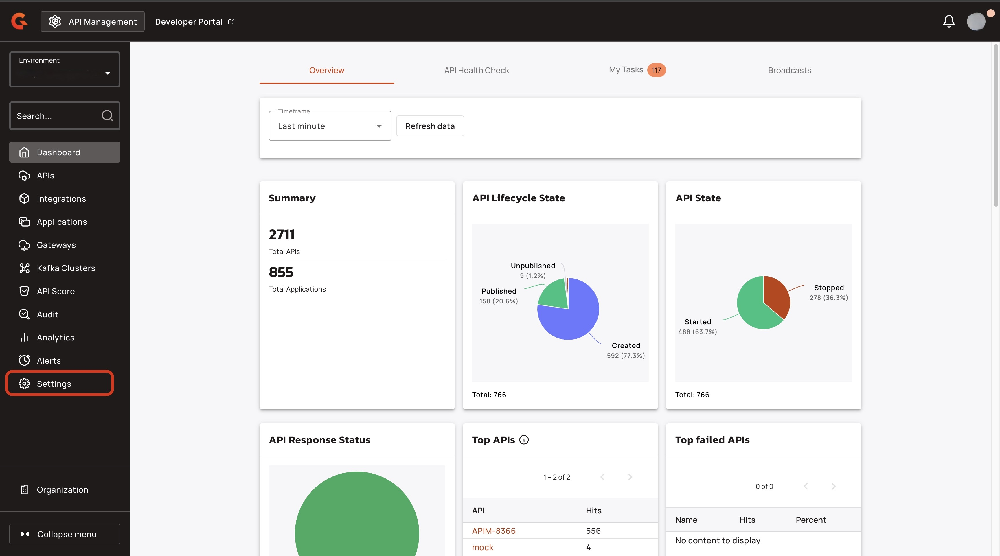<figcaption></figcaption></figure>
2.  From the **Settings** menu, click **Settings**. 

    <figure>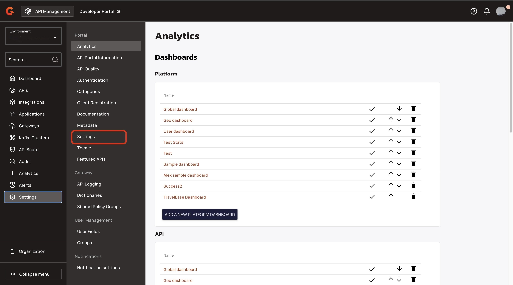<figcaption></figcaption></figure>
3.  Navigate to the **New Developer Portal** section, and then click **Open Settings**. The New Developer Portal settings open on the navigation tab. 

    <figure>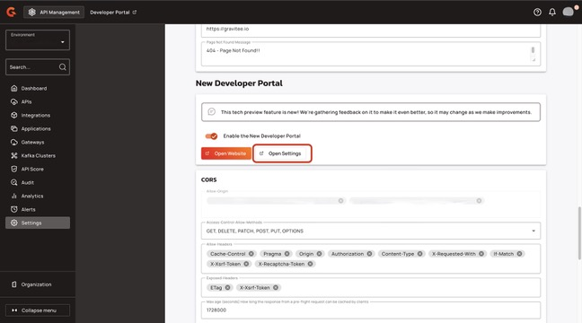<figcaption></figcaption></figure>
4. Customize your navigation using the following components:



When you add a page that is not in a folder, the page appears as a root level menu item. When you publish the page, the page appears in the top navigation bar of your New Developer Portal.

**Add a page**

1.  Click **Add**, and then click **Add Page**. 

    <figure>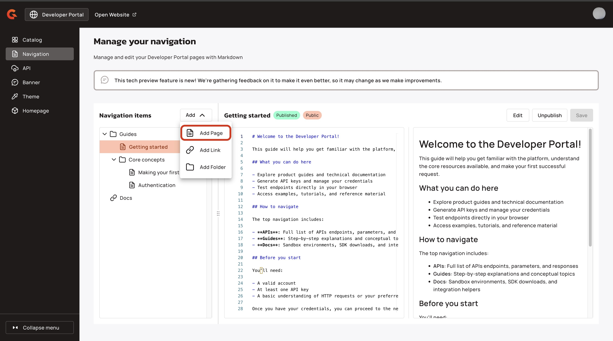<figcaption></figcaption></figure>
2. In the **Add page** pop-up screen, type a title for your page.
3. (Optional) Turn on the **Authentication is required to view this page.** toggle. This toggle ensures that the user must be signed in to the New Developer Portal to see the page.
4.  Click **Add**.\
    Here we need to mention that now we can add 2 types of pages Gravitee markdown and OpenAPI. here are the screenshots:

    <figure>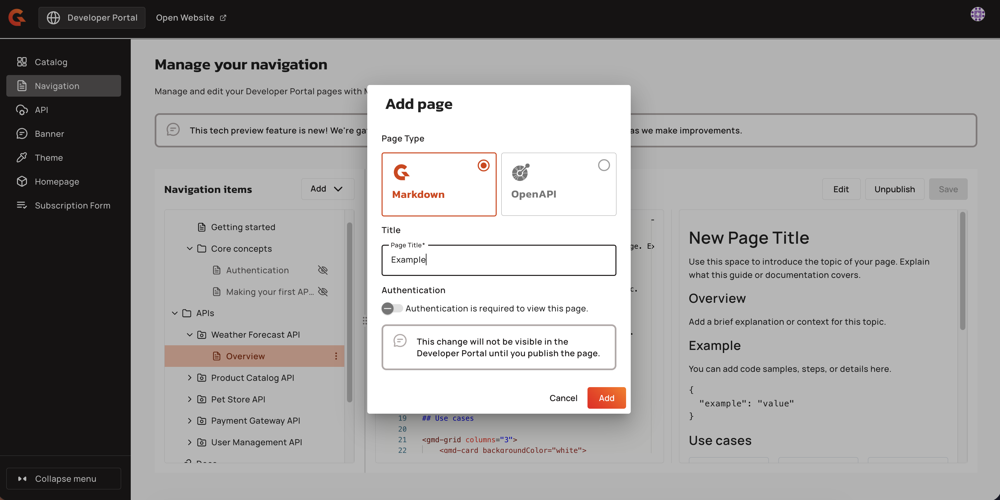<figcaption></figcaption></figure>

    <figure><figcaption></figcaption></figure>
5. Customize your page. The page contains default content that you can use to customize your new page with unique content. For more information about customizing your page with Gravitee Markdown, see [gravitee-markdown-components.md](gravitee-markdown-components.md "mention")

Open API example content:

<figure>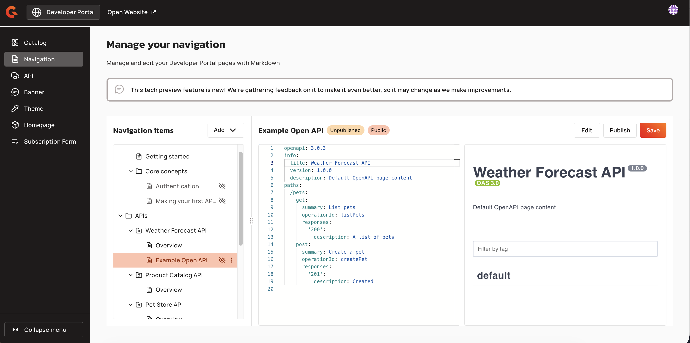<figcaption></figcaption></figure>

6. Publish the page by completing either of the following steps:

⚠️ A page can only be published if all of its ancestor folders are published or if it's a top level page.

*   Click **Publish**. 

    <figure>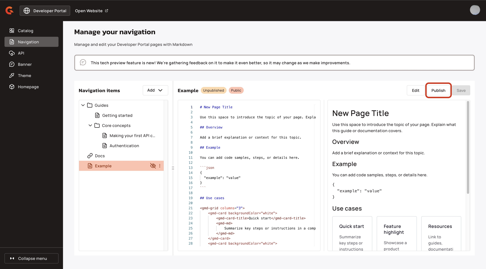<figcaption></figcaption></figure>
*   Navigate to the page in the navigation bar, click the **ellipses** (<i class="fa-ellipsis-vertical">:ellipsis-vertical:</i>), and then click **Publish**. 

    <figure>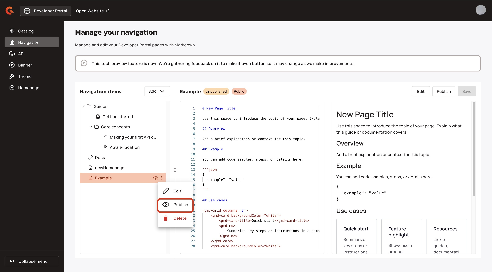<figcaption></figcaption></figure>

1.  In the **Publish page** pop-up window, click **Publish**. 

    <figure>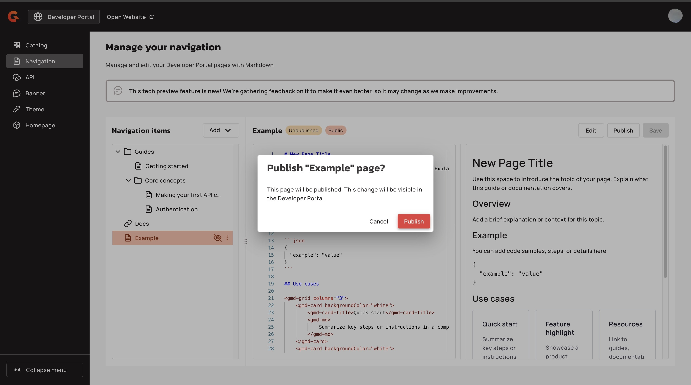<figcaption></figcaption></figure>



Folders group related pages together. A folder is a section on your New Developer Portal. When you add pages to your folder, they appear in the menu for that section instead of the top navigation.

**Add a folder**

1.  Click **Add**, and then click **Add Folder**. 

    <figure>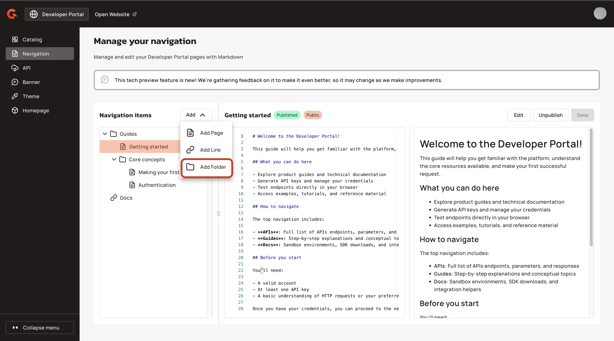<figcaption></figcaption></figure>
2. In the **Add folder** **pop-up** menu, type a title for the folder.
3. (Optional) Turn on the **Authentication is required to view this folder**. toggle. This ensures that the user has to sign in to the New Developer Portal to view the folder.
4.  Click **Add**. 

    <figure>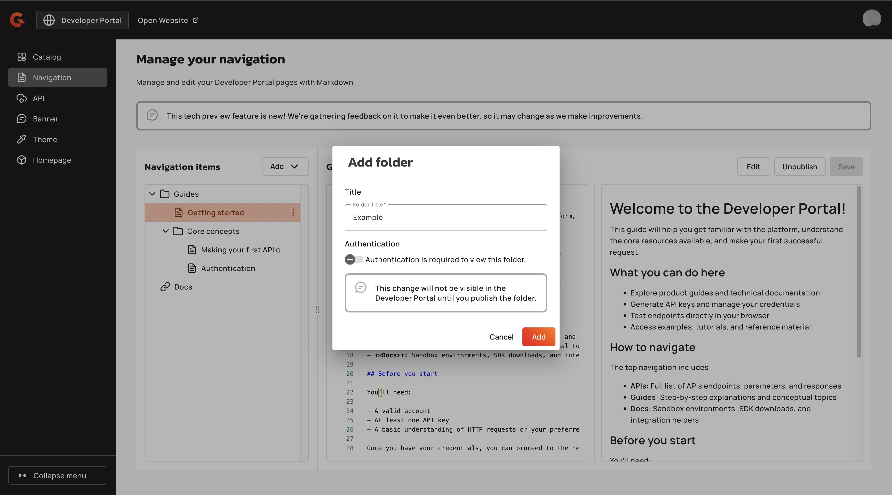<figcaption></figcaption></figure>
5.  Publish the folder. To publish the folder, complete either of the following steps:

    ⚠️ A folder can be only published if all of its ancestor folders are published or if it's a top level folder.

    *   Click **Publish**. 

        <figure>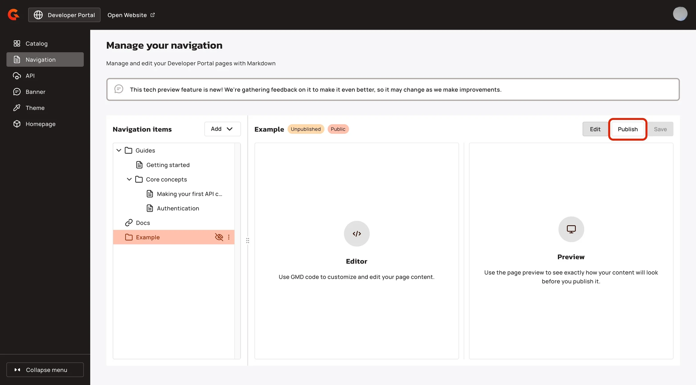<figcaption></figcaption></figure>
    *   Navigate to the folder in the navigation bar, click the **ellipses**, and then click **Publish**. 

        <figure>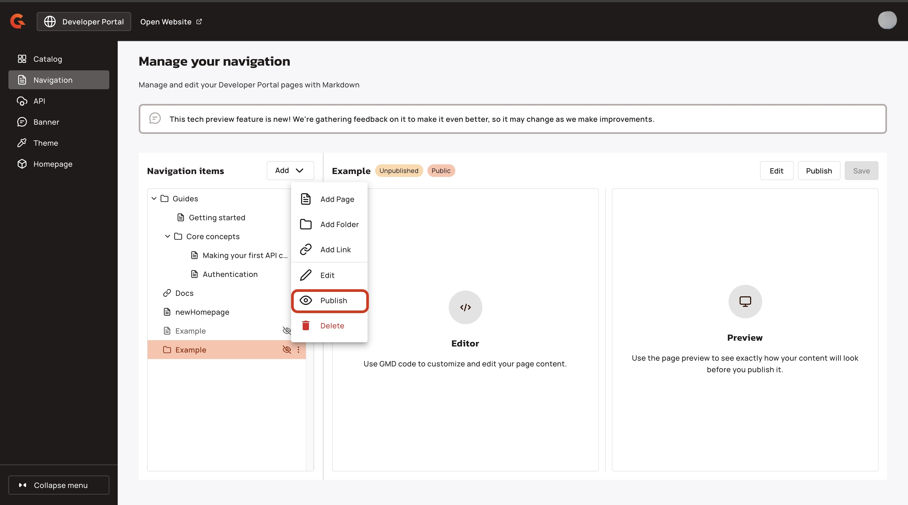<figcaption></figcaption></figure>
6.  In the **Publish folder**, pop-up box, click **Publish**. 

    <figure>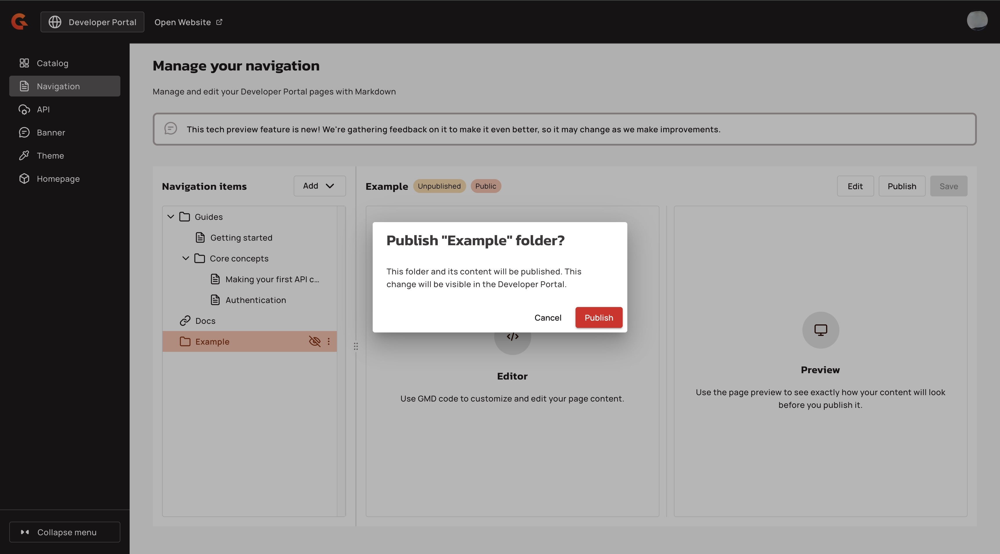<figcaption></figcaption></figure>

**Unpublishing cascade**

Unpublishing now works by cascade: all navigation items within a folder are unpublished with their parent.

<figure>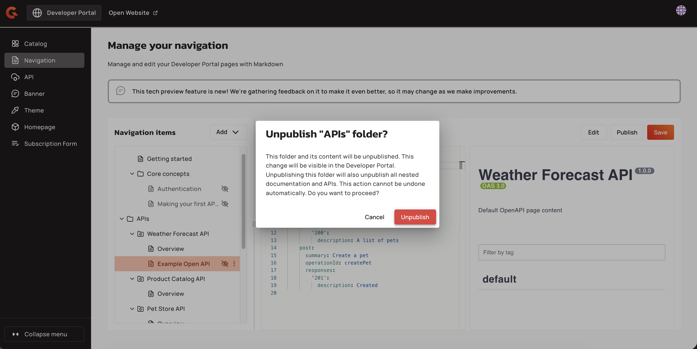<figcaption></figcaption></figure>

**Add a page to a folder**

When you add a page to a folder, that page becomes a menu item within that section of the New Developer Portal.

1. Navigate to the the folder in the **Navigation items** menu.
2. Click **the ellipsis**.
3.  Click **Add page**. 

    <figure>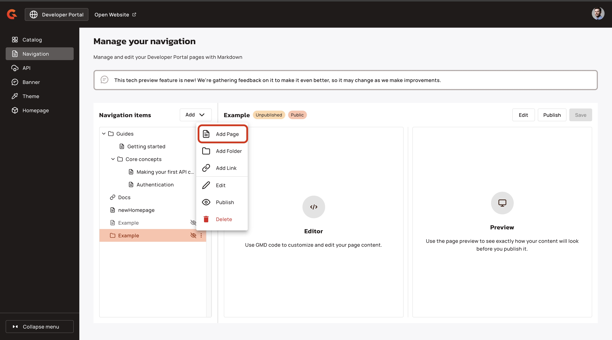<figcaption></figcaption></figure>



When you add a link, the link appears as a root level menu item. When you publish the link, the page appears in the top navigation bar of your New Developer Portal.

**Add a link**

1.  Click **Add**, and then click **Add Link**. 

    <figure>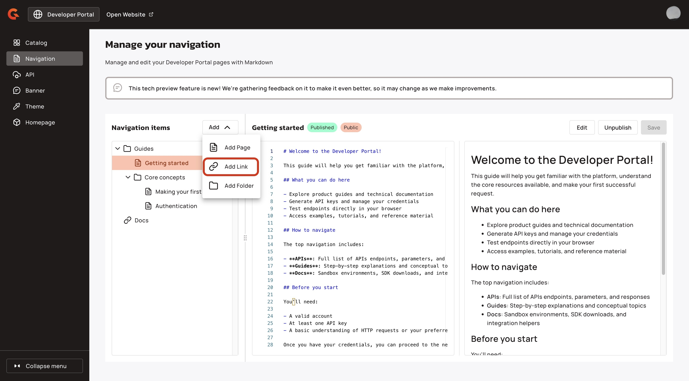<figcaption></figcaption></figure>
2. In the **Add link** pop-up box, complete the following sub-steps:
   1. In the **Title** field, type a title for the link.
   2. In the **Link settings** field, enter the URL for the link.
   3. (Optional) Turn on the **Authentication is required to view this link**. toggle. This toggle ensures that the user has to sign in to the New Developer Portal to view the link.
3.  Click **Add**. 

    <figure>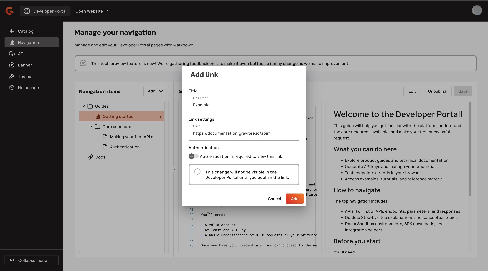<figcaption></figcaption></figure>
4.  Publish the page. To publish the page, complete either of the following steps:

    ⚠️ A link can be only published if all of its ancestor folders are published or if it's a top level link.

    *   Click **Publish**. 

        <figure>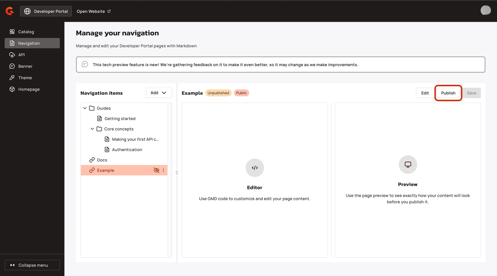<figcaption></figcaption></figure>
    *   Navigate to link in the navigation bar, click the **ellipses**, and then click **Publish**. 

        <figure>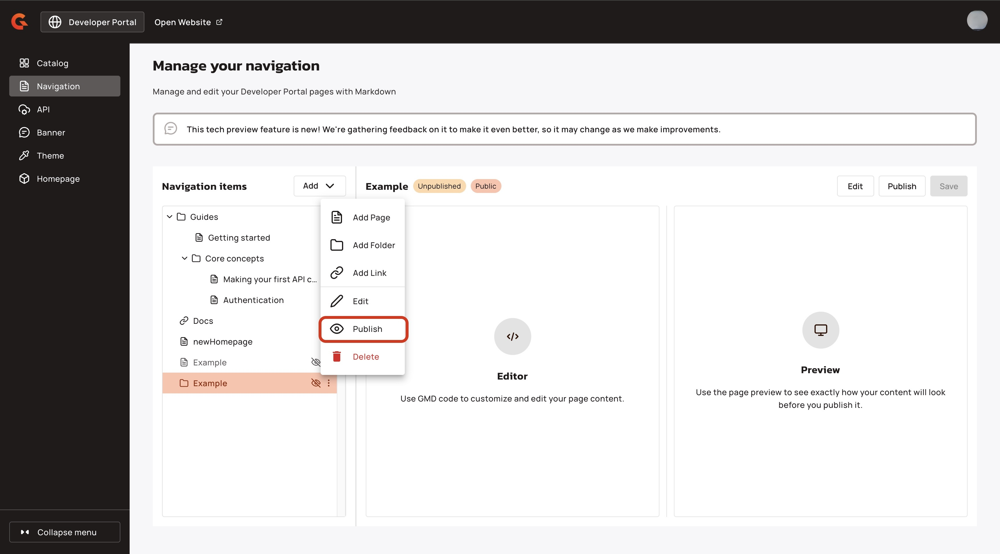<figcaption></figcaption></figure>
5.  In the **Publish link** pop-up menu, click **Publish**. 

    <figure>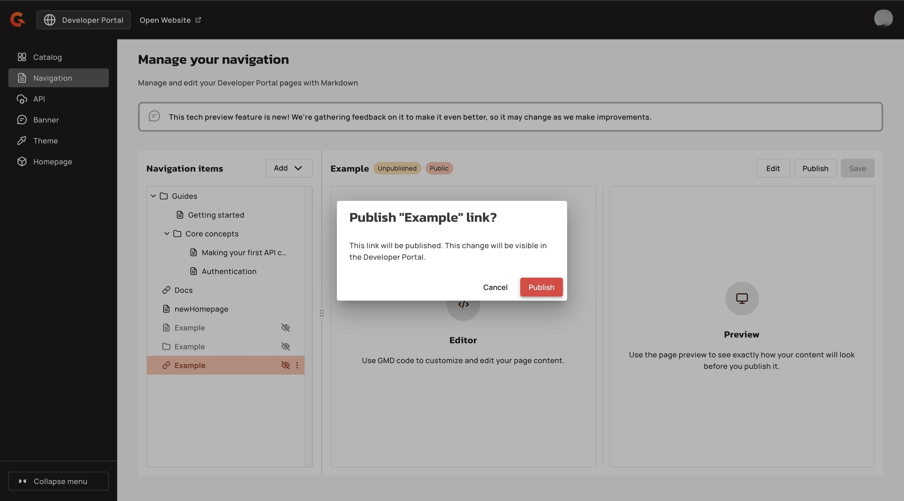<figcaption></figcaption></figure>



API navigation items represent actual APIs that exist in the platform.


Adding APIs to the documentation is **the only way** to make them visible in the New Developer Portal.

Unlike in the Classic Portal, the property `published` of an API is not taken into account in the New Developer Portal.


API navigation items act similarly to folders meaning that they can contain other navigation items like Pages, Folders and Links.

However, there are some limitations of APIs compared to folders:

* APIs cannot contain other APIs and that on any level of the hierarchy, for example API -> Folder -> API chain is not allowed.
* APIs also cannot be at the top level of the navigation structure, they have to be inside a folder.

**Add an API**

1. Open the context menu of a folder in which you want to add your API by clicking the **ellipses**, and then click **Add API**.

<figure>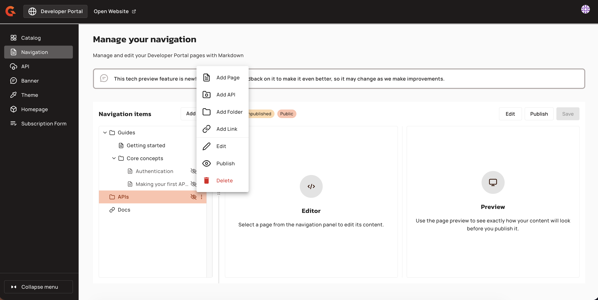<figcaption></figcaption></figure>

2. An **API selection dialog** opens up where you can select APIs to be added.
3. (Optional) Turn on the **Authentication is required to view selected APIs** toggle. This ensures that the user has to sign in to the New Developer Portal to view the APIs.
4. Click **Add**.

<figure>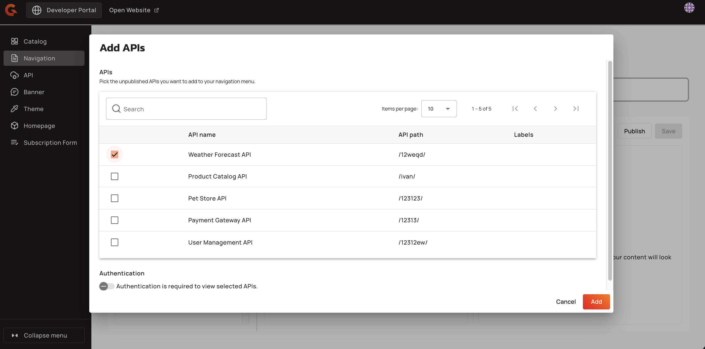<figcaption></figcaption></figure>

5. Publish the API. To publish the API, complete either of the following steps:

⚠️ An API can be only published if all of its ancestor folders are published.

* Click **Publish**.

<figure>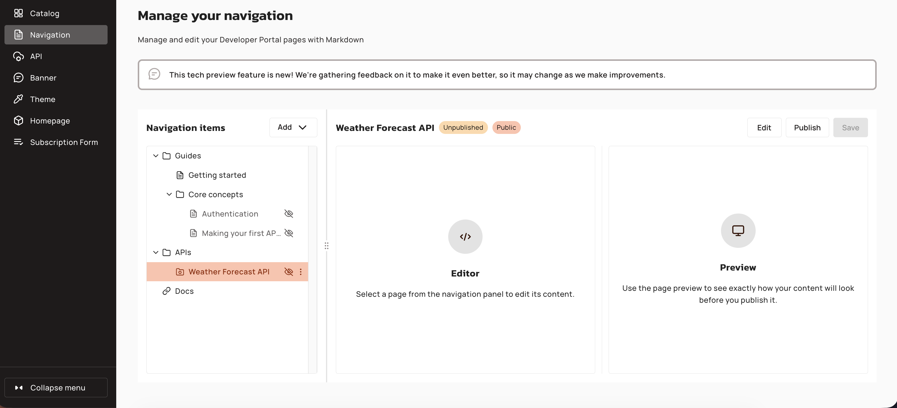<figcaption></figcaption></figure>

* Navigate to the folder in the navigation bar, click the **ellipses**, and then click **Publish**.

<figure>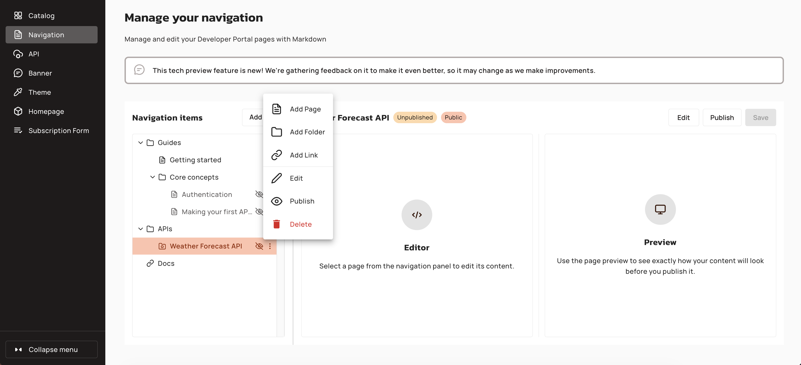<figcaption></figcaption></figure>

6. In the **Publish API** pop-up box, click **Publish**.

<figure>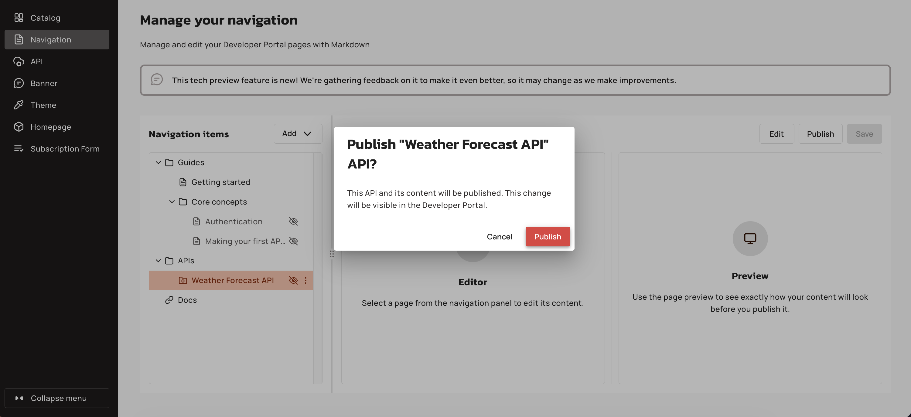<figcaption></figcaption></figure>

**Add a page to an API**

When you add a page to an API, that page becomes a menu item within that API in the New Developer Portal.

1. Navigate to the the folder in the **Navigation items** menu.
2. Click **the ellipsis**.
3. Click **Add page**.

**Add a folder to an API**

When you add a folder to an API, that folder becomes nested within that API in the New Developer Portal.

1. Navigate to the the folder in the **Navigation items** menu.
2. Click **the ellipsis**.
3. Click **Add folder**.



## Verification

The content appears on the New Developer Portal. To view the content, complete the following step:

Click **Open website**.

<figure>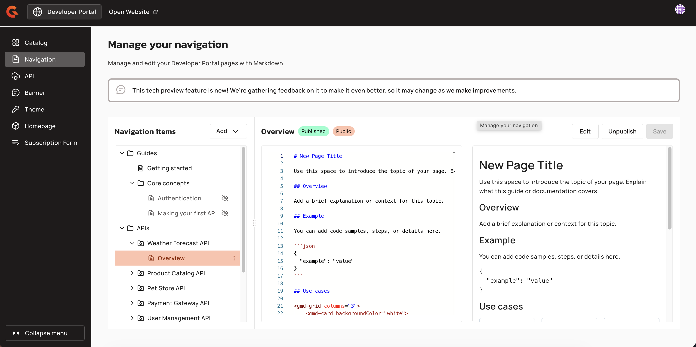<figcaption></figcaption></figure>

The new root-level items appear in the navigation bar.

<figure>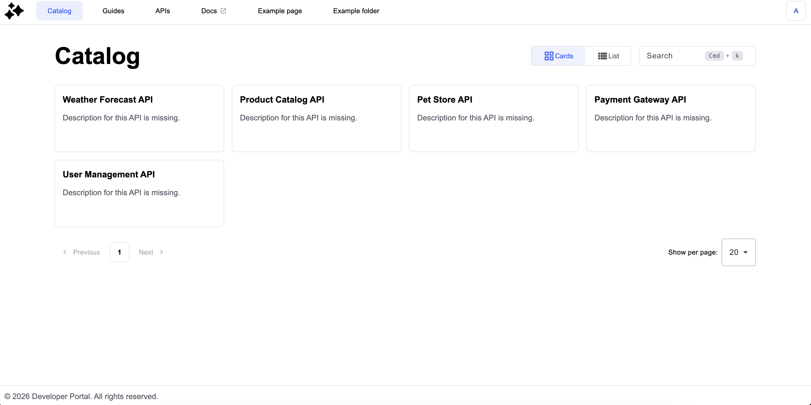<figcaption></figcaption></figure>
