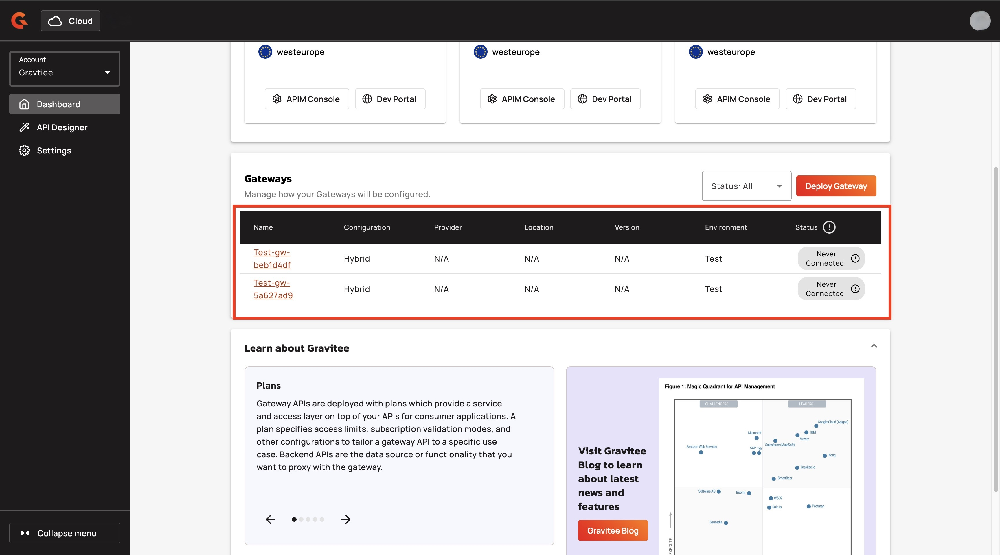
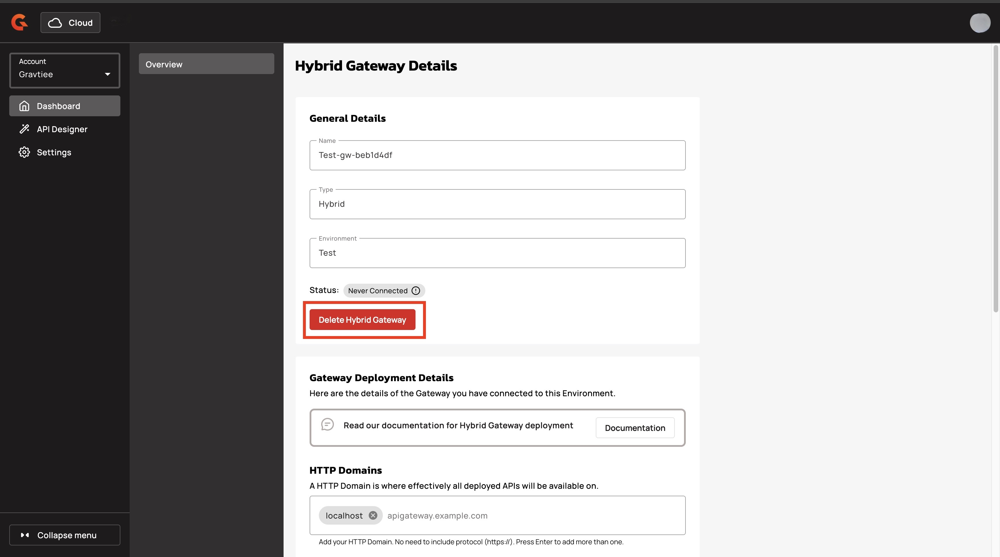
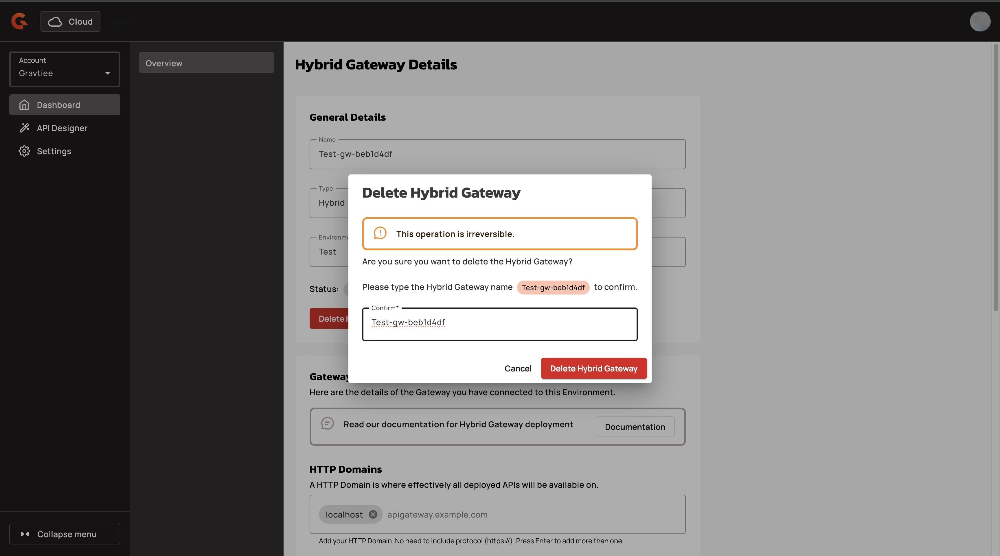

# Delete a Hybrid Gateway

## Overview

Deleting a hybrid Gateway is a way to maintain control and security within your environment. By removing connections that are no longer needed, you strengthen your security model, ensure that your system remains robust, and promote product maturity.

## Delete a hybrid Gateway

1.  Sign in to [Gravitee Cloud](https://cloud.gravitee.io/).

    <figure><figcaption></figcaption></figure>
2.  Navigate to the **Gateways** section, and then click the Gateway that you want to delete.

    <figure><figcaption></figcaption></figure>
3.  In the **Hybrid Gateway Details** screen, navigate to the **General Details** section, and then click **Delete Hybrid Gateway**.

    <figure><figcaption></figcaption></figure>
4.  In the **Delete Hybrid Gateway** pop-up window, type the name of the Gateway.

    

Deleting a gateway is permanent!

    <figure><figcaption></figcaption></figure>

    5\. Click \*\*Delete Hybrid Gateway\*\*.

## Verification

When you delete a hybrid Gateway, you receive the following message: "Gateway has been deleted."

<figure><figcaption></figcaption></figure>

## Next steps

* (Optional) Link your hybrid deployment to a new hybrid Gateway. For more information about linking to a hybrid Gateway, see [link-to-a-hybrid-gateway.md](link-to-a-hybrid-gateway.md "mention").
