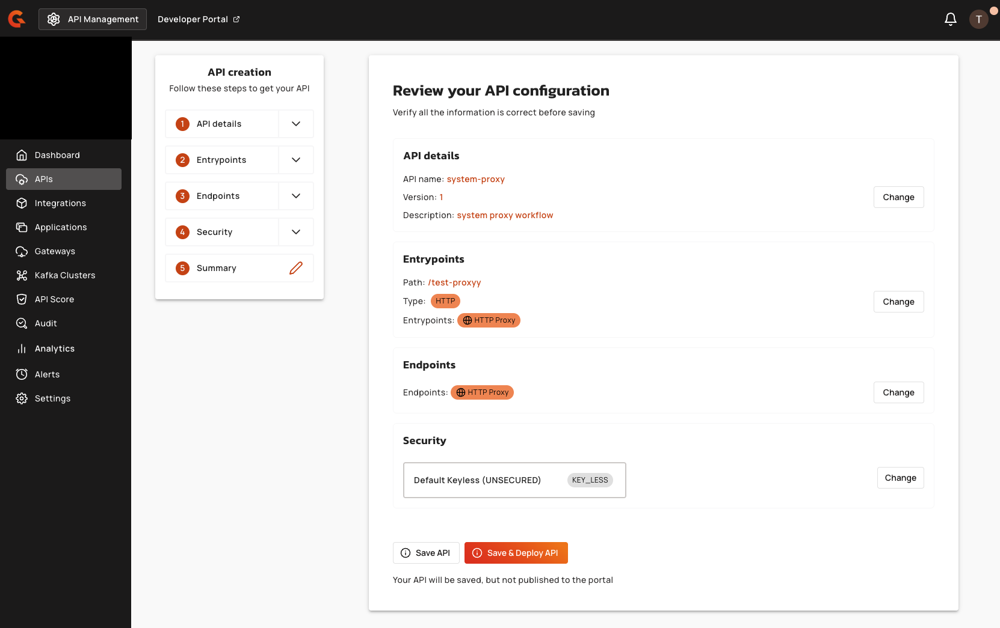

# System Proxy for Backend APIs

## Overview

This guide explains how to configure a system proxy that the Gravitee Gateway uses to communicate with backend APIs. Use this configuration in the following scenarios:

* Your Gateway needs to reach external backend APIs through a corporate proxy
* You want a central proxy configuration for all API endpoints
* APIs are configured with `useSystemProxy: true` in their endpoint settings

### How It Works

Follow these steps to configure the system proxy:

1. Configure the system proxy in the Gateway
2. Create an API with an endpoint pointing to your backend
3. Enable `Use System Proxy` in the API endpoint configuration
4. The Gateway routes all backend calls for that API through the system proxy


**Selective Proxy Usage**

The system proxy is only used for APIs that enable `useSystemProxy: true`  in their endpoint configuration. Internal APIs can bypass the proxy by leaving this option disabled.


## Prerequisites

Before configuring the system proxy, ensure you have the following:

* Kubernetes cluster with [Helm](https://helm.sh/docs/intro/install/) installed.
* Corporate proxy server hostname and port.
* Proxy authentication credentials.&#x20;

## Configuration

To configure the system proxy, complete the following steps:

* [#create-kubernetes-secrets](system-proxy-for-backend-apis.md#create-kubernetes-secrets "mention")
* [#configure-helm-values](system-proxy-for-backend-apis.md#configure-helm-values "mention")
* [#deploy-with-helm](system-proxy-for-backend-apis.md#deploy-with-helm "mention")

### Create Kubernetes Secrets

Create a secret for proxy credentials using the following commands:

```sh
# Create namespace
kubectl create namespace gravitee-apim

# Create proxy credentials secret
kubectl create secret generic system-proxy-credentials \
  --from-literal=username=proxy-user \
  --from-literal=password=proxy-password \
  -n gravitee-apim
```

### Configure Helm Values

The Helm values file defines the system proxy settings that the Gateway uses at runtime. Create a `values.yaml` file with the following system proxy configuration:



```yaml
management:
  type: mongodb

ratelimit:
  type: mongodb

gateway:
  enabled: true

  # System Proxy Configuration (via environment variables)
  env:
    # Proxy Type
    - name: gravitee_system_proxy_type
      value: "HTTP"                            # Options: HTTP, SOCKS4, SOCKS5

    # Proxy Host and Port
    - name: gravitee_system_proxy_host
      value: "corporate-proxy.internal"        # REPLACE with your proxy hostname
    - name: gravitee_system_proxy_port
      value: "8080"                            # REPLACE with your proxy port

    # Proxy Authentication (using Kubernetes Secrets)
    - name: gravitee_system_proxy_username
      valueFrom:
        secretKeyRef:
          name: system-proxy-credentials
          key: username
    - name: gravitee_system_proxy_password
      valueFrom:
        secretKeyRef:
          name: system-proxy-credentials
          key: password
```



For deployments using environment variables directly:

```
gravitee_system_proxy_type=HTTP
gravitee_system_proxy_host=corporate-proxy.internal
gravitee_system_proxy_port=8080
gravitee_system_proxy_username=proxy-user
gravitee_system_proxy_password=proxy-password
```



For reference, the equivalent `gravitee.yml` configuration:

```yaml
system:
  proxy:
    type: HTTP        # HTTP, SOCKS4, SOCKS5
    host: corporate-proxy.internal
    port: 8080
    username: proxy-user
    password: proxy-password
```



### Deploy with Helm

Install the Gateway with your proxy configuration using the following commands:

```sh
helm repo add gravitee https://helm.gravitee.io

helm repo update

helm install gravitee-apim gravitee/apim \
  --namespace gravitee-apim \
  -f values.yaml \
  --wait
```

## Configuration Reference

This section provides reference information for system proxy configuration:

### System Proxy Environment Variables

The following table describes the available environment variables for configuring the system proxy:

| Variable                         | Type    | Description                                   |
| -------------------------------- | ------- | --------------------------------------------- |
| `gravitee_system_proxy_type`     | string  | Proxy protocol: `HTTP`, `SOCKS4`, or `SOCKS5` |
| `gravitee_system_proxy_host`     | string  | Proxy server hostname                         |
| `gravitee_system_proxy_port`     | integer | Proxy server port                             |
| `gravitee_system_proxy_username` | string  | Proxy authentication username                 |
| `gravitee_system_proxy_password` | string  | Proxy authentication password                 |

## Configure APIs to Use System Proxy

After deploying the Gateway with the system proxy configured, you enable it for each API that should route traffic through the proxy.&#x20;

### Management Console UI

#### **For an existing API:**

1.  From the dashboard, click **APIs** from the left menu, then select the API you want to configure.

    <figure><figcaption></figcaption></figure>
2.  Select **Endpoints**, then select the endpoint group you want to modify.

    <figure><figcaption></figcaption></figure>
3.  Select **Configuration**.

    <figure><figcaption></figcaption></figure>
4.  Scroll to the **Proxy** section and enable **Use System Proxy**.

    <figure><figcaption></figcaption></figure>
5. Save and deploy your API.&#x20;

#### **For a new API:**

1.  From the dashboard, click **APIs** from the left menu, then click **Add API**.<br>

    <figure><figcaption></figcaption></figure>
2.  Follow the API creation wizard to configure your API details.

    <figure><figcaption></figcaption></figure>
3.  In the **Endpoints** configuration step, input the HTTP proxy target URL.

    <figure><figcaption></figcaption></figure>
4.  In the **Configuration** section, scroll to the **Proxy** section and enable **Use System Proxy**.

    <figure><figcaption></figcaption></figure>
5.  Complete the remaining steps in the API creation wizard, and deploy your API.

    <figure><figcaption></figcaption></figure>

## Verification

#### Verify Gateway Configuration

Confirm that the Gateway has loaded the proxy settings by checking pod environment variables:

```sh
# Check Gateway pod environment variables
kubectl get pod -n gravitee-apim -l app.kubernetes.io/component=gateway \
  -o jsonpath='{.items[0].spec.containers[0].env}' | \
  jq '.[] | select(.name | startswith("gravitee_system_proxy"))'

# Check Gateway logs for proxy configuration
kubectl logs -n gravitee-apim -l app.kubernetes.io/component=gateway | grep -i "system.*proxy"
```

#### Test API Through Proxy

1. Create a test API pointing to an external backend:
   * Context path: `/test-proxy`
   * Backend: `https://httpbin.org/get`
   * Enable `Use System Proxy` in endpoint configuration
2. Deploy the API
3.  Test through the Gateway:

    ```sh
    curl https://<your-gateway-url>/test-proxy
    ```
4. Check proxy server logs to verify traffic flows through the proxy
