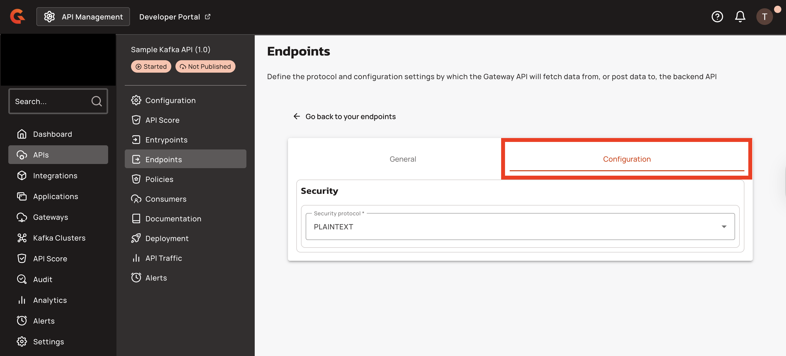
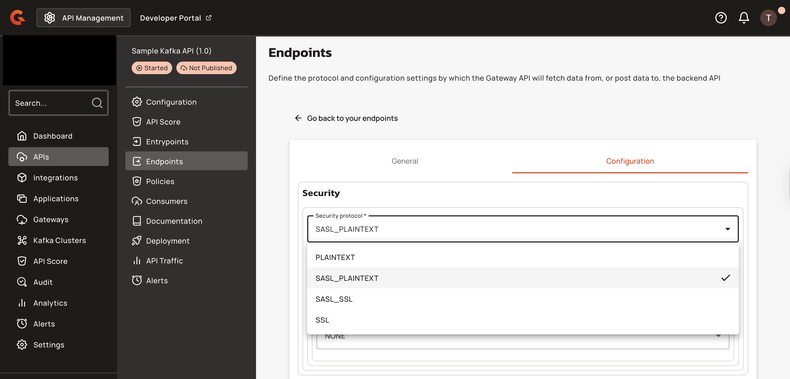
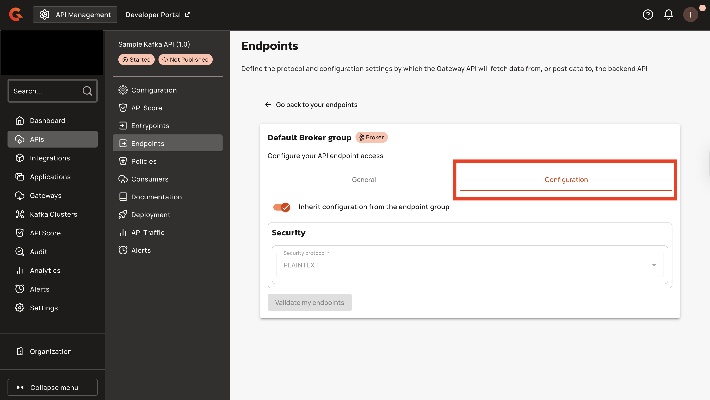

# Endpoints

## Overview

Endpoints define the protocol and configuration settings the Gateway API uses to fetch data from or post data to the backend API. Kafka APIs can have one endpoint group with a single endpoint. The **Endpoints** section lets you modify your Kafka endpoint group and Kafka endpoint.

<figure><figcaption></figcaption></figure>

## Security protocols

Gravitee Kafka APIs support **PLAINTEXT**, **SASL\_PLAINTEXT**, **SASL\_SSL**, or **SSL** as the security protocol to connect to the Kafka cluster.

### SASL mechanisms

In addition to [Kafka's](https://kafka.apache.org/documentation/#security_overview) standard mechanisms, Gravitee supports:

* **NONE**: A stub mechanism that falls back to `PLAINTEXT` protocol.
* **OAUTHBEARER\_TOKEN**: A mechanism that defines a fixed token or a dynamic token from [Gravitee Expression Language](../../../../4.9/gravitee-expression-language.md).
* **DELEGATE\_TO\_BROKER**: Authentication is delegated to the Kafka broker.


When using `DELEGATE_TO_BROKER`, the supported mechanisms available to the client are `PLAIN` and `AWS_IAM_MSK`. The `AWS_MSK_IAM` mechanism requires you to host the Kafka Gateway on AWS. Otherwise, authentication fails.


## Tenant-based routing

Tenant-based routing enables a single Native Kafka API definition to route traffic to different backend endpoints based on the gateway's configured tenant identifier. This eliminates the need to duplicate API configurations for isolated environments such as internal and external networks.

Each gateway instance can be assigned a tenant identifier via the `tenant` configuration property. When processing a Native Kafka API request, the gateway selects the first endpoint whose tenant list includes the gateway's tenant. If no tenant is configured on the gateway, all endpoints are eligible. If no tenant list is defined on an endpoint, that endpoint matches any gateway tenant.

### Endpoint tenant assignment

Endpoints within a Native Kafka API can declare zero or more tenant identifiers. The gateway evaluates these lists at runtime to determine which backend to use. Multiple endpoints in the same group may share tenant assignments, but only the first matching endpoint is selected—no load balancing occurs across tenant-filtered endpoints.

### Tenant resolution

The Management Console resolves tenant IDs to human-readable names when displaying endpoint configurations. If a tenant name cannot be found, the raw tenant ID is displayed. Tenant metadata (name, description) is managed separately from API definitions and is used only for UI display. The gateway uses tenant IDs directly from the API definition.

The endpoint table in the Management Console displays a **Tenants** column showing comma-separated tenant names. This column is hidden if no endpoints in the group have tenant assignments. Tenant names are resolved from tenant IDs for display purposes.

### Matching logic

The gateway applies the following rules to select an endpoint:

| Gateway Tenant | Endpoint Tenants | Match Result |
|:--------------|:-----------------|:-------------|
| Not configured | Any value or empty | Match |
| Configured | `null` | Match |
| Configured | Empty list `[]` | Match |
| Configured (e.g., `"tenant-b"`) | Contains `"tenant-b"` | Match |
| Configured (e.g., `"tenant-c"`) | Does not contain `"tenant-c"` | No match |

Within an endpoint group, the gateway selects the first endpoint that matches the tenant filter. If no endpoint matches the gateway's tenant, a `KafkaNoApiEndpointFoundException` is thrown and logged at WARN level (not ERROR) with the message `"No endpoint found for tenant: {tenantValue}"` or `"No endpoint found for api"` if no tenant is configured. The exception is handled without stack trace logging to reduce noise for expected tenant mismatch scenarios.

### Use case example

A common use case for tenant-based routing is separating internal and external network traffic. An API definition can include two endpoints:

* An `internal-endpoint` with `tenants: ["internal"]` that routes to an internal Kafka cluster
* An `external-endpoint` with `tenants: ["external"]` that routes to an external Kafka cluster

Gateway instances configured with `tenant: "internal"` route to the internal endpoint, while gateways configured with `tenant: "external"` route to the external endpoint. This approach maintains a single API definition while isolating traffic by network boundary.

### Prerequisites

* Gravitee API Management 4.x with Native Kafka API support
* Gateway instances configured with distinct tenant identifiers (if tenant-based routing is required)
* Tenant definitions created in the Management Console (for UI display only; tenant IDs can be used directly in API definitions)

### Gateway configuration

Configure the gateway tenant identifier using the following property:

| Property | Description | Example |
|:---------|:------------|:--------|
| `tenant` | Optional gateway tenant identifier used to filter eligible endpoints. If not set, the gateway matches all endpoints regardless of their tenant configuration. | `"internal"` or `"external"` |

### Configure endpoint tenants in the Management Console

The endpoint configuration form includes a **Tenants** multi-select dropdown. To assign tenants to a Native Kafka endpoint:

1. Open the endpoint editor for a Native Kafka endpoint.
2. Locate the **Tenants** field. This field is displayed for all Native Kafka endpoints.
3. Select one or more tenants from the dropdown. Tenant names are displayed with descriptions on hover.
4. Save the endpoint configuration.

The selected tenant IDs are stored in the endpoint definition and used by gateways at runtime.

### Restrictions

* Only the first matching endpoint in a group is selected. No load balancing occurs across tenant-filtered endpoints.
* If a gateway has a tenant configured and no endpoint matches, the API request fails with a `KafkaNoApiEndpointFoundException`.
* Tenant matching is exact and case-sensitive. Partial matches or wildcards are not supported.
* Endpoints with `null` or empty tenant lists match any gateway tenant, including gateways with no tenant configured.
* Gateways with no tenant configured match all endpoints, regardless of their tenant assignments.

## Edit the endpoint group

Gravitee assigns each Kafka API endpoint group the default name **Default Broker group.** To edit the endpoint group, complete the following steps:

1. Click the **Edit** button with the pencil icon to edit the endpoint group.

    <figure><figcaption></figcaption></figure>

2. Select the **General** tab to change the name of your Kafka endpoint group.

    <figure><figcaption></figcaption></figure>

3. Select the **Configuration** tab to edit the security settings of your Kafka endpoint group.

    <figure><figcaption></figcaption></figure>

4. Select one of the security protocols from the drop-down menu, and then configure the associated settings to define your Kafka authentication flow.

    <figure><figcaption></figcaption></figure>

* **PLAINTEXT:** No further security configuration is necessary.
* **SASL\_PLAINTEXT:** Choose NONE, GSSAPI, OAUTHBEARER, OAUTHBEARER\_TOKEN, PLAIN, SCRAM-SHA-256, SCRAM-SHA-512, or DELEGATE\_TO\_BROKER.
  * **NONE:** No additional security configuration required.
  * **AWS\_MSK\_IAM:** Enter the JAAS login context parameters.
  * **GSSAPI:** Enter the JAAS login context parameters.
  * **OAUTHBEARER:** Enter the OAuth token URL, client ID, client secret, and the scopes to request when issuing a new token.
  * **OAUTHBEARER\_TOKEN:** Provide your custom token value.
  * **PLAIN:** Enter the username and password to connect to the broker.
  * **SCRAM-SHA-256:** Enter the username and password to connect to the broker.
  * **SCRAM-SHA-512:** Enter the username and password to connect to the broker.
  * **DELEGATE\_TO\_BROKER:** No additional security configuration required.
* **SSL:** Choose whether to enable host name verification, and then use the drop-down menu to configure a truststore type.
  * **None**
  * **JKS with content:** Enter binary content as base64 and the truststore password.
  * **JKS with path:** Enter the truststore file path and password.
  * **PKCS#12 / PFX with content:** Enter binary content as base64 and the truststore password.
  * **PKCS#12 / PFX with path:** Enter the truststore file path and password.
  * **PEM with content:** Enter binary content as base64 and the truststore password.
  * **PEM with path:** Enter the truststore file path and password and the keystore type.
* **SASL\_SSL:** Configure both SASL authentication and SSL encryption, choose a **SASL** mechanism from the options listed under **SASL\_PLAINTEXT**, and then configure **SSL** settings as described in the **SSL** section.

## Edit the endpoint

Gravitee automatically assigns your Kafka API endpoint the name **Default Broker**.

1. Click the pencil icon under **ACTIONS** to edit the endpoint.

    <figure><figcaption></figcaption></figure>

2. Select the **General** tab to edit your endpoint name and the list of bootstrap servers.

    <figure><figcaption></figcaption></figure>

3. By default, endpoints inherit configuration settings from their endpoint group. To override these settings, select the **Configuration** tab and configure custom security settings.

    <figure><figcaption></figcaption></figure>
