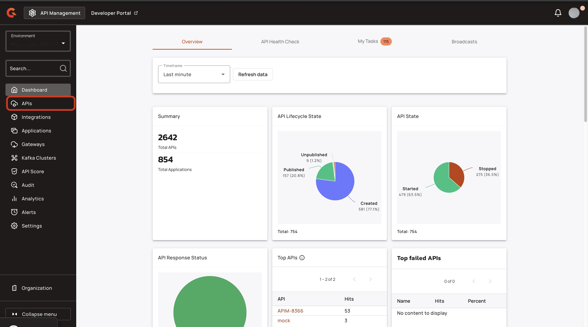
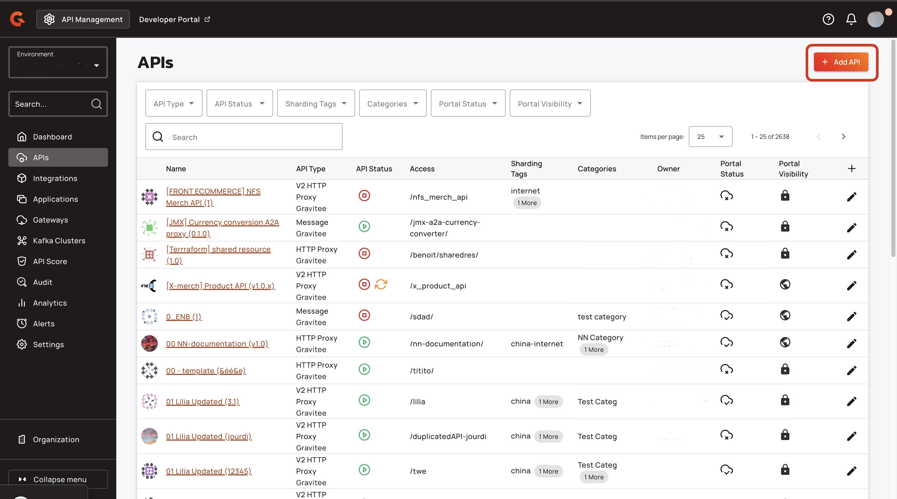
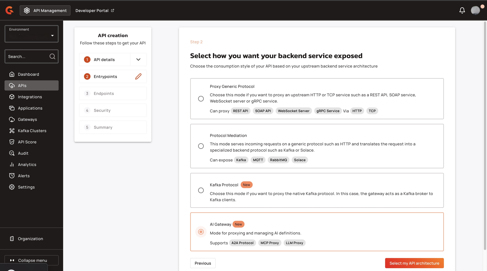
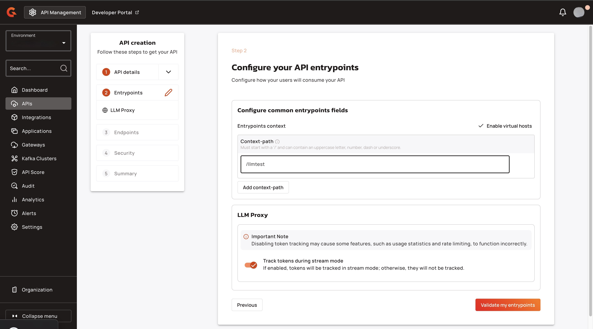
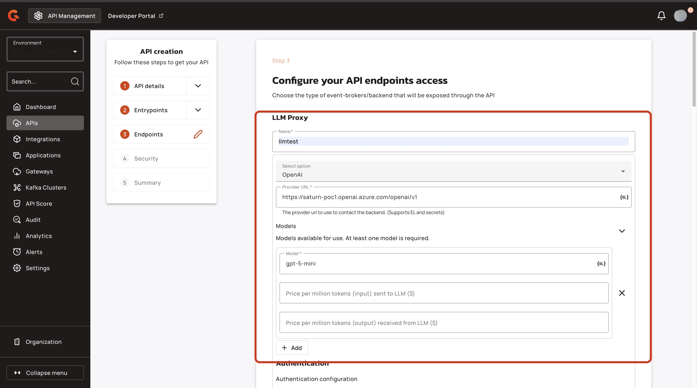
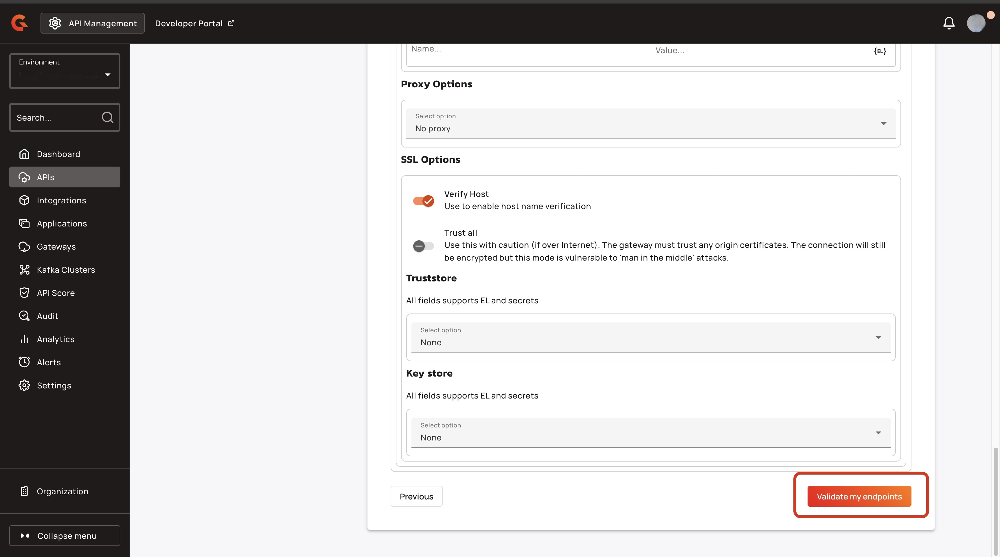

# Proxy your LLMs

## Overview

The LLM proxy exposes an OpenAI compatible API to the consumer, which you can easily plug in any OpenAI-compatible client. On the backend, the LLM proxy automatically maps and adapts requests to different LLM providers.

This allows you to leverage the Gravitee ecosystem with your LLMs. You can apply our policies, manage subscriptions and track analytics, but you also have new features tailored to LLMs such as statistics and rate limiting based on LLM tokens.

This guide explains how to set up your LLM in Gravitee.

## Prerequisites

* Access to one of the following LLM providers: OpenAI API, Gemini, or Bedrock, and an OpenAI-compatible LLM.
* A fully Self-Hosted Installation of APIM or a Hybrid Installation of APIM. For more information about installing APIM, see [self-hosted-installation-guides](../../self-hosted-installation-guides/ "mention") and [hybrid-installation-and-configuration-guides](../../hybrid-installation-and-configuration-guides/ "mention").
* An Enterprise License. For more information about obtaining an Enterprise license, see [enterprise-edition.md](../../readme/enterprise-edition.md "mention").

## Proxy your LLM

### Access the Gravitee Creation Wizard&#x20;

1.  From the **Dashboard**, click **APIs**.<br>

    <figure><figcaption></figcaption></figure>
2.  From the **APIs** screen, click **+ Add API**.<br>

    <figure><figcaption></figcaption></figure>

### Create an LLM proxy API

1.  Click **Create V4 API**. <br>

    <figure><figcaption></figcaption></figure>
2. In the **Provide some details on your API**, complete the following sub-steps:
   1. In the **API name** field, type the name of your API. For example, Test.
   2. In the **Version number field**, type the version of your API. For example, 1.1
3.  Click **Validate my API details.**<br>

    <figure><figcaption></figcaption></figure>
4.  Select **AI Gateway**, and then click **Select my API architecture**.<br>

    <figure><figcaption></figcaption></figure>
5.  Select **LLM Proxy**, and click **Select my entrypoints**.<br>

    <figure><figcaption></figcaption></figure>
6. In the **Configure your API entrypoints** screen, complete the following sub-steps:
   1. In the **Context-path** field, type the context path for your proxy. For example, llmtest.&#x20;
   2. (Optional) Turn off the **Track tokens during stream mode** toggle. If you turn off **Track tokens during stream mode**, some usage statistics and rate limiting functionality might not function correctly because some token usage is hidden.&#x20;
7.  Click **Validate my entrypoints**.<br>

    <figure><figcaption></figcaption></figure>
8. In the **Configure your API endpoints access** screen, complete the following sub-steps:
   1. In the **Name** field, type the name of your endpoint.&#x20;
   2. From the **Select option** dropdown menu, select the LLM provider.&#x20;
   3.  In the **Model** field, type the name of the model. <br>

       <figure><figcaption></figcaption></figure>
9.  Click **Validate my endpoints**.<br>

    <figure><figcaption></figcaption></figure>
10. Click **Validate my plans.** <br>

    <figure><figcaption></figcaption></figure>
11. Click **Save and Deploy API**.<br>

    <figure><figcaption></figcaption></figure>

## Verification&#x20;

To verify that your proxied your LLM, call your API using the following command:

```shellscript
curl <GATEWAY_URL>/<CONTEXT_PATH>/models
```

* Replace `<GATEWAY_URL>` with your Gateway's URL.
* Replace `<CONTEXT_PATH>` with the context path for your API.&#x20;

The response lists all of the models that you can call with that API:

```
{"object":"list","data":[{"id":"llmtest:gpt-5-mini","object":"model","owned_by":"llmtest"}]}% 
```

## AI Semantic Caching

AI Semantic Caching reduces latency and cost for LLM Proxy APIs by caching responses to semantically similar prompts. Instead of treating "What is the capital of France?" and "Capital of France?" as distinct requests, the policy uses vector embeddings to recognize semantic similarity and return cached responses when appropriate.

### Prerequisites

* APIM Enterprise Edition
* Deployed AI text embedding model resource (ONNX BERT, OpenAI, or HTTP custom)
* Deployed vector store resource (Redis or AWS S3)
* Redis infrastructure (if using Redis vector store) with support for vector indexing (HNSW algorithm)
* AWS S3 bucket (if using AWS S3 vector store)
* LLM Proxy API configured with chat completion endpoint

### Key Concepts

#### Vector Embeddings

The policy converts user prompts into high-dimensional vectors using AI embedding models (ONNX BERT, OpenAI, or custom HTTP endpoints). Semantically similar prompts produce similar vectors, enabling the system to match requests based on meaning rather than exact text.

#### Similarity Matching

When a request arrives, the policy queries the vector store for cached embeddings above a configured similarity threshold (e.g., 0.7 cosine similarity). If a match is found, the cached response is returned immediately without invoking the backend LLM. If no match exists, the request proceeds to the backend and the response is cached for future use.

#### Context-Aware Caching

The policy supports metadata parameters that enable context-specific caching. For example, you can cache responses per API, per tenant, or per user by attaching metadata to each cached entry. Sensitive metadata values can be hashed using MurmurHash3 (128-bit) and Base64 URL-safe encoding before storage.

### Gateway Configuration

#### AI Semantic Caching Policy

| Property | Description | Example |
|:---------|:------------|:--------|
| `modelName` | Name of the AI embedding model resource | `ai-model-text-embedding-resource` |
| `vectorStoreName` | Name of the vector store resource | `vector-store-redis-resource` |
| `promptExpression` | EL expression to extract content to embed | `{#jsonPath(#request.content, '$.messages[-1:].content')}` |
| `cacheCondition` | EL expression determining if response is cacheable | `{#response.status >= 200 && #response.status < 300}` |
| `parameters` | List of key-value metadata pairs (supports EL expressions) | See Parameter Configuration below |

#### Parameter Configuration

| Property | Description | Example |
|:---------|:------------|:--------|
| `key` | Metadata field name | `retrieval_context_key` |
| `value` | EL expression to extract value | `{#context.attributes['api']}` |
| `encode` | Whether to hash the value using secure encoding | `true` |

#### OpenAI Embedding Model Resource

| Property | Description | Example |
|:---------|:------------|:--------|
| `uri` | OpenAI API endpoint | `https://api.openai.com/v1/embeddings` |
| `apiKey` | API authentication key | `sk-proj-...` |
| `organizationId` | Optional organization ID | `org-...` |
| `projectId` | Optional project ID | `proj_...` |
| `modelName` | Model identifier | `text-embedding-3-small` |
| `dimensions` | Embedding dimensions (must be non-negative) | `384` |
| `encodingFormat` | `FLOAT` or `BASE64` | `FLOAT` |

#### HTTP Custom Embedding Model Resource

| Property | Description | Example |
|:---------|:------------|:--------|
| `uri` | HTTP endpoint URI | `https://custom-model.example.com/embed` |
| `method` | HTTP method | `POST` |
| `headers` | Request headers | `[{"name": "Authorization", "value": "Bearer token"}]` |
| `requestBodyTemplate` | Template for request body | `{"input": "{input}"}` |
| `inputLocation` | JSONPath to input field | `$.input` |
| `outputEmbeddingLocation` | JSONPath to embedding output | `$.data[0].embedding` |

#### ONNX BERT Embedding Model Resource

| Property | Description | Example |
|:---------|:------------|:--------|
| `model` | Model type and files | `XENOVA_ALL_MINILM_L6_V2` |
| `poolingMode` | Pooling strategy | `MEAN` |
| `padding` | Enable/disable padding | `true` |

Available ONNX models: `XENOVA_ALL_MINILM_L6_V2` (512 max sequence length), `XENOVA_BGE_SMALL_EN_V1_5` (512), `XENOVA_MULTILINGUAL_E5_SMALL` (512).

#### Redis Vector Store Resource

| Property | Description | Example |
|:---------|:------------|:--------|
| `embeddingSize` | Vector dimension size | `384` |
| `maxResults` | Maximum similar vectors to retrieve | `1` |
| `similarity` | Similarity metric | `COSINE` |
| `threshold` | Minimum similarity score | `0.7` |
| `indexType` | Vector index algorithm | `HNSW` |
| `allowEviction` | Enable TTL-based eviction | `true` |
| `evictTime` | Eviction time value | `10` |
| `evictTimeUnit` | Time unit for eviction | `SECONDS` |

### Creating an AI Semantic Caching Policy

Configure the policy on your LLM Proxy API by specifying the embedding model resource and vector store resource names. Set `promptExpression` to extract the user prompt from the request body—for chat completion APIs, use `{#jsonPath(#request.content, '$.messages[-1:].content')}` to extract the last message content. Configure `cacheCondition` to control when responses are cached (default caches all 2xx responses). Optionally add metadata parameters to enable context-aware caching, such as API ID or tenant ID, and set `encode: true` for sensitive values to hash them before storage.

### Creating Context-Aware Caching with Metadata

Add parameters to the policy configuration to attach metadata to cached entries. For example, to cache responses per API, add a parameter with `key: "api_id"` and `value: "{#context.attributes['api']}"`. To prevent metadata leakage, set `encode: true` to hash the value using MurmurHash3 (128-bit) and Base64 URL-safe encoding. The policy evaluates EL expressions at runtime and stores the resulting metadata alongside the cached response and embedding vector.

### LLM Proxy Request Format

The policy expects LLM Proxy chat completion requests in this format:

```json
{
  "messages": [
    {
      "role": "user",
      "content": "<user prompt>"
    }
  ],
  "model": "OpenAI:gpt-4o"
}
```

Responses follow the OpenAI chat completion schema with `id`, `object`, `created`, `model`, `choices`, and `usage` fields. The policy caches the entire response body along with HTTP headers and status code.

### Architecture Notes

#### Policy Execution Flow

When a request arrives, the policy extracts the prompt using `promptExpression`, generates an embedding via the AI model resource, and queries the vector store for similar embeddings above the configured threshold. If a match is found, the policy injects the cached response into the execution context and skips backend invocation. If no match exists, the request proceeds to the backend, and the policy evaluates `cacheCondition` on the response—if true, it stores the response body, headers, status code, and metadata alongside the embedding vector.

#### Invoker Replacement

The policy replaces the default HTTP invoker with `AiSemanticCachingInvoker`, which intercepts the response phase to conditionally cache responses. This design ensures caching logic executes after the backend call completes and the full response is available.

#### Vector Metadata Schema

Cached entries store a JSON object with `headers` (Map<String, List<String>>), `response` (String), `status` (Integer), and user-defined parameters from the policy configuration. This metadata enables context-aware retrieval and response reconstruction.

### Restrictions

* Requires APIM Enterprise Edition
* Requires deployment of AI text embedding model resource (ONNX BERT, OpenAI, or HTTP custom)
* Requires deployment of vector store resource (Redis or AWS S3)
* Redis vector store requires HNSW index support
* OpenAI `dimensions` must be non-negative if provided
* Vector entity ID must not be null or blank
* Configuration validation throws `IllegalArgumentException` for missing required fields (`uri`, `apiKey`, `modelName`, `inputLocation`, `outputEmbeddingLocation`, `encodingFormat`)
* ONNX BERT models have maximum sequence length of 512 tokens
* Similarity threshold configured in vector store resource, not policy

## Next steps

* [add-the-token-rate-limit-policy-to-your-llm-proxy.md](add-the-token-rate-limit-policy-to-your-llm-proxy.md "mention")
* [add-the-guard-rails-policy-to-your-llm-proxy.md](add-the-guard-rails-policy-to-your-llm-proxy.md "mention")
