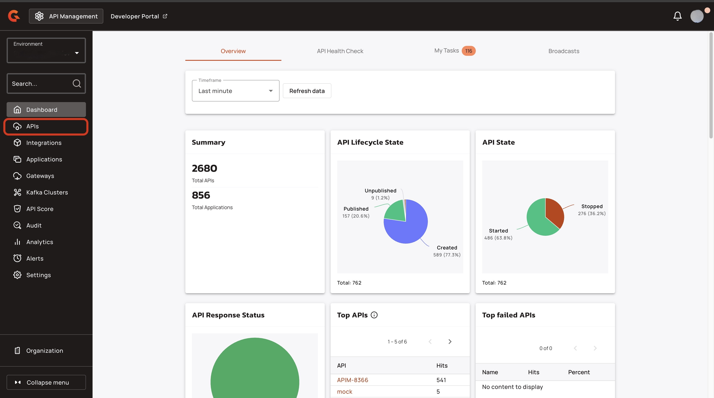
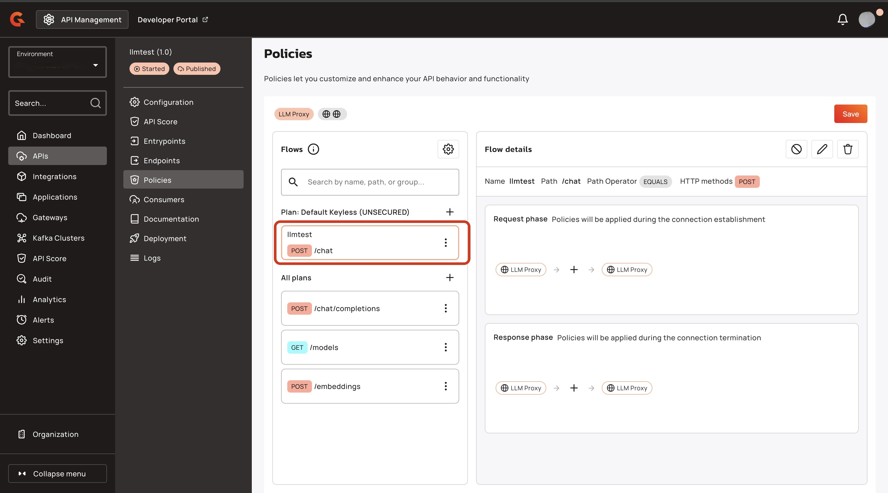
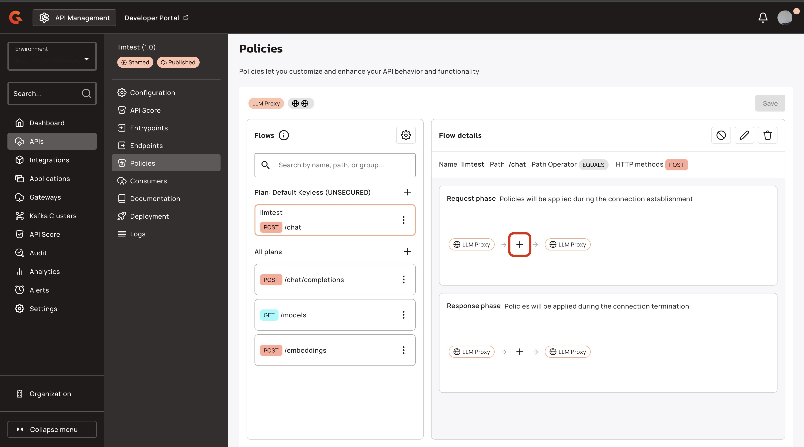
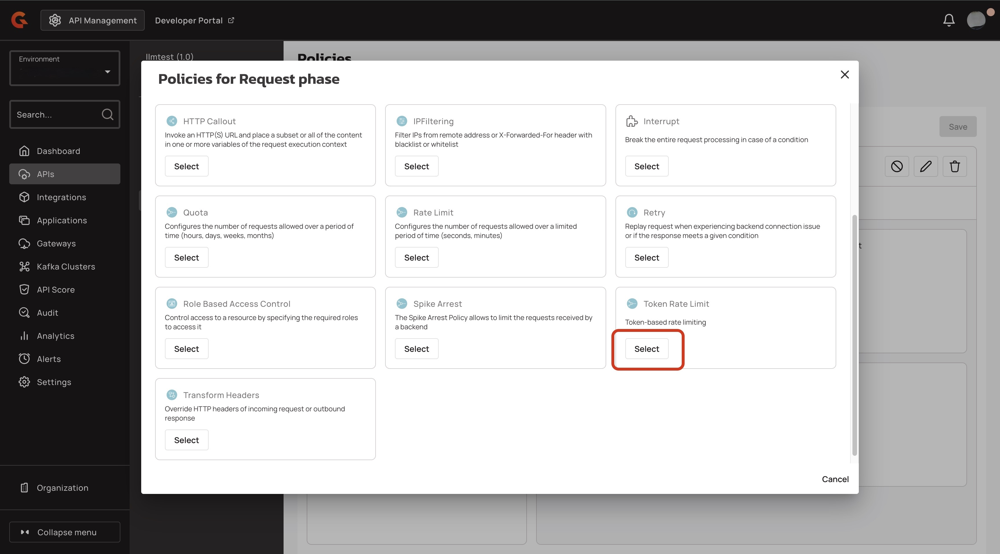

# Add the Token Rate Limit policy to your LLM proxy

## Overview&#x20;

With the AI - Token Rate Limit policy, you can configure the number of total inbound tokens and outbound tokens allowed over a limited period of time in minutes and seconds.


You might receive an error when you use this policy using the Gravitee's docker image. This happens because the default images are based on Alpine Linux, which does not support the ONNX Runtime. To resolve this issue, you must use the Gravitee's docker image based on Debian. To download the correct image, use `graviteeio/apim-gateway:4.10.0-debian`.


## Prerequisites&#x20;

* Access to one of the following LLM providers: OpenAI API, Gemini, or Bedrock, and an OpenAI-compatible LLM.
* A fully Self-Hosted Installation of APIM or a Hybrid Installation of APIM. For more information about installing APIM, see [self-hosted-installation-guides](../../self-hosted-installation-guides/ "mention") and [hybrid-installation-and-configuration-guides](../../hybrid-installation-and-configuration-guides/ "mention").
* An Enterprise License. For more information about obtaining an Enterprise license, see [enterprise-edition.md](../../readme/enterprise-edition.md "mention").
* Complete the steps in [proxy-your-llms.md](proxy-your-llms.md "mention").

## Add the token rate limit policy to your LLM proxy

1.  From the **Dashboard**, click **APIs.** <br>

    <figure><figcaption></figcaption></figure>
2.  In the **APIs** screen, click your LLM proxy. <br>

    <figure><figcaption></figcaption></figure>
3.  In the **API's menu**, click **Policies**.<br>

    <figure><figcaption></figcaption></figure>
4.  Navigate to the **Flows** section, and select a flow that you want to add the Token Rate Limit policy to. For example, `POST/chat`.<br>

    <figure><figcaption></figcaption></figure>
5.  In the **Request phase** section, click **the plus.**<br>

    <figure><figcaption></figcaption></figure>
6.  In the **Policies for Request phase** pop-up window, navigate to **Token Rate Limit**, and then click **Select**.<br>

    <figure><figcaption></figcaption></figure>
7. Navigate to the **Apply rate-limiting** section, and then complete the following sub-steps:
   1. In the **Max tokens (static)** field, add the Max tokens for the token limit. For example, `100`.
   2. In the **Time duration** field, type the time interval that the token limit is set to. For example, `1`.
   3. In the **Time unit** dropdown menu, select the unit of time for the time interval. For example, `MINUTES`.
8.  Click **Add policy**.<br>

    <figure><figcaption></figcaption></figure>
9.  Click **Save.**<br>

    <figure><figcaption></figcaption></figure>
10. In the **This API is out of sync** pop-up window, click **Deploy API**.<br>

    <figure><figcaption></figcaption></figure>
11. (Optional) In the **Deploy your API** pop-up window, type a deployment label for your deployment.&#x20;
12. In the **Deploy your API** pop-up window, click **Deploy**.<br>

    <figure><figcaption></figcaption></figure>

## Verification&#x20;

*   Call your LLM proxy twice with a `POST` request using the following command: <br>

    ```bash
    curl -X POST \
      https://<GATEWAY_URL>/<CONTEXT_PATH>/chat/completions \
      -H "Content-Type: application/json" \
      -d '{
        "messages": [
          {
            "role": "system",
            "content": "<SYSTEM_INSTRUCTIONS>"
          },
          {
            "role": "user",
            "content": "<USER_MESSAGE>"
          }
        ],
        "model": "<MODEL_ID>"
      }'

    ```

    * Replace `<GATEWAY_URL>` with your Gateway URL.
    * Replace `<CONTEXT_PATH>` with the context path for LLM Proxy. For example, llmtest.
    * Replace `<SYSTEM_INSTRUCTIONS>` with the instructions for the model's behavior.
    * Replace `<USER_MESSAGE>` with the user's input text.
    * Replace `<MODEL_ID>` with your model ID. For example, `llmtest:gpt-5-mini` .

On the second API call, you receive the following response:

```bash
{"message":"Rate limit exceeded! You reached the limit of 100 tokens per 1 minutes","http_status_code":429
```
