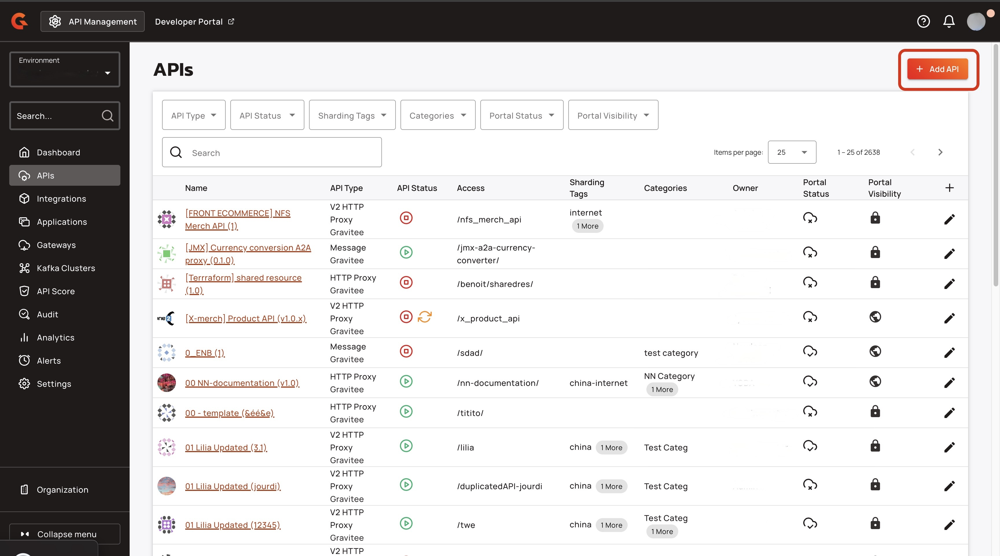
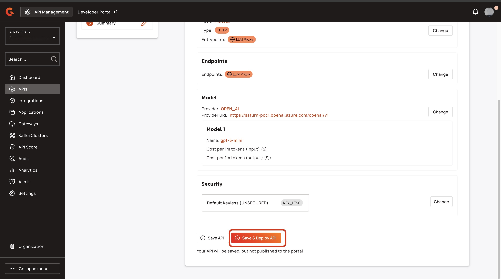

# Proxy your LLMs

## Overview

The LLM proxy exposes an OpenAI compatible API to the consumer, which you can easily plug in any OpenAI-compatible client. On the backend, the LLM proxy automatically maps and adapts requests to different LLM providers.

This allows you to leverage the Gravitee ecosystem with your LLMs. You can apply our policies, manage subscriptions and track analytics, but you also have new features tailored to LLMs such as statistics and rate limiting based on LLM tokens.

This guide explains how to set up your LLM in Gravitee.

## Prerequisites

* Access to one of the following LLM providers: OpenAI API, Gemini, or Bedrock, and an OpenAI-compatible LLM.
* A fully Self-Hosted Installation of APIM or a Hybrid Installation of APIM. For more information about installing APIM, see [self-hosted-installation-guides](../../self-hosted-installation-guides/ "mention") and [hybrid-installation-and-configuration-guides](../../hybrid-installation-and-configuration-guides/ "mention").
* An Enterprise License. For more information about obtaining an Enterprise license, see [enterprise-edition.md](../../readme/enterprise-edition.md "mention").

## Proxy your LLM

### Access the Gravitee Creation Wizard&#x20;

1.  From the **Dashboard**, click **APIs**.<br>

    <figure><figcaption></figcaption></figure>
2.  From the **APIs** screen, click **+ Add API**.<br>

    <figure><figcaption></figcaption></figure>

### Create an LLM proxy API

1.  Click **Create V4 API**. <br>

    <figure><figcaption></figcaption></figure>
2. In the **Provide some details on your API**, complete the following sub-steps:
   1. In the **API name** field, type the name of your API. For example, Test.
   2. In the **Version number field**, type the version of your API. For example, 1.1
3.  Click **Validate my API details.**<br>

    <figure><figcaption></figcaption></figure>
4.  Select **AI Gateway**, and then click **Select my API architecture**.<br>

    <figure><figcaption></figcaption></figure>
5.  Select **LLM Proxy**, and click **Select my entrypoints**.<br>

    <figure><figcaption></figcaption></figure>
6. In the **Configure your API entrypoints** screen, complete the following sub-steps:
   1. In the **Context-path** field, type the context path for your proxy. For example, llmtest.&#x20;
   2. (Optional) Turn off the **Track tokens during stream mode** toggle. If you turn off **Track tokens during stream mode**, some usage statistics and rate limiting functionality might not function correctly because some token usage is hidden.&#x20;
7.  Click **Validate my entrypoints**.<br>

    <figure><figcaption></figcaption></figure>
8. In the **Configure your API endpoints access** screen, complete the following sub-steps:
   1. In the **Name** field, type the name of your endpoint.&#x20;
   2. From the **Select option** dropdown menu, select the LLM provider.&#x20;
   3.  In the **Model** field, type the name of the model. <br>

       <figure><figcaption></figcaption></figure>
9.  Click **Validate my endpoints**.<br>

    <figure><figcaption></figcaption></figure>
10. Click **Validate my plans.** <br>

    <figure><figcaption></figcaption></figure>
11. Click **Save and Deploy API**.<br>

    <figure><figcaption></figcaption></figure>

## Verification&#x20;

To verify that your proxied your LLM, call your API using the following command:

```shellscript
curl <GATEWAY_URL>/<CONTEXT_PATH>/models
```

* Replace `<GATEWAY_URL>` with your Gateway's URL.
* Replace `<CONTEXT_PATH>` with the context path for your API.&#x20;

The response lists all of the models that you can call with that API:

```
{"object":"list","data":[{"id":"llmtest:gpt-5-mini","object":"model","owned_by":"llmtest"}]}% 
```

## Next steps

* [add-the-token-rate-limit-policy-to-your-llm-proxy.md](add-the-token-rate-limit-policy-to-your-llm-proxy.md "mention")
* [add-the-guard-rails-policy-to-your-llm-proxy.md](add-the-guard-rails-policy-to-your-llm-proxy.md "mention")
