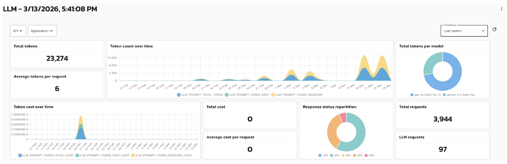
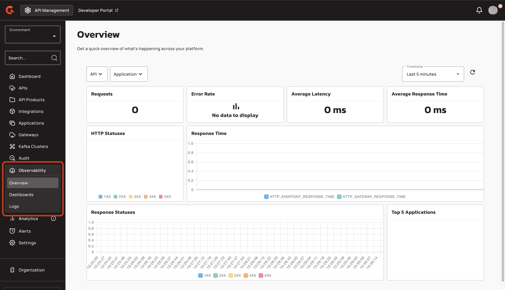
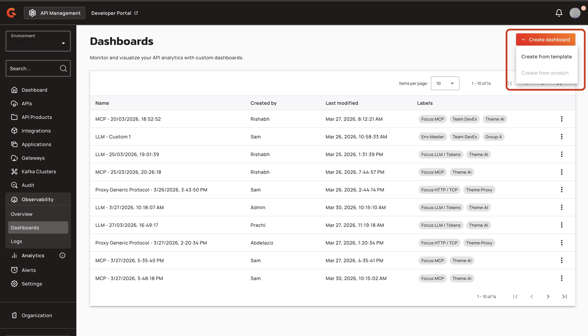
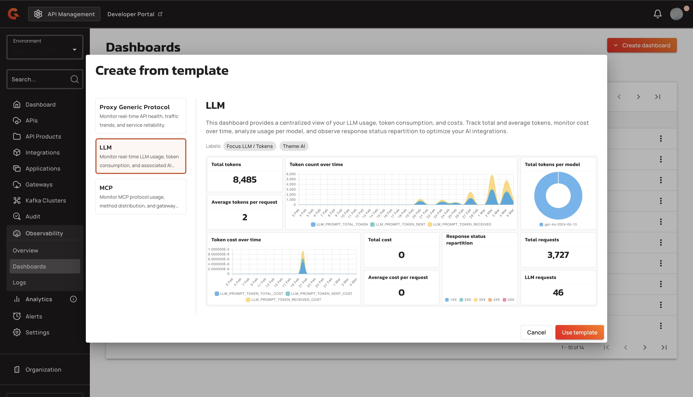
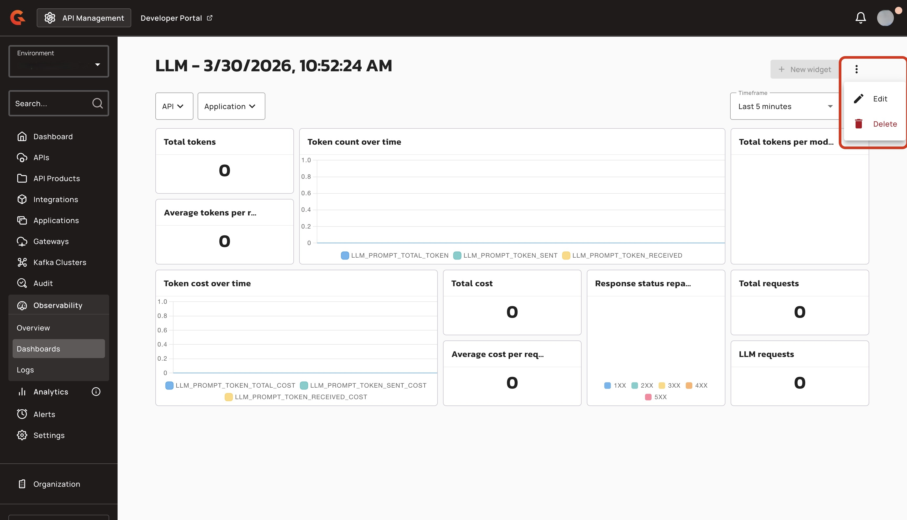
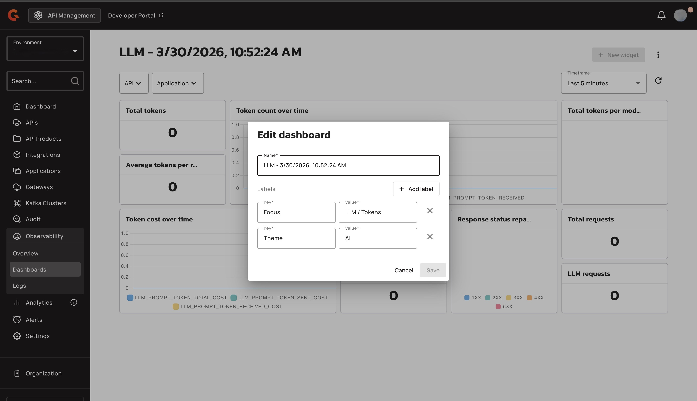
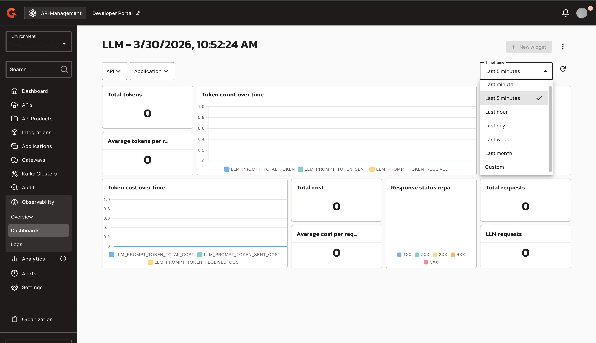
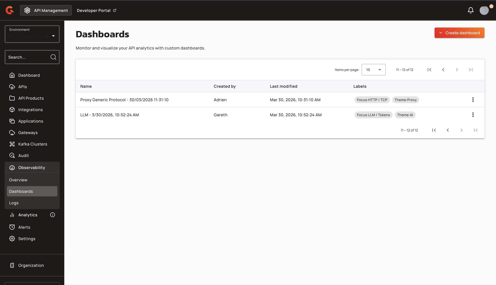

# LLM Usage Dashboard

## Overview

The LLM Dashboard provides users with clear visibility into the LLM usage for their environment. With this Dashboard, the user can monitor how often a tool is used, the behavior of the LLM, and any errors produced by the LLM.

### Metrics for the LLM Dashboard

The LLM dashboard shows the following metrics:

* Total tokens. The combined total of prompt tokens and completion tokens processed.
* Average tokens per request. The average token consumption for each LLM call.
* Total token count over time. The cost trend of tokens for prompts and completion.
* Token cost over time. The trend of prompt, completion, and total tokens consumed.
* Total cost. The total cost of the LLM usage.
* Average cost per request. The average spend for each LLM call.
* Response status reparition. The breakdown of HTTP outcomes for each LLM call.
* Total token per model. The breadkown of comsumption across LLM models.
* Total requests. All HTTP calls processed by the Gateway.
* LLM requests. Total call volume targeting LLM providers.

.

## Prerequisities

To configure the LLM Dashboard, the user must have the following permissions:

* Environment-dashboard-r : see dashboard
* Environment-dashboard-c : create a dashboard
* Environment-dashboard-u : update a dashboard
* Environment-dashboard-d : delete a dashboard

## Create an LLM usage Dashboard

1. From the **Dashboard**, click **Observability**.
2. From the **Observability** dropdown menu, click **Dashboard**. 
3. Click **Create dashboard**, and then click **Create from template**. 
4. Click **LLM**, and then click **Use template**. 
5. (Optional) Change the name of the dashboard and the labels for the dashboard. To change the name of the dashboard and the labels for the dashboard, complete the following sub-steps: a. Click **Dashboard options**, and then click **Edit**.  b. In the **Edit dashboard** pop-up window, navigate to the **Name** field, and then enter a new name for your dashboard. c. To add a new label for your dashboard, click **+ Add label**, and then enter the key-value pair. d. To delete a label, click the **X** next the key-value pair that you want to delete. 
6. (Optional) Change the timeframe for the dashboard. To changee the timeframe for the dashboard, compelte the following sub-steps: a. Click the **timeframe** dropdown menu. b. Select a new time frame or select **custom** to enter a custome timeframe. 

## Verification

Your dashboard appears in the Dashboard list. 
