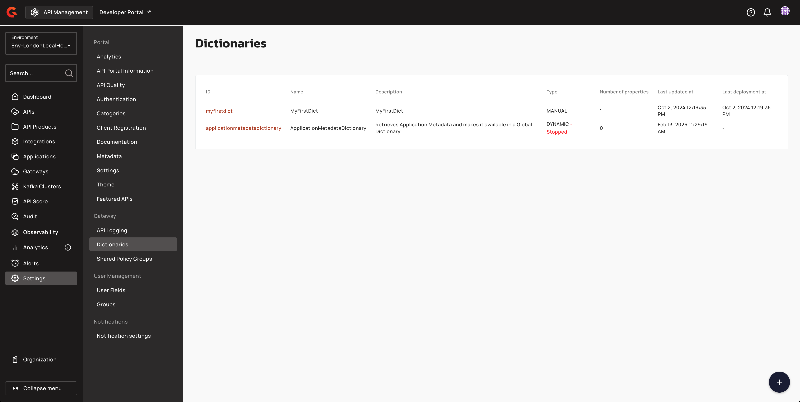
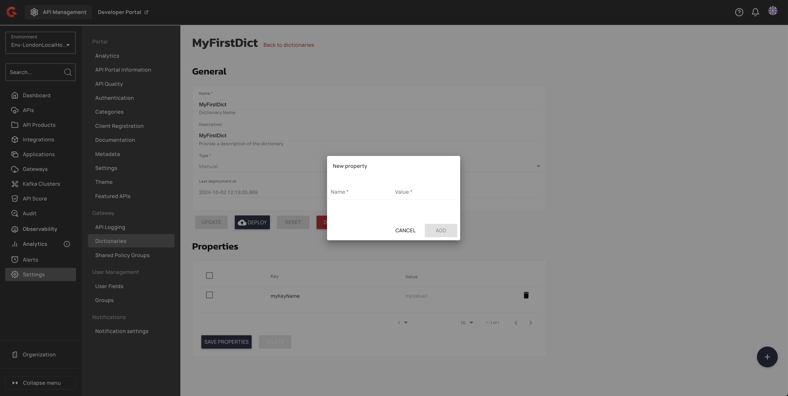
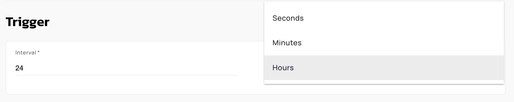
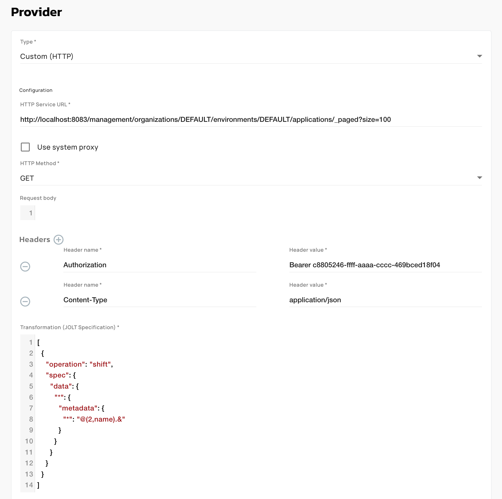
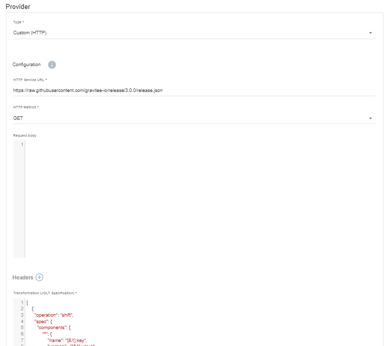
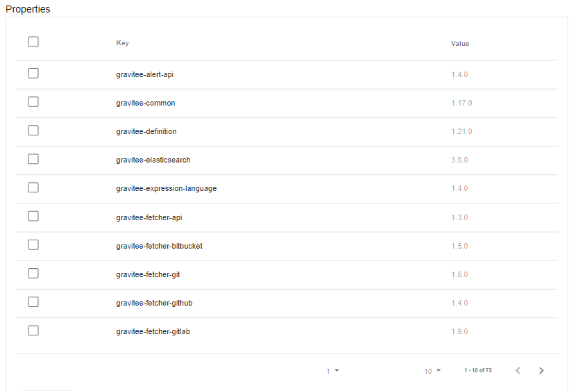

# Dictionaries

## Overview

While API publishers can create properties for their own APIs, dictionaries provide a way to manage properties independent of individual APIs, making it possible to apply them across APIs and maintain them globally with a different user profile, such as an administrator.

Dictionary properties are based on key-value pairs. You can create two types of dictionaries: manual and dynamic.


APIM doesn't support encrypting dictionary property values. Dictionaries don't have an encryption option, in contrast to API properties. For sensitive values that are scoped to a single API, use encrypted API properties instead of a dictionary. For more information, see [Property Encryption](../../prepare-a-production-environment/production-best-practices/general-recommendations/property-encryption.md).


Dictionaries need to be deployed to the API Gateway before you can use them. You can see the date and time the dictionary was last deployed in the dictionary list:

<figure><figcaption></figcaption></figure>


**How are dictionaries used?**

You can use dictionaries anywhere in APIM where [Gravitee Expression Language](services.md) is supported, such as when defining policies for API flows.

Access a dictionary property with `{#dictionaries['<dictionary-id>']['<property-key>']}`, where `<dictionary-id>` identifies the dictionary and `<property-key>` is the name of the property. For example, if a dictionary with the ID `countries` holds a property `FR` set to `France`, then `{#dictionaries['countries']['FR']}` resolves to `France`. The identifier is the dictionary's key if one is set, and otherwise its ID.


## Reference a dictionary property in the Expression Language

You reference manual and dynamic dictionaries the same way. After a dictionary is deployed to the Gateway, read any of its properties in policy configuration, or anywhere else [Gravitee Expression Language](services.md) is supported, with:

`{#dictionaries['<dictionary-id>']['<property-key>']}`

You reference a dynamic dictionary by its ID, the same as a manual one. A dynamic dictionary refreshes its properties from an HTTP source on the schedule you define, and exposes each returned key as a property.

For example, a dynamic dictionary with the ID `partner-routing` is refreshed every few minutes from an internal service and holds these properties:

| Property key | Value |
| --- | --- |
| `acme-host` | `https://acme.api.internal` |
| `acme-tier` | `premium` |
| `maintenance` | `false` |

Reference its properties anywhere Expression Language is supported:

* **Read a value.** `{#dictionaries['partner-routing']['acme-host']}` resolves to `https://acme.api.internal`. Use it to set a backend target or build a URL from a centrally managed value.
* **Set a header.** In a header transformation policy, set the `X-Backend-Tier` header to `{#dictionaries['partner-routing']['acme-tier']}`.
* **Drive a flow condition.** Run a flow only during maintenance with the condition `{#dictionaries['partner-routing']['maintenance'] == 'true'}`.
* **Look up a value with a request attribute.** Build the property key from the request. For a dictionary `tenant-config` keyed by tenant ID, `{#dictionaries['tenant-config'][#request.headers['X-Tenant-Id'][0]]}` reads the value stored under the incoming tenant ID.

The outer key is the dictionary's ID, or its key if one is set. The inner key is the property name. Each expression resolves to the current value held for that property, so a dynamic dictionary serves the latest values it has retrieved from the source.

Deploy the dictionary to the Gateway before you reference it.

## Create a new dictionary

To create a new dictionary, select **Settings** in the left hand nav, then select **Dictionaries.**

<figure><figcaption>
Access dictionary settings
</figcaption></figure>

Select the icon. You'll be brought to the **Create a new dictionary** page. Here, you'll need to define the **Name, Description,** and **Type.** You'll have two options for **Dictionary type**:

* **Manual**: These dictionaries are made up of static properties defined manually at dictionary creation time
* **Dynamic**: These dictionaries are made up of properties that are updated continuously, based on a schedule and source URL defined at dictionary creation time

### Create a manual dictionary

To create a manual dictionary, choose **Manual** as the **Type**, then click **Create.** You'll be brought to a page where you can define the static properties for your dictionary. To create a property, select the icon and give your property a name and value.

<figure><figcaption>
Add properties to your dictionary
</figcaption></figure>

Select **Add**, and then **Save Properties** when you are done defining your key-value pairs. To start and deploy your dictionary, select **Deploy.**

### Create a dynamic dictionary

To create a dynamic dictionary, choose **Dynamic** as the **Type**. **Trigger** and **Provider** sections will then appear.



The **Trigger** defines the schedule for which dynamic properties will be created. Define the **Interval** and the **Time Unit** (seconds, minutes, hours).

<figure><figcaption>
Define your trigger (for how often to retrieve properties from the 3rd-party service)
</figcaption></figure>



In the **Provider** section, specify the details of the source of the properties:

* A **Type** of **Custom (HTTP)**.
* **HTTP Service URL**: the URL and method of the API providing the properties
* Enable or disable **Use system proxy**
* The **HTTP Methods**
* The request body
* One or more HTTP headers
* The transformation to apply to the response, in JOLT format

Example Screenshot:

<figure><figcaption></figcaption></figure>



When you're done, click **Create**, then **Start**. Gravitee APIM will begin to retrieve the properties at the defined intervals and list them in the **Properties** section.

You can select any properties you want to delete and/or select **Deploy** to deploy your Dictionary to your Gravitee API Gateway.

Example

The following example creates a list of properties based on extracting the names and versions from the JSON at the defined URL and assigning them to the property keys and values:

When you select **Start**, the properties are added to the list according to the defined schedule:

