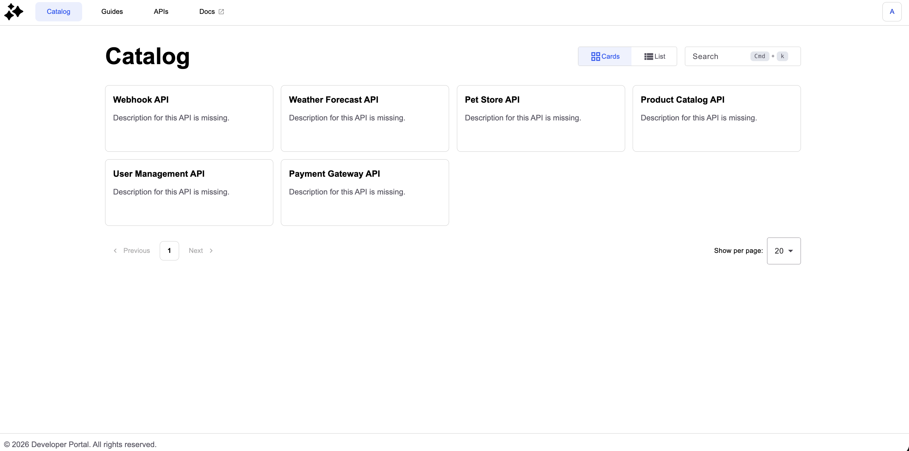
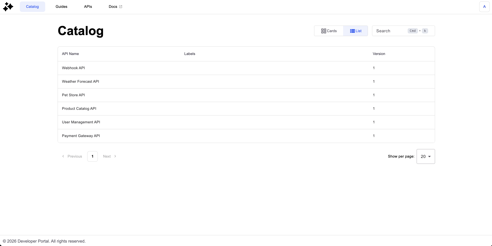

# Catalog

## Overview

Catalog allows consumers to discover APIs published in the New Developer Portal.

## Prerequisites

* Enable the New Developer Portal. For more information about enabling the New Developer Portal, see [configure-the-new-portal.md](configure-the-new-portal.md "mention").
* Publish APIs. For more information about how to publish APIs in the New Developer Portal, see [#customizing-your-navigation](customize-the-navigation/#customizing-your-navigation "mention").

## Display APIs in the Catalog

The catalog allows you to see the APIs in two view modes:

1. Card view

<figure><figcaption></figcaption></figure>

2. List view

<figure><figcaption></figcaption></figure>

You can also use the search bar to narrow your selection by your query.

Here are the criteria that are taken into account in the search:

* API name
* Labels
* Owner
* API Type
* Sharding Tags
* Description
