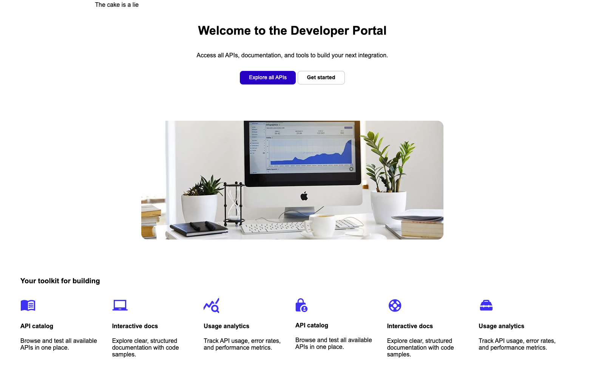
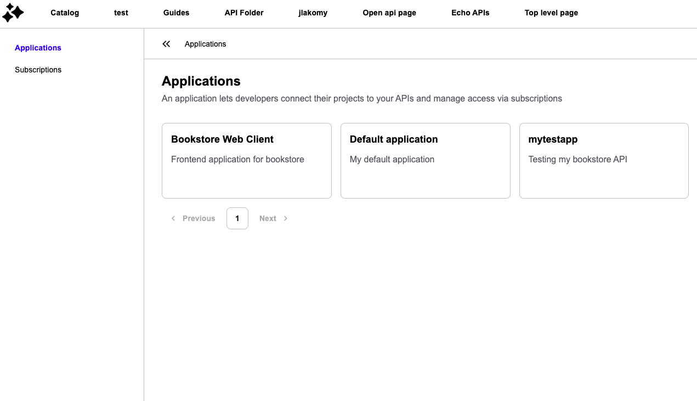
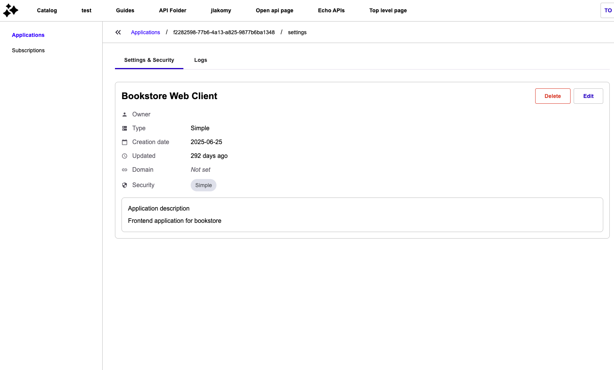
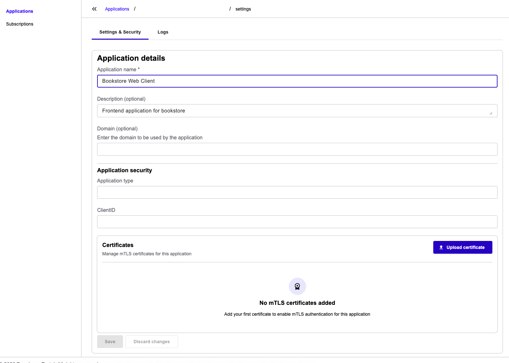
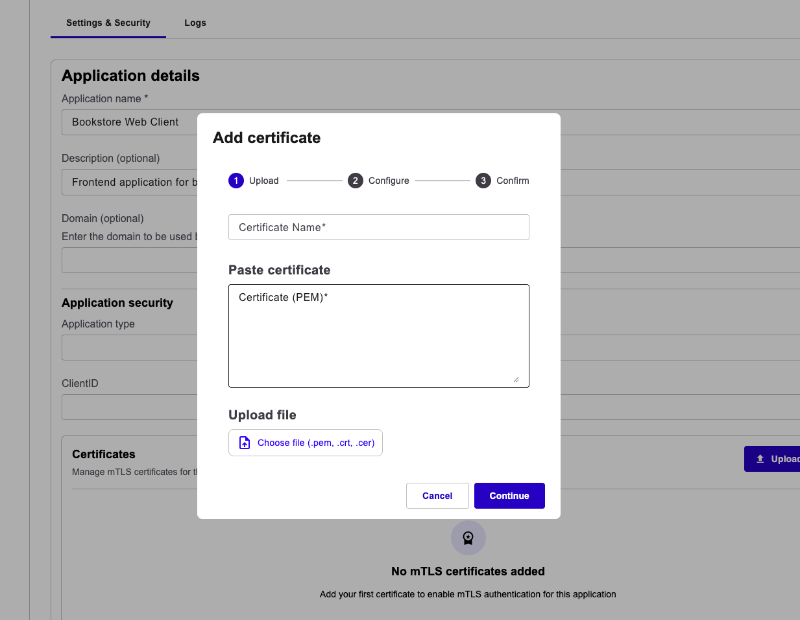

# Create and manage mTLS certificates (application owner guide)

This guide shows application owners how to upload, rotate, and delete mTLS client certificates for their applications from the new Developer Portal.

## Prerequisites

* The new Developer Portal is enabled for your environment (`portal.next.access.enabled`).
* Your administrator has turned on the **Enable mTLS Certificate Management** toggle in the **New Developer Portal** section of the **Portal** settings page in the Management Console. Without this toggle the Certificates section isn't shown. For details, see [Configuring mTLS certificate management (administrator guide)](configuring-mtls-certificate-management-administrator-guide.md).
* You have `APPLICATION_DEFINITION[UPDATE]` on the application. The Certificates section is rendered inside the application's edit form, so `APPLICATION_DEFINITION[READ]` alone isn't enough to view or manage certificates from the new Developer Portal.
* Your certificate is a valid X.509 certificate in PEM format. CA certificates aren't accepted.

## Open the Certificates section

1.  Sign in to the new Developer Portal.

    <figure><figcaption>
New Developer Portal homepage
</figcaption></figure>
2.  Go to **Applications**.

    <figure><figcaption>
Applications list in the new Developer Portal
</figcaption></figure>
3.  Click the application you want to manage. The application opens on the **Settings & Security** tab in view mode.

    <figure><figcaption>
Settings &#x26; Security tab in view mode, showing the Edit button
</figcaption></figure>
4. Click **Edit**. The **Settings & Security** tab switches to edit mode and displays the **Application details** form.
5.  Scroll to the **Certificates** section at the bottom of the form.

    <figure><figcaption>
Certificates section in its empty state, inside the edit form
</figcaption></figure>

    If no certificate has been uploaded yet, the section shows the empty state message _"No mTLS certificates added"_. Once one or more certificates exist, the section displays the **Active certificates** and **Certificate history** tabs.

## Upload a certificate

1.  In the **Certificates** section, click **Upload certificate**. The **Add certificate** dialog opens on the **Upload** step.

    <figure><figcaption>
Upload step of the Add certificate dialog
</figcaption></figure>
2. In the **Certificate Name** field, enter a name for the certificate. The name can be up to 255 characters.
3. Provide the PEM-encoded certificate body in one of two ways:
   * Under **Paste certificate**, paste the PEM content into the **Certificate (PEM)** text area.
   * Under **Upload file**, click **Choose file (.pem, .crt, .cer)** and select a certificate file from your local machine. If the **Certificate Name** field is empty, it auto-fills with the file name (without extension).
4. Click **Continue**. The portal sends the PEM to Gravitee for validation. If the certificate is valid, the wizard advances to the **Configure** step and pre-fills **Active until (optional)** with the certificate's expiration date. If validation fails, an inline error appears and you stay on the **Upload** step.
5. On the **Configure** step, optionally adjust **Active until (optional)**. The date can't be earlier than today.
6. If another certificate is already active for this application, the **Configure** step also shows a **Grace period end for current certificate** field. Set the date on which the currently active certificate should be revoked. Both certificates remain active until that date, so clients can cut over without downtime. The grace period end can't be later than the currently active certificate's expiration.
7. Click **Continue**. The wizard advances to the **Confirm** step and displays the **Certificate Summary**.
8. Review the summary and click **Add Certificate**. The new certificate is created, and if a grace period was set, the currently active certificate's end date is updated to match.

## View certificates

In the **Certificates** section, two tabs organize certificates by state:

* **Active certificates** — certificates with status `ACTIVE`, `ACTIVE_WITH_END`, or `SCHEDULED`.
* **Certificate history** — certificates with status `REVOKED`.

Each row displays:

| Column         | Description                              |
| -------------- | ---------------------------------------- |
| Name           | The certificate's display name.          |
| Uploaded       | The date the certificate was uploaded.   |
| Expiry date    | The certificate's X.509 `notAfter` date. |
| Status         | The current certificate status.          |
| Days remaining | The number of days until expiration.     |

## Delete a certificate

1. In the **Active certificates** tab, click the delete action on the certificate row.
2. Confirm the first deletion dialog.
3. If the certificate you're deleting is the only active certificate left on the application, a second warning dialog asks you to confirm that no active certificate will remain. Click **Cancel** on either dialog to abort the deletion.

If the application still has active mTLS subscriptions and you try to delete its last certificate, Gravitee rejects the request to prevent leaving those subscriptions without a valid certificate. Upload a replacement first or delete the subscriptions, then retry.

## Verification

To verify mTLS certificate management is working as expected, follow these steps:

1. Sign in to the new Developer Portal.
2. Go to **Applications** and click your application.
3. On the **Settings & Security** tab, click **Edit**.
4. Scroll to the **Certificates** section and confirm it's visible.
5. Upload a test certificate by following the steps above. After submission, the certificate appears in the **Active certificates** tab with status `ACTIVE` or `ACTIVE_WITH_END`.
6. Delete the test certificate. After confirmation, it moves to the **Certificate history** tab with status `REVOKED`.
