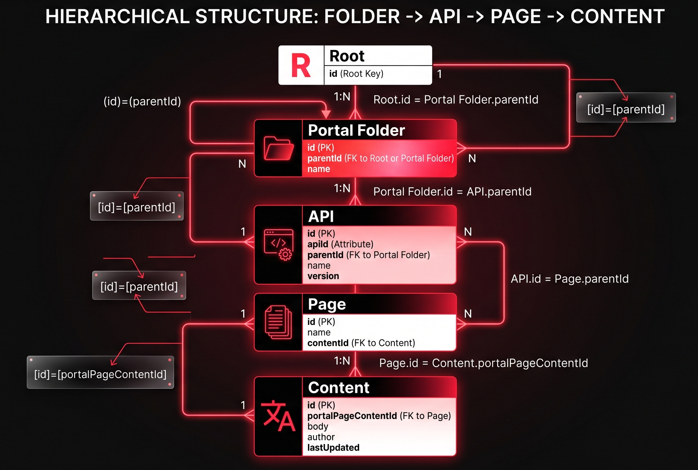
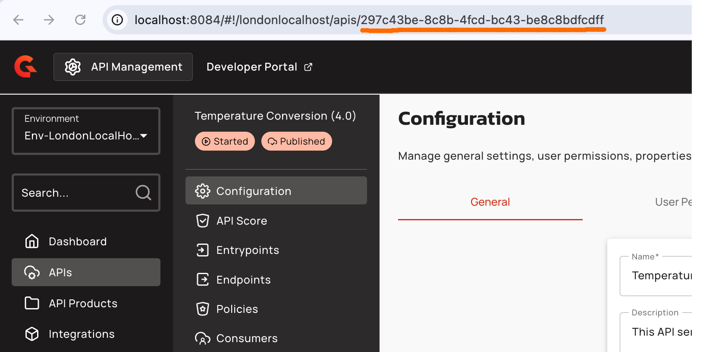
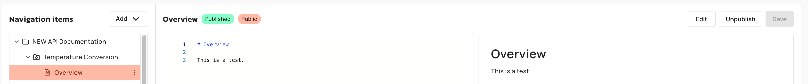
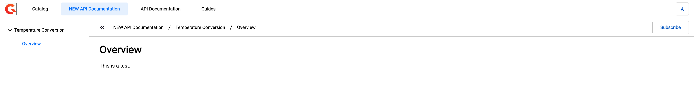

# Structure the navigation with the Management API

## Overview

This guide shows how to programmatically manage your Gravitee Developer Portal (v4.11) with the Gravitee Management API (mAPI) v2. It shows how to create a folder structure for organization and publish APIs and their documentation to the New Developer Portal.

In Gravitee APIM 4.11, the Developer Portal has a tree-based publishing model. You manage your content with Portal Pages, which is content such as markdown and OpenAPI specs, and Portal Navigation Items, which is the structure that determines what is visible in the portal menu.

In contrast to the Classic Developer Portal, where you used the `/portal` mAPI - the "Next Gen" Developer Portal uses new endpoints in the `/management/v2` mAPI, and are environment specific.

<figure><figcaption><p>Hierarchical structure of Folder, API, Page, and Content</p></figcaption></figure>

## Prerequisites

Before you structure your navigation, complete the following steps:

* Ensure you have your Management API v2 Base URL: `https://<your-gravitee-mapi-host>/management/v2` .
* Ensure you have your organization ID. For example,  `DEFAULT` .
* Ensure you have your Environment ID. For example, `DEFAULT` .
* Ensure you have established your authentication. Add a [Personal Access Token (PAT)](../../../configure-and-manage-the-platform/manage-organizations-and-environments/create-a-service-account.md#generate-a-personal-access-token) or [(Automation) Cloud Token](https://app.gitbook.com/s/QiHAMRWybFsowkRWSjCc/guides/cloud-tokens), in the `Authorization` header.

## Structure your navigation with the Management API

1. [#one-time-operation-create-a-portal-folder](structure-the-navigation-with-the-management-api.md#one-time-operation-create-a-portal-folder "mention")
2. [#obtain-the-id-api](structure-the-navigation-with-the-management-api.md#obtain-the-id-api "mention")
3. [#add-the-api-to-the-developer-portal](structure-the-navigation-with-the-management-api.md#add-the-api-to-the-developer-portal "mention")
4. [#add-a-new-page-to-your-api](structure-the-navigation-with-the-management-api.md#add-a-new-page-to-your-api "mention")
5. [#add-content-to-your-new-page](structure-the-navigation-with-the-management-api.md#add-content-to-your-new-page "mention")


### (One time operation) Create a Portal Folder


&#x20;If the folder is `PRIVATE`, the APIs inside it will only be visible to logged-in users, even if the APIs themselves are `PUBLIC`.


To organise your APIs or general documentation, create a root folder within the environment's Portal Pages, which are not published by default.  This is a one-time operation because you can use APIs and Pages in this folder.&#x20;

1. Send a `POST` request using either a curl command or an HTTP request:



```shellscript
curl --location 'https://<your-gravitee-mapi-host>/management/v2/organizations/<DEFAULT>/environments/<DEFAULT>/portal-navigation-items' \
--header 'Content-Type: application/json' \
--header 'Authorization: Bearer {your_personal_access_token}' \
--data '{
  "title": "API Documentation",
  "type": "FOLDER",
  "area": "TOP_NAVBAR",
  "visibility": "PUBLIC",
  "order": 0
}'
```

* Replace `<your-gravitee-mapi-host>` with your Gravitee mAPI host.&#x20;
* Replace `<DEFAULT>` with your organization ID.
* Replace `<DEFAULT>` with your environment ID.
* Replace `{your_personal_access_token}` with your Personal Access Token.



```json
POST https://<your-gravitee-mapi-host>/management/v2/organizations/{orgId}/environments/{envId}/portal-navigation-items

{
  "title": "API Documentation",
  "type": "FOLDER",
  "area": "TOP_NAVBAR",
  "visibility": "PUBLIC",
  "order": 0
}
```

* Replace `<your-gravitee-mapi-host>` with your Gravitee mAPI host.&#x20;



<details>

<summary>Example Response</summary>

```json
{
    "type": "FOLDER",
    "id": "87eff454-fa9b-4bbe-acc7-eb1b6512ae09",
    "organizationId": "DEFAULT",
    "environmentId": "DEFAULT",
    "title": "NEW API Documentation",
    "area": "TOP_NAVBAR",
    "rootId": "87eff454-fa9b-4bbe-acc7-eb1b6512ae09",
    "order": 0,
    "published": false,
    "visibility": "PUBLIC"
}
```

</details>

2. Copy the response in the `id` field, For example, `87eff454-fa9b-4bbe-acc7-eb1b6512ae09`, and then store it somewhere safe. You need this ID to place APIs or pages in the folder.
3. Publish this new Folder by setting `published: true`  by sending a `PUT` request using either a curl command or an HTTP request:



```shellscript
curl --location --request PUT 'https://<your-gravitee-mapi-host>/management/v2/organizations/<DEFAULT>/environments/<DEFAULT>/portal-navigation-items/{id}' \
--header 'Content-Type: application/json' \
--header 'Authorization: Bearer {your_personal_access_token}' \
--data '{
    "type": "FOLDER",
    "id": "{id}",
    "organizationId": "DEFAULT",
    "environmentId": "DEFAULT",
    "title": "API Documentation",
    "area": "TOP_NAVBAR",
    "rootId": "{id}",
    "order": 0,
    "published": true,
    "visibility": "PUBLIC"
}'
```

* Replace `<your-gravitee-mapi-host>` with your mAPI host.
* Replace `{id}` with the relevant folder ID.
* Replace `<DEFAULT>` with your organization ID.
* Replace `<DEFAULT>` with your environment ID.
* Replace `{your_personal_access_token}` with your Personal Access Token.



### Verification

To confirm the folder is published, do one of the following:

1.  Send a GET request to list the top-level navigation items:

    ```bash
    curl --location 'https://<your-gravitee-mapi-host>/management/v2/organizations/DEFAULT/environments/DEFAULT/portal-navigation-items?area=TOP_NAVBAR&loadChildren=true' \
    --header 'Authorization: Bearer {your_personal_access_token}'
    ```

    Confirm the response contains your folder with `"published": true` and the expected `title`.
2. Open the Developer Portal in a browser and confirm the **API Documentation** folder appears in the top navigation bar.

### Obtain the `id` API

Before you publish an API to the portal, you must create and configure the API. After you create and configure the API, you must obtain the unique `id` of your API. You can obtain the `id` of your API by completing either of the following actions:

* View the APIM Console URL of your API.

<figure><figcaption></figcaption></figure>

* Query the `/apis/_search` endpoint of your API's entry point contextPath using either a curl command or an HTTP request.



```shellscript
curl --location 'https://<your-gravitee-mapi-host>/management/v2/organizations/DEFAULT/environments/DEFAULT/apis/_search' \
--header 'Content-Type: application/json' \
--header 'Authorization: Bearer {your_personal_access_token}' \
--data '{"query":"/my-demo-api-entrypoint-path/"}'
```

* Replace `<your-gravitee-mapi-host>` with your mAPI host.
* Replace `<DEFAULT>` with your organization ID.
* Replace `<DEFAULT>` with your environment ID.
* Replace `{your_personal_access_token}` with your Personal Access Token.
* Replace the query with the actual entrypoint path of your API.



### Verification&#x20;

The `id` returned in the response.

### Add the API to the Developer Portal

With the API `id` , which is used as the `apiId` You can access the API through the Developer Portal. By default, the API is unpublished. The `parentId` is the `id` of the folder created in [#one-time-operation-create-a-portal-folder](structure-the-navigation-with-the-management-api.md#one-time-operation-create-a-portal-folder "mention").

1. Send a `POST` request using either a curl command or an HTTP request:



```shellscript
curl --location 'https://<your-gravitee-mapi-host>/management/v2/organizations/<DEFAULT>/environments/<DEFAULT>/portal-navigation-items' \
--header 'Content-Type: application/json' \
--header 'Authorization: Bearer {your_personal_access_token}' \
--data '{
    "title":"",
    "type":"API",
    "area":"TOP_NAVBAR",
    "parentId":"87eff454-fa9b-4bbe-acc7-eb1b6512ae09",
    "visibility":"PUBLIC",
    "apiId":"297c43be-8c8b-4fcd-bc43-be8c8bdfcdff"
 }'
```

* Replace `<your-gravitee-mapi-host>` with your mAPI host.
* Replace `<DEFAULT>` with your organization ID.
* Replace `<DEFAULT>` with your environment ID.
* Replace `{your_personal_access_token}` with your Personal Access Token.
* Replace the `parentId` value with the folder ID you created in the first step.
* Replace the `appId` value with the API ID you wish to add to the Portal.



<details>

<summary>Example Response</summary>

```json
{
    "type": "API",
    "apiId": "297c43be-8c8b-4fcd-bc43-be8c8bdfcdff",
    "id": "f1d68b7e-0d23-4f8f-a7ef-50505bb3abfb",
    "organizationId": "DEFAULT",
    "environmentId": "DEFAULT",
    "title": "Temperature Conversion",
    "area": "TOP_NAVBAR",
    "parentId": "87eff454-fa9b-4bbe-acc7-eb1b6512ae09",
    "rootId": "87eff454-fa9b-4bbe-acc7-eb1b6512ae09",
    "order": 0,
    "published": false,
    "visibility": "PUBLIC"
}
```

</details>

2. Publish the API. This update uses the HTTP `PUT` method with the response from step 1. But with `published: true` Copy the `id` returned by the POST in the previous step into the URL path. Copy `apiId` and `parentId` from the same response into the request body



```shellscript
curl --location --request PUT 'https://<your-gravitee-mapi-host>/management/v2/organizations/DEFAULT/environments/DEFAULT/portal-navigation-items/{id}' \
--header 'Content-Type: application/json' \
--header 'Authorization: Bearer {your_personal_access_token}' \
--data '{
    "type": "API",
    "apiId": "297c43be-8c8b-4fcd-bc43-be8c8bdfcdff",
    "id": "f1d68b7e-0d23-4f8f-a7ef-50505bb3abfb",
    "organizationId": "DEFAULT",
    "environmentId": "DEFAULT",
    "title": "Temperature Conversion",
    "area": "TOP_NAVBAR",
    "parentId": "87eff454-fa9b-4bbe-acc7-eb1b6512ae09",
    "rootId": "87eff454-fa9b-4bbe-acc7-eb1b6512ae09",
    "order": 0,
    "published": true,
    "visibility": "PUBLIC"
}'
```

* Replace `<your-gravitee-mapi-host>` with your mAPI host.
* Replace `<DEFAULT>` with your organization ID.
* Replace `<DEFAULT>` with your environment ID.
* Replace `{id}` with the `id` created from the previous step.
* Replace `{your_personal_access_token}` with your Personal Access Token.
* The `data` value is retrieved from the response when you created the API in the Portal.



<details>

<summary>Example Response</summary>

```json
{
    "type": "API",
    "apiId": "297c43be-8c8b-4fcd-bc43-be8c8bdfcdff",
    "id": "f1d68b7e-0d23-4f8f-a7ef-50505bb3abfb",
    "organizationId": "DEFAULT",
    "environmentId": "DEFAULT",
    "title": "Temperature Conversion",
    "area": "TOP_NAVBAR",
    "parentId": "87eff454-fa9b-4bbe-acc7-eb1b6512ae09",
    "rootId": "87eff454-fa9b-4bbe-acc7-eb1b6512ae09",
    "order": 0,
    "published": true,
    "visibility": "PUBLIC"
}
```

</details>

### Add a new Page to your API


Use the `order` field in Navigation Items to sort how items appear in the Portal sidebar.


To add API documentation, create a new Page and modify it to include your content. To add API documentation, complete the following steps:

1. Send the `POST` request.  The `parentId` is the `id` of the API that you obtained in [#obtain-the-id-of-your-api](structure-the-navigation-with-the-management-api.md#obtain-the-id-of-your-api "mention").



```shellscript
curl --location 'https://<your-gravitee-mapi-host>/management/v2/organizations/DEFAULT/environments/DEFAULT/portal-navigation-items' \
--header 'Content-Type: application/json' \
--header 'Authorization: Bearer {your_personal_access_token}' \
--data '{
    "title":"Overview",
    "type":"PAGE",
    "area":"TOP_NAVBAR",
    "parentId":"f1d68b7e-0d23-4f8f-a7ef-50505bb3abfb",
    "visibility":"PUBLIC"
 }'
```

* Replace `<your-gravitee-mapi-host>` with your mAPI host.
* Replace `<DEFAULT>` with your organization ID.
* Replace `<DEFAULT>` with your environment ID.
* Replace `{your_personal_access_token}` with your Personal Access Token.
* The `parentId` is the `id` of the API that you created in [#obtain-the-id-of-your-api](structure-the-navigation-with-the-management-api.md#obtain-the-id-of-your-api "mention").



<details>

<summary>Example Response</summary>

```json
{
    "type": "PAGE",
    "portalPageContentId": "fa3acb68-6ab1-45ae-b9ef-73e5c0b7bacf",
    "id": "a46e69c8-a271-4acc-80e8-c0e16ef5bda7",
    "organizationId": "DEFAULT",
    "environmentId": "DEFAULT",
    "title": "Overview",
    "area": "TOP_NAVBAR",
    "parentId": "f1d68b7e-0d23-4f8f-a7ef-50505bb3abfb",
    "rootId": "87eff454-fa9b-4bbe-acc7-eb1b6512ae09",
    "order": 0,
    "published": false,
    "visibility": "PUBLIC"
}
```

</details>

### Add content to your new Page


&#x20;For OpenAPI specs, ensure the `content` is a valid JSON string and `type` is `SWAGGER`. If you use Markdown, ensure the `type` is set to `MARKDOWN`.


Documentation pages are attached to the API directly. Once you publish the page to the Developer Portal, you will see the API in the Catalog and a button to subscribe to it. To add content to your Page, complete the following steps:

1. Obtain the new `portalPageContentId` from the response in [#add-a-new-page-to-your-api](structure-the-navigation-with-the-management-api.md#add-a-new-page-to-your-api "mention").  Your payload must include the page type, for example, GRAVITEE\_MARKDOWN or SWAGGER, and the `content`.  This update requires the HTTP `PUT` method on the `/portal-page-contents` endpoint.



```shellscript
curl --location --request PUT 'https://<your-gravitee-mapi-host>/management/v2/organizations/DEFAULT/environments/DEFAULT/portal-page-contents/{portalPageContentId}' \
--header 'Content-Type: application/json' \
--header 'Authorization: Bearer {your_personal_access_token}' \
--data '{
    "type": "GRAVITEE_MARKDOWN",
    "content": "# Overview\n\nThis is a test."
}'
```

* Replace `<your-gravitee-mapi-host>` with your mAPI host.
* Replace `<DEFAULT>` with your organization ID.
* Replace `<DEFAULT>` with your environment ID.
* Replace `{portalPageContentId}` with the ID from the previous response.
* Replace `{your_personal_access_token}` with your Personal Access Token.



<details>

<summary>Example Response</summary>

```json
{
    "id": "fa3acb68-6ab1-45ae-b9ef-73e5c0b7bacf",
    "type": "GRAVITEE_MARKDOWN",
    "content": "# Overview\n\nThis is a test."
}
```

</details>

If you want to include OpenAPI Specification as the content, please refer to this example:



```shellscript
curl --location --request PUT 'https://<your-gravitee-mapi-host>/management/v2/organizations/DEFAULT/environments/DEFAULT/portal-page-contents/{portalPageContentId}' \
--header 'Content-Type: application/json' \
--header 'Authorization: Bearer {your_personal_access_token}' \
--data '{
  "name": "OpenAPI Technical Reference",
  "type": "SWAGGER",
  "content": "{\"openapi\": \"3.0.0\", ...}"
}'
```

* Replace `<your-gravitee-mapi-host>` with your mAPI host.
* Replace `<DEFAULT>` with your organization ID.
* Replace `<DEFAULT>` with your environment ID.
* Replace `{portalPageContentId}` with the ID from the previous response.
* Replace `{your_personal_access_token}` with your Personal Access Token.



2. Publish the Page.  Retrieve the page `id` and response from [#add-the-api-to-the-developer-portal](structure-the-navigation-with-the-management-api.md#add-the-api-to-the-developer-portal "mention"), and publish the API by setting `published: true`.  This update requires HTTP `PUT` method.



```shellscript
curl --location --request PUT 'https://<your-gravitee-mapi-host>/management/v2/organizations/DEFAULT/environments/DEFAULT/portal-navigation-items/{id}' \
--header 'Content-Type: application/json' \
--header 'Authorization: Bearer {your_personal_access_token}' \
--data '{
    "type": "PAGE",
    "portalPageContentId": "fa3acb68-6ab1-45ae-b9ef-73e5c0b7bacf",
    "id": "a46e69c8-a271-4acc-80e8-c0e16ef5bda7",
    "organizationId": "DEFAULT",
    "environmentId": "DEFAULT",
    "title": "Overview",
    "area": "TOP_NAVBAR",
    "parentId": "f1d68b7e-0d23-4f8f-a7ef-50505bb3abfb",
    "rootId": "87eff454-fa9b-4bbe-acc7-eb1b6512ae09",
    "order": 0,
    "published": true,
    "visibility": "PUBLIC"
}'
```

* Replace `<your-gravitee-mapi-host>` with your mAPI host.
* Replace `<DEFAULT>` with your organization ID.
* Replace `<DEFAULT>` with your environment ID.
* Replace `{your_personal_access_token}` with your Personal Access Token.
* The `data` value is retrieved from the response when you created the page in the Portal.



<details>

<summary>Example Response</summary>

```json
{
    "type": "PAGE",
    "portalPageContentId": "fa3acb68-6ab1-45ae-b9ef-73e5c0b7bacf",
    "id": "a46e69c8-a271-4acc-80e8-c0e16ef5bda7",
    "organizationId": "DEFAULT",
    "environmentId": "DEFAULT",
    "title": "Overview",
    "area": "TOP_NAVBAR",
    "parentId": "f1d68b7e-0d23-4f8f-a7ef-50505bb3abfb",
    "rootId": "87eff454-fa9b-4bbe-acc7-eb1b6512ae09",
    "order": 0,
    "published": true,
    "visibility": "PUBLIC"
}
```

</details>

### Verification

* The API page has the `published` status in the Developer Portal Console.

<figure><figcaption><p>View of the API and page in the Developer Portal Navigation Admin Console</p></figcaption></figure>

* The API is visible on the Developer Portal with the **Subscribe** button.

<figure><figcaption><p>View of the published API and documentation page in the Developer Portal</p></figcaption></figure>
