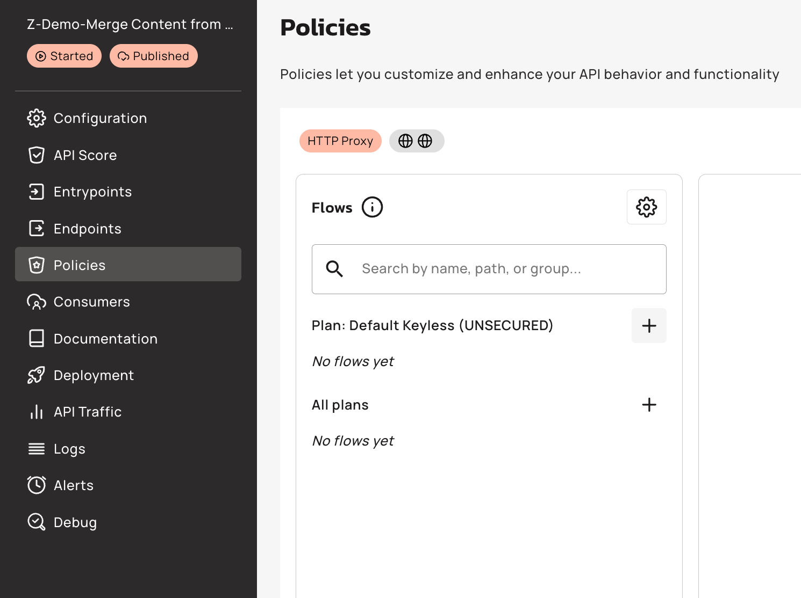

# Manage Subscriptions

### Overview 

You can subscribe to APIs and manage your subscriptions with the New Developer Portal. Unless the API has a keyless plan, a consumer must create an application and subscribe to a published API plan to access an API. Applications act on behalf of the user.

### Prerequisites 

* Enable the New Developer Portal. For more information about enabling the New Developer Portal, see [Enable the New Developer Portal](https://documentation.gravitee.io/apim/developer-portal/new-developer-portal/configure-the-new-portal).
* Create an application in the New Developer Portal. For more information about creating applications in the New Developer Portal, see [create-an-application.md](create-an-application.md "mention")

### Subscribe to an API 

To subscribe to an API, complete the following steps:

1. Navigate to the Catalog.
2. Choose an API and navigate its documentation page

<figure><figcaption></figcaption></figure>

2. Click Subscribe to navigate to the Subscription page

<figure><figcaption></figcaption></figure>

3. Select a Plan

<figure><figcaption></figcaption></figure>

4. Select an application

<figure><figcaption></figcaption></figure>

5. Confirm the subscription

<figure><figcaption></figcaption></figure>

6. You will be redirected to the [#subscription-details](manage-subscriptions.md#subscription-details "mention")

<figure><figcaption></figcaption></figure>

### View existing subscriptions

You can manage all existing subscriptions from the subscriptions dashboard.

1. Using the dropdown menu at the top right corner of the screen, navigate to the Subscriptions page

This page shows all subscriptions **across all APIs and Applications**. You can filter subscriptions by API, Application, and Subscription Status.

2. Click on a subscription in the subscription list, and you will be redirected to [#subscription-details](manage-subscriptions.md#subscription-details "mention")

<figure><figcaption></figcaption></figure>

### Subscription details

This page allows you to manage an individual subscription.

* View subscription properties
* Navigate to the API Page
* Navigate to the Application page
* Close subscription

<figure><figcaption></figcaption></figure>

#### Close subscription

To close a subscription, click on Close subscription button at the top right corner of the screen.

<figure><figcaption></figcaption></figure>

Once closed, the subscription status is updated and access information is no longer visible.

<figure><figcaption></figcaption></figure>
