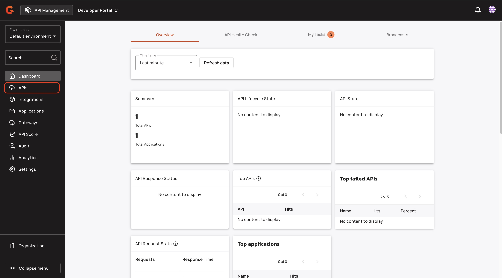
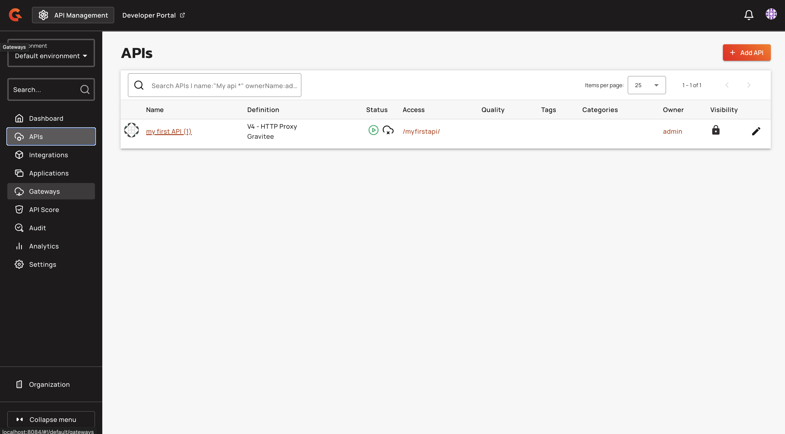
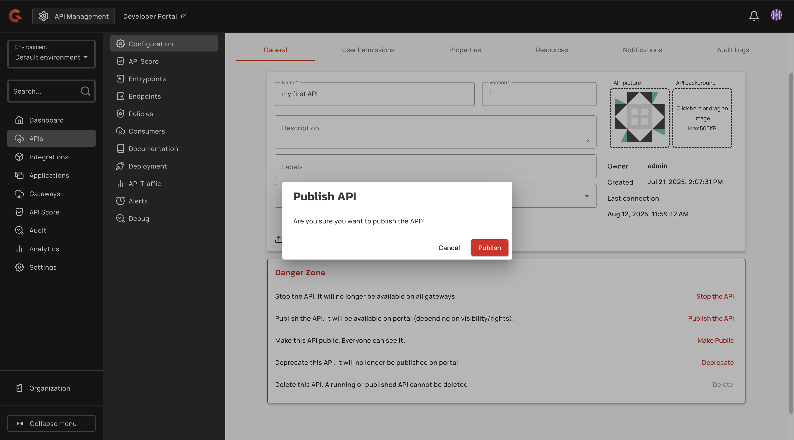
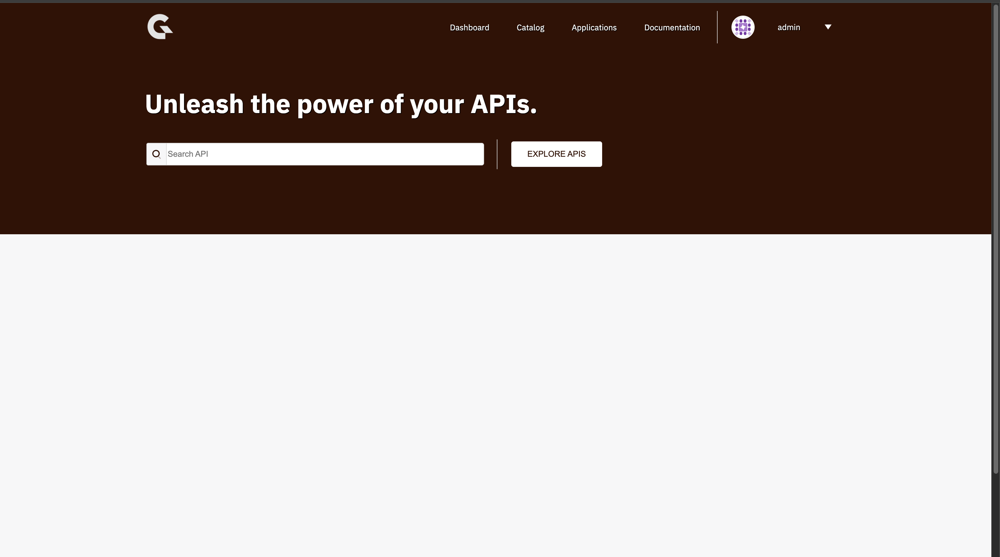
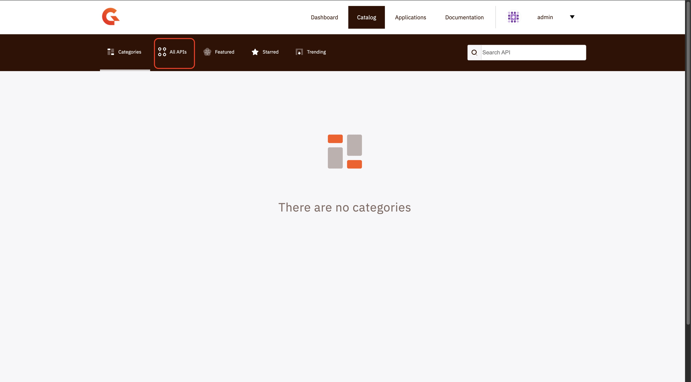
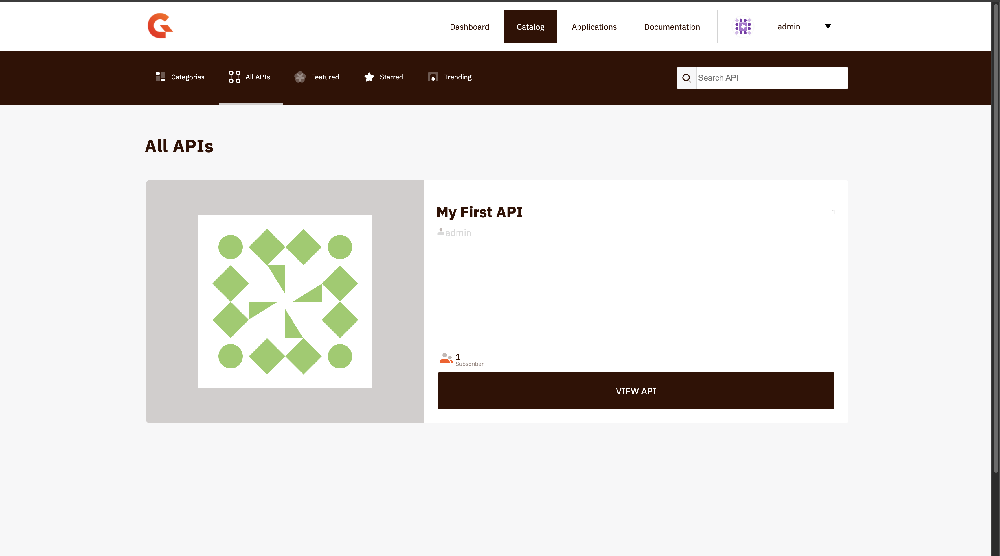

# Publish your API

## Overview

This guide explains how to Publish your API.

## Prerequisites

* Complete the steps in [create-an-api.md](create-an-api.md "mention").
* Complete the steps in [add-security.md](add-security.md "mention").
* Complete the steps in [add-a-policy.md](add-a-policy.md "mention").

## Publish your API


This page applies to the Classic Portal. The New Developer Portal doesn't use the API's published state. To make an API visible in the New Developer Portal, add the API to the portal navigation and publish it there. For more information, see [Manage Portal Navigation and APIs](../../developer-portal/new-developer-portal/customize-the-navigation/README.md).


1.  From the dashboard, click **APIs**.

    <figure><figcaption></figcaption></figure>
2.  Click the API that you created in [create-an-api.md](create-an-api.md "mention").

    <figure><figcaption></figcaption></figure>
3.  In the **Danger Zone** section, click **Publish the API**.

    <figure><figcaption></figcaption></figure>
4.  In the **Publish API** pop-up window, click **Publish**. Your API is now published to the Developer Portal.

    <figure><figcaption></figcaption></figure>

## Verification

Your API appears on the Developer Portal. To view your API in the Developer Portal, complete the following steps:

1.  In the console header navigation, click **Developer Portal**.

    <figure><figcaption></figcaption></figure>
2.  In the Developer Portal, click **Explore APIs**.

    <figure><figcaption></figcaption></figure>
3.  In the **Catalog** page, click **All APIs.**

    <figure><figcaption></figcaption></figure>

Your API appears in the **All APIs** section.

<figure><figcaption></figcaption></figure>
