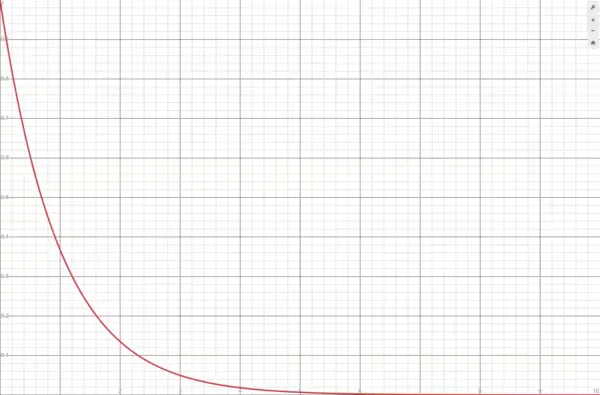

# API Score

<table data-view="cards"><thead><tr><th data-type="content-ref"></th></tr></thead><tbody><tr><td><a href="enable-api-score.md">enable-api-score.md</a></td></tr><tr><td><a href="view-api-scores.md">view-api-scores.md</a></td></tr><tr><td><a href="rulesets-and-functions.md">rulesets-and-functions.md</a></td></tr><tr><td><a href="types-of-assets.md">types-of-assets.md</a></td></tr><tr><td><a href="generate-an-api-score.md">generate-an-api-score.md</a></td></tr></tbody></table>

## Overview

API Score is Gravitee’s automated governance capability. It lets you score your APIs based on criteria like security, documentation, and consistency. As a static tool, API Score evaluates how your APIs are configured and designed, but does not perform tests on the data plane.

The API Score feature uses rulesets to score APIs. Gravitee provides default rulesets, but you can also create your own custom rulesets.

## How API Score works

When you evaluate an API’s score, any relevant piece of information about your API’s design and settings is sent to the scoring service. Specifically, the scoring service receives the Gravitee API definition, as well as any OpenAPI or AsyncAPI documentation pages attached to your API.

Virtually any setting or configuration that is part of your API can be used for scoring. This lets you use API Score to verify that your APIs comply with your organization’s standards and policies related to documentation, security, and more. For example, you can use API Score to verify the following aspects of your API:

* Is the API properly documented, with descriptions and Markdown pages?
* Are the RBACs properly set?
* Is the API exposed to consumers using a secure mechanism like JWT or OAuth 2.0?
* Does the API include specific policies, such as rate limiting or topic mapping?

When API Score scores your API, it returns issues in the form of errors, warnings, infos, and hints for you to investigate. It also generates a scoring percentage based on the number and severity of issues raised.

## How your API score is calculated

API Score evaluates each component of your API as a separate [asset](types-of-assets.md):

* The Gravitee API definition is always evaluated as one asset.
* Each attached OpenAPI or AsyncAPI documentation page is evaluated as an additional asset. Other documentation page types aren't scored.

Each asset is scored individually with the following formula, using only the issues raised for that asset:

`asset_score = 100 · e^−0.1·(1.0·nbErrors + 0.5·nbWarnings + 0.2·nbInfos + 0.1·nbHints)`

Each asset's score is projected onto a function that has the following shape:

<figure><figcaption></figcaption></figure>

The API score shown in the Console is the arithmetic average of all per-asset scores. The error, warning, info, and hint counts shown next to the score are totals summed across every asset.

For example, an API with two assets, a Gravitee definition with no issues (score 100%) and an OpenAPI page with 11 errors (score `100 · e^−1.1` ≈ 33%), displays 11 errors and an overall score of (100% + 33%) / 2 ≈ 66%.

An asset whose analysis fails, for example a documentation page that fails to parse, is excluded from both the average and the totals. If no asset is successfully analyzed, no score is available.
