# Implement BFF pattern (with a Shared Policy Group)

## Overview

In recent years, it was common to implement OpenID Connect for single-page apps (SPAs) in JavaScript (React, Angular, Vue, etc.). This approach is no longer recommended.

For more information, see the [OAuth browser-based apps draft.](https://datatracker.ietf.org/doc/draft-ietf-oauth-browser-based-apps/)

* Using access tokens in the browser has more security risks than using secure cookies.
* A SPA is a public client and cannot keep a secret. Any secret would be part of the JavaScript and accessible to anyone inspecting the source code.
* Recent browser changes to prevent tracking may result in third-party cookies being dropped during token renewal.
* Browsers cannot store data securely for long periods. Stored data is vulnerable to various attacks.
* Browsers have introduced stronger [SameSite cookies](https://datatracker.ietf.org/doc/html/draft-west-first-party-cookies-07), and using tokens in the browser is now considered less secure in comparison.

Due to the above issues, the recommended security approach for SPAs is to avoid storing access tokens in the browser and instead create a lightweight backend component called Backend for Frontend (BFF).


The **BFF pattern** can also serve as a valuable approach in scenarios where backend APIs or applications lack existing protection, providing a transparent and secure mechanism for consumers to access them through web browsers.


<figure>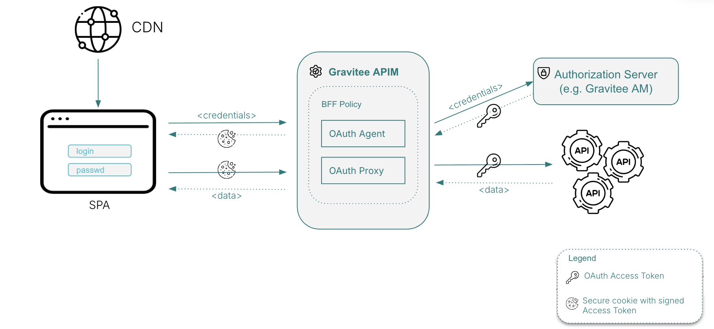<figcaption></figcaption></figure>

#### BFF Shared Policy Group responsibilities

* **OAuth Agent:** Forwards OAuth requests to the Authorization Server when requested by the SPA. The agent creates the actual OAuth request messages and any secrets used, then receives tokens in response messages. Secure cookies are then returned to the browser and cannot be accessed by the SPA's JavaScript code.
* **OAuth Proxy:** Receives a secure cookie from the SPA and propagates the access token to backend APIs.

## Implementation

This guide assumes that the `clientId` property has been created in your API. This `clientId` redirects the user to the Authorization Server. This implementation creates a session cookie. (Optional): You can edit the [shared policy group](../../create-and-configure-apis/apply-policies/shared-policy-groups.md) to configure the cookie with an expiration date.

### Task 1: Create an On-Request Shared Policy Group

1.  Navigate to the shared policy groups by clicking on Settings, and then **Shared Policy Groups**.<br>

    <figure><figcaption></figcaption></figure>
2. Click **Add Shared Policy Group**, and select **Proxy API**.
3.  Specify a name for this SPG, and ensure the **Request** phase is selected. Then click on the **\[Save]** button.<br>

    <figure>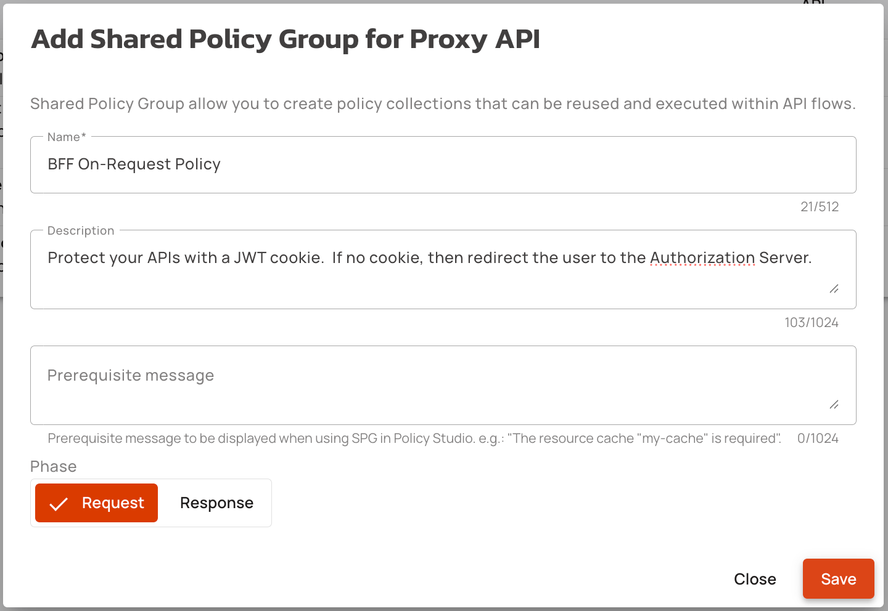<figcaption></figcaption></figure>
4. Add the [**Groovy**](../../create-and-configure-apis/apply-policies/policy-reference/groovy.md) **Policy**
   1. Use the following GroovyScript to get the Auth BFF cookie

```groovy
def cookieHeader = request.headers['Cookie'][0]
def getCookieValue(cookieHeader, cookieName) {
    if (!cookieHeader) {
        return nulln
    }
    for (String part: cookieHeader.split(';')) {
        String trimmed = part.trim()
        String[] pieces = trimmed.split('=', 2)
        if (pieces.length == 2) {
            String name = pieces[0]
            String value = pieces[1]
            if (name == cookieName) {
                return value
            }
        }
    }
    return null
}
def bffCookie = getCookieValue(cookieHeader, "X-Gravitee-BFF-Cookie")
context.attributes['bffCookie'] = bffCookie
```

b. Click on the **\[Add policy]** button, and progress to the next step.

<figure>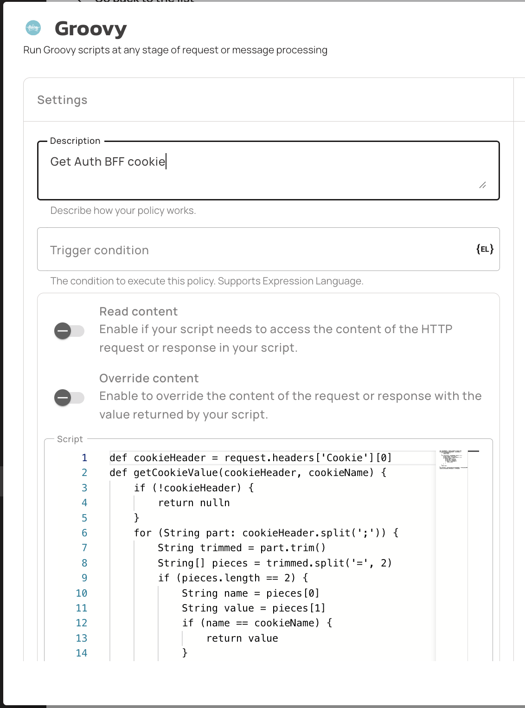<figcaption></figcaption></figure>

5. Add the [**Mock**](../../create-and-configure-apis/apply-policies/policy-reference/mock.md) **Policy**
   1. Set the **Trigger condition** to `{#context.attributes['bffCookie'] == null && #request.params['code'] == null}`
   2. Set the **HTTP Status Code** to `302-MOVED_TEMPORARILY`
   3. Add a new **Header** named `Location`, with value of `https://auth.server.com/oauth/authorize?client_id={#api.properties['clientId']}&response_type=code&redirect_uri={#request.scheme + '://' + #request.host + #request.path}`
   4.  Click on the **\[Add policy]** button, and progress to the next step.

       <figure>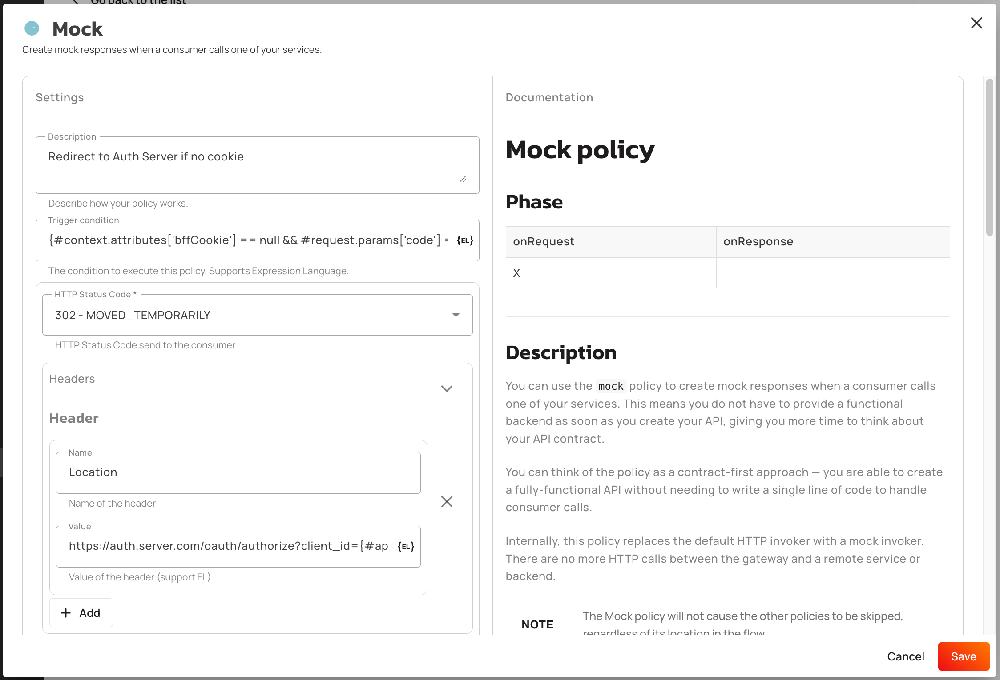<figcaption></figcaption></figure>
6. Add the [**HTTP Callout**](../../create-and-configure-apis/apply-policies/policy-reference/http-callout.md) **Policy**
   1. Set the **Trigger condition** to `{#context.attributes['bffCookie'] == null && #request.params['code'] != null}`
   2. Set the **HTTP Method** to `POST`
   3. Set the **URL** to the Auth Server token endpoint. E.g.: `https://auth.server.com/oauth/token`
   4. Add a new **Header** named `Content-Type`, with value of `application/x-www-form-urlencoded`
   5. Set the **Request body** to `grant_type=authorization_code&code={#request.params['code'][0]}&client_id={#api.properties['clientId']}&redirect_uri={#request.scheme + '://' + #request.host + #request.path}`
   6. Add a new **Context Variable** named `accessToken`, with value of `{#jsonPath(#calloutResponse.content, '$.access_token')}`
   7.  Click on the **\[Add policy]** button, and progress to the next step.

       <figure>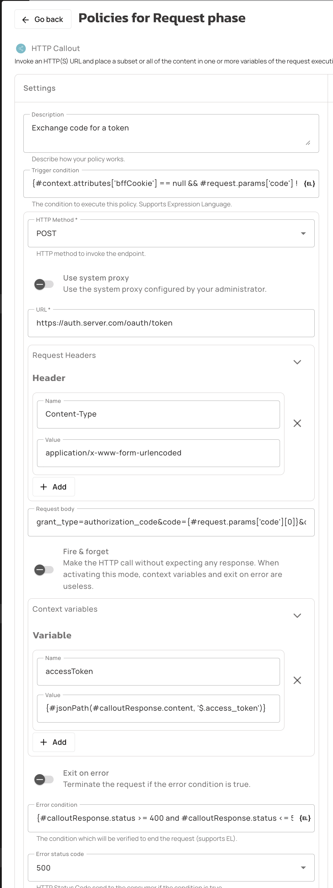<figcaption></figcaption></figure>
7. Add the [**Transform Headers**](../../create-and-configure-apis/apply-policies/policy-reference/transform-headers.md) **Policy**
   1. Set the **Trigger condition** to `{#context.attributes['bffCookie'] != null}`
   2. Within the **Set/replace headers** section, add a new **Key** named `Authorization` with a value of `Bearer {#context.attributes['bffCookie']}`
   3.  Click on the **\[Add policy]** button, and progress to the next step.

       <figure>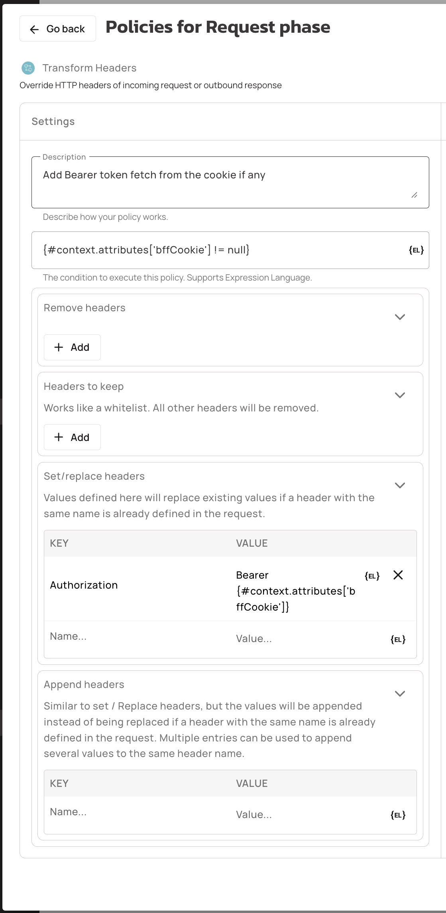<figcaption></figcaption></figure>
8. Add the [**JSON Web Tokens**](../../create-and-configure-apis/apply-policies/policy-reference/jws-validator.md) **Policy**
   1. Set the **Trigger condition** to `{#context.attributes['bffCookie'] != null}`
   2. Set the **JWKS resolver** to `JWKS_URL`
   3. Set the **Resolver parameter** to `https://auth.server.com/.well-known/jwks.json`
   4.  Click on the **\[Add policy]** button, and progress to the next step.<br>

       <figure>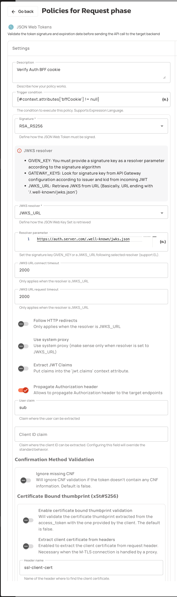<figcaption></figcaption></figure>
9. Now that all the policies have been added, click on the **\[Save]** button.
10. Click the **\[Deploy]** button.

    <figure>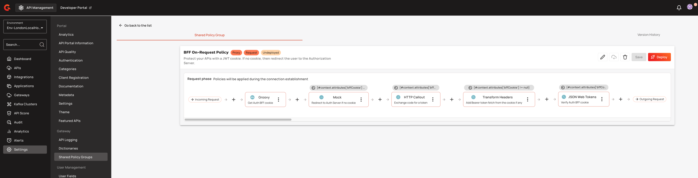<figcaption></figcaption></figure>

<details>

<summary>You can find the full JSON definition for the <strong>BFF On-Request Shared Policy Group</strong> here</summary>

```json
{
  "name": "BFF On-Request Shared Policy Group",
  "description": "Protect your APIs with a JWT cookie, if no cookie, redirect the user to the authorization server",
  "prerequisiteMessage": "",
  "version": 1,
  "apiType": "PROXY",
  "originContext": {
    "origin": "MANAGEMENT"
  },
  "steps": [
    {
      "name": "Groovy",
      "description": "Get Auth BFF cookie",
      "enabled": true,
      "policy": "groovy",
      "configuration": {
        "scope": "REQUEST",
        "script": "def cookieHeader = request.headers['Cookie'][0]\n\ndef getCookieValue(cookieHeader, cookieName) {\n    if (!cookieHeader) {\n        return null\n    }\n\n    for (String part : cookieHeader.split(';')) {\n        String trimmed = part.trim()\n        String[] pieces = trimmed.split('=', 2)\n        if (pieces.length == 2) {\n            String name = pieces[0]\n            String value = pieces[1]\n            if (name == cookieName) {\n                return value\n            }\n        }\n    }\n    return null\n}\n\ndef bffCookie = getCookieValue(cookieHeader, \"X-Gravitee-BFF-Cookie\")\ncontext.attributes['bffCookie'] = bffCookie\n"
      }
    },
    {
      "name": "Mock",
      "description": "Redirect to Auth Server if no cookie",
      "enabled": true,
      "policy": "mock",
      "configuration": {
        "headers": [
          {
            "name": "Location",
            "value": "https://auth.server.com/oauth/authorize?client_id={#api.properties['clientId']}&response_type=code&redirect_uri={#request.scheme + '://' + #request.host + #request.path}"
          }
        ],
        "status": "302"
      },
      "condition": "{#context.attributes['bffCookie'] == null && #request.params['code'] == null}"
    },
    {
      "name": "HTTP Callout",
      "description": "Exchange code for a token",
      "enabled": true,
      "policy": "policy-http-callout",
      "configuration": {
        "headers": [
          {
            "name": "Content-Type",
            "value": "application/x-www-form-urlencoded"
          }
        ],
        "variables": [
          {
            "name": "accessToken",
            "value": "{#jsonPath(#calloutResponse.content, '$.access_token')}"
          }
        ],
        "method": "POST",
        "fireAndForget": false,
        "scope": "REQUEST",
        "errorStatusCode": "500",
        "body": "grant_type=authorization_code&code={#request.params['code'][0]}&client_id={#api.properties['clientId']}&redirect_uri={#request.scheme + '://' + #request.host + #request.path}",
        "errorCondition": "{#calloutResponse.status >= 400 and #calloutResponse.status <= 599}",
        "url": "https://auth.server.com/oauth/token",
        "exitOnError": false
      },
      "condition": "{#context.attributes['bffCookie'] == null && #request.params['code'] != null}"
    },
    {
      "name": "Transform Headers",
      "description": "Add Bearer token fetch from the cookie if any",
      "enabled": true,
      "policy": "transform-headers",
      "configuration": {
        "whitelistHeaders": [],
        "addHeaders": [
          {
            "name": "Authorization",
            "value": "Bearer {#context.attributes['bffCookie']}"
          }
        ],
        "scope": "REQUEST",
        "removeHeaders": []
      },
      "condition": "{#context.attributes['bffCookie'] != null}"
    },
    {
      "name": "JSON Web Tokens",
      "description": "Verify Auth BFF cookie",
      "enabled": true,
      "policy": "jwt",
      "configuration": {
        "signature": "RSA_RS256",
        "publicKeyResolver": "JWKS_URL",
        "extractClaims": false,
        "propagateAuthHeader": true,
        "resolverParameter": "https://auth.server.com/.well-known/jwks.json",
        "followRedirects": false,
        "connectTimeout": 2000,
        "tokenTypValidation": {
          "ignoreCase": false,
          "expectedValues": ["JWT"],
          "enabled": false,
          "ignoreMissing": false
        },
        "useSystemProxy": false,
        "requestTimeout": 2000,
        "confirmationMethodValidation": {
          "certificateBoundThumbprint": {
            "extractCertificateFromHeader": false,
            "headerName": "ssl-client-cert",
            "enabled": false
          },
          "ignoreMissing": false
        },
        "userClaim": "sub"
      },
      "condition": "{#context.attributes['bffCookie'] != null}"
    }
  ],
  "phase": "REQUEST",
  "lifecycleState": "DEPLOYED"
}
```

You can import this Shared Policy Group using Gravitee's Management API.

> Save the above JSON definition to a file named `bff-on-request.json`, and then use the following command:
>
> `curl -X POST "http://{gravitee_mAPI_hostname}/management/v2/organizations/DEFAULT/environments/DEFAULT/shared-policy-groups" -H "Authorization: {your_personal_token}" -H "Content-Type: application/json" -d @bff-on-request.json`

</details>

### Task 2: Create an On-Response shared policy group

1.  Navigate back to the shared policy groups by clicking on Settings, and then **Shared Policy Groups**.

    <figure>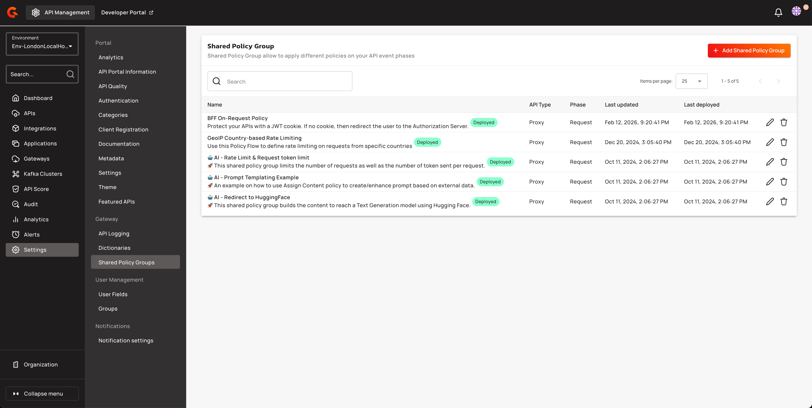<figcaption></figcaption></figure>
2. Click **Add Shared Policy Group**, and select **Proxy API**.
3.  Specify a name for this SPG, and ensure the **Response** phase is selected. Then click on the **\[Save]** button.

    <figure>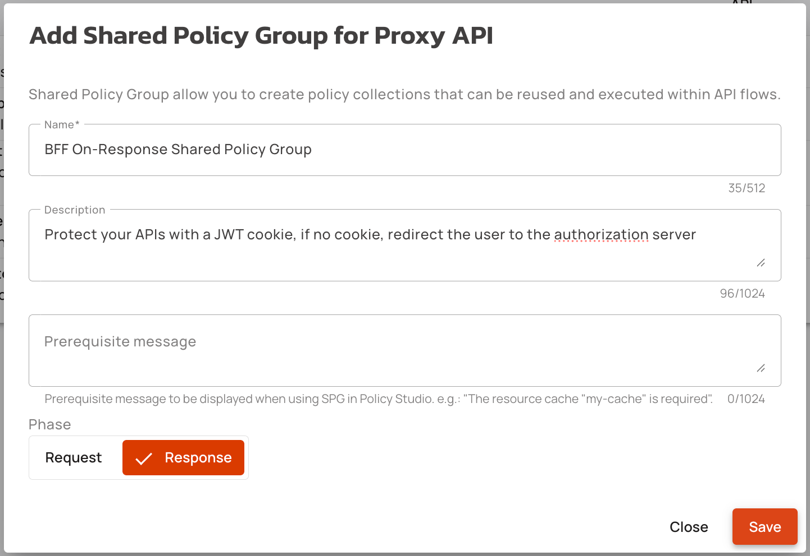<figcaption></figcaption></figure>
4. Add the [**Transform Headers**](../../create-and-configure-apis/apply-policies/policy-reference/transform-headers.md) **Policy**
   1. Set the **Trigger condition** to `{#context.attributes['accessToken'] != null}`
   2. Within the **Set/replace headers** section, add a new **Key** named `Set-Cookie` with a value of `X-Gravitee-BFF-Cookie={#context.attributes['accessToken']}; Path=/; HttpOnly; SameSite=Strict`
   3.  Click on the **\[Add policy]** button, and progress to the next step.

       <figure>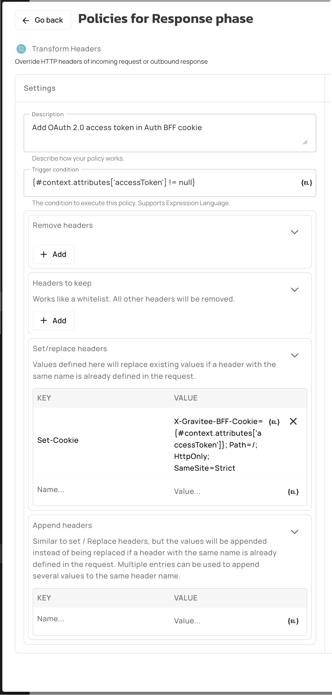<figcaption></figcaption></figure>
5. Now that all the policies have been added, click on the **\[Save]** button.
6.  Click the **\[Deploy]** button.

    <figure>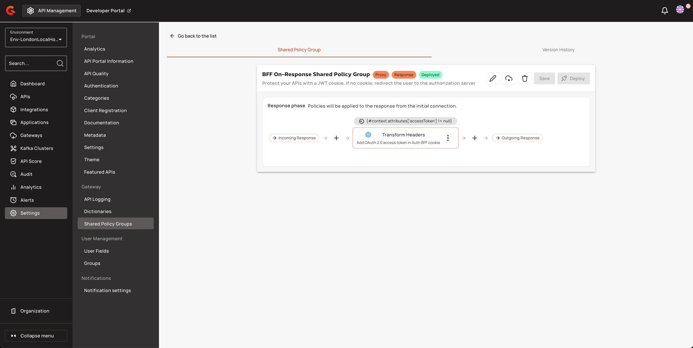<figcaption></figcaption></figure>

<details>

<summary>You can find the full JSON definition for the <strong>BFF On-Response Shared Policy Group</strong> here</summary>

```json
{
    "name": "BFF On-Response Shared Policy Group",
    "description": "Protect your APIs with a JWT cookie, if no cookie, redirect the user to the authorization server",
    "prerequisiteMessage": "",
    "version": 1,
    "apiType": "PROXY",
    "originContext": {
        "origin": "MANAGEMENT"
    },
    "steps": [
        {
            "name": "Transform Headers",
            "description": "Add OAuth 2.0 access token in Auth BFF cookie",
            "enabled": true,
            "policy": "transform-headers",
            "configuration": {
                "whitelistHeaders": [],
                "addHeaders": [
                    {
                        "name": "Set-Cookie",
                        "value": "X-Gravitee-BFF-Cookie={#context.attributes['accessToken']}; Path=/; HttpOnly; SameSite=Strict"
                    }
                ],
                "scope": "REQUEST",
                "removeHeaders": []
            },
            "condition": "{#context.attributes['accessToken'] != null}"
        }
    ],
    "phase": "RESPONSE",
    "lifecycleState": "DEPLOYED"
}
```

You can import this Shared Policy Group using Gravitee's Management API.

> Save the above JSON definition to a file named `bff-on-response.json`, and then use the following command:
>
> `curl -X POST "http://{gravitee_mAPI_hostname}/management/v2/organizations/DEFAULT/environments/DEFAULT/shared-policy-groups" -H "Authorization: {your_personal_token}" -H "Content-Type: application/json" -d @bff-on-response.json`

</details>

### Task 3: Use the Shared Policy Groups in your API

Now it is time to add these Shared Policy Groups into your existing API.

1. Navigate to your API.
2. Click into **Policies**.
3. Create a new Flow, or select an existing Flow to edit.
4. Add your recently created Shared Policy Groups:
   1. Add the '**BFF On-Request Shared Policy Group**' into the **Request** **Phase**, and
   2. Add the '**BFF On-Response Shared Policy Group**' into the **Response Phase**.
5. Click on the **\[Save]** button.
6.  Finally, click on the **\[Deploy API]** popup, to deploy these configuration changes to your Gateway.

    <figure>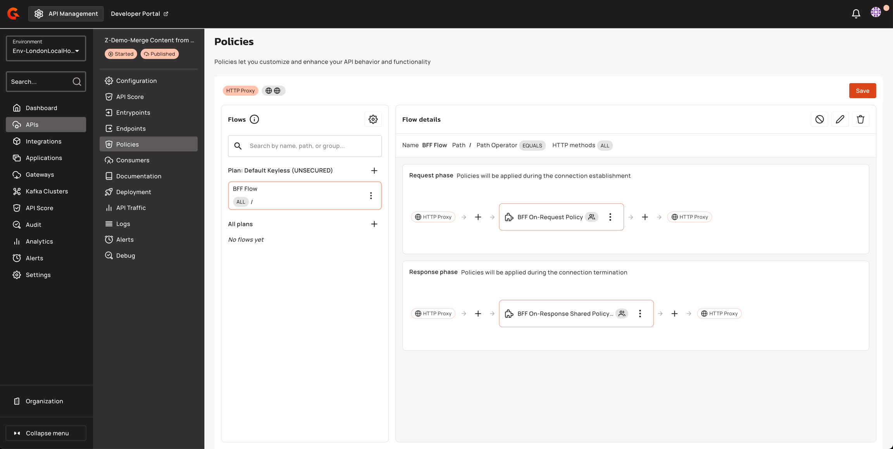<figcaption></figcaption></figure>

To quickly test the flow, just call your API via a Web Browser and you should be redirected to the login page of your Authorization Server if no cookie has been found.
