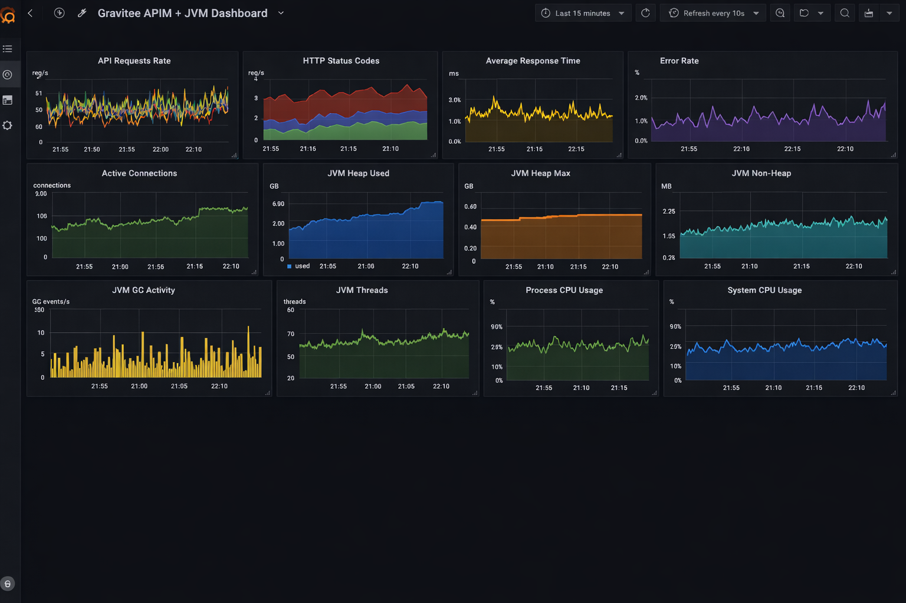

# Monitor APIM with Prometheus and Grafana using Docker Compose

This guide walks through deploying a full monitoring stack for Gravitee API Management (APIM) with Docker Compose. The stack scrapes the metrics exposed by the Gravitee Prometheus exporter and visualizes them in Grafana, covering API traffic, JVM health, and host system usage.


This guide uses third-party tools. For their full configuration options, see the [Docker Compose](https://docs.docker.com/compose/), [Prometheus](https://prometheus.io/docs/), and [Grafana](https://grafana.com/docs/) documentation.


## Set up monitoring on an existing Gateway

If you already run a Gravitee Gateway (self-hosted or hybrid), follow these steps to push its metrics to Prometheus and Grafana. To try the full stack on a single machine instead, see the Docker Compose example below.

### Enable the Prometheus metrics service

The Gateway exposes Prometheus-formatted metrics through its internal API. The metrics service is disabled by default. Enable it on the Gateway, then enable the Prometheus output.




```yaml
services:
  metrics:
    enabled: true
    prometheus:
      enabled: true
```





```yaml
gateway:
  services:
    metrics:
      enabled: true
      prometheus:
        enabled: true
        concurrencyLimit: 3
```




For the full set of options, including label configuration and Vert.x metric naming versions, see [Expose Metrics to Prometheus](../../analyze-and-monitor-apis/logging/expose-metrics-to-prometheus.md).

### Expose and secure the internal API

The metrics endpoint is served by the Gateway internal API. By default this API is bound to `localhost` on port `18082` and protected with basic authentication. To let Prometheus scrape it, make the endpoint reachable and set credentials you control.




```yaml
services:
  core:
    http:
      enabled: true
      port: 18082
      host: 0.0.0.0
      authentication:
        type: basic
        users:
          admin: <your-password>
```


Set `host` to `0.0.0.0` or a specific interface so Prometheus can reach the endpoint from another host. The default is `localhost`, which only accepts local connections.



In Kubernetes the Gateway internal API binds to `0.0.0.0` inside the pod by default. To let Prometheus reach it, enable a service for the core API:


```yaml
gateway:
  services:
    core:
      http:
        enabled: true
        port: 18082
        host: 0.0.0.0
        authentication:
          type: basic
          password: <your-password>
      service:
        enabled: true
        type: ClusterIP
        externalPort: 18082
```




The metrics are exposed at the path `/_node/metrics/prometheus`.


The default credentials are `admin` / `adminadmin`. Change the password before you expose the endpoint, and restrict network access to the internal API to your monitoring infrastructure.


### Configure Prometheus to scrape the Gateway

Add a scrape job that targets the Gateway internal API. Replace `<gateway-host>` with the host or service that exposes port `18082`, and use the credentials you set above.


```yaml
scrape_configs:
  - job_name: 'gravitee-gateway'
    basic_auth:
      username: admin
      password: <your-password>
    metrics_path: /_node/metrics/prometheus
    static_configs:
      - targets: ['<gateway-host>:18082']
```


### Add Prometheus as a Grafana data source

In Grafana, add your Prometheus instance as a data source. For the exact steps, see [Add a data source](https://grafana.com/docs/grafana/latest/datasources/) in the Grafana documentation.

### Import the example dashboard

Gravitee provides an example dashboard to get you started. It includes panels for API traffic, JVM health, and host system usage.

1. In Grafana, import a dashboard and paste the JSON below. For the exact steps, see [Import a dashboard](https://grafana.com/docs/grafana/latest/dashboards/build-dashboards/import-dashboards/) in the Grafana documentation.
2. Select your Prometheus data source when prompted.

```json
{
  "annotations": { "list": [] },
  "editable": true,
  "schemaVersion": 30,
  "style": "dark",
  "time": { "from": "now-15m", "to": "now" },
  "title": "Gravitee APIM + JVM Dashboard",
  "panels": [
    {
      "type": "graph",
      "title": "API Requests Rate",
      "gridPos": { "x": 0, "y": 0, "w": 12, "h": 6 },
      "lines": true,
      "targets": [
        { "expr": "rate(http_server_requests_total[1m])", "legendFormat": "{{method}}", "refId": "A", "nullPointMode": "null" }
      ]
    },
    {
      "type": "graph",
      "title": "HTTP Status Codes",
      "gridPos": { "x": 12, "y": 0, "w": 12, "h": 6 },
      "lines": true,
      "targets": [
        { "expr": "sum by (code) (rate(http_server_requests_total[1m]))", "legendFormat": "{{code}}", "refId": "B", "nullPointMode": "null" }
      ]
    },
    {
      "type": "graph",
      "title": "Average Response Time",
      "gridPos": { "x": 0, "y": 6, "w": 12, "h": 6 },
      "lines": true,
      "targets": [
        { "expr": "rate(http_server_response_time_seconds_sum[1m]) / rate(http_server_response_time_seconds_count[1m])", "refId": "C", "legendFormat": "Avg", "nullPointMode": "null" }
      ]
    },
    {
      "type": "graph",
      "title": "Error Rate (5xx)",
      "gridPos": { "x": 12, "y": 6, "w": 12, "h": 6 },
      "lines": true,
      "targets": [
        { "expr": "sum(rate(http_server_requests_total{code=~\"5..\"}[1m])) / sum(rate(http_server_requests_total[1m]))", "refId": "F", "nullPointMode": "null" }
      ]
    },
    {
      "type": "graph",
      "title": "Active Server Connections",
      "gridPos": { "x": 0, "y": 12, "w": 12, "h": 6 },
      "lines": true,
      "targets": [
        { "expr": "http_server_active_connections", "refId": "G", "nullPointMode": "null" }
      ]
    },
    {
      "type": "graph",
      "title": "JVM Heap Used",
      "gridPos": { "x": 12, "y": 12, "w": 12, "h": 6 },
      "lines": true,
      "targets": [
        { "expr": "jvm_memory_used_bytes{area=\"heap\"}", "refId": "H", "nullPointMode": "null" }
      ]
    },
    {
      "type": "graph",
      "title": "JVM Non-Heap Used",
      "gridPos": { "x": 0, "y": 18, "w": 12, "h": 6 },
      "lines": true,
      "targets": [
        { "expr": "jvm_memory_used_bytes{area=\"nonheap\"}", "refId": "I", "nullPointMode": "null" }
      ]
    },
    {
      "type": "graph",
      "title": "JVM GC Activity",
      "gridPos": { "x": 12, "y": 18, "w": 12, "h": 6 },
      "lines": true,
      "targets": [
        { "expr": "rate(jvm_gc_pause_seconds_sum[1m])", "refId": "J", "nullPointMode": "null" }
      ]
    },
    {
      "type": "graph",
      "title": "JVM Threads",
      "gridPos": { "x": 0, "y": 24, "w": 12, "h": 6 },
      "lines": true,
      "targets": [
        { "expr": "jvm_threads_live_threads", "refId": "K", "nullPointMode": "null" }
      ]
    },
    {
      "type": "graph",
      "title": "Process CPU Usage",
      "gridPos": { "x": 12, "y": 24, "w": 12, "h": 6 },
      "lines": true,
      "targets": [
        { "expr": "process_cpu_usage", "refId": "L", "nullPointMode": "null" }
      ]
    },
    {
      "type": "graph",
      "title": "System CPU Usage",
      "gridPos": { "x": 0, "y": 30, "w": 24, "h": 6 },
      "lines": true,
      "targets": [
        { "expr": "system_cpu_usage", "refId": "M", "nullPointMode": "null" }
      ]
    }
  ]
}
```

## Try it locally with Docker Compose

This section deploys a complete monitoring stack with Docker Compose so you can try the integration end to end on a single machine.

## Architecture

The stack runs the following components as Docker Compose services:

- MongoDB: APIM configuration database
- Elasticsearch: analytics storage
- Management API: APIM REST API
- Gateway: APIM Gateway, which exposes Prometheus metrics on its internal API
- Management Console: APIM web UI
- Prometheus: scrapes and stores the Gateway metrics
- Grafana: visualizes the metrics

Metrics flow from the Gateway internal API to Prometheus, and Grafana queries Prometheus:

```text
APIM Gateway (internal API) --> Prometheus --> Grafana
```

## Prerequisites

- Docker
- Docker Compose
- Recommended: 4 GB of RAM available to Docker

## Enable the metrics service

The Gateway exposes Prometheus metrics through its internal API. The Docker Compose file in this guide enables the metrics service with these Gateway environment variables:

```bash
gravitee_services_metrics_enabled=true
gravitee_services_metrics_prometheus_enabled=true
```

For the full set of options, including label configuration and Vert.x naming versions, see [Expose Metrics to Prometheus](../../analyze-and-monitor-apis/logging/expose-metrics-to-prometheus.md).


By default, the internal API binds to `localhost`. If Prometheus runs in a separate container and can't reach the metrics endpoint, set the `services.core.http.host` property to `0.0.0.0` so the endpoint is reachable across containers. See [Expose Metrics to Prometheus](../../analyze-and-monitor-apis/logging/expose-metrics-to-prometheus.md).


## Set up the Docker Compose stack

Create the project files, then start the stack.

### Create a project directory

```bash
mkdir gravitee-prometheus-grafana
cd gravitee-prometheus-grafana
```

### Create the Docker Compose file

Create a `docker-compose.yml` file with the following content:

```yaml
version: "3.8"

services:

  mongodb:
    image: mongo:6
    container_name: gravitee-mongodb
    restart: always
    ports:
      - "27017:27017"
    volumes:
      - mongo_data:/data/db

  elasticsearch:
    image: docker.elastic.co/elasticsearch/elasticsearch:8.11.3
    container_name: gravitee-elasticsearch
    environment:
      - discovery.type=single-node
      - xpack.security.enabled=false
      - ES_JAVA_OPTS=-Xms1g -Xmx1g
    ports:
      - "9200:9200"
    volumes:
      - es_data:/usr/share/elasticsearch/data

  prometheus:
    image: prom/prometheus
    container_name: prometheus
    ports:
      - "9090:9090"
    volumes:
      - ./prometheus.yml:/etc/prometheus/prometheus.yml

  grafana:
    image: grafana/grafana
    container_name: grafana
    ports:
      - "3000:3000"
    environment:
      - GF_SECURITY_ADMIN_PASSWORD=admin

  management-api:
    image: graviteeio/apim-management-api:4
    container_name: gravitee-management-api
    depends_on:
      - mongodb
      - elasticsearch
    environment:
      - gravitee_management_mongodb_uri=mongodb://mongodb:27017/gravitee
      - gravitee_analytics_elasticsearch_endpoints_0=http://elasticsearch:9200
    ports:
      - "8083:8083"

  gravitee-gateway:
    image: graviteeio/apim-gateway:4
    container_name: gravitee-gateway
    depends_on:
      - mongodb
      - elasticsearch
    environment:
      - gravitee_management_mongodb_uri=mongodb://mongodb:27017/gravitee
      - gravitee_reporters_elasticsearch_endpoints_0=http://elasticsearch:9200
      - gravitee_services_metrics_enabled=true
      - gravitee_services_metrics_prometheus_enabled=true
    ports:
      - "8082:8082"

  management-ui:
    image: graviteeio/apim-management-ui:4
    container_name: gravitee-management-ui
    ports:
      - "8084:8080"
    depends_on:
      - management-api

volumes:
  mongo_data:
  es_data:
```

### Create the Prometheus configuration

Create a `prometheus.yml` file with the following content:

```yaml
global:
  scrape_interval: 5s

scrape_configs:
  - job_name: 'gravitee'
    basic_auth:
      username: admin
      password: adminadmin
    metrics_path: '/_node/metrics/prometheus'
    static_configs:
      - targets: ['gravitee-gateway:18082']
```

The scrape job targets the Gateway internal API on port `18082` and reads the formatted metrics from the `/_node/metrics/prometheus` endpoint. The default internal API credentials are `admin` / `adminadmin`.

### Start the stack

```bash
docker compose up -d
```

Wait one to two minutes for all services to start.

## Access the services

After the stack starts, the services are available at these URLs:

| Service | URL |
| --- | --- |
| Management Console | `http://localhost:8084` |
| Gateway | `http://localhost:8082` |
| Prometheus | `http://localhost:9090` |
| Grafana | `http://localhost:3000` |

The default Console credentials are `admin` / `admin`. The default Grafana credentials are `admin` / `admin`.

## Configure Grafana

Configure Grafana to read from Prometheus, then import the sample dashboard.

### Add the Prometheus data source

1. Open `http://localhost:3000` and sign in with the default credentials.
2. Open **Connections**.
3. Click **Data sources**.
4. Add a **Prometheus** data source.
5. In the URL field, enter `http://prometheus:9090`.
6. Save the data source.


For the authoritative data source and dashboard import procedures, see the [Grafana documentation](https://grafana.com/docs/grafana/latest/).


### Import the sample dashboard

1. Open **Dashboards**.
2. Click **Import**.
3. Paste the dashboard JSON below.
4. Select the Prometheus data source.
5. Import the dashboard.

```json
{
  "annotations": { "list": [] },
  "editable": true,
  "schemaVersion": 30,
  "style": "dark",
  "time": { "from": "now-15m", "to": "now" },
  "title": "Gravitee APIM + JVM Dashboard",
  "panels": [
    {
      "type": "graph",
      "title": "API Requests Rate",
      "gridPos": { "x": 0, "y": 0, "w": 12, "h": 6 },
      "lines": true,
      "targets": [
        { "expr": "rate(http_server_requests_total[1m])", "legendFormat": "{{method}}", "refId": "A", "nullPointMode": "null" }
      ]
    },
    {
      "type": "graph",
      "title": "HTTP Status Codes",
      "gridPos": { "x": 12, "y": 0, "w": 12, "h": 6 },
      "lines": true,
      "targets": [
        { "expr": "sum by (code) (rate(http_server_requests_total[1m]))", "legendFormat": "{{code}}", "refId": "B", "nullPointMode": "null" }
      ]
    },
    {
      "type": "graph",
      "title": "Average Response Time",
      "gridPos": { "x": 0, "y": 6, "w": 12, "h": 6 },
      "lines": true,
      "targets": [
        { "expr": "rate(http_server_response_time_seconds_sum[1m]) / rate(http_server_response_time_seconds_count[1m])", "refId": "C", "legendFormat": "Avg", "nullPointMode": "null" }
      ]
    },
    {
      "type": "graph",
      "title": "Error Rate (5xx)",
      "gridPos": { "x": 12, "y": 6, "w": 12, "h": 6 },
      "lines": true,
      "targets": [
        { "expr": "sum(rate(http_server_requests_total{code=~\"5..\"}[1m])) / sum(rate(http_server_requests_total[1m]))", "refId": "F", "nullPointMode": "null" }
      ]
    },
    {
      "type": "graph",
      "title": "Active Server Connections",
      "gridPos": { "x": 0, "y": 12, "w": 12, "h": 6 },
      "lines": true,
      "targets": [
        { "expr": "http_server_active_connections", "refId": "G", "nullPointMode": "null" }
      ]
    },
    {
      "type": "graph",
      "title": "JVM Heap Used",
      "gridPos": { "x": 12, "y": 12, "w": 12, "h": 6 },
      "lines": true,
      "targets": [
        { "expr": "jvm_memory_used_bytes{area=\"heap\"}", "refId": "H", "nullPointMode": "null" }
      ]
    },
    {
      "type": "graph",
      "title": "JVM Non-Heap Used",
      "gridPos": { "x": 0, "y": 18, "w": 12, "h": 6 },
      "lines": true,
      "targets": [
        { "expr": "jvm_memory_used_bytes{area=\"nonheap\"}", "refId": "I", "nullPointMode": "null" }
      ]
    },
    {
      "type": "graph",
      "title": "JVM GC Activity",
      "gridPos": { "x": 12, "y": 18, "w": 12, "h": 6 },
      "lines": true,
      "targets": [
        { "expr": "rate(jvm_gc_pause_seconds_sum[1m])", "refId": "J", "nullPointMode": "null" }
      ]
    },
    {
      "type": "graph",
      "title": "JVM Threads",
      "gridPos": { "x": 0, "y": 24, "w": 12, "h": 6 },
      "lines": true,
      "targets": [
        { "expr": "jvm_threads_live_threads", "refId": "K", "nullPointMode": "null" }
      ]
    },
    {
      "type": "graph",
      "title": "Process CPU Usage",
      "gridPos": { "x": 12, "y": 24, "w": 12, "h": 6 },
      "lines": true,
      "targets": [
        { "expr": "process_cpu_usage", "refId": "L", "nullPointMode": "null" }
      ]
    },
    {
      "type": "graph",
      "title": "System CPU Usage",
      "gridPos": { "x": 0, "y": 30, "w": 24, "h": 6 },
      "lines": true,
      "targets": [
        { "expr": "system_cpu_usage", "refId": "M", "nullPointMode": "null" }
      ]
    }
  ]
}
```

## Covered metrics

The sample dashboard visualizes the following metrics.

### API metrics

- Request rate
- HTTP status codes
- Average response time
- Error rate (5xx)
- Active server connections

### JVM metrics

- Heap memory used
- Non-heap memory used
- Garbage collection activity
- Live threads

### System metrics

- Process CPU usage
- System CPU usage

## Generate test traffic

To populate the dashboard, send requests through the Gateway:

```bash
curl http://localhost:8082
```

Repeat the request to generate metrics.

## Run sample PromQL queries

Use these Prometheus queries to explore the metrics in Prometheus or in Grafana panels. The metric names match the sample dashboard.

### Average response time

```promql
rate(http_server_response_time_seconds_sum[1m]) / rate(http_server_response_time_seconds_count[1m])
```

### Heap usage percentage

```promql
jvm_memory_used_bytes{area="heap"} / jvm_memory_max_bytes{area="heap"}
```

### Error rate (5xx)

```promql
sum(rate(http_server_requests_total{code=~"5.."}[1m])) / sum(rate(http_server_requests_total[1m]))
```

## Verification

To verify the monitoring stack is working as expected, follow these steps:

1. Open Prometheus at `http://localhost:9090`.
2. Open the **Status** menu and confirm the `gravitee` scrape target is reported as up.
3. Generate traffic through the Gateway with `curl http://localhost:8082`.
4. Open the imported dashboard in Grafana at `http://localhost:3000`.
5. Confirm the API, JVM, and system panels display data.

<figure><figcaption><p>The Gravitee APIM and JVM dashboard displaying live metrics in Grafana</p></figcaption></figure>
