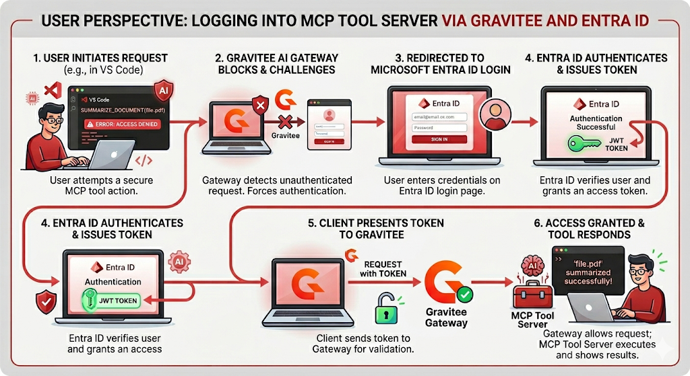

# Configure an MCP-Proxy with the OAuth plan and Entra ID

## Overview

This guide explains how to secure a Model Context Protocol (MCP) Proxy with an OAuth2 Plan using Microsoft Entra ID as the identity provider.

You will create an MCP Proxy on the Gravitee Gateway to proxy an existing MCP Tool Server. This guide uses the public [Microsoft Learn MCP service](https://learn.microsoft.com/en-us/training/support/mcp) (`https://learn.microsoft.com/api/mcp`) as the backend. You will enable secured access via a Gravitee OAuth2 Plan that uses Entra ID as the OAuth2 identity provider. Finally, you will use VS Code to access the secured MCP Proxy via the Gravitee Gateway using the MCP Authorization [Pre-Registration](https://modelcontextprotocol.io/specification/2025-11-25/basic/authorization#preregistration) method.

Using Gravitee to proxy an MCP Tool Server provides:

* Discoverability
* Security
* Observability

### Background

Microsoft Entra ID does not provide a Token Introspection Endpoint (RFC 7662) as part of its OAuth2/OIDC implementation. To secure an API in Gravitee with Entra ID, you must use Gravitee's JWT Plan, which validates tokens in the request against a configured JWKS\_URL.

To correctly support the MCP Authorization Specification, certain elements of the OAuth2 specification are required, such as the WWW-Authenticate header (RFC 9728 Section 5.1), Protected Resource Metadata Discovery (RFC 9728 Section 3.2), and Authorization Server Discovery (RFC 9728). These are available in Gravitee's OAuth2 Plan/Policy. A new Gravitee OAuth2 Resource plugin was created specifically for Entra ID (`gravitee-resource-oauth2-provider-entra-id`).

For more information on the MCP Authorization specification, see [https://modelcontextprotocol.io/docs/tutorials/security/authorization](https://modelcontextprotocol.io/docs/tutorials/security/authorization).

#### Key Configuration Points

Here is what is happening behind the scenes:

1. **The 401 Challenge**: The MCP spec requires the server to tell the client where to find the "Resource Metadata." Gravitee is configured to intercept unauthenticated requests and return a `WWW-Authenticate` header containing the URL for the metadata endpoint.
2. **The Metadata Endpoint**: Gravitee hosts (or proxies) a `.well-known/oauth-protected-resource` endpoint. This JSON response tells the MCP client two things:
   1. The "Resource ID" (the audience for the token).
   2. The "Authorization Server" (Entra ID's URL).
3. **JWT Validation**: Because Entra ID doesn't support standard OAuth2 Introspection, Gravitee uses an _Entra ID-specific OAuth Resource_ (similar to the existing JWT Plan) and downloads Entra ID's public keys (JWKS) to verify that the token presented by the client is authentic and has not expired.
4. **The Proxying**: Once the token is verified, Gravitee strips the complexity and sends a clean request to the backend MCP server. This allows you to use a public backend (like the MS Learn MCP) while strictly controlling who can access it.

More details on the login sequence and access flow can be found in the [Appendix 2](secure-a-mcp-proxy-with-entra-id-oauth.md#appendix-2-login-sequence-and-access-flow).

#### Why use a Proxy?

Without Gravitee, you would have to build OAuth logic, token validation, and "Well-Known" endpoint support directly into your MCP server code. By using the MCP Proxy, you offload all security and governance (rate limiting, logging, and access control) to the Gateway level.

## Prerequisites

Before you secure an MCP Proxy with Entra ID OAuth2, complete the following:

* Obtain access to Microsoft Entra ID to create a new App Registration for the MCP Tool Server Resource.
* Install Gravitee APIM 4.11.2 or later.
* Install the `gravitee-policy-oauth2-5.2.0` plugin or later (bundled in APIM 4.11.2).
* Install the `gravitee-resource-oauth2-provider-entra-id-1.0.0` plugin or later.
* Obtain an Enterprise License to use AI Agent Management features, such as the MCP Proxy.

## Steps

1. [Create a new MCP-Proxy](secure-a-mcp-proxy-with-entra-id-oauth.md#step-1-create-a-new-mcp-proxy) with a KEYLESS plan to confirm access.
2. [Test public access](secure-a-mcp-proxy-with-entra-id-oauth.md#step-2-test-public-access-using-microsoft-vs-code) using Microsoft VS Code.
3. [Create Entra ID App Registration](secure-a-mcp-proxy-with-entra-id-oauth.md#step-3-create-entra-id-app-registration).
4. [Secure MCP-Proxy with OAuth2](secure-a-mcp-proxy-with-entra-id-oauth.md#step-4-secure-mcp-proxy-with-oauth):
   1. [Add Entra ID OAuth Resource](secure-a-mcp-proxy-with-entra-id-oauth.md#add-the-entra-id-oauth-resource).
   2. [Remove the KEYLESS plan and add a new secure OAuth plan](secure-a-mcp-proxy-with-entra-id-oauth.md#add-the-oauth-plan).
5. [Test secured access](secure-a-mcp-proxy-with-entra-id-oauth.md#step-5-test-secured-access-using-microsoft-vs-code) using Microsoft VS Code.
6. (Optionally) [Secure access to a specific Tool on the MCP Tool Server.](secure-a-mcp-proxy-with-entra-id-oauth.md#step-6-optionally-secure-access-to-a-specific-tool-on-the-mcp-tool-server).

### Step 1: Create a new MCP-Proxy

1. Add a new MCP-Proxy API:
   1. **API Name**: MS Learn MCP
   2. **Version**: 1.0.0
   3. **Entrypoint**: `/ms-learn-mcp`
   4. **Endpoint**: `https://learn.microsoft.com/api/mcp`
   5. **Plan**: KEYLESS plan

Start and deploy your API to your Gateway.

### Step 2: Test public access using Microsoft VS Code

1. Open VS Code and create a new `mcp.json` file in your workspace.
2.  Add a new MCP Tool Server (for example, `demo-ms-learn-mcp`) that points to the URL of your newly created MCP-Proxy API, as shown in the screenshot:

    <figure><figcaption></figcaption></figure>
3. Save the file and click **Start** to begin accessing the public MS Learn MCP Tool Server.
4.  Verify that the response shows "3 tools."

    <figure><figcaption></figcaption></figure>


You can now access the public MS Learn MCP Tool Server via the Gravitee Gateway.


Stop the MCP Tool Server by clicking **Stop**.

### Step 3: Create Entra ID App Registration

<figure><figcaption></figcaption></figure>

1. Log in to the Azure Portal and navigate to **App Registrations**.
2. Click **New registration**.
3. Configure the registration:
   1. **Name**: MS-Learn-MCP-Tool-Server
   2. **Supported account types**: Single tenant only (or another relevant option)
   3. **Redirect URI (optional)**: Leave blank. You'll add multiple entries in the next steps.
4.  Click **Register**.

    <div data-gb-custom-block data-tag="hint" data-style="success" class="hint hint-success"><p>The new App Registration is complete. Store the following values for later use when configuring OAuth:</p><ol><li><strong>Application (client) ID</strong> (for example, <code>2553a281-2ebf-4d6c-aea1-1303a1af0dc6</code>), which will become part of your audience value.</li><li><strong>Directory (tenant) ID</strong> (for example, <code>fffe4189-a2fb-4ec8-89ce-f5649e94735e</code>).</li></ol></div>
5.  Click **Add a Redirect URI** and add the relevant URIs. For VS Code, you need two items:

    1. **Platform Type**: Web
    2. **Redirect URI**: `http://localhost:33418`
    3. **Implicit grant and hybrid flows**:
       1. ☑ Access tokens (used for implicit flows)
       2. ☑ ID tokens (used for implicit and hybrid flows)

    <figure><figcaption></figcaption></figure>
6.  Add a second Redirect URI:

    1. **Platform Type**: Web
    2. **Redirect URI**: `https://vscode.dev/redirect`

    <figure><figcaption></figcaption></figure>
7.  To allow users from VS Code to sign in and request consent, add OIDC scopes. Click **API permissions** and add the following Microsoft Graph delegated permissions:

    1. `email`
    2. `offline_access`
    3. `openid`
    4. `profile`

    <figure><figcaption></figcaption></figure>
8.  Microsoft requires at least one scope for successful operation. In the **Expose an API** menu, click **Add a scope**.

    1. Define the **Application ID URI**. Leave this as default (for example, `api://2553a281-2ebf-4d6c-aea1-1303a1af0dc6`) or specify a different value such as the Gateway API URL (for example, `https://mygateway.mycompany.com/ms-learn-mcp)`.

    <figure><figcaption></figcaption></figure>

    2. Define a new scope called `Tools.Read`, as shown in the screenshot:

    <figure><figcaption></figcaption></figure>

### Step 4: Secure MCP-Proxy with OAuth

Remove the KEYLESS plan from your MCP-Proxy API and replace it with the OAuth plan. First, add the Entra ID OAuth Resource, then add the OAuth plan that references the resource.

#### Add the Entra ID OAuth Resource

1.  In the Gravitee APIM Console, navigate to your new MCP-Proxy API (MS Learn MCP). Under the **Configuration** menu, click the **Resources** tab and add a new **Microsoft Entra ID Resource**.

    <figure><figcaption></figcaption></figure>
2.  Configure the Microsoft Entra ID resource:

    1. **Name**: EntraID OAuth Resource
    2. **Audience**: Specify your Entra ID **Application (client) ID** (for example, `api://2553a281-2ebf-4d6c-aea1-1303a1af0dc6`) or specify a different value such as the Gateway API URL (for example, `https://mygateway.mycompany.com/ms-learn-mcp)`.

    <figure><figcaption></figcaption></figure>

#### Add the OAuth plan

1. In the API's **Consumers** menu, delete or close the existing KEYLESS plan.
2.  Add a new **OAuth plan**:

    1. **Name**: Secure OAuth Plan with Entra ID
    2. **OAuth2 authentication configuration > OAuth2 resource**: EntraID OAuth Resource
    3. **OAuth2 authentication configuration > Required scopes**: `api://2553a281-2ebf-4d6c-aea1-1303a1af0dc6/Tools.Read` or your Gateway API URL + scope (for example, `https://mygateway.mycompany.com/ms-learn-mcp/Tools.Read)`.

    <figure><figcaption></figcaption></figure>
3. Save your changes, publish the new OAuth plan, and deploy your API configuration changes to the Gateway.


You have secured this MCP-Proxy with the secure OAuth plan.


### Step 5: Test secured access using Microsoft VS Code

1.  Open VS Code and click **Start** to begin accessing the secured MS Learn MCP Tool Server.

    <figure><figcaption></figcaption></figure>

    <div data-gb-custom-block data-tag="hint" data-style="info" class="hint hint-info"><p>If you see other dialog boxes (such as the screenshot below), your Entra ID OAuth Resource has not been configured correctly (for example, incorrect Tenant ID).</p><p align="center"></p></div>
2.  VS Code will request your client ID for the MCP Authorization Pre-Registration method. Enter the client ID of your Entra ID App Registration. VS Code will also request an optional client secret. Do not supply a client secret.

    <figure><figcaption></figcaption></figure>
3.  VS Code will notify you that it wants to authenticate to Microsoft:

    <figure><figcaption></figcaption></figure>

    <div data-gb-custom-block data-tag="hint" data-style="info" class="hint hint-info"><p>If you see other messages at this stage, the issue is usually related to misconfiguration of your Entra ID OAuth Resource or OAuth plan.</p></div>
4. A new browser tab will open. Sign in with your Entra ID user account or select an existing Entra ID user account.
5.  Consent to the required permissions for VS Code to use your App Registration:

    <figure><figcaption></figcaption></figure>

    <figure><figcaption></figcaption></figure>
6. Verify that you are signed in:

<figure><figcaption></figcaption></figure>

7. In VS Code, verify that 3 tools are available.

<figure><figcaption></figcaption></figure>


If you encounter errors or do not see the available tools, you typically have a configuration issue in your Entra ID App Registration. Check your VS Code OUTPUT console to troubleshoot.


8. To verify access to these tools, use the CHAT to ask what tools are available from the `demo-ms-learn-mcp` tool server:

<figure><figcaption></figcaption></figure>


You can now access the secured MS Learn MCP Tool Server via the Gravitee Gateway using Entra ID OAuth.


### Step 6: (Optionally) Secure access to a specific Tool on the MCP Tool Server

You can now use the MCP ACLs Policy to limit users/clients to specific tools.  View the [MCP ACLs Policy](../../create-and-configure-apis/apply-policies/policy-reference/ai-mcp-acl.md) for more information.

## Appendix 1: Reference MCP-Proxy and Entra ID App Registration configurations

### MCP-Proxy API definition

<details>

<summary>For reference, this is an export of the MCP-Proxy in Gravitee JSON format:</summary>

```json
{
  "api": {
    "definitionVersion": "V4",
    "name": "MS Learn MCP",
    "description": "MS Learn MCP",
    "apiVersion": "1,0",
    "state": "STARTED",
    "visibility": "PRIVATE",
    "lifecycleState": "CREATED",
    "type": "MCP_PROXY",
    "listeners": [
      {
        "type": "HTTP",
        "paths": [
          {
            "path": "/ms-learn-mcp/",
            "overrideAccess": false
          }
        ],
        "pathMappings": [],
        "entrypoints": [
          {
            "type": "mcp-proxy",
            "qos": "NONE",
            "configuration": {}
          }
        ],
        "servers": []
      }
    ],
    "endpointGroups": [
      {
        "name": "Default MCP Proxy group",
        "type": "mcp-proxy",
        "loadBalancer": {
          "type": "ROUND_ROBIN"
        },
        "sharedConfiguration": "{\"proxy\":{\"useSystemProxy\":false,\"enabled\":false},\"http\":{\"keepAliveTimeout\":30000,\"keepAlive\":true,\"propagateClientHost\":false,\"followRedirects\":false,\"readTimeout\":10000,\"idleTimeout\":0,\"connectTimeout\":3000,\"useCompression\":true,\"maxConcurrentConnections\":20,\"version\":\"HTTP_1_1\",\"pipelining\":false},\"ssl\":{\"keyStore\":{\"type\":\"\"},\"hostnameVerifier\":true,\"trustStore\":{\"type\":\"\"},\"trustAll\":false}}",
        "endpoints": [
          {
            "name": "Default MCP Proxy",
            "type": "mcp-proxy",
            "weight": 1,
            "inheritConfiguration": true,
            "configuration": {
              "target": "https://learn.microsoft.com/api/mcp"
            },
            "services": {},
            "secondary": false,
            "tenants": []
          }
        ],
        "services": {}
      }
    ],
    "analytics": {
      "enabled": true
    },
    "flowExecution": {
      "mode": "DEFAULT",
      "matchRequired": false
    },
    "flows": [],
    "allowMultiJwtOauth2Subscriptions": false,
    "disableMembershipNotifications": false,
    "resources": [
      {
        "name": "EntraID OAuth Resource",
        "type": "oauth2-entra-id",
        "configuration": "{\"proxy\":{\"useSystemProxy\":false,\"enabled\":false},\"audience\":\"api://2553a281-2ebf-4d6c-aea1-1303a1af0dc6\",\"scopeSeparator\":\" \",\"tenantId\":\"fffe4189-a2fb-4ec8-89ce-f5649e94735e\",\"http\":{\"keepAliveTimeout\":30000,\"keepAlive\":true,\"propagateClientHost\":false,\"followRedirects\":false,\"readTimeout\":10000,\"idleTimeout\":0,\"connectTimeout\":3000,\"useCompression\":true,\"maxConcurrentConnections\":20,\"version\":\"HTTP_1_1\",\"pipelining\":false},\"ssl\":{\"keyStore\":{\"type\":\"\"},\"hostnameVerifier\":true,\"trustStore\":{\"type\":\"\"},\"trustAll\":false},\"userClaim\":\"oid\"}",
        "enabled": true
      }
    ],
    "properties": []
  },
  "plans": [
    {
      "definitionVersion": "V4",
      "flows": [],
      "name": "Secure OAuth Plan with Entra ID",
      "description": "",
      "security": {
        "type": "OAUTH2",
        "configuration": {
          "oauthResource": "EntraID OAuth Resource",
          "extractPayload": true,
          "checkRequiredScopes": false,
          "requiredScopes": [
            "api://2553a281-2ebf-4d6c-aea1-1303a1af0dc6/Tools.Read"
          ],
          "modeStrict": true,
          "propagateAuthHeader": true
        }
      },
      "mode": "STANDARD",
      "commentRequired": false,
      "order": 1,
      "status": "PUBLISHED",
      "tags": [],
      "type": "API",
    }
  ],
  "apiMedia": []
}
```

</details>

### Entra ID App Registration manifest

<details>

<summary>For reference, this is an export of the Entra ID App Registration manifest:</summary>

```json
{
	"appId": "2553a281-2ebf-4d6c-aea1-1303a1af0dc6",
	"applicationTemplateId": null,
	"disabledByMicrosoftStatus": null,
	"displayName": "MS-Learn-MCP-Tool-Server",
	"description": null,
	"identifierUris": [
		"api://2553a281-2ebf-4d6c-aea1-1303a1af0dc6"
	],
	"publisherDomain": "mycompany.onmicrosoft.com",
	"signInAudience": "AzureADMyOrg",
	"tokenEncryptionKeyId": null,
	"samlMetadataUrl": null,
	"defaultRedirectUri": null,
	"optionalClaims": null,
	"requestSignatureVerification": null,
	"api": {
		"acceptMappedClaims": null,
		"knownClientApplications": [],
		"requestedAccessTokenVersion": null,
		"oauth2PermissionScopes": [
			{
				"adminConsentDescription": "Allows the app to read all tools on the MCP Tool Server",
				"adminConsentDisplayName": "Tools Read",
				"id": "fec9dd0b-e408-436e-8670-dcffb096aac3",
				"isEnabled": true,
				"type": "User",
				"userConsentDescription": "Allows the app to read all tools on the MCP Tool Server on your behalf",
				"userConsentDisplayName": "Tools Read",
				"value": "Tools.Read"
			}
		],
		"preAuthorizedApplications": []
	},
	"appRoles": [],
	"keyCredentials": [],
	"parentalControlSettings": {
		"countriesBlockedForMinors": [],
		"legalAgeGroupRule": "Allow"
	},
	"passwordCredentials": [],
	"publicClient": {
		"redirectUris": []
	},
	"requiredResourceAccess": [
		{
			"resourceAppId": "00000003-0000-0000-c000-000000000000",
			"resourceAccess": [
				{
					"id": "64a6cdd6-aab1-4aaf-94b8-3cc8405e90d0",
					"type": "Scope"
				},
				{
					"id": "7427e0e9-2fba-42fe-b0c0-848c9e6a8182",
					"type": "Scope"
				},
				{
					"id": "37f7f235-527c-4136-accd-4a02d197296e",
					"type": "Scope"
				},
				{
					"id": "14dad69e-099b-42c9-810b-d002981feec1",
					"type": "Scope"
				},
				{
					"id": "e1fe6dd8-ba31-4d61-89e7-88639da4683d",
					"type": "Scope"
				}
			]
		}
	],
	"verifiedPublisher": {
		"displayName": null,
		"verifiedPublisherId": null,
		"addedDateTime": null
	},
	"web": {
		"homePageUrl": null,
		"logoutUrl": null,
		"redirectUris": [
			"https://vscode.dev/redirect",
			"http://localhost:33418"
		],
		"implicitGrantSettings": {
			"enableAccessTokenIssuance": true,
			"enableIdTokenIssuance": true
		},
		"redirectUriSettings": [
			{
				"uri": "https://vscode.dev/redirect",
				"index": null
			},
			{
				"uri": "http://localhost:33418",
				"index": null
			}
		]
	},
	"servicePrincipalLockConfiguration": {
		"isEnabled": true,
		"allProperties": true,
		"credentialsWithUsageVerify": true,
		"credentialsWithUsageSign": true,
		"identifierUris": false,
		"tokenEncryptionKeyId": true
	},
	"spa": {
		"redirectUris": []
	}
}
```

</details>

## Appendix 2: Login sequence and access flow

This diagram illustrates the login sequence and access flow from the user's perspective when interacting with an MCP Tool Server secured by Gravitee and Microsoft Entra ID.

The workflow begins with a typical user action - such as attempting to execute a tool within an IDE like VS Code - and guides you through the entire authentication and authorization process.

The sequence follows six main phases:

1. **Request Initiation**: The user (or client software acting on their behalf) tries to execute a secure action, which initially fails without proper authentication.
2. **Challenge**: The Gravitee Gateway, acting as a proxy, detects the missing authentication and challenges the client to provide credentials.
3. **Authentication Redirect**: The user is redirected to the Microsoft Entra ID login screen to sign in securely.
4. **Token Issuance**: Upon a successful login, Entra ID validates the user and issues a JWT (JSON Web Token).
5. **Access Attempt**: The client presents this new JWT token to the Gravitee Gateway.
6. **Resolution**: Gravitee validates the token and, if correct, forwards the original request to the MCP Tool Server, allowing the user to successfully complete their action.

<figure><figcaption></figcaption></figure>

## Appendix 3: Working with Claude Code

To operate with Claude Code, you will need to add the relevant RedirectURI to your Entra ID Application:

* **Platform Type**: Mobile and desktop applications
* **Redirect URI**: `http://localhost:8765/callback`

Claude Code requires a slightly different MCP configuration, as shown below:


```json
{
  "mcpServers": {
    "demo-ms-learn-mcp": {
      "type": "http",
      "url": "https://mygateway.mycompany.com/ms-learn-mcp",
      "oauth": {
        "clientId": "...",
        "callbackPort": 8765,
        "scopes": "https://mygateway.mycompany.com/ms-learn-mcp/user_impersonation"
      }
    }
  }
}
```

