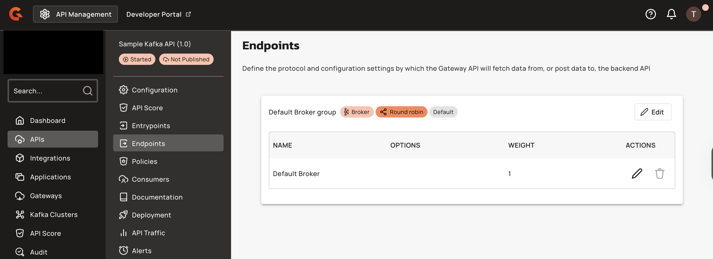
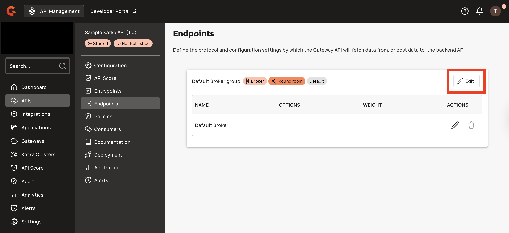
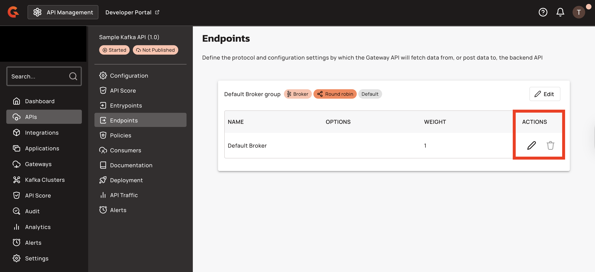
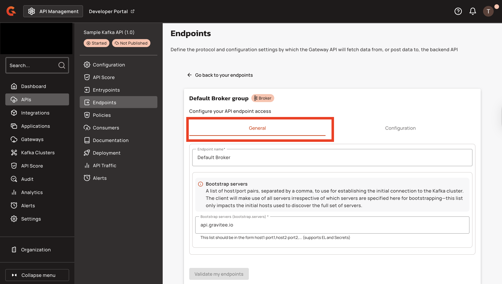

# Endpoints

## Overview

Endpoints define the protocol and configuration settings the Gateway API uses to fetch data from or post data to the backend API. Native Kafka APIs can define multiple endpoints within an endpoint group, enabling pre-configured cluster alternatives for disaster recovery, migration, and regional routing scenarios. The **Endpoints** section lets you modify your Kafka endpoint group and Kafka endpoint.

<figure><figcaption></figcaption></figure>

## Security protocols

Gravitee Kafka APIs support **PLAINTEXT**, **SASL\_PLAINTEXT**, **SASL\_SSL**, or **SSL** as the security protocol to connect to the Kafka cluster.

### SASL mechanisms

In addition to [Kafka's](https://kafka.apache.org/documentation/#security_overview) standard mechanisms, Gravitee supports:

* **NONE**: A stub mechanism that falls back to `PLAINTEXT` protocol.
* **OAUTHBEARER\_TOKEN**: A mechanism that defines a fixed token or a dynamic token from [Gravitee Expression Language](../../../gravitee-expression-language.md).
* **DELEGATE\_TO\_BROKER**: Authentication is delegated to the Kafka broker.


When using `DELEGATE_TO_BROKER`, the supported mechanisms available to the client are `PLAIN` and `AWS_IAM_MSK`. The `AWS_MSK_IAM` mechanism requires you to host the Kafka Gateway on AWS. Otherwise, authentication fails.


## Create an endpoint group

To create an endpoint group for a Native Kafka API:

1. Navigate to the API's endpoint configuration in the Console.
2. The endpoint group type is automatically set to `native-kafka` when the API type is `NATIVE` and a Kafka listener is detected.
3. Add at least one endpoint to the group, specifying the bootstrap servers and optional tenant tags.
4. Save the configuration to validate and deploy the endpoint group.


The load balancer type field is not displayed for Native Kafka APIs.


Validation ensures the group contains at least one endpoint and that endpoint names are unique within the group.

## Edit the endpoint group

Gravitee assigns each Kafka API endpoint group the default name **Default Broker group.** To edit the endpoint group, complete the following steps:

1. Click the **Edit** button with the pencil icon to edit the endpoint group.

    <figure><figcaption></figcaption></figure>

2. Select the **General** tab to change the name of your Kafka endpoint group.

    <figure><figcaption></figcaption></figure>

3. Select the **Configuration** tab to edit the security settings of your Kafka endpoint group.

    <figure><figcaption></figcaption></figure>

4. Select one of the security protocols from the drop-down menu, and then configure the associated settings to define your Kafka authentication flow.

    <figure><figcaption></figcaption></figure>

* **PLAINTEXT:** No further security configuration is necessary.
* **SASL\_PLAINTEXT:** Choose NONE, GSSAPI, OAUTHBEARER, OAUTHBEARER\_TOKEN, PLAIN, SCRAM-SHA-256, SCRAM-SHA-512, or DELEGATE\_TO\_BROKER.
  * **NONE:** No additional security configuration required.
  * **AWS\_MSK\_IAM:** Enter the JAAS login context parameters.
  * **GSSAPI:** Enter the JAAS login context parameters.
  * **OAUTHBEARER:** Enter the OAuth token URL, client ID, client secret, and the scopes to request when issuing a new token.
  * **OAUTHBEARER\_TOKEN:** Provide your custom token value.
  * **PLAIN:** Enter the username and password to connect to the broker.
  * **SCRAM-SHA-256:** Enter the username and password to connect to the broker.
  * **SCRAM-SHA-512:** Enter the username and password to connect to the broker.
  * **DELEGATE\_TO\_BROKER:** No additional security configuration required.
* **SSL:** Choose whether to enable host name verification, and then use the drop-down menu to configure a truststore type.
  * **None**
  * **JKS with content:** Enter binary content as base64 and the truststore password.
  * **JKS with path:** Enter the truststore file path and password.
  * **PKCS#12 / PFX with content:** Enter binary content as base64 and the truststore password.
  * **PKCS#12 / PFX with path:** Enter the truststore file path and password.
  * **PEM with content:** Enter binary content as base64 and the truststore password.
  * **PEM with path:** Enter the truststore file path and password and the keystore type.
* **SASL\_SSL:** Configure both SASL authentication and SSL encryption, choose a **SASL** mechanism from the options listed under **SASL\_PLAINTEXT**, and then configure **SSL** settings as described in the **SSL** section.

## Edit the endpoint

Gravitee automatically assigns your Kafka API endpoint the name **Default Broker**.

1. Click the pencil icon under **ACTIONS** to edit the endpoint.

    <figure><figcaption></figcaption></figure>

2. Select the **General** tab to edit your endpoint name and the list of bootstrap servers.

    <figure><figcaption></figcaption></figure>

3. By default, endpoints inherit configuration settings from their endpoint group. To override these settings, select the **Configuration** tab and configure custom security settings.

    <figure><figcaption></figcaption></figure>

## Reorder endpoints

To change the active endpoint, reorder endpoints in the group using drag-and-drop or move controls in the Console. The first endpoint in the list becomes the active endpoint. Deploying this change triggers a graceful shutdown of existing connections for the API on the gateways, allowing Kafka clients to retry and reconnect to the newly selected endpoint.


Drag-and-drop is disabled in read-only mode and while a reordering operation is in progress.


A success message "Endpoint reordered successfully" confirms the operation.

## Console display

The Console displays endpoint groups and endpoints with the following columns:

| Column | Description | Displayed For |
|:-------|:------------|:--------------|
| Drag icon | Drag handle for reordering | All endpoints |
| Name | Endpoint name with "Default" badge for first endpoint in first group | All endpoints |
| Bootstrap Servers | Kafka bootstrap servers from `endpoint.configuration.bootstrapServers` | Native Kafka endpoints |
| Security Protocol | Security protocol badge with tooltip indicating inheritance or override | Native Kafka endpoints with security configuration |
| Actions | Overflow menu (Rename, Duplicate, Delete) | All endpoints |


The weight column is not displayed for Native Kafka APIs.


The **Options** column is hidden if no endpoints in the group have configured options.

Security protocol badges display tooltips:

* **Inherited**: "Security protocol inherited from group configuration"
* **Override**: "Security protocol override by endpoint configuration"
