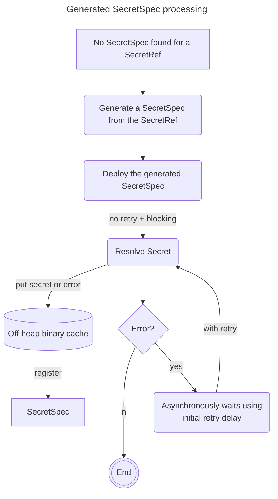
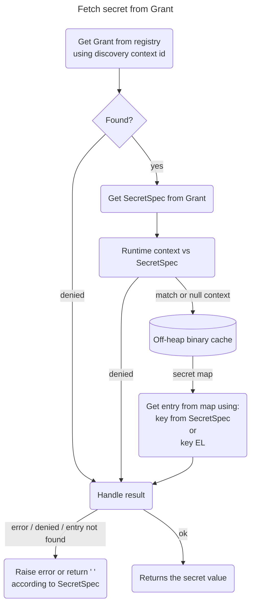
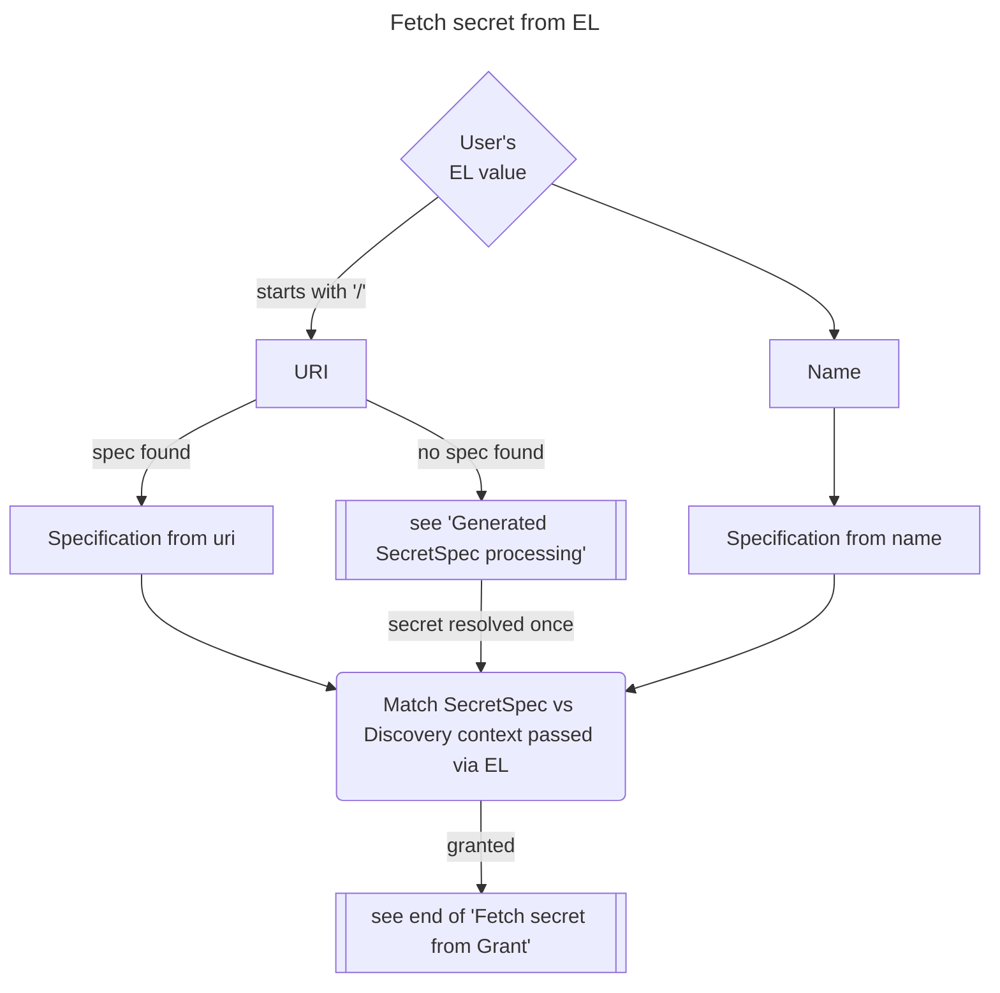

# APIM Plugin Reference

This page catalogs all APIM plugins available through the [Gravitee Marketplace](https://www.gravitee.io/plugins). Plugins that have dedicated documentation pages are linked directly. All other plugins include their full marketplace documentation inline.

## Connector

### - Connector HTTP

**Plugin ID**: `gravitee-connector-http`

#### HTTP Connector


##### Description

The HTTP connector implements the SME Connector API in order to provide native integration with HTTP Protocol.

##### Compatibility with APIM

| Plugin version | APIM version |
| --- | --- |
| 3.x | 4.0.x to latest |
| 2.x | 3.18.x to 3.20.x |
| 1.1.x | 3.15.x to 3.17.x |
| 1.0.x | 3.13.x to 3.14.x |

## Fetcher

### Fetcher - Bitbucket API

**Plugin ID**: `gravitee-fetcher-bitbucket`

#### Bitbucket Fetcher


##### Documentation

This plugin allow Gravitee.io to fetch content from a bitbucket repository.
It's primarily used to fetch documentation.

### Fetcher Git

**Plugin ID**: `gravitee-fetcher-git`

#### Git Fetcher


##### Documentation

This plugin allow Gravitee.io to fetch content from a Git repository.
It's primarily used to fetch documentation.

**Authentication is currently not supported**.

### Fetcher Github

**Plugin ID**: `gravitee-fetcher-github`

#### GitHub Fetcher


##### Documentation

This plugin allow Gravitee.io to fetch content from a GitHub repository.
It's primarily used to fetch documentation.

### Fetcher - GitLab API v3

**Plugin ID**: `gravitee-fetcher-gitlab`

#### Gitlab Fetcher


##### Documentation

This plugin allow Gravitee.io to fetch content from a gitlab repository.
It's primarily used to fetch documentation.

### Fetcher - HTTP

**Plugin ID**: `gravitee-fetcher-http`

#### HTTP Fetcher


##### Description

This plugin allow Gravitee.io to fetch content from an URL.
It's primarily used to fetch documentation.

**Authentications is currently not supported**.

## Notifier

### Notifier Email

**Plugin ID**: `gravitee-notifier-email`

#### Email Notifier


##### Documentation

### Notifier Kafka

**Plugin ID**: `gravitee-notifier-kafka`

#### Kafka Notifier


##### Documentation

### - Notifier - Slack

**Plugin ID**: `gravitee-notifier-slack`

#### Slack Notifier


##### Documentation

### - Notifier - Webhook

**Plugin ID**: `gravitee-notifier-webhook`

#### Webhook Notifier


##### Documentation

## Other

#### Endpoint

### Agent To Agent

**Plugin ID**: `gravitee-endpoint-agent-to-agent`

#### Agent to agent endpoint


[label label-enterprise]#Enterprise feature#

##### Description

Designed to support Google's Agent-to-Agent (A2A) protocol.
It facilitates communication using SSE, HTTP GET, or HTTP POST methods in compliance with evolving A2A specifications.

| Plugin version | APIM version |
| --- | --- |
| 2.x | 4.11.0 and upper |
| 1.x | 4.8.0 to 4.10.x |

###### Configuration

Currently, the Agent to agent reuses the configuration model from the http-proxy endpoint. This means both the Agent to agent specific settings and any shared configurations are directly inherited from the http-proxy endpoint definitions.
For detailed information on available configuration options, refer to the https://github.com/gravitee-io/gravitee-api-management/tree/master/gravitee-apim-plugin/gravitee-apim-plugin-endpoint/gravitee-apim-plugin-endpoint-http-proxy#endpoint-configuration[HTTP Proxy endpoint configuration documentation].

### Azure Service Bus

**Plugin ID**: `gravitee-endpoint-azure-service-bus`

→ [Full documentation](../../create-and-configure-apis/configure-v4-apis/endpoints/azure-service-bus.md)

### Kafka

**Plugin ID**: `gravitee-endpoint-kafka`

→ [Full documentation](../../create-and-configure-apis/configure-v4-apis/endpoints/kafka.md)

### MQTT5

**Plugin ID**: `gravitee-endpoint-mqtt5`

→ [Full documentation](../../create-and-configure-apis/configure-v4-apis/endpoints/mqtt5.md)

### Rabbitmq

**Plugin ID**: `gravitee-endpoint-rabbitmq`

→ [Full documentation](../../create-and-configure-apis/configure-v4-apis/endpoints/rabbitmq.md)

### Solace

**Plugin ID**: `gravitee-endpoint-solace`

→ [Full documentation](../../create-and-configure-apis/configure-v4-apis/endpoints/solace.md)

#### Entrypoint

### Agent To Agent

**Plugin ID**: `gravitee-entrypoint-agent-to-agent`

#### Agent to agent entrypoint


[label label-enterprise]#Enterprise feature#

##### Description

Designed to support Google's Agent-to-Agent (A2A) protocol.
It facilitates communication using SSE, HTTP GET, or HTTP POST methods in compliance with evolving A2A specifications.

| Plugin version | APIM version |
| --- | --- |
| 2.x | 4.11.0 and upper |
| 1.x | 4.8.0 and upper |

###### Plugin identifier

In order to use this _Advanced_ version, you only have to declare the following identifier `agent-to-agent` while configuring your API entrypoints.

###### Configuration

| Property | Default Value | Description |
| --- | --- | --- |
| heartbeatIntervalInMs | 5000ms | Define the interval in which heartbeat are sent to client |

### HTTP Get

**Plugin ID**: `gravitee-entrypoint-http-get`

→ [Full documentation](../../create-and-configure-apis/configure-v4-apis/entrypoints/http-get.md)

### HTTP Post

**Plugin ID**: `gravitee-entrypoint-http-post`

→ [Full documentation](../../create-and-configure-apis/configure-v4-apis/entrypoints/http-post.md)

### MCP Tool Server

**Plugin ID**: `gravitee-entrypoint-mcp-tool-server`

#### MCP Entrypoint


##### Description

An MCP entrytpoint that allow an AI agent to interact with an existing HTTP Proxy API

###### Compatibility matrix

| Plugin version | APIM version |
| --- | --- |
| 1.x | 4.8.x |
| 2.x | 4.11.x |


###### Configuration

TBD

### SSE

**Plugin ID**: `gravitee-entrypoint-sse`

→ [Full documentation](../../create-and-configure-apis/configure-v4-apis/entrypoints/server-sent-events.md)

### Webhook

**Plugin ID**: `gravitee-entrypoint-webhook`

→ [Full documentation](../../create-and-configure-apis/configure-v4-apis/entrypoints/webhook.md)

### Websocket

**Plugin ID**: `gravitee-entrypoint-websocket`

→ [Full documentation](../../create-and-configure-apis/configure-v4-apis/entrypoints/websocket.md)

#### Federation Agent

### Apigee

**Plugin ID**: `gravitee-federation-agent-apigee`

→ [Full documentation](../../govern-apis/federation/3rd-party-providers/apigee-x.md)

### AWS API Gateway

**Plugin ID**: `gravitee-federation-agent-aws-api-gateway`

→ [Full documentation](../../govern-apis/federation/3rd-party-providers/aws-api-gateway/README.md)

### Azure API Management

**Plugin ID**: `gravitee-federation-agent-azure-api-management`

→ [Full documentation](../../govern-apis/federation/3rd-party-providers/azure-api-management.md)

### Confluent Platform

**Plugin ID**: `gravitee-federation-agent-confluent-platform`

→ [Full documentation](../../govern-apis/federation/3rd-party-providers/confluent-platform.md)

### Edge Stack

**Plugin ID**: `gravitee-federation-agent-edge-stack`

→ [Full documentation](../../govern-apis/federation/3rd-party-providers/edge-stack.md)

### IBM API Connect

**Plugin ID**: `gravitee-federation-agent-ibm-api-connect`

→ [Full documentation](../../govern-apis/federation/3rd-party-providers/ibm-api-connect.md)

### Mulesoft

**Plugin ID**: `gravitee-federation-agent-mulesoft`

→ [Full documentation](../../govern-apis/federation/3rd-party-providers/mulesoft-anypoint.md)

### Solace

**Plugin ID**: `gravitee-federation-agent-solace`

→ [Full documentation](../../govern-apis/federation/3rd-party-providers/solace.md)

#### Uncategorized

### Gamma Module Aim

**Plugin ID**: `gravitee-gamma-module-aim`

#### Gamma Module - AI Management

### A gravitee service plugin to load and query ML/AI models in the gateway

**Plugin ID**: `gravitee-inference-service`

`gravitee-inference-service` is a plugin for the Gravitee platform that enables seamless integration of machine learning models via Vert.x. This service allows for model loading and querying through a reactive event-based architecture.

##### Requirements

- Java 21
- Maven (`mvn`)
- Vert.x

##### Features

- Load machine learning models using the event bus.
- Query models with a flexible and reactive programming style.
- Leverages Vert.x’s concurrency model for efficient, non-blocking requests.

##### Installation

Ensure that the following dependencies are available in your environment:

- `gravitee-inference` (for model support)
- Java 21 and Maven (`mvn`)
- Vert.x (for event-driven architecture)

##### Setup

To install and configure the plugin, you will need to integrate this service into your existing Gravitee setup. Ensure that Vert.x is running in your environment, as this service depends on it.

To built it:
```bash
$ mvn clean install
```

##### Example Usage

The following example demonstrates how to interact with the `gravitee-inference-service` plugin via Vert.x:

###### Java Code Example

###### 1. Load the Model

The first step is to load the model by sending a request to the `SERVICE_INFERENCE_MODELS_ADDRESS` address. The response will contain the address to query the model.

```java
import io.vertx.rxjava3.core.Vertx;
import io.vertx.rxjava3.RxHelper;
import io.vertx.core.json.Json;

Vertx vertx = Vertx.vertx();

vertx.eventBus().<Buffer>request(SERVICE_INFERENCE_MODELS_ADDRESS, Json.encodeToBuffer(request))
        // Model may take some time to load depending on the size and for the first time
        .subscribeOn(RxHelper.blockingScheduler(vertx.getDelegate()))
        .observeOn(RxHelper.scheduler(vertx.getDelegate()))
        .map(message -> message.body().toString()) // The response will be the model's address
        .subscribe(address -> {
            System.out.println("Model address: " + address); // Store or process the address
        }, Throwable::printStackTrace);
```

This request sends a model loading command and returns the model's address.

###### 2. Query the Model

Once the model is loaded, you can query it by sending a second request to the model’s address. The request will include the input data for the model.

```java
import io.vertx.rxjava3.core.Vertx;
import io.vertx.rxjava3.RxHelper;
import io.vertx.core.buffer.Buffer;
import io.vertx.core.json.Json;
import io.gravitee.inference.api.service.InferenceAction;

import static io.gravitee.inference.api.Constants.INPUT;

vertx
    .eventBus()
    .<Buffer>request(
        modelAddress, // The address returned from the first request
        Json.encodeToBuffer(new InferenceRequest(InferenceAction.INFER, Map.of(INPUT, "The big brown fox jumps over the lazy dog")))
    )
    .subscribeOn(RxHelper.blockingScheduler(vertx.getDelegate()))
    .observeOn(RxHelper.scheduler(vertx.getDelegate()))
    .map(message -> Json.decodeValue(message.body(), clazz)) // Decode the result
    .subscribe(
        result -> {
            System.out.println("Inference Result: " + result); // Process or display the result
        },
        Throwable::printStackTrace
    );
```

This call sends the input data (e.g., `"The big brown fox jumps over the lazy dog"`) to the model for inference.

---

###### Flow Explanation

1. **Model Creation (First Call)**:
    - The first event bus request (`SERVICE_INFERENCE_MODELS_ADDRESS`) initializes the model loading process and returns an address.
2. **Model Query (Second Call)**:
    - The second request queries the model using the address obtained from the first call. It sends the input data (e.g., `"The big brown fox jumps over the lazy dog"`) to the model for inference.
3. **Result Handling**:
    - The model's output is returned and processed by decoding the message and outputting or further handling the result.

###### Request Examples

###### Request for Embeddings

The request for embedding requires a model and tokenizer file. Below is how you can START the request with a dynamically generated random path:

```java
import io.gravitee.inference.api.Constants;
import io.gravitee.inference.api.service.InferenceRequest;
import io.gravitee.inference.api.embedding.PoolingMode;

import java.nio.file.Paths;
import java.util.Map;
import java.util.List;
import java.util.UUID;
import io.gravitee.inference.api.service.InferenceAction;

import static io.gravitee.inference.api.service.InferenceFormat.ONNX_BERT;
import static io.gravitee.inference.api.service.InferenceType.EMBEDDING;
import static io.gravitee.inference.api.classifier.ClassifierMode.TOKEN;
import static io.gravitee.inference.api.Constants.*;

var request = new InferenceRequest(
  InferenceAction.START,
  Map.of(
    INFERENCE_FORMAT, ONNX_BERT,
    INFERENCE_TYPE, EMBEDDING,
    MODEL_PATH, "/path/to/your/Xenova/all-MiniLM-L6-v2/model_quantized.onnx",
    TOKENIZER_PATH, "/path/to/your/Xenova/all-MiniLM-L6-v2/tokenizer.json",
    Constants.POOLING_MODE, PoolingMode.MEAN,
    MAX_SEQUENCE_LENGTH, 512
  )
);
```

###### Request for Classification

For the classification request, the process is similar but with different labels for token classification:

```java
import io.gravitee.inference.api.Constants;
import io.gravitee.inference.api.service.InferenceRequest;

import java.nio.file.Paths;
import java.util.List;
import java.util.Map;
import java.util.UUID;
import io.gravitee.inference.api.service.InferenceAction;

import static io.gravitee.inference.api.service.InferenceFormat.ONNX_BERT;
import static io.gravitee.inference.api.service.InferenceType.CLASSIFIER;
import static io.gravitee.inference.api.classifier.ClassifierMode.TOKEN;
import static io.gravitee.inference.api.Constants.*;

var request =
  new InferenceRequest(
    InferenceAction.START,
    Map.of(
      INFERENCE_FORMAT, ONNX_BERT,
      INFERENCE_TYPE, CLASSIFIER,
      CLASSIFIER_MODE, TOKEN,
      MODEL_PATH, "/path/to/your/dslim/distilbert-NER/model.onnx",
      TOKENIZER_PATH, "/path/to/your/dslim/distilbert-NER/tokenizer.json",
      CLASSIFIER_LABELS, List.of("O", "B-PER", "I-PER", "B-ORG", "I-ORG", "B-LOC", "I-LOC", "B-MISC", "I-MISC"),
      DISCARDED_LABELS, List.of("O")
    )
  );

// But also
var request = new InferenceRequest(
    InferenceAction.START,
    Map.of(
            INFERENCE_FORMAT, ONNX_BERT,
            INFERENCE_TYPE, CLASSIFIER,
            CLASSIFIER_MODE, TOKEN,
            MODEL_PATH, "/path/to/your/dslim/distilbert-NER/model.onnx",
            TOKENIZER_PATH, "/path/to/your/dslim/distilbert-NER/tokenizer.json",
            CONFIG_JSON_PATH, "/path/to/your/dslim/distilbert-NER/config.json",
            DISCARDED_LABELS, List.of("O")
    )
);

//This applies also to Sequence classification
```

> If you provide the same model at least twice (based on the configuration map), many addresses will be created but only
> one model will be loaded in memory

###### Teardown the inference

In order to teardown the inference, just build a "STOP" inference request and provide the inference model
address.


```java
import io.gravitee.inference.api.Constants;
import io.gravitee.inference.api.service.InferenceRequest;

import java.nio.file.Paths;
import java.util.List;
import java.util.Map;
import java.util.UUID;
import io.gravitee.inference.api.service.InferenceAction;

import static io.gravitee.inference.api.service.InferenceFormat.ONNX_BERT;
import static io.gravitee.inference.api.service.InferenceType.CLASSIFIER;
import static io.gravitee.inference.api.classifier.ClassifierMode.TOKEN;
import static io.gravitee.inference.api.Constants.*;

var request =
  new InferenceRequest(
    InferenceAction.STOP,
    Map.of(
      MODEL_ADDRESS_KEY, "<inference-model-address>"
    )
  );
```

> If you provided the same model several times, stopping the inference will just teardown the address
> but the model will be kept in memory until no address are bound to the model.

### Management API Services External API

**Plugin ID**: `gravitee-management-api-services-external-api`

#### Gravitee.io Service External API

##### Description


```yml
services:
  external-api:
    type: mulesoft
    endpoint: https://mulesoft_management_host_url
    username: user
    password: pwd
    # Sharding tags configuration
    # Allows to define inclusion/exclusion sharding tags to only deploy a part of APIs on MuleSoft.
    # To exclude just prefix the tag with '!'.
    # Use ',' to separate tags.
    # Example: tags: external, !private
    tags: mulesoft
    mulesoft:
      organization: orgId
      environment: envId
```

### Reactor Message

**Plugin ID**: `gravitee-reactor-message`

#### Reactor Message


##### Description

The reactor is used to handle HTTP-based APIs dealing with messages.

##### Compatibility with APIM

| Plugin version | APIM version |
| --- | --- |
| 10.x | 4.11.x |
| 9.x | 4.10.x |
| 8.x | 4.9.x |
| 7.x | 4.8.x |
| 6.x | 4.7.x |
| 5.x | 4.6.x |
| 4.x | 4.5.x |
| 3.x | 4.4.x |
| 2.x | 4.2.x to 4.3.x |
| 1.x | 4.0.x to 4.1.x |

#### Secret provider

### Secret Provider AWS

**Plugin ID**: `gravitee-secret-provider-aws`

→ [Full documentation](../../prepare-a-production-environment/sensitive-data-management/plugin-support.md)

### Secret Provider HC Vault

**Plugin ID**: `gravitee-secret-provider-hc-vault`

→ [Full documentation](../../prepare-a-production-environment/sensitive-data-management/plugin-support.md)

### Secret Provider Kubernetes

**Plugin ID**: `gravitee-secret-provider-kubernetes`

→ [Full documentation](../../prepare-a-production-environment/sensitive-data-management/plugin-support.md)

## Policy

### AI Prompt Guard Rails

**Plugin ID**: `gravitee-policy-ai-prompt-guard-rails`

→ [Full documentation](../../create-and-configure-apis/apply-policies/policy-reference/ai-prompt-guard-rails.md)

### AI Prompt Token Tracking

**Plugin ID**: `gravitee-policy-ai-prompt-token-tracking`

→ [Full documentation](../../create-and-configure-apis/apply-policies/policy-reference/ai-prompt-token-tracking.md)

### A policy to perform R.A.G based on a vector store

**Plugin ID**: `gravitee-policy-ai-retrieval-augmented-generation`

[](https://download.gravitee.io/#graviteeio-ee/apim/plugins/policies/gravitee-policy-ai-rag/)[](https://github.com/gravitee-io/gravitee-policy-ai-rag/blob/master/LICENSE.txt)[](https://github.com/gravitee-io/gravitee-policy-ai-rag/releases)[](https://circleci.com/gh/gravitee-io/gravitee-policy-ai-rag)

##### Phases

| onRequest | onResponse | onMessageRequest | onMessageResponse |
|:---------:|:----------:|:----------------:|:-----------------:|
|     ✅     |            |                  |                   |

##### Description

The `ai-retrieval-augmented-generation` policy enables **Retrieval-Augmented Generation (RAG)**, enriching prompts with context retrieved from a vector store.  
It uses an AI embedding model to convert the incoming request into a vector, then queries a vector store for the most relevant documents.  
The retrieved results are stored in the execution context and injected into a **prompt template**, allowing the language model to generate more accurate and context-aware responses.

This policy integrates with AI resources such as:
- **Text embedding models** (for vector generation)
- **Vector stores** (for similarity search and retrieval)

RAG provides a hybrid approach: dynamic generation with context-aware retrieval.

> ℹ️ This policy is especially useful for **knowledge-base Q&A**, **document search augmentation**, and **API assistants** that require contextual understanding.

##### Configuration

You can configure the policy with the following options:

| Property           | Required | Description                                                                                                           | Type   | Default                                                    |
|--------------------|----------|-----------------------------------------------------------------------------------------------------------------------|--------|------------------------------------------------------------|
| `modelName`        | ✅        | The unique identifier of the embedding model resource to use for vector generation.                                   | string | —                                                          |
| `vectorStoreName`  | ✅        | The name of the vector store resource used to retrieve relevant documents.                                            | string | —                                                          |
| `resultsAttribute` | ✅        | The context attribute where retrieved results will be stored for later use in the prompt template.                    | string | `ragResults`                                               |
| `promptExpression` | ✅        | EL expression to extract the user’s query or request content for embedding and similarity search.                     | string | `{#jsonPath(#request.content, '$.messages[-1:].content')}` |
| `promptTemplate`   | ✅        | The template that guides the AI model’s response. Can reference context attributes (e.g., results from retrieval).    | string | See [default example](#default-prompt-template)            |
| `parameters`       |          | List of key-value pairs used as metadata filters in the vector search. Values support EL and can be securely encoded. | array  | —                                                          |

###### Parameter Object Structure

Each `parameter` item contains:

| Property | Description                                                                                     | Type    |
|----------|-------------------------------------------------------------------------------------------------|---------|
| `key`    | Name of the metadata field to store or query with.                                              | string  |
| `value`  | EL expression or static string for the metadata value.                                          | string  |
| `encode` | Whether the value should be hashed and encoded for safe indexing (e.g., sensitive information). | boolean |

###### Default Prompt Template

```text
Answer this question to the best of your abilities:

    Question: {#jsonPath(#request.content, '$.messages[-1:].content')}

Use the information below to construct your answer:

    Information: {#context.attributes['ragResults'][0]['content']}

If no information was submitted, just answer you do not know.
```

###### Example Configuration

```json
{
  "name": "AI RAG Policy",
  "enabled": true,
  "policy": "ai-retrieval-augmented-generation",
  "configuration": {
    "modelName": "ai-model-text-embedding-resource",
    "vectorStoreName": "vector-store-redis-resource",
    "resultsAttribute": "ragResults",
    "promptExpression": "{#jsonPath(#request.content, '$.messages[-1:].content')}",
    "promptTemplate": "Answer this question: {#jsonPath(#request.content, '$.messages[-1:].content')} with context: {#context.attributes['ragResults']}",
    "parameters": [
      {
        "key": "tenant_id",
        "value": "{#context.attributes['tenant']}",
        "encode": true
      }
    ]
  }
}
```

---

##### License

This project is licensed under the [Apache License 2.0](./LICENSE).

### AI Semantic Caching

**Plugin ID**: `gravitee-policy-ai-semantic-caching`

→ [Full documentation](../../create-and-configure-apis/apply-policies/policy-reference/ai-semantic-caching.md)

### AMQP

**Plugin ID**: `gravitee-policy-amqp`

#### AMQP Gravitee Policy


*Build*

`mvn clean install`

`gravitee-policy-amqp-<VERSION>.zip` will be generated in a `/targer` folder.

*Install*

Copy `gravitee-policy-amqp-<VERSION>.zip` to the `/plugins` folder on `gravitee-gateway` and `graviteeio-management-api`

*Use*

The plugin was tested with rabbitmq_server-3.7.14 with AMQP 1.0 protocol version. Run these command from `sbin` RabbitMQ installation folder of to enable AMQP 1.0 support:

`rabbitmq-plugins enable rabbitmq_amqp1_0`

Configure AMQP policy from the API management portal and specify Host, Port, Queue name, Username and password of RabbitMQ server.

If you want to use Request - Response functionality, enable corresponding checkbox. `AmqpListener` test class is provided to simulate a Echo-like response.

*TODO*

- Fix unit test for the Request-Response functionality - use separate threads
- Mock `AmqpClient` instead of `AmqpConnectionManager` There were some troubles with mocking Amqp Classes - solved now using `withoutAnnotations()` method.
- Test with other MQs
- Investigate problem with default connection.createAnonymousSender and connection.createDynamicReceiver in RabbitMQ for avoiding named response queues.
- Multi-tenancy support - store `correlationIds` and response queue names in Redis

### API Key

**Plugin ID**: `gravitee-policy-apikey` — Gravitee Policy - Api Key

→ [Full documentation](../../create-and-configure-apis/apply-policies/policy-reference/api-key.md)

### Assign attributes

**Plugin ID**: `gravitee-policy-assign-attributes` — Gravitee Policy - Assign attributes

→ [Full documentation](../../create-and-configure-apis/apply-policies/policy-reference/assign-attributes.md)

### Assign content

**Plugin ID**: `gravitee-policy-assign-content` — Gravitee Policy - Assign content

→ [Full documentation](../../create-and-configure-apis/apply-policies/policy-reference/assign-content.md)

### Policy - Metrics Properties

**Plugin ID**: `gravitee-policy-assign-metrics` — Gravitee.io Policy - Metrics Properties

→ [Full documentation](../../create-and-configure-apis/apply-policies/policy-reference/assign-metrics.md)

### - Policy - AWS Lambda

**Plugin ID**: `gravitee-policy-aws-lambda` — Gravitee.io - Policy - AWS Lambda

→ [Full documentation](../../create-and-configure-apis/apply-policies/policy-reference/aws-lambda.md)

### - Policy - Basic Authentication

**Plugin ID**: `gravitee-policy-basic-authentication` — Gravitee.io - Policy - Basic Authentication

→ [Full documentation](../../create-and-configure-apis/apply-policies/policy-reference/basic-authentication.md)

### Caching

**Plugin ID**: `gravitee-policy-cache` — Gravitee Policy - Caching

→ [Full documentation](../../create-and-configure-apis/apply-policies/policy-reference/cache.md)

### Callout HTTP

**Plugin ID**: `gravitee-policy-callout-http` — Gravitee Policy - Callout HTTP

→ [Full documentation](../../create-and-configure-apis/apply-policies/policy-reference/http-callout.md)

### Check Certificate Thumbprint

**Plugin ID**: `gravitee-policy-check-certificate-thumbprint`

#### CheckCertificateThumbprint Gravitee Policy


##### Phase

[cols="4*", options="header"]
| onRequest | onResponse | onRequestContent | onResponseContent | X | - | - | - |
| --- | --- | --- | --- | --- | --- | --- | --- |

##### Description

This policy check the **x5t#S256** that exist in **access_token**, this is necessary to validate certificate in **OpenBanking Brazil** requirements.
To get the **x5t#S256** the AS (Authorization Server) needs to support the **Mutual-TLS Client Certificate-Bound Access Tokens**.
The documentation can be viewed here: https://datatracker.ietf.org/doc/html/rfc8705#section-3

This policy can be very useful in mTLS authentication and can be used to verify if the certificate that create
access_token is the same certificate that authenticated against you api.

This policy plugin only works in this version with certificate provided by HTTP Header, like **ssl-client-cert**.
The Header **ssl-client-cert** is a Header that nginx provided after mTLS authentication, the value of this header
is the certificate string encoded by URLEncode, documentation can be found here: http://nginx.org/en/docs/http/ngx_http_ssl_module.html.

> This is the default value, when is used nginx-controller ingress, this name can be different in your setup.

> This is an initial policy, and a lot of work needs to be done in this code.

##### Configuration

| Property | Required | Description | Type | Default |
| --- | --- | --- | --- | --- |
| tokenHeader | X |  |  |  |
| Name of the header where we can find the access_token |  |  |  |  |
| string | authorization | certHeader | X |  |
| The name of the header where we can find the urlencoded certificate |  |  |  |  |
| string | ssl-client-cert | errorCode | - |  |
| The error http status code that you want to return when certificate thumbprint do not match. |  |  |  |  |
| string | 401 | errorMessage | - |  |
| The error message that you want to return when certificate thumbprint do not match. |  |  |  |  |
| string | Certificate not belong to certificate that created this access_token. |  |  |  |

##### Examples

```json
"policy-check-certificate-thumbprint": {
    "tokenHeader": "authorization",
    "certHeader": "ssl-client-cert"
}
```

##### Errors

###### Default error

| Code | Message |
| --- | --- |
| ```401``` | An error occurred when certificate thumbprint do not match. |

### Policy - Circuit Breaker

**Plugin ID**: `gravitee-policy-circuit-breaker` — Gravitee.io Policy - Circuit Breaker

→ [Full documentation](../../create-and-configure-apis/apply-policies/policy-reference/circuit-breaker.md)

### A policy to test CI config for deployment and bundle process

**Plugin ID**: `gravitee-policy-citest`

#### CI Test Policy


##### Description
Fake policy to test CI/CD configuration.

This is a fake breaking change. And it's better with a Breaking Change commit.


A new line to generate a new version

### Cloud Events

**Plugin ID**: `gravitee-policy-cloud-events`

→ [Full documentation](../../create-and-configure-apis/apply-policies/policy-reference/cloudevents.md)

### Content Based Routing

**Plugin ID**: `gravitee-policy-content-based-routing`

#### ContentBasedRouting Gravitee Policy


Here you can document your ContentBasedRouting Gravitee Policy.

### Custom Query Parameters Parser

**Plugin ID**: `gravitee-policy-custom-query-parameters-parser`

→ [Full documentation](../../create-and-configure-apis/apply-policies/policy-reference/custom-query-parameters-parser.md)

### Data Cache

**Plugin ID**: `gravitee-policy-data-cache`

→ [Full documentation](../../create-and-configure-apis/apply-policies/policy-reference/data-cache.md)

### Data Logging Masking

**Plugin ID**: `gravitee-policy-data-logging-masking`

→ [Full documentation](../../create-and-configure-apis/apply-policies/policy-reference/data-logging-masking.md)

### Dynamic Routing

**Plugin ID**: `gravitee-policy-dynamic-routing` — Gravitee Policy - Dynamic Routing

→ [Full documentation](../../create-and-configure-apis/apply-policies/policy-reference/dynamic-routing.md)

### - Policies - Generate HTTP Signature

**Plugin ID**: `gravitee-policy-generate-http-signature` — Gravitee.io - Policies - Generate HTTP Signature

→ [Full documentation](../../create-and-configure-apis/apply-policies/policy-reference/generate-http-signature.md)

### Generate JWT

**Plugin ID**: `gravitee-policy-generate-jwt` — Gravitee Policy - Generate JWT

→ [Full documentation](../../create-and-configure-apis/apply-policies/policy-reference/generate-jwt.md)

### GeoIP Filtering

**Plugin ID**: `gravitee-policy-geoip-filtering` — Gravitee Policy - GeoIP Filtering

→ [Full documentation](../../create-and-configure-apis/apply-policies/policy-reference/geoip-filtering.md)

### GraphQL Rate Limit

**Plugin ID**: `gravitee-policy-graphql-rate-limit`

→ [Full documentation](../../create-and-configure-apis/apply-policies/policy-reference/graphql-rate-limit.md)

### Groovy script

**Plugin ID**: `gravitee-policy-groovy` — Gravitee Policy - Groovy script

→ [Full documentation](../../create-and-configure-apis/apply-policies/policy-reference/4.9-groovy.md)

### HTML JSON

**Plugin ID**: `gravitee-policy-html-json`

→ [Full documentation](../../create-and-configure-apis/apply-policies/policy-reference/html-to-json.md)

### HTTP Redirect

**Plugin ID**: `gravitee-policy-http-redirect`

→ [Full documentation](../../create-and-configure-apis/apply-policies/policy-reference/http-redirect.md)

### HTTP Signature

**Plugin ID**: `gravitee-policy-http-signature`

→ [Full documentation](../../create-and-configure-apis/apply-policies/policy-reference/http-signature.md)

### Hypercurrent Metering

**Plugin ID**: `gravitee-policy-hypercurrent-metering`

#### HyperCurrent Gravitee Metering Policy

Building:

```
mvn -Dlicense.skip  clean package
```

### Interrupt

**Plugin ID**: `gravitee-policy-interrupt` — Gravitee Policy - Interrupt

→ [Full documentation](../../create-and-configure-apis/apply-policies/policy-reference/interrupt.md)

### Filter request by IP based on blacklist or whitelist

**Plugin ID**: `gravitee-policy-ipfiltering` — Gravitee Policy - Filter request by IP based on blacklist or whitelist

→ [Full documentation](../../create-and-configure-apis/apply-policies/policy-reference/ip-filtering.md)

### Javascript

**Plugin ID**: `gravitee-policy-javascript`

→ [Full documentation](../../create-and-configure-apis/apply-policies/policy-reference/javascript.md)

### Js

**Plugin ID**: `gravitee-policy-js`

→ [Full documentation](../../create-and-configure-apis/apply-policies/policy-reference/javascript-policy-new-reference.md)

### JSON Threat Protection

**Plugin ID**: `gravitee-policy-json-threat-protection` — Gravitee Policy - JSON Threat Protection

→ [Full documentation](../../create-and-configure-apis/apply-policies/policy-reference/json-threat-protection.md)

### JSON to JSON

**Plugin ID**: `gravitee-policy-json-to-json` — Gravitee Policy - JSON to JSON

→ [Full documentation](../../create-and-configure-apis/apply-policies/policy-reference/json-to-json.md)

### JSON To Toon

**Plugin ID**: `gravitee-policy-json-to-toon`

[](https://download.gravitee.io/#graviteeio-apim/plugins/policies/gravitee-policy-json-to-toon/)
[](https://github.com/gravitee-io/gravitee-policy-json-to-toon/blob/master/LICENSE.txt)
[](https://github.com/gravitee-io/gravitee-policy-json-to-toon/releases)
[](https://circleci.com/gh/gravitee-io/gravitee-policy-json-to-toon)

##### Overview
The `Json-to-toon` policy allows for seamless conversion between JSON (JavaScript Object Notation) and TOON (Toon Object Notation) formats. This policy can be applied to both HTTP requests and responses, as well as to individual messages, making it a versatile tool for data transformation within your API.

[TOON](https://github.com/toon-format/toon) is a compact, human-readable encoding of the JSON data model that minimizes tokens and makes structure easy for models to follow. It's intended for LLM input as a drop-in, lossless representation of your existing JSON.

###### Key Features

*   **Bidirectional Conversion**: Convert data from JSON to TOON or from TOON to JSON.
*   **Flexible Application**: Apply the policy to the entire HTTP body or to individual messages in a stream.
*   **Rich Configuration**: Fine-tune the conversion process with a variety of options for both encoding (JSON to TOON) and decoding (TOON to JSON).
*   **Automatic Header Management**: The policy automatically sets the `Content-Type` and `Content-Length` headers to reflect the new data format.

This policy is particularly useful when you need to interface with systems that produce or consume TOON-formatted data, allowing you to maintain a consistent JSON-based API for your clients while seamlessly integrating with other services.


##### Usage
The `json-to-toon` policy provides a powerful and flexible way to convert data between JSON and TOON formats. Below are examples of how to configure the policy.

###### JSON to TOON Conversion

When converting from JSON to TOON, you can customize the output format using the following options:

**Example Configuration (JSON to TOON):**

```json
{
  "conversion": "JSON_TO_TOON",
  "indent": 2,
  "delimiter": "COMMA",
  "flatten": "NONE"
}
```

###### TOON to JSON Conversion

When converting from TOON to JSON, you can control how the data is parsed and formatted:

```json
{
  "conversion": "TOON_TO_JSON",
  "strict": true,
  "expandPaths": "OFF",
  "prettyPrint": true
}
```


##### Errors
These templates are defined at the API level, in the "Entrypoint" section for v4 APIs, or in "Response Templates" for v2 APIs.
The error keys sent by this policy are as follows:

| Key |
| ---  |
| JSON_TO_TOON_ERROR |


##### Phases
The `json-to-toon` policy can be applied to the following API types and flow phases.

###### Compatible API types

* `PROXY`
* `MESSAGE`

###### Supported flow phases:

* Request
* Response
* Publish
* Subscribe

##### Compatibility matrix
Strikethrough text indicates that a version is deprecated.

| Plugin version| APIM |
| --- | ---  |
|1.x|4.10.x and above |


##### Configuration options


###### 
| Name <br>`json name`  | Type <br>`constraint`  | Mandatory  | Description  |
|:----------------------|:-----------------------|:----------:|:-------------|
| Conversion<br>`conversion`| object| ✅| Conversion of <br>Values: `NONE` `JSON_TO_TOON` `TOON_TO_JSON`|


###### : NONE `conversion = "NONE"` 
| Name <br>`json name`  | Type <br>`constraint`  | Mandatory  | Default  | Description  |
|:----------------------|:-----------------------|:----------:|:---------|:-------------|
| No properties | | | | | | | 

###### : JSON_TO_TOON `conversion = "JSON_TO_TOON"` 
| Name <br>`json name`  | Type <br>`constraint`  | Mandatory  | Default  | Description  |
|:----------------------|:-----------------------|:----------:|:---------|:-------------|
| Delimiter<br>`delimiter`| enum (string)| ✅| `COMMA`| Delimiter for TOON format<br>Values: `COMMA` `TAB` `PIPE`|
| Flattening<br>`flatten`| enum (string)|  | `SAFE`| Key flattening strategy<br>Values: `SAFE` `OFF`|
| Flatten Depth<br>`flattenDepth`| integer|  | `1`| Depth to flatten keys|
| Indentation<br>`indent`| integer| ✅| `2`| Number of spaces for indentation|
| Length Marker<br>`lengthMarker`| boolean|  | | Include length markers in TOON encoding|


###### : TOON_TO_JSON `conversion = "TOON_TO_JSON"` 
| Name <br>`json name`  | Type <br>`constraint`  | Mandatory  | Default  | Description  |
|:----------------------|:-----------------------|:----------:|:---------|:-------------|
| Delimiter<br>`delimiter`| enum (string)| ✅| `COMMA`| Delimiter for TOON format<br>Values: `COMMA` `TAB` `PIPE`|
| Expand Paths<br>`expandPaths`| enum (string)|  | `SAFE`| Path expansion strategy during decoding<br>Values: `SAFE` `OFF`|
| Indentation<br>`indent`| integer| ✅| `2`| Number of spaces for indentation|
| Pretty Print JSON<br>`prettyPrint`| boolean|  | | Enable pretty printing for TOON to JSON conversion|
| Strict Mode<br>`strict`| boolean|  | `true`| Enable strict mode for TOON decoding|


##### Examples


##### Changelog

###### [1.0.0-alpha.3](https://github.com/gravitee-io/gravitee-policy-json-to-toon/compare/1.0.0-alpha.2...1.0.0-alpha.3) (2026-03-02)


##### Bug Fixes

* add license headers to policy and test files ([31d1b4d](https://github.com/gravitee-io/gravitee-policy-json-to-toon/commit/31d1b4d75db687bbffee01c686b26dab7b8dd37b))
* add PUBLISH and SUBSCRIBE to http_message in plugin.properties and update README ([d442454](https://github.com/gravitee-io/gravitee-policy-json-to-toon/commit/d4424548934c311580989e4d0085d17c770d4ed4))
* enforce additionalProperties constraint in schema-form.json ([c93c682](https://github.com/gravitee-io/gravitee-policy-json-to-toon/commit/c93c682c9dcdaf9028787933f332e141c795d15f))
* remove unused jackson-databind dependency from pom.xml ([6ae80d3](https://github.com/gravitee-io/gravitee-policy-json-to-toon/commit/6ae80d38cccf9e5162f37ef065f4c50f3fd2a219))
* update documentation references and improve configuration types in JsonToToonPolicy ([8dd6caa](https://github.com/gravitee-io/gravitee-policy-json-to-toon/commit/8dd6caa2266d304112a64f23df353f7c6794175b))
* update usage examples and configuration options in documentation for json-to-toon policy ([792dd81](https://github.com/gravitee-io/gravitee-policy-json-to-toon/commit/792dd816c423a0c54bd1e5705ed929890b597161))

###### [1.0.0-alpha.2](https://github.com/gravitee-io/gravitee-policy-json-to-toon/compare/1.0.0-alpha.1...1.0.0-alpha.2) (2026-01-19)


##### Bug Fixes

* change groupId to io.gravitee ([48d9851](https://github.com/gravitee-io/gravitee-policy-json-to-toon/commit/48d9851fcca7d3581c076a634b537846a8191512))

###### 1.0.0-alpha.1 (2026-01-19)


##### Features

* add CONTENT_TYPE ([74a14f4](https://github.com/gravitee-io/gravitee-policy-json-to-toon/commit/74a14f47b0ca6d03996195551f12eef0d6348788))
* impl json to toon and toon to json policy ([c96f0c5](https://github.com/gravitee-io/gravitee-policy-json-to-toon/commit/c96f0c5f2cf68caa8a496e558b46ed869f1c0019))

### JSON Validation

**Plugin ID**: `gravitee-policy-json-validation` — Gravitee Policy - JSON Validation

→ [Full documentation](../../create-and-configure-apis/apply-policies/policy-reference/json-validation.md)

### JSON XML

**Plugin ID**: `gravitee-policy-json-xml`

→ [Full documentation](../../create-and-configure-apis/apply-policies/policy-reference/json-to-xml.md)

### JSON Web Signature

**Plugin ID**: `gravitee-policy-jws` — Gravitee Policy - JSON Web Signature

→ [Full documentation](../../create-and-configure-apis/apply-policies/policy-reference/jws-validator.md)

### JSON Web Tokens

**Plugin ID**: `gravitee-policy-jwt` — Gravitee Policy - JSON Web Tokens

→ [Full documentation](../../create-and-configure-apis/apply-policies/policy-reference/4.9-jwt-validator.md)

### Kafka ACL

**Plugin ID**: `gravitee-policy-kafka-acl`

→ [Full documentation](../../create-and-configure-apis/apply-policies/policy-reference/kafka-acl.md)

### Kafka Message Encryption/Decryption

**Plugin ID**: `gravitee-policy-kafka-message-encryption-decryption`

→ [Full documentation](../../create-and-configure-apis/apply-policies/policy-reference/kafka-message-encryption-decryption-policy-reference.md)

### Kafka Message Filtering

**Plugin ID**: `gravitee-policy-kafka-message-filtering`

→ [Full documentation](../../create-and-configure-apis/apply-policies/policy-reference/kafka-message-filtering.md)

### Kafka Quota

**Plugin ID**: `gravitee-policy-kafka-quota`

→ [Full documentation](../../create-and-configure-apis/apply-policies/policy-reference/kafka-quota.md)

### Sample policy for the Gravitee Kafka Gateway.

**Plugin ID**: `gravitee-policy-kafka-sample`

#### Gravitee Kafka Sample Policy

This is a sample custom policy for the Gravitee Kafka Gateway.
It does some basic conversion of text between upper and lower case for string messages.

Feel free to use this repository as a guide for building your own custom policies on the Kafka Gateway.

The Kafka Gateway requires an enterprise license of Gravitee, so you will need to have a license in order ot use this policy in a real API.

🚀 Happy coding! 🚀

### Kafka Topic Mapping

**Plugin ID**: `gravitee-policy-kafka-topic-mapping`

→ [Full documentation](../../create-and-configure-apis/apply-policies/policy-reference/kafka-topic-mapping.md)

### Kafka Transform Key

**Plugin ID**: `gravitee-policy-kafka-transform-key`

→ [Full documentation](../../create-and-configure-apis/apply-policies/policy-reference/kafka-transform-key.md)

### Kafka Virtual Topics

**Plugin ID**: `gravitee-policy-kafka-virtual-topics`

*No additional documentation available.*

### APIM - Policy - Keyless

**Plugin ID**: `gravitee-policy-keyless` — Gravitee.io APIM - Policy - Keyless

→ [Full documentation](../../create-and-configure-apis/apply-policies/policy-reference/keyless.md)

### Latency

**Plugin ID**: `gravitee-policy-latency`

→ [Full documentation](../../create-and-configure-apis/apply-policies/policy-reference/latency.md)

### Logging

**Plugin ID**: `gravitee-policy-logging`

#### Logging Policy


##### Deprecated
> **Caution:** This policy is deprecated and no more available since Gravitee.io APIM 1.16

##### Phase

[cols="^2,^2,^2",options="header"]
| onRequest | onResponse | onRequestContent | onResponseContent |
| --- | --- | --- | --- |
| X |  |  |  |
| X |  |  |  |

##### Description

##### Usage

##### Configuration
```json
```
"logging": {
}

### MCP ACL

**Plugin ID**: `gravitee-policy-mcp-acl`

→ [Full documentation](../../create-and-configure-apis/apply-policies/policy-reference/ai-mcp-acl.md)

### Message Filtering

**Plugin ID**: `gravitee-policy-message-filtering`

→ [Full documentation](../../create-and-configure-apis/apply-policies/policy-reference/message-filtering.md)

### - APIM - Policy Metric Reporter

**Plugin ID**: `gravitee-policy-metrics-reporter` — Gravitee.io - APIM - Policy Metric Reporter

→ [Full documentation](../../create-and-configure-apis/apply-policies/policy-reference/metrics-reporter.md)

### Mock

**Plugin ID**: `gravitee-policy-mock` — Gravitee Policy - Mock

→ [Full documentation](../../create-and-configure-apis/apply-policies/policy-reference/mock.md)

### mTLS

**Plugin ID**: `gravitee-policy-mtls`

→ [Full documentation](../../create-and-configure-apis/apply-policies/policy-reference/mtls.md)

### Native IP Filtering

**Plugin ID**: `gravitee-policy-native-ip-filtering`

→ [Full documentation](../../create-and-configure-apis/apply-policies/policy-reference/native-ip-filtering.md)

### OAS Validation

**Plugin ID**: `gravitee-policy-oas-validation`

→ [Full documentation](../../create-and-configure-apis/apply-policies/policy-reference/oas-validation.md)

### - API Management - Policy - OAuth2

**Plugin ID**: `gravitee-policy-oauth2` — Gravitee.io - API Management - Policy - OAuth2

→ [Full documentation](../../create-and-configure-apis/apply-policies/policy-reference/oauth2/README.md)

### - API Management - Policy - OpenID Connect UserInfo

**Plugin ID**: `gravitee-policy-openid-connect-userinfo` — Gravitee.io - API Management - Policy - OpenID Connect UserInfo

→ [Full documentation](../../create-and-configure-apis/apply-policies/policy-reference/openid-connect-userinfo.md)

### - API Management - Policy - Override HTTP method

**Plugin ID**: `gravitee-policy-override-http-method` — Gravitee.io - API Management - Policy - Override HTTP method

→ [Full documentation](../../create-and-configure-apis/apply-policies/policy-reference/override-http-method.md)

### PII Filtering

**Plugin ID**: `gravitee-policy-pii-filtering`

→ [Full documentation](../../create-and-configure-apis/apply-policies/policy-reference/pii-filtering.md)

### Pizza

**Plugin ID**: `gravitee-policy-pizza`

#### Pizza Factory policy

##### Phases

[cols="4*", options="header"]
| onRequest | onResponse | onMessageRequest | onMessageResponse | X | X |  |  |
| --- | --- | --- | --- | --- | --- | --- | --- |

##### Description

You can use the `pizza` policy to create a pizza from request or response headers and/or body.

This policy allows the API Publisher to configure:
 * The `crust`, which can be any string
 * The `sauce`, which can only be `TOMATO` or `CREAM`
 * If he allows the API Consumer to add `pineapple` or `🍍` topping on its pizza.

Then, the consumer of the API has to provide toppings to build the pizza.
It can be done by providing one of the following or both:
 * `X-Pizza-Topping` header with as many value as he wants
 * An array of strings as a json payload. Providing an invalid payload will result on a `400 - BAD_REQUEST` or `500 - Internal Server Error`

If no toppings are provided, the policy does nothing expect adding the `X-Pizza: not-created` header.
Else, a pizza object will be created and set as payload, and the header `X-Pizza: created will be added`.

If `pineapple` is forbidden, and the API COnsumer tries to use it as a topping, then it should result in
 * A `406 - Not Acceptable` on the request phase
 * A `500 - Internal Server Error` on the response phase


##### Configuration

You can configure the policy with the following options:

[cols="5*", options=header]
| Property | Required | Description | Type | Default | crust | X | The crust to use for your pizza, for example, `Pan` | string |  | sauce | X | The sauce to use on the crust. Can be `TOMATO` or `SAUCE` | string | pineappleForbidden |  | Is pineapple forbidden. Ends in a `406 - Not Acceptable` on request and `500 - Internal Server Error` on response if "pineapple" is found in the toppings. | boolean | `true` |
| --- | --- | --- | --- | --- | --- | --- | --- | --- | --- | --- | --- | --- | --- | --- | --- | --- | --- | --- |

Example configuration:

```json
{
    "configuration": {
        "crust": "Pan",
        "sauce": "TOMATO",
        "pineappleForbidden": false
    }
}
```

##### Examples

Using the previous configuration example and for this input:

```json
[
    "cheddar", "mustard"
]
```

```httprequest
X-Pizza-Topping: mushroom
X-Pizza-Topping: onions
X-Pizza-Topping: ham
```

The output is as follows:

```json
{
  "crust": "Pan",
  "sauce": "TOMATO",
  "toppings": [
    "cheddar",
    "mustard",
    "mushroom",
    "onions",
    "ham"
  ]
}
```

##### Errors

| Phase | Code | Error template key | Description |  |  |  |  |  |  |  |  |
| --- | --- | --- | --- | --- | --- | --- | --- | --- | --- | --- | --- |
| REQUEST | ```406 - NOT ACCEPTABLE``` | PIZZA_ERROR | Not Acceptable to have pineapple on a Pizza. | REQUEST | ```400 - BAD REQUEST``` | PIZZA_ERROR | The paylaod is not an array of string or an error occurs while processing pizza | RESPONSE | ```500 - INTERNAL SERVER ERROR``` | PIZZA_ERROR | Not Acceptable to have pineapple on a Pizza or the paylaod is not an array of string or an error occurs while processing pizza |

### Quota

**Plugin ID**: `gravitee-policy-quota`

→ [Full documentation](../../create-and-configure-apis/apply-policies/policy-reference/rate-limit.md)

### Rate Limit

**Plugin ID**: `gravitee-policy-ratelimit`

→ [Full documentation](../../create-and-configure-apis/apply-policies/policy-reference/rate-limit.md)

### Regex Threat Protection

**Plugin ID**: `gravitee-policy-regex-threat-protection` — Gravitee Policy - Regex Threat Protection

→ [Full documentation](../../create-and-configure-apis/apply-policies/policy-reference/regex-threat-protection.md)

### Request content size limit

**Plugin ID**: `gravitee-policy-request-content-limit` — Gravitee Policy - Request content size limit

→ [Full documentation](../../create-and-configure-apis/apply-policies/policy-reference/request-content-limit.md)

### - API Management - Policy - Request Validation

**Plugin ID**: `gravitee-policy-request-validation` — Gravitee.io - API Management - Policy - Request Validation

→ [Full documentation](../../create-and-configure-apis/apply-policies/policy-reference/request-validation.md)

### Resource Filtering

**Plugin ID**: `gravitee-policy-resource-filtering` — Gravitee Policy - Resource Filtering

→ [Full documentation](../../create-and-configure-apis/apply-policies/policy-reference/resource-filtering.md)

### Rest to SOAP

**Plugin ID**: `gravitee-policy-rest-to-soap` — Gravitee Policy - Rest to SOAP

→ [Full documentation](../../create-and-configure-apis/apply-policies/policy-reference/rest-to-soap.md)

### Retry

**Plugin ID**: `gravitee-policy-retry` — Gravitee Policy - Retry

→ [Full documentation](../../create-and-configure-apis/apply-policies/policy-reference/retry.md)

### - API Management - Policy - RBAC

**Plugin ID**: `gravitee-policy-role-based-access-control` — Gravitee.io - API Management - Policy - RBAC

→ [Full documentation](../../create-and-configure-apis/apply-policies/policy-reference/role-based-access-control-rbac.md)

### Spike Arrest

**Plugin ID**: `gravitee-policy-spikearrest`

→ [Full documentation](../../create-and-configure-apis/apply-policies/policy-reference/rate-limit.md)

### SSL Enforcement

**Plugin ID**: `gravitee-policy-ssl-enforcement` — Gravitee Policy - SSL Enforcement

→ [Full documentation](../../create-and-configure-apis/apply-policies/policy-reference/ssl-enforcement.md)

### Template

**Plugin ID**: `gravitee-policy-template`

→ [Full documentation](../../create-and-configure-apis/apply-policies/policy-reference/template.md)

### Token Rate Limit

**Plugin ID**: `gravitee-policy-token-ratelimit`

→ [Full documentation](../../create-and-configure-apis/apply-policies/policy-reference/ai-token-rate-limit.md)

### Policy : Traffic Shadowing

**Plugin ID**: `gravitee-policy-traffic-shadowing` — Gravitee Policy : Traffic Shadowing

→ [Full documentation](../../create-and-configure-apis/apply-policies/policy-reference/traffic-shadowing.md)

### Transform Avro JSON

**Plugin ID**: `gravitee-policy-transform-avro-json`

→ [Full documentation](../../create-and-configure-apis/apply-policies/policy-reference/avro-to-json.md)

### Transform Avro Protobuf

**Plugin ID**: `gravitee-policy-transform-avro-protobuf`

→ [Full documentation](../../create-and-configure-apis/apply-policies/policy-reference/avro-to-protobuf.md)

### Transform Protobuf JSON

**Plugin ID**: `gravitee-policy-transform-protobuf-json`

→ [Full documentation](../../create-and-configure-apis/apply-policies/policy-reference/protobuf-to-json.md)

### Transform Status Code

**Plugin ID**: `gravitee-policy-transform-status-code`

→ [Full documentation](../../create-and-configure-apis/apply-policies/policy-reference/status-code-transformation.md)

### Policy : Transform Headers

**Plugin ID**: `gravitee-policy-transformheaders` — Gravitee Policy : Transform Headers

→ [Full documentation](../../create-and-configure-apis/apply-policies/policy-reference/transform-headers.md)

### Transform Query Parameters

**Plugin ID**: `gravitee-policy-transformqueryparams` — Gravitee Policy - Transform Query Parameters

→ [Full documentation](../../create-and-configure-apis/apply-policies/policy-reference/transform-query-parameters.md)

### URL Rewriting

**Plugin ID**: `gravitee-policy-url-rewriting` — Gravitee Policy - URL Rewriting

→ [Full documentation](../../create-and-configure-apis/apply-policies/policy-reference/url-rewriting.md)

### Webhook HMAC Signature Generator

**Plugin ID**: `gravitee-policy-webhook-hmac-signature-generator`

#### Webhook Signature Generator Policy


##### Phase

[cols="4*", options="header"]
| onRequest | onResponse | onMessageRequest | onMessageResponse | - | X | - | X |
| --- | --- | --- | --- | --- | --- | --- | --- |

##### Description

Generates a Webhook (HMAC) signature against the outbound HTTP body or Message, and optionally additional custom header(s), to ensure its identity.  Typically used (in a Gravitee V4-Message API with Protocol Mediation) to generate & attach a HMAC signature of an outbound message to a remote Webhook.

HMAC Signatures are a kind of authentication method which is adding a level of security.  It ensures the request has originated from the known source and has not been tampered with.

The sender of the message generates a HMAC signature (typically stored in a header of the request) and is then validated by the receiver using a pre-shared secret.  This policy will generate that signature, and add it into a HTTP header in the outbound message.

The "Signature" is based on the model that the receiver must authenticate itself with a digital signature produced by a shared symmetric key (e.g.: HMAC).  Also known as the shared "secret".

> When combining this policy with the AVRO or Protobuf (binary to text) transformation policies, remember to order that policy beforehand (so this policy receives the message as plain text in order to generate the HMAC signature).

##### Configuration

| Property | Required | Description | Default |
| --- | --- | --- | --- |
| targetSignatureHeader | X |  |  |
| Specify the HTTP header that will contain the generated HMAC signature |  |  |  |
| X-HMAC-Signature | schemeType | X |  |
| By default, this policy will generate the HMAC signature only against the HTTP body.  Set this boolean to 'true' if you need to include additional headers (as well as the HTTP body/message) in the signature generation. |  |  |  |
| false | headersDelimiter | - |  |
| Specify a delimiter to separate each header and the body/message |  |  |  |
| . | headers [List] | - |  |
| List of existing HTTP or Message headers to prepend their values to the body/message for generating the HMAC signature |  |  |  |
|  | secret | X |  |
| The secret key used to generate the HMAC signature |  |  |  |
|  | algorithms | X |  |
| Specify the HMAC algorithm (e.g.: HmacSHA1, HmacSHA256, HmacSHA384, or HmacSHA512) |  |  |  |
| HmacSHA256 |  |  |  |


```json
{
  "policy": "webhook-signature-generator",
  "configuration": {
	"schemeType": {
	  "enabled": true,
	  "headersDelimiter": ".",
	  "headers": [
		"My-CustomHeader-Timestamp"
	  ]
	},
	"secret": "mySecret",
	"targetSignatureHeader": "X-HMAC-Signature",
	"algorithm": "HmacSHA256"
  }
}
```

##### Example Usage

This example describes how to generate a HMAC signature for each outbound message delivered from an Event Broker (e.g.:Confluent) via a Webhook (PUSH Plan) - using Protocol Mediation.

For added complexity, you may want the HMAC signature to be generated from both the Message Content AND a Message Header.  In our protocol mediation scenario, when publishing messages into the Event Broker you can use the `Transform Headers` policy to convert HTTP Headers into Message Headers.  And then when subscribing to or consuming those messages, the HMAC Signature can be generated from both the Message Content AND a Message Header(s).

Add this policy into the Subscribe phase (of the Event Messages flow).  Remember to order any other transformation policies (like AVRO<>JSON) before this policy.  

Policy configuration; specify the name of the new Signature Header to add to the outbound message, as well as the secret and algorithm type.  You can now add additional Message Header(s) from your Message in your Event Broker.

[,shell]
.Posting Messages into an Event Broker (only to demonstrate HTTP Headers to Message Headers transformation):
```
curl -L 'https://gravitee-apim-gateway/post-to-confluent' -H 'Content-Type: application/json' -H 'X-Custom-Header: some_unique_value' -d '{"my_field1":16,"my_field2":"This is a message from HTTP POST to Confluent Cloud (using a Schema Registry)"}'
```
The above API service uses the Transform Headers policy to add a new `my-custom-header-confluent` message header with the value from the requests' `X-Custom-Header` header.

```json
Webhook.site:
	"request":{
		"method":"POST",
		"url":"https://webhook.site/5de85005-abcd-1234-2ad18ef8b07f",
		"headers":[
			{"name":"x-hmac-signature","value":"P247Tg1qbJiokTKO2hVd17B6Nb6WfaMhgdN/YB9DnO4="},
			{"name":"my-custom-header-confluent","value":"some_unique_value"},
			{"name":"x-gravitee-request-id","value":"4f60cb44-9598-4c80-a0cb-4495984c80a0"}
		],
		"bodySize":108,
		"postData":{
			"text":"{\"my_field1\":16,\"my_field2\":\"This is a message from HTTP POST to Confluent Cloud (using a Schema Registry)\"}"}},
			...
```

Now the customer or receiver can validate this request by combining the `my-custom-header-confluent` header value and the HTTP body/content, and comparing HMAC signatures.

Don't forget to include the `headers delimiter` when sharing the `secret` with the receiver (so they use the exact same content to generate & validate the HMAC signature)!

```python
import hashlib
import hmac
import base64

def validate_hmac_signature(signature, message, key):
    """
    Validates an HMAC signature against a message and secret key.

    Args:
        signature: The received HMAC signature (Base64 encoded).
        message: The message that was signed.
        key: The shared secret key used for signing.

    Returns:
        True if the signature is valid, False otherwise.
    """
    # Convert the key to bytes (if it's a string)
    if isinstance(key, str):
        key = key.encode('utf-8')

    # Convert the message to bytes (if it's a string)
    if isinstance(message, str):
        message = message.encode('utf-8')

    # Calculate the HMAC signature
    calculated_signature = hmac.new(key, message, hashlib.sha256).digest()
    
    # Base64 encode the calculated signature
    calculated_signature_base64 = base64.b64encode(calculated_signature).decode('utf-8')

    # Compare the received signature with the calculated signature
    return hmac.compare_digest(signature.encode('utf-8'), calculated_signature_base64.encode('utf-8'))

#### Example Usage:
signature = "P247Tg1qbJiokTKO2hVd17B6Nb6WfaMhgdN/YB9DnO4="  # Replace with the received signature
message = b'some_unique_value.{"my_field1":16,"my_field2":"This is a message from HTTP POST to Confluent Cloud (using a Schema Registry)"}'  # Replace with the raw message (prepended with any Message Headers and headersDelimiter)
key = b"testsecret" # Replace with your secret key

if validate_hmac_signature(signature, message, key):
    print("HMAC signature is valid")
else:
    print("HMAC signature is invalid")
```

##### Http Status Code

| Code | Message |
| --- | --- |
| ```500``` | In case of: * Missing target signature header or secret * Response does not contain the specified headers to use for signature generation * Signature generation failure (such as not being able to read the payload or message) |

##### Errors

If you're looking to override the default response provided by the policy, you can do it
thanks to the response templates feature. These templates must be define at the API level (see `Response Templates`
from the `Proxy` menu).

Here are the error keys sent by this policy:

[cols="2*", options="header"]
| Key | Parameters | WEBHOOK_SIGNATURE_INVALID_SIGNATURE | - | WEBHOOK_SIGNATURE_NOT_FOUND | - | WEBHOOK_SIGNATURE_NOT_BASE64 | - | WEBHOOK_ADDITIONAL_HEADERS_NOT_VALID | - |
| --- | --- | --- | --- | --- | --- | --- | --- | --- | --- |

### - Policy - WS-Security Authentication

**Plugin ID**: `gravitee-policy-wssecurity-authentication` — Gravitee.io - Policy - WS Security Authentication

→ [Full documentation](../../create-and-configure-apis/apply-policies/policy-reference/ws-security-authentication.md)

### WS-Security Sign

**Plugin ID**: `gravitee-policy-wssecurity-sign`

→ [Full documentation](../../create-and-configure-apis/apply-policies/policy-reference/ws-security-sign.md)

### XML to JSON Transformation

**Plugin ID**: `gravitee-policy-xml-json` — Gravitee Policy - XML to JSON Transformation

→ [Full documentation](../../create-and-configure-apis/apply-policies/policy-reference/xml-to-json.md)

### XML Threat Protection

**Plugin ID**: `gravitee-policy-xml-threat-protection` — Gravitee Policy - XML Threat Protection

→ [Full documentation](../../create-and-configure-apis/apply-policies/policy-reference/xml-threat-protection.md)

### Policy - XML Validation

**Plugin ID**: `gravitee-policy-xml-validation` — Gravitee.io Policy - XML Validation

→ [Full documentation](../../create-and-configure-apis/apply-policies/policy-reference/xml-validation.md)

### XSLT Transformation

**Plugin ID**: `gravitee-policy-xslt` — Gravitee Policy - XSLT Transformation

→ [Full documentation](../../create-and-configure-apis/apply-policies/policy-reference/xslt.md)

## Reporter

### Cloud

**Plugin ID**: `gravitee-reporter-cloud`

#### Gravitee Cloud Reporter


##### Presentation

This reporter allows to connect your APIM Gateway instance to the Gravitee Cloud to send metrics and logs to your Gravitee Cloud APIM Control Plane.

##### Compatibility matrix

| Plugin version | APIM version | JDK version |
| --- | --- | --- |
| 3.x | >= 4.11.0 | 21 |
| 2.x | 4.10.x | 17 |
| 1.7.x | 4.9.x | 17 |
| 1.5.x | 4.8.x | 17 |
| 1.1.x | 4.4.x to 4.7.x | 17 |

##### Build

This plugin requires:

* Maven 3
* JDK 11

Once built, a plugin archive file is generated in : target/gravitee-reporter-cloud-<project.version>.zip

##### Deploy

Put the plugin zip archive in your gravitee plugin workspace (default is : ${gravitee.home}/plugins)

##### Configuration

The Reporter Cloud plugin is automatically enabled and auto-configured when a Cloud Token is provided as an environment variable or in the gravitee.yml file:

```yaml
cloud:
  token: <cloud token>
```

The auto-configuration of the reporter cloud is handled by the `gravitee-cloud-initializer` which does not allow disabling the cloud reporting unless the cloud feature is fully disabled (`cloud.enabled` set to `false`). However, as the Cloud Reporter plugin uses HTTP Post requests to send bulks of reports to the Cloud, it is possible define some options:

```yaml
reporters:
  cloud:
    bulk:
      items: 1000 # Number of items to bulk, unless the flush interval is reached.
    flushInterval: 5 # Flush interval in seconds, unless the bulk size is reached.
    retry:
      initialDelay: 3000 # Delay between retry attempts in milliseconds.
      maxDelay: 30000 # Max delay between retry attempts in milliseconds (exponential backoff).
      maxRetries: 6 # Max number of retry attempts (1 initial attempt + 6 retries).
    client:
        http:
            idleTimeout: 10000 # Read or write timeout
            connectTimeout: 5000
            keepAlive: true
            maxConcurrentConnections: 100
            http2MultiplexingLimit: -1
            version: HTTP_2
            clearTextUpgrade: true
        ssl:
            trustAll: false
            hostnameVerifier: true
            trustStore:
              type: PEM # PKCS12, JKS, NONE
              path: # path to pem, pkcs12 or jk file
              content: # base64 as an alternative to path
              password: # only for pkcs12 or jks
              alias: # only for pkcs12 or jks
        proxy:
            enabled: false
            type: HTTP #SOCK4, SOCK5
            host: localhost
            port: 3128
            username: user
            password: secret
            useSystemProxy: false
```

##### Memory Sizing

The Cloud Reporter sends all report events to the Gravitee Cloud in batches of 1,000 items by default (logs, metrics, monitor data, etc.).

These batches are compressed prior to being sent to the Cloud. If connectivity issues or slowdowns occur, the Cloud Reporter will temporarily store the compressed batches in memory. This provides sufficient time to recover from failures and prevents the loss of valuable metrics.

The Cloud Reporter has a memory size limit to prevent exhausting all available resources. By default, this limit is set to 25MB, roughly 10% of the default allocated memory (256MB). This limit is a cap, not a reserved amount of memory. If the limit is reached due to errors or slowdowns, the Cloud Reporter will begin dropping the oldest batches of reports to queue the newest ones, ensuring it stays within the 25MB cap.

The current maximum memory size of 25MB allows storing a substantial number of metrics in memory, depending on the log and metrics size. In most cases, this is sufficient to withstand network connectivity issues lasting several minutes.

If you start seeing the following log entry in the gateway server logs, you should check that the connectivity between the gateway and the Gravitee Cloud is functioning normally.

```plaintext
Overflow detected. Dropping bulk of reports to avoid excessive memory pressure.
```

You may need to reconsider the maximum memory size in the following cases:

* *You have enabled logging on your APIs*. When logging is enabled, the size of the batch reports sent to the Cloud increases, and data transfer may take longer. During this time, the batches of reports are enqueued, consuming more memory and increasing the risk of dropping batches as the maximum memory limit could be reached more quickly.
* *You have a very high throughput*. Each request on the gateway generates a report. As throughput increases, the batches of reports become larger and more frequent.

##### Other Fine-Tuning Settings

In most situations, you do not need to fine-tune the Cloud Reporter. However, the following options can be adjusted to optimize performance for your specific environment:

* `reporters.cloud.bulk.items`: You can decrease the size of each batch if you notice transfer latency due to large data payloads. Decreasing this value will decrease the number of reports by bulk and then increase the number of requests sent to the Cloud.
* `reporters.cloud.retry.initialDelay`: You can reduce the initial retry delay applied in case of an error (5xx, connection error, etc.). Decreasing this value will result in faster retries and can reduce memory pressure when dealing with high throughput.
* `reporters.cloud.retry.maxDelay`: To increase the likelihood of success, retries are exponential (factor of 1.5), but are capped at a maximum delay of 30 seconds by default. You can reduce this delay if you notice memory pressure. However, be aware that this also increases the probability of failures and dropped reports, as all retries will be executed within a shorter period.
* `reporters.cloud.retry.maxRetries`: You can increase or decrease the number of retry attempts in case of errors or connectivity issues. Reducing this value acts as a "fail fast" mechanism.

###### Calculation of Retry Delays

The retry mechanism uses exponential backoff with a multiplication factor of 1.5. The delay for each retry attempt is determined by the following formula:

$delay = min(initialDelay * 1.5^{(retryNumber-1)}, maxDelay)$

Given the factor of 1.5 and the following default settings:

* initialDelay: 3s
* maxDelay: 30s
* maxRetries: 6

The actual delays between each retry attempt will be:

* $3*1.5^0 = 3s$
* $3*1.5^1 = 4.5s$
* $3*1.5^2 = 6.75s$
* $3*1.5^3 = 10.125s$
* $3*1.5^4 = 15.19s$
* $3*1.5^5 = 22.78s$

In the worse case, a bulk of reports will be dropped after 6 retries and ~62s.

### Datadog

**Plugin ID**: `gravitee-reporter-datadog`

→ [Full documentation](../../analyze-and-monitor-apis/reporters/datadog-reporter.md)

### Elasticsearch

**Plugin ID**: `gravitee-reporter-elasticsearch`

→ [Full documentation](../../analyze-and-monitor-apis/reporters/elasticsearch-reporter.md)

### Reporter - Accesslog

**Plugin ID**: `gravitee-reporter-file` — Gravitee Reporter - Accesslog

→ [Full documentation](../../analyze-and-monitor-apis/reporters/file-reporter.md)

### - API Management - Reporter - Kafka

**Plugin ID**: `gravitee-reporter-kafka`

#### Gravitee Kafka Reporter


##### Presentation
Report GraviteeIO Gateway request events to Kafka brokers

##### Build
This plugin require :  

* Maven 3
* JDK 8

Once built, a plugin archive file is generated in : target/gravitee-reporter-kafka-1.0.0-SNAPSHOT.zip

##### Deploy
Just unzip the plugin archive in your gravitee plugin workspace ( default is : ${node.home}/plugins )

##### Configuration
The configuration is loaded from the common GraviteeIO Gateway configuration file (gravitee.yml)
All kafka producer properties are allowed and available on the [official documentation website](https://kafka.apache.org/documentation/#producerconfigs) .

Please note compability of this plugin with yours Kafka Brokers.
Vertx kafka client 3.5.0 uses Kafka 0.10.2.1 , 3.5.1 uses Kafka 1.0.0.

Currently this plugin relies on 3.5.0.

See:

* https://cwiki.apache.org/confluence/display/KAFKA/Compatibility+Matrix
* https://spring.io/projects/spring-kafka (for embedded tests)

Example :

For a secured Kafka with SSL and Kerberos

```YAML
reporters:
  kafka:
    topic: gateway_log_topic
    hosts:
      - node1:6062
      - node2:6062
    type:
      - log
      - monitor
    java:
      security:
        krb5:
          conf: /opt/krb5.conf
    settings:
      acks: 1
      security:
        protocol: SASL_SSL
      sasl:
        jaas:
          config: >-
            com.sun.security.auth.module.Krb5LoginModule required
            useKeyTab=true
            refreshKrb5Config=true
            storeKey=true
            serviceName="kafka"
            keyTab="/opt/key.keytab"
            principal="foo@DOMAIN.COM";
```

### Reporter- TCP

**Plugin ID**: `gravitee-reporter-tcp` — Gravitee Reporter- TCP

→ [Full documentation](../../analyze-and-monitor-apis/reporters/tcp-reporter.md)

## Repository

### Repository - Cassandra implementation

**Plugin ID**: `gravitee-repository-cassandra`

Cassandra repository based on Cassandra NoSQL Database.
This repository uses Datastax Java driver for synchronous communication with Cassandra.

##### Requirement

The minimum requirement is :
 * Maven3
 * Jdk8

In order to use **Gravitee** snapshot, You need to declare the following repository in you Maven settings :

https://oss.sonatype.org/content/repositories/snapshots


##### Building

```
$ git clone https://github.com/gravitee-io/gravitee-repository-cassandra.git
$ cd gravitee-repository-cassandra
$ mvn clean package
```


##### Installing

Unzip the gravitee-repository-cassandra-1.0.0-SNAPSHOT.zip in the gravitee home directory.

Move the *gravitee-repository-cassandra-1.0.0-SNAPSHOT.zip* in the **Gravitee** */plugins* directory.


##### Configuration

| Parameter                                            |   Description   |         default |
| ------------------------------------------------ | ------------- | -------------: |
| contactPoints                                         | allows to connect to Cassandra cluster nodes. It is not necessary to add all contact points because Cassandra driver will use auto-discovery mechanism |       localhost |
| port                                                  | defines the CQL native transport port |            9042 |
| keyspaceName                                          | name of the keyspace. Note that the final will be prefixed with the corresponding scope | <scope>cluster |
| username                                              | permit to connect to Cassandra if using access with credentials. If not, username is ignored |        gravitee |
| password                                              | permit to connect to Cassandra if using access with credentials. If not, password is ignored |        password |
| connectTimeoutMillis                                  | defines how long the driver waits to establish a new connection to a Cassandra node before giving up |            5000 |
| readTimeoutMillis                                     | controls how long the driver waits for a response from a given Cassandra node before considering it unresponsive |           12000 |
| consistencyLevel                                      | sets the level of consistency for read & write access, e.g. ONE, QUORUM, ALL (see Datastax documentation for comprehensive list) |             ONE |


> The script for creating keyspace and tables is in *src/main/resources*.

### - API Management - Repository - AWS DynamoDB implementation

**Plugin ID**: `gravitee-repository-dynamodb`

#### Gravitee AWS DynamoDB Repository


##### Installing
Move the *gravitee-repository-dynamodb-1.0.0-SNAPSHOT.zip* in the **Gravitee** */plugins* directory.

##### Create tables
You can create tables using the http://docs.aws.amazon.com/cli/latest/[Amazon aws CLI].
All scripts are located in the `scripts` folder.
If you want to create tables on your local dynamoDb, you have to provide the endpoint url:
```
$ cd scripts
$ aws dynamodb create-table --endpoint-url http://localhost:8000 --cli-input-json file://01-createtable-api.json
$ aws dynamodb create-table --endpoint-url http://localhost:8000 --cli-input-json file://02-createtable-apikey.json
$ aws dynamodb create-table --endpoint-url http://localhost:8000 --cli-input-json file://03-createtable-application.json
$ aws dynamodb create-table --endpoint-url http://localhost:8000 --cli-input-json file://04-createtable-event.json
$ aws dynamodb create-table --endpoint-url http://localhost:8000 --cli-input-json file://05-createtable-eventsearchindex.json
$ aws dynamodb create-table --endpoint-url http://localhost:8000 --cli-input-json file://06-createtable-group.json
$ aws dynamodb create-table --endpoint-url http://localhost:8000 --cli-input-json file://07-createtable-membership.json
$ aws dynamodb create-table --endpoint-url http://localhost:8000 --cli-input-json file://08-createtable-metadata.json
$ aws dynamodb create-table --endpoint-url http://localhost:8000 --cli-input-json file://09-createtable-page.json
$ aws dynamodb create-table --endpoint-url http://localhost:8000 --cli-input-json file://10-createtable-plan.json
$ aws dynamodb create-table --endpoint-url http://localhost:8000 --cli-input-json file://11-createtable-subscription.json
$ aws dynamodb create-table --endpoint-url http://localhost:8000 --cli-input-json file://12-createtable-tag.json
$ aws dynamodb create-table --endpoint-url http://localhost:8000 --cli-input-json file://13-createtable-tenant.json
$ aws dynamodb create-table --endpoint-url http://localhost:8000 --cli-input-json file://14-createtable-user.json
$ aws dynamodb create-table --endpoint-url http://localhost:8000 --cli-input-json file://15-createtable-view.json
$ aws dynamodb create-table --endpoint-url http://localhost:8000 --cli-input-json file://16-createtable-role.json
```

##### Configure

###### Credentials
You can configure credentials using `gravitee.yml`


```yaml
management:
  type: dynamodb
  dynamodb:
    #http://docs.aws.amazon.com/general/latest/gr/rande.html#ddb_region
    awsRegion: eu-west-2
    awsAccessKeyId: YOUR-ACCESS-KEY-ID
    awsSecretKey: YOUR-SECRET-ACCESS-KEY
```

Or you can use the default AWS credential mechanism to set options:
http://docs.aws.amazon.com/sdk-for-java/v1/developer-guide/credentials.html

This means you can set credentials via :

. Environment variables
. Java system properties
. The default credentials profile file
. Amazon ECS container credentials
. EC2 instance profile credentials


###### How to run a local DynamoDB
You can setup a local DynamoDB following this guide: http://docs.aws.amazon.com/amazondynamodb/latest/developerguide/DynamoDBLocal.html

But to get started quickly, we provide a Docker image
```
$ docker run -p 8000:8000 graviteeio/dynamodb
```

To configure Gravitee.io APIM to connect to your local instance you have to configure your local endpoint:

```yaml
management:
  type: dynamodb
  dynamodb:
    #http://docs.aws.amazon.com/general/latest/gr/rande.html#ddb_region
    awsRegion: eu-west-2
    awsAccessKeyId: localdynamodb
    awsSecretKey: xxx
    awsEndpoint: http://localhost:8000
```

And configure your AWS CLI to use your local dynamodb :
```
$ export AWS_ACCESS_KEY_ID=localdynamodb
$ export AWS_SECRET_ACCESS_KEY=xxx
$ aws dynamodb create-table --endpoint-url http://localhost:8000 --cli-input-json ...
```

## Resource

### AI Model Text Classification

**Plugin ID**: `gravitee-resource-ai-model-text-classification`

#### AI Model Text Classification Resource


##### Description

The resource is used to fetch and invoke a text classification model for Gravitee gateway policies. Models are fetched from Hugging Face.

##### Compatibility

| AI Model Text Classification Resource plugin | APIM |
| --- | --- |
| 1.x | 4.8.x |
| 2.x | 4.9.x |

##### Notice

This plugin exposes models based on meta LLama 4:

* [gravitee-io/Llama-Prompt-Guard-2-22M-onnx](https://huggingface.co/gravitee-io/Llama-Prompt-Guard-2-22M-onnx)
* [gravitee-io/Llama-Prompt-Guard-2-86M-onnx](https://huggingface.co/gravitee-io/Llama-Prompt-Guard-2-86M-onnx)

``Llama 4 is licensed under the Llama 4 Community License, Copyright © Meta Platforms, Inc. All Rights Reserved.``

##### Available models

The AI model text classification resource provides the following models:

- [minuva/MiniLMv2-toxic-jigsaw-onnx](https://huggingface.co/minuva/MiniLMv2-toxic-jigsaw-onnx)
- [gravitee-io/detoxify-onnx](https://huggingface.co/gravitee-io/detoxify-onnx)
- [gravitee-io/distilbert-multilingual-toxicity-classifier](https://huggingface.co/gravitee-io/distilbert-multilingual-toxicity-classifier)
- [gravitee-io/Llama-Prompt-Guard-2-22M-onnx](https://huggingface.co/gravitee-io/Llama-Prompt-Guard-2-22M-onnx)
- [gravitee-io/Llama-Prompt-Guard-2-86M-onnx](https://huggingface.co/gravitee-io/Llama-Prompt-Guard-2-86M-onnx)

In addition to the models above, we've added 3 new lightweight models:

- [gravitee-io/bert-tiny-toxicity](https://huggingface.co/gravitee-io/bert-tiny-toxicity)
- [gravitee-io/bert-mini-toxcity](https://huggingface.co/gravitee-io/bert-mini-toxicity)
- [gravitee-io/bert-small-toxcity](https://huggingface.co/gravitee-io/bert-small-toxicity)

> **Note:** The models are not included in the resource package. The resource automatically downloads the models from Hugging Face when they are not available locally. The Models files are stored in `$GRAVITEE_HOME/models` directory. Ensure that the user that runs the Gateway can write in that directory.

> **Warning:** Models are loaded in memory. You may need to increase the memory (Java Heap size and Kubernetes resource limits) of the Gateway to avoid any OutOfMemory error. The increase depends on the model size and the number of APIs that use the resource.

### AI Model Text Embedding

**Plugin ID**: `gravitee-resource-ai-model-text-embedding`

[](https://github.com/gravitee-io/gravitee-resource-ai-model-text-embedding/releases)

##### Description

The Text Embedding AI Model Resource is a Gravitee APIM resource plugin that provides text embedding capabilities for gateway policies. It transforms text input into high-dimensional vector representations that can be used for semantic search, similarity matching, and other AI-powered features.

This resource integrates with Gravitee's Inference Service for model execution and is designed to be used as a resource in APIM policies. The resource is initialized when the API starts and released when the API is stopped.

The plugin supports multiple model providers:
- **ONNX BERT models**: Local inference using ONNX Runtime for high performance and data privacy
- **OpenAI**: Remote API-based embeddings using OpenAI's embedding models
- **HTTP**: Custom remote inference endpoints for flexibility

##### Configuration

You can configure the resource with different model providers. Each provider has its own configuration options.

###### ONNX BERT Configuration

| Property | Required | Description | Type | Default |
|----------|----------|-------------|------|---------|
| provider | ✓ | Model provider type | string | bertOnnx |
| model | ✓ | Model configuration including name and path | object | - |
| poolingMode | ✓ | Pooling mode for embeddings | enum | MEAN |
| padding | - | Enable padding for input sequences | boolean | false |
| maxLength | - | Maximum sequence length | integer | - |

###### OpenAI Configuration

| Property | Required | Description | Type | Default |
|----------|----------|-------------|------|---------|
| provider | ✓ | Model provider type | string | openai |
| uri | ✓ | OpenAI API endpoint | string | - |
| apiKey | ✓ | OpenAI API key | string | - |
| model | ✓ | Model name (e.g., text-embedding-3-small) | string | - |
| organizationId | - | OpenAI organization ID | string | - |
| projectId | - | OpenAI project ID | string | - |
| dimensions | - | Number of dimensions for embeddings | integer | - |
| encodingFormat | - | Encoding format for embeddings | enum | - |

###### HTTP Configuration

| Property | Required | Description | Type | Default |
|----------|----------|-------------|------|---------|
| provider | ✓ | Model provider type | string | http |
| uri | ✓ | HTTP endpoint URL | string | - |
| method | ✓ | HTTP method (GET, POST, etc.) | enum | POST |
| headers | - | HTTP headers | object | - |
| requestTemplate | - | Request body template | string | - |
| responseTemplate | - | Response parsing template | string | - |

###### Configuration Examples

###### ONNX BERT Model (Local Inference)

```json
{
    "name": "text-embedding",
    "type": "ai-model-text-embedding",
    "enabled": true,
    "configuration": {
        "provider": "bertOnnx",
        "model": {
            "name": "all-MiniLM-L6-v2",
            "path": "models/Xenova/all-MiniLM-L6-v2/"
        },
        "poolingMode": "MEAN",
        "padding": false
    }
}
```

###### OpenAI

```json
{
    "name": "text-embedding",
    "type": "ai-model-text-embedding",
    "enabled": true,
    "configuration": {
        "provider": "openai",
        "uri": "https://api.openai.com/v1/embeddings",
        "apiKey": "${openai.api.key}",
        "model": "text-embedding-3-small",
        "dimensions": 1536
    }
}
```

###### Custom HTTP Endpoint

```json
{
    "name": "text-embedding",
    "type": "ai-model-text-embedding",
    "enabled": true,
    "configuration": {
        "provider": "http",
        "uri": "https://your-inference-service.com/embed",
        "method": "POST",
        "headers": {
            "Authorization": "Bearer ${custom.api.key}",
            "Content-Type": "application/json"
        },
        "requestTemplate": "{\"text\": \"{input}\"}",
        "responseTemplate": "{embedding}"
    }
}
```

##### Compatibility

- APIM 4.11.x
- Requires gravitee-inference-service 1.4.0 or higher for local ONNX models

##### Building

```bash
mvn clean package
```

##### Testing

```bash
mvn test
```

### AI Model Token Classification

**Plugin ID**: `gravitee-resource-ai-model-token-classification`

#### AI Model Token Classification Resource


##### Description

The resource is used to fetch and invoke a token classification model for Gravitee gateway policies. Models are fetched from Hugging Face.

##### Compatibility

| AI Model Text Classification Resource plugin | APIM |
| --- | --- |
| 1.x | 4.10.x |


##### Available models

The AI model token classification resource provides the following models:

- [dslim/distilbert-NER](https://huggingface.co/dslim/distilbert-NER)
- [gravitee-io/bert-small-pii-detection](https://huggingface.co/gravitee-io/bert-small-pii-detection)

> **Note:** The models are not included in the resource package. The resource automatically downloads the models from Hugging Face when they are not available locally. The Models files are stored in `$GRAVITEE_HOME/models` directory. Ensure that the user that runs the Gateway can write in that directory.

> **Warning:** Models are loaded in memory. You may need to increase the memory (Java Heap size and Kubernetes resource limits) of the Gateway to avoid any OutOfMemory error. The increase depends on the model size and the number of APIs that use the resource.

### AI Vector Store AWS S3

**Plugin ID**: `gravitee-resource-ai-vector-store-aws-s3`

This resource provides vector search capabilities using **Amazon S3 Vectors (S3‑Tensors)** as the underlying vector store. It is designed to be integrated into AI pipelines that rely on semantic similarity, retrieval-augmented generation (RAG), or embedding-based search.

Supports advanced features like scalable storage, strong consistency, and fine-grained metadata filtering.

---

##### 🔧 Configuration

To use this resource, register it with the following configuration:

```json
{
  "name": "vector-store-aws-s3-vectors-resource",
  "type": "ai-vector-store-aws-s3-vectors",
  "enabled": true,
  "configuration": {
    "properties": {
      "embeddingSize": 384,
      "maxResults": 5,
      "similarity": "COSINE",
      "threshold": 0.9,
      "readOnly": true,
      "allowEviction": false,
      "evictTime": 1,
      "evictTimeUnit": "HOURS"
    },
    "awsS3VectorsConfiguration": {
      "vectorBucketName": "my-vector-bucket",
      "vectorIndexName": "default-index",
      "encryption": "SSE_S3",
      "kmsKeyId": null,
      "region": "us-east-1",
      "awsAccessKeyId": "...",
      "awsSecretAccessKey": "...",
      "sessionToken": null
    }
  }
}
```

---

##### ⚙️ Key Configuration Options

###### Top-Level Properties

| Field            | Description                                                                                                                                                                                                                 | Required | Default   |
|------------------|-----------------------------------------------------------------------------------------------------------------------------------------------------------------------------------------------------------------------------|----------|-----------|
| `embeddingSize`  | Dimension of the embedding vectors. This must match the dimensionality used by the model generating embeddings.                                                                                                              | Yes      | 384       |
| `maxResults`     | Maximum number of results returned in a vector search query.                                                                                                                                                                | Yes      | 5         |
| `similarity`     | The distance metric used to compare embedding vectors. `COSINE` measures the cosine of the angle between vectors. Best for normalized vectors and when direction matters more than magnitude. `EUCLIDEAN` measures the straight-line distance between vectors. Best when both direction and magnitude are important. | Yes      | COSINE    |
| `threshold`      | Minimum similarity score for a result to be considered relevant. Set this value higher to filter out less relevant results.                                                                                  | Yes      | 0.9       |
| `readOnly`       | If true, disables writes and enables read-only access to the index.                                                                                                                 | Yes      | true      |
| `allowEviction`  | Enable automatic eviction of old or unused entries from the vector store when `readOnly` is false. Only shown if `readOnly` is false.                                               | No       | false     |
| `evictTime`      | Duration after which an unused vector entry can be evicted. Only shown if `allowEviction` is true.                                                                                  | No       | 1         |
| `evictTimeUnit`  | Unit of time used to define eviction duration. Defines how long unused vectors are retained. Only shown if `allowEviction` is true.                                                        | No       | HOURS     |

---

###### AWS S3 Vectors Configuration

| Field                   | Description                                                        | Required | Default   |
|-------------------------|--------------------------------------------------------------------|----------|-----------|
| `vectorBucketName`      | S3 vector bucket name (3–63 lowercase, numbers, hyphens).          | Yes      |           |
| `vectorIndexName`       | Index name within the bucket; immutable after creation.             | Yes      |           |
| `encryption`            | S3 server-side encryption type. (`SSE_S3`, `SSE_KMS`, or `NONE`)   | Yes      | SSE_S3    |
| `kmsKeyId`              | ARN of the KMS key if using `SSE_KMS`.                            | No       | null      |
| `region`                | AWS region where the bucket/index exist.                           | Yes      |           |
| `awsAccessKeyId`        | AWS access key ID for authentication.                              | Yes      |           |
| `awsSecretAccessKey`    | AWS secret access key for authentication.                          | Yes      |           |
| `sessionToken`          | AWS session token (optional).                                      | No       | null      |

---

###### Required Fields

- **Top-Level Properties:** `embeddingSize`, `maxResults`, `similarity`, `threshold`, `readOnly`
- **AWS S3 Vectors Configuration:** `vectorBucketName`, `vectorIndexName`, `encryption`, `region`, `awsAccessKeyId`, `awsSecretAccessKey`

###### Conditional Display

- `allowEviction` is only shown if `readOnly` is false.
- `evictTime` and `evictTimeUnit` are only shown if `allowEviction` is true.

---

##### 🧑‍💼 Multi-Tenant Isolation via Metadata

To enable multi-tenant isolation, include a unique context key (`retrieval_context_key`) in the metadata of each vector when adding. Queries can be filtered using this metadata key. Deletions are not filtered by this key in the resource implementation.

##### 🧩 Metadata Codec: Why & How

The resource uses a custom metadata codec (`S3VectorsMetadataCodec`) to safely encode and decode metadata for AWS S3 Vectors. This codec:
- Converts Java metadata (Map<String, Object>) into the AWS S3 Vectors Document format for storage and filtering.
- Ensures only supported primitive types (string, number, boolean, lists of these) are filterable in S3 Vectors.
- Packs complex or nested metadata into a non-filterable blob field, allowing round-trip retrieval without loss.
- Decodes metadata from S3 Vectors back into Java objects for use in your application.

**Usage in the project:**
- When adding or querying vectors, metadata is encoded using the codec to ensure compatibility and filtering support.
- When retrieving results, metadata is decoded back to its original structure, including any complex/nested fields.

This approach ensures robust, lossless metadata handling and supports advanced use cases like multi-tenant isolation and custom metadata fields.

---

##### 🧠 How It Works

1. **Initialization:** On startup, the resource ensures the S3 bucket and index exist, creating them if necessary. The index is created with the dimension and distance metric specified in `properties`.
2. **Adding Vectors:** Vectors are added one at a time. If `allowEviction` is enabled, an `expireAt` metadata field is set. If `retrieval_context_key` is present in metadata, it is stored for isolation.
3. **Querying Vectors:** Queries can filter by `retrieval_context_key` in metadata. Results include similarity/distance scores and metadata.
4. **Removing Vectors:** Vectors are removed by key. No metadata filtering is applied to deletions.
5. **Eviction:** The resource only tags vectors with `expireAt`; consumers must implement their own cleanup logic to remove expired vectors.

---

##### 🧠 Example Usage Pattern

1. **Create a vector bucket and index** via AWS Console, CLI, SDK, or let the resource create them. Set dimensions and distance metric via configuration.
2. **Insert vectors** one at a time using the resource API. Each vector has a unique key, float32 embedding matching `embeddingSize`, and metadata. Include `retrieval_context_key` in metadata for multi-tenant isolation if desired.
3. **Query vectors** using the resource API, optionally filtering on `retrieval_context_key` in metadata, and returning similarity/distance scores and metadata.
4. **Delete vectors** using the resource API by key. No metadata filtering is applied to deletions.
5. **Eviction** (if enabled): Vectors are tagged with `expireAt` in metadata. Consumers must periodically remove expired vectors.

---

##### ✅ Features
- Fully managed, no infrastructure to run or patch
- Scales to millions/billions of vectors and thousands of indexes
- Low-cost, up to 90% cheaper than dedicated vector DBs
- Strong read-after-write consistency (provided by AWS S3 Vectors)
- Fine-grained IAM-based access control
- Seamless integration with Bedrock Knowledge Bases and OpenSearch
- Multi-tenant isolation via metadata keys

---

##### ⚠️ Limitations
- No automatic eviction: expired vectors are only tagged; consumers must remove them
- Only single vector operations are supported (no batch insert)
- Deletions are by key only; no metadata filtering
- Index distance metric is set via `similarity` property

---

##### 🗃 Supported Similarity Functions

- `COSINE`: Ideal for normalized embeddings.
- `EUCLIDEAN`: Computes L2 distance.
> **Note:** The index’s distance metric is set from the `similarity` property and must match your embeddings.

---

##### 🚀 Use Cases

- Retrieval-Augmented Generation (RAG) with Amazon Bedrock
- Semantic search over large document/media sets
- Agent memory/context vector storage
- Multi-tenant indexing (via metadata keys)

---

##### 📌 Summary

This **S3‑Tensors (Amazon S3 Vectors)** resource delivers a fully managed, scalable, cost-efficient vector store on S3. It is ideal for production-grade RAG and semantic search pipelines, with strong AWS-native integration, and multi-tenant isolation.

### A gravitee vector store resource based on Redis

**Plugin ID**: `gravitee-resource-ai-vector-store-redis`

[](https://dl.circleci.com/status-badge/redirect/gh/gravitee-io/gravitee-resource-ai-vector-store-redis/tree/main)

##### Description

The AI Vector Store Redis resource provides vector search capabilities using **Redis** as the underlying vector store. It is designed to be integrated into AI pipelines that rely on semantic similarity, retrieval-augmented generation (RAG), or embedding-based search.

This resource is responsible for storing and retrieving vector embeddings from Redis, enabling efficient similarity search operations. It supports advanced features like **HNSW indexing** for fast approximate nearest neighbor search, multiple similarity metrics, and configurable eviction policies.

Key capabilities:
- Vector storage and similarity search using RediSearch
- Support for FLAT (exact) and HNSW (approximate) indexing
- Multiple similarity metrics (COSINE, EUCLIDEAN, DOT_PRODUCT)
- Configurable eviction for time-sensitive data
- Read-only mode for production replicas
- Customizable query templates

##### Configuration

###### Quick Start

Minimal configuration example:

```json
{
  "name": "vector-store-redis-resource",
  "type": "ai-vector-store-redis",
  "enabled": true,
  "configuration": {
    "properties": {
      "embeddingSize": 384,
      "maxResults": 5,
      "similarity": "COSINE",
      "threshold": 0.7
    },
    "redisConfig": {
      "url": "redis://localhost:6379",
      "index": "my_vector_index",
      "prefix": "vectors:"
    }
  }
}
```

###### Configuration Properties

###### AI Vector Store Properties

| Property | Required | Description | Type | Default |
|----------|----------|-------------|------|---------|
| `embeddingSize` | ✓ | Dimensionality of embedding vectors. **Must match your embedding model's output dimensions exactly**. Common values: 384 (MiniLM), 768 (BERT-base), 1536 (OpenAI ada-002). | integer (≥1) | 384 |
| `maxResults` | | Maximum number of similar vectors to return. For RAG: 3-5, Semantic search: 10-20. | integer (≥1) | 5 |
| `similarity` | | Distance metric for similarity measurement. `COSINE` (recommended for text), `EUCLIDEAN` (L2 distance), or `DOT_PRODUCT`. | enum | COSINE |
| `threshold` | | Minimum similarity score to include results (0.0-1.0, applies to COSINE only). Higher values = stricter filtering. For RAG: 0.7-0.9, Search: 0.5-0.7. | float | 0.7 |
| `indexType` | | Vector indexing algorithm. `HNSW` (fast, approximate, for >1000 vectors) or `FLAT` (exact, for <1000 vectors). | enum | HNSW |
| `readOnly` | | When true, prevents adding new vectors (search-only mode). Useful for production read replicas. | boolean | false |
| `allowEviction` | | Enable automatic eviction of old vectors based on TTL. Enable for time-sensitive data, disable for permanent knowledge bases. | boolean | false |
| `evictTime` | | Number of time units before eviction (when `allowEviction=true`). | integer (≥1) | 10 |
| `evictTimeUnit` | | Time unit for eviction: `SECONDS`, `MINUTES`, `HOURS`, or `DAYS`. Example: chat history = 7 DAYS. | enum | SECONDS |

###### Redis Configuration

| Property | Required | Description | Type | Default |
|----------|----------|-------------|------|---------|
| `url` | ✓ | Redis connection URL. Format: `redis://[username:password@]host:port[/database]`. Use `rediss://` for TLS. | string | - |
| `username` | | Redis ACL username (Redis 6.0+). | string | - |
| `password` | | Redis authentication password. | string | - |
| `index` | ✓ | Name of the RediSearch index. Use descriptive names like `product_embeddings`, `docs_index`. | string | - |
| `prefix` | ✓ | Namespace prefix for Redis keys. Examples: `vectors:`, `docs:`, `products:`. Best practice: end with `:`. | string | - |
| `query` | | Custom RediSearch query template with placeholders (`$retrieval_context_key`, `$max_results`, `$vector`). | string | Default KNN query |
| `scoreField` | | Field name for similarity scores in search results. | string | similarity_score |
| `maxPoolSize` | | Number of Redis connections in the connection pool. Low traffic: 5-10, Medium: 10-20, High: 20-50. | integer | 6 |

###### Redis Vector Store Configuration

These parameters tune vector storage and indexing (only visible when `readOnly=false`):

| Property | Required | Description | Type | Default |
|----------|----------|-------------|------|---------|
| `vectorType` | | Precision of vector values. `FLOAT32` (recommended), `FLOAT64` (high accuracy), `FLOAT16` (memory-efficient), `BFLOAT16` (ML models). | enum | FLOAT32 |

**HNSW-specific parameters** (when `indexType=HNSW`):

| Property | Required | Description | Type | Default |
|----------|----------|-------------|------|---------|
| `M` | | Maximum connections per node in HNSW graph. Higher = better recall, more memory. 8-12 (memory-constrained), 16 (balanced), 32-64 (high accuracy). | integer (≥0) | 16 |
| `efConstruction` | | Neighbors considered during graph construction. Higher = better index quality, slower indexing. 100 (dev), 200 (default), 400-600 (production). | integer (≥0) | 200 |
| `efRuntime` | | Candidates examined during search. Higher = better recall, higher latency. 10 (real-time), 50-100 (balanced), 200+ (accuracy-critical). | integer (≥0) | 10 |
| `epsilon` | | Relative error tolerance for range searches. 0.01 (1% error, default), 0.001 (high precision), 0.05 (faster). | float (≥0) | 0.01 |

**FLAT-specific parameters** (when `indexType=FLAT`):

| Property | Required | Description | Type | Default |
|----------|----------|-------------|------|---------|
| `initialCapacity` | | Initial number of vectors to allocate memory for. Set to expected dataset size to avoid reallocations. | integer (≥1) | 5 |
| `blockSize` | | Number of vectors to allocate when growing the index. Larger blocks reduce reallocations but may waste memory. | integer (≥1) | 10 |

###### Complete Configuration Example

Production RAG system with comprehensive settings:

```json
{
  "name": "vector-store-redis-resource",
  "type": "ai-vector-store-redis",
  "enabled": true,
  "configuration": {
    "properties": {
      "embeddingSize": 1536,
      "maxResults": 3,
      "similarity": "COSINE",
      "threshold": 0.75,
      "indexType": "HNSW",
      "readOnly": false,
      "allowEviction": false
    },
    "redisConfig": {
      "url": "rediss://prod-redis.example.com:6380",
      "username": "rag_user",
      "password": "***",
      "index": "docs_embeddings",
      "prefix": "rag:docs:",
      "scoreField": "similarity_score",
      "maxPoolSize": 20,
      "vectorStoreConfig": {
        "vectorType": "FLOAT32",
        "M": 16,
        "efConstruction": 400,
        "efRuntime": 50
      }
    }
  }
}
```

##### Common Use Cases

###### 1. RAG (Retrieval-Augmented Generation)

```json
{
  "properties": {
    "embeddingSize": 1536,
    "maxResults": 3,
    "similarity": "COSINE",
    "threshold": 0.75,
    "indexType": "HNSW"
  },
  "redisConfig": {
    "index": "docs_embeddings",
    "prefix": "rag:docs:",
    "vectorStoreConfig": {
      "efRuntime": 50
    }
  }
}
```

**Priority:** High relevance, low latency

###### 2. Semantic Search

```json
{
  "properties": {
    "embeddingSize": 768,
    "maxResults": 20,
    "similarity": "COSINE",
    "threshold": 0.5,
    "indexType": "HNSW"
  },
  "redisConfig": {
    "index": "search_index",
    "prefix": "search:",
    "vectorStoreConfig": {
      "vectorType": "FLOAT16",
      "efRuntime": 100
    }
  }
}
```

**Priority:** Broader results, good recall, memory-efficient

###### 3. Chat History with Auto-Eviction

```json
{
  "properties": {
    "embeddingSize": 384,
    "maxResults": 10,
    "similarity": "COSINE",
    "threshold": 0.6,
    "allowEviction": true,
    "evictTime": 7,
    "evictTimeUnit": "DAYS"
  },
  "redisConfig": {
    "index": "chat_history",
    "prefix": "chat:"
  }
}
```

**Priority:** Recent context, automatic cleanup

###### 4. Development/Testing

```json
{
  "properties": {
    "embeddingSize": 384,
    "maxResults": 5,
    "similarity": "COSINE",
    "threshold": 0.7,
    "indexType": "FLAT"
  },
  "redisConfig": {
    "url": "redis://localhost:6379",
    "index": "dev_index",
    "prefix": "dev:"
  }
}
```

**Priority:** Small datasets, exact results, simple setup

##### Features

- **Fast Vector Search**: HNSW algorithm provides sub-linear search time with excellent recall (>95%)
- **Multiple Similarity Metrics**: Support for COSINE, EUCLIDEAN, and DOT_PRODUCT
- **Flexible Indexing**: Choose between FLAT (exact, <1K vectors) and HNSW (approximate, >1K vectors)
- **Automatic Eviction**: TTL-based eviction for time-sensitive data
- **Read-Only Mode**: Safe read replicas for production environments
- **Customizable Queries**: Advanced query templates with metadata filtering
- **Connection Pooling**: Efficient Redis connection management
- **Memory Optimization**: Multiple float precision options (FLOAT16/32/64, BFLOAT16)

##### Decision Guide

###### Choosing Similarity Metric

- **COSINE** (Recommended): Use for text embeddings from modern models. Direction matters more than magnitude. Returns 0-1 score.
- **EUCLIDEAN**: Use for image embeddings or when absolute distance matters. Sensitive to magnitude.
- **DOT_PRODUCT**: Use for pre-normalized embeddings or Maximum Inner Product Search (MIPS).

###### Choosing Index Type

- **HNSW**: Use when you have >1,000 vectors. Fast approximate search, memory-efficient, 95%+ recall. Best for production.
- **FLAT**: Use when you have <1,000 vectors or need exact results (100% recall). Linear search time.

###### Tuning Performance

**For faster queries (lower latency):**
- Lower `efRuntime` (e.g., 10)
- Lower `M` (e.g., 8-12)
- Use `FLOAT16` instead of `FLOAT32`
- Reduce `maxResults`

**For better accuracy (higher recall):**
- Increase `efRuntime` (e.g., 100-200)
- Increase `efConstruction` (e.g., 400)
- Increase `M` (e.g., 32)
- Use `FLOAT32` or `FLOAT64`

##### Best Practices

1. **Always match `embeddingSize` to your model** - Mismatches cause runtime errors
2. **Start with defaults and iterate** - Tune based on metrics, not assumptions
3. **Use COSINE for text embeddings** - Works well with most modern embedding models
4. **Use HNSW for >1,000 vectors** - FLAT doesn't scale beyond small datasets
5. **Set threshold based on use case** - RAG needs higher (0.7-0.8), search can be lower (0.5-0.6)
6. **Consider memory constraints early** - FLOAT16 cuts memory in half with minimal quality loss
7. **Match `maxPoolSize` to concurrency** - Avoid overwhelming Redis with too many connections
8. **Enable eviction for time-sensitive data** - Prevents unbounded growth
9. **Monitor recall and latency** - Balance based on use case requirements
10. **Test with real data** - Synthetic data doesn't represent production patterns

##### Resources

- [Redis Vector Similarity Documentation](https://redis.io/docs/stack/search/reference/vectors/)
- [HNSW Algorithm Paper](https://arxiv.org/abs/1603.09320)
- [Gravitee APIM Documentation](https://docs.gravitee.io/)

### - Resource - HTTP Authentication Provider

**Plugin ID**: `gravitee-resource-auth-provider-http`

#### Gravitee.io HTTP Authentication Provider


##### Description

Gravitee.io HTTP Authentication Provider resource is used to validate user's credentials against an HTTP server.

##### Configuration

You can configure the resource with the following options :

| Property | Required | Description | Type | Default |
| --- | --- | --- | --- | --- |
| method | X |  |  |  |
| HTTP method to invoke the endpoint. |  |  |  |  |
| string | POST | useSystemProxy | - |  |
| Use the system proxy configured by your administrator |  |  |  |  |
| boolean | false | url | X |  |
| The server url |  |  |  |  |
| string | - | headers | - |  |
| Request HTTP headers |  |  |  |  |
| - | - | body | - |  |
| Request body |  |  |  |  |
| string | - | condition | X |  |
| The condition which will be verified to validate that the authentication is successful (support EL). |  |  |  |  |
| string | {#authResponse.status == 200} |  |  |  |


```json
{
    "configuration": {
        "method": "POST",
        "useSystemProxy": false,
        "url": "https://auth-server",
        "headers": [],
        "body": "",
        "condition": "{#authResponse.status == 200}"
    }
}
```

### - API Management - Resource - Authentication Provider - Inline

**Plugin ID**: `gravitee-resource-auth-provider-inline`

#### Gravitee.io Access Management Resource


##### Description

Gravitee.io Access Management resource is defined to introspect an access_token generated by a Gravitee.io Access
Management instance.

##### Configuration

You can configure the resource with the following options :

| Property | Required | Description | Type | Default |
| --- | --- | --- | --- | --- |
| serverURL | X |  |  |  |
| The URL of the Gravitee.io Access Management server. |  |  |  |  |
| string | - | securityDomain | X |  |
| The security domain (realm) from where the token has been generated and must be introspect. |  |  |  |  |
| string | - | clientId | X |  |
| The client identifier. |  |  |  |  |
| string | - | clientSecret | X |  |
| The client secret. |  |  |  |  |
| string | - |  |  |  |


```json
{
    "configuration": {
        "clientId": "my-client",
        "clientSecret": "f2ddb55e-30b5-4a45-9db5-5e30b52a4574",
        "securityDomain": "my-security",
        "serverURL": "https://graviteeio_access_management"
    }
}
```

### - Resource - LDAP Authentication Provider

**Plugin ID**: `gravitee-resource-auth-provider-ldap`

#### Gravitee.io LDAP Authentication Provider


##### Description

Gravitee.io LDAP Authentication Provider resource is used to validate user's credentials against an LDAP server.

##### Compatibility with APIM

| Plugin version | APIM version |
| --- | --- |
| 2.0 | 4.6 to latest |
| 1.0 | Previous versions |
##### Configuration

You can configure the resource with the following options :

| Property | Required | Description | Type | Default | Supports EL | Supports secrets |  |  |  |  |  |  |
| --- | --- | --- | --- | --- | --- | --- | --- | --- | --- | --- | --- | --- |
| contextSourceUrl | X |  |  |  |  |  |  |  |  |  |  |  |
| URL to the LDAP server instance |  |  |  |  |  |  |  |  |  |  |  |  |
| string | ldap://myserver.example.com:389 | X | X | contextSourceBase | X |  |  |  |  |  |  |  |
| The source base used to authenticate to the LDAP server and query for users when validating user's credentials |  |  |  |  |  |  |  |  |  |  |  |  |
| string | - | X | X | contextSourceUsername | X |  |  |  |  |  |  |  |
| Username credential used to connect to the LDAP server |  |  |  |  |  |  |  |  |  |  |  |  |
| string | - | X | X | contextSourcePassword | X |  |  |  |  |  |  |  |
| Password credential used to connect to the LDAP server |  |  |  |  |  |  |  |  |  |  |  |  |
| string | - | X | X | useStartTLS | - |  |  |  |  |  |  |  |
| Should the API gateway use SSL to connect to the LDAP server |  |  |  |  |  |  |  |  |  |  |  |  |
| boolean | false | - | - | userSearchFilter | X |  |  |  |  |  |  |  |
| LDAP Filter to select the relevant attribute to check the username |  |  |  |  |  |  |  |  |  |  |  |  |
| string | uid={0} | X | - | userSearchBase | - |  |  |  |  |  |  |  |
| Search base within `contextSourceBase` used to search into the correct OU when validating user's credentials. If not supplied, the search will be performed using the Base DN (`contextSourceBase`). |  |  |  |  |  |  |  |  |  |  |  |  |
| string | - | X | - | cacheMaxElements | X |  |  |  |  |  |  |  |
| Maximum number of elements within the cache used to store successful authentications. 0 means no cache. |  |  |  |  |  |  |  |  |  |  |  |  |
| positive integer | 100 | - | - | cacheTimeToLive | X |  |  |  |  |  |  |  |
| Maximum time to live (in milliseconds) of the elements from the cache used to store successful authentications. |  |  |  |  |  |  |  |  |  |  |  |  |
| positive integer | 60000 (min 1000) | - | - | attributes | X | User LDAP attributes to put in the request context. Attributes can then be read from any other policy supporting EL i.e. `gravitee.attribute.user.{attribute}` | array of string | [*] (all) | - | - | connectTimeout | - |
| Duration of time in milliseconds that connects will block. |  |  |  |  |  |  |  |  |  |  |  |  |
| positive integer | 5000 | - | - | responseTimeout | - |  |  |  |  |  |  |  |
| Duration of time in milliseconds to wait for responses |  |  |  |  |  |  |  |  |  |  |  |  |
| positive integer | 5000 | - | - | minPoolSize | - |  |  |  |  |  |  |  |
| Minimum pool of connections to be initialized |  |  |  |  |  |  |  |  |  |  |  |  |
| positive integer | 5 | - | - | maxPoolSize | - |  |  |  |  |  |  |  |
| Maximum pool of connections can grow to |  |  |  |  |  |  |  |  |  |  |  |  |
| positive integer | 15 | - | - |  |  |  |  |  |  |  |  |  |

```json
{
    "configuration": {
        "contextSourceUrl": "ldap://localhost:1389",
        "contextSourceBase": "dc=example,dc=com",
        "contextSourceUsername": "cn=Directory Manager",
        "contextSourcePassword":"password",
        "useStartTLS": false,
        "userSearchFilter": "uid={0}",
        "userSearchBase": "ou=Special Users",
        "attributes": [
          "displayName",
          "mail",
          "ou"
        ],
        "cacheMaxElements": 100,
        "cacheTimeToLive": 60000,
        "connectTimeout": 5000,
        "responseTimeout": 5000,
        "minPoolSize": 5,
        "maxPoolSize": 15
    }
}
```

```json
{
    "configuration": {
        "contextSourceUrl": "{#secrets.get('/kubernetes/ldap:url')}",
        "contextSourceBase": "dc=example,dc=com",
        "contextSourceUsername": "cn=Directory Manager",
        "contextSourcePassword":"{#secrets.get('/kubernetes/ldap:password')}",
        "userSearchBase": "{#dictionnary['ldap']['search-base]}"
    }
}
```

### Gravite Resource - Cache

**Plugin ID**: `gravitee-resource-cache`

#### Cache Resource


##### Description

The cache resource is used to maintain a cache and link it to the API lifecycle.
It means that the cache is initialized when the API is starting and released when API is stopped.

This cache is responsible to store HTTP response from the backend to avoid subsequent calls.

Current implementation of the cache resource is based on https://hazelcast.com/[Hazelcast].

##### Configuration

You can configure the resource with the following options :

| Property | Required | Description | Type | Default |
| --- | --- | --- | --- | --- |
| name | X |  |  |  |
| The name of the cache. |  |  |  |  |
| string | my-cache | timeToIdleSeconds | X |  |
| The maximum number of seconds an element can exist in the cache without being accessed. The element expires at this limit and will no longer be returned from the cache. The default value is 0, which means no timeToIdle (TTI) eviction takes place (infinite lifetime). |  |  |  |  |
| integer | 0 | timeToLiveSeconds | X |  |
| The maximum number of seconds an element can exist in the cache regardless of use. The element expires at this limit and will no longer be returned from the cache. The default value is 0, which means no timeToLive (TTL) eviction takes place (infinite lifetime). |  |  |  |  |
| integer | 0 | maxEntriesLocalHeap | X |  |
| The maximum objects to be held in local heap memory (0 = no limit). |  |  |  |  |
| integer | 1000 |  |  |  |


```json
{
    "name" : "cache",
    "type" : "cache",
    "enabled" : true,
    "configuration" : {
        "name": "my-cache",
        "timeToIdleSeconds":0,
        "timeToLiveSeconds":0,
        "maxEntriesLocalHeap":1000
    }
}
```

### Cache Redis

**Plugin ID**: `gravitee-resource-cache-redis`

#### Redis Cache Resource


##### Description

The Redis cache resource is used to maintain a cache and link it to the API lifecycle.
It means that the cache is initialized when the API is starting and released when API is stopped.

This cache is responsible to store HTTP response from the backend to avoid subsequent calls.

Current implementation of the cache resource is based on https://redis.io/[Redis].


##### Compatibility with APIM

| Plugin version | APIM version |
| --- | --- |
| 4.0 | 4.6 to latest |
| 3.0 | DO NOT USE |
| 2.0 | 4.5 to latest |
| 1.5 | 4.0 to 4.4 |

##### Configuration

You can configure the resource with the following options :

| Property | Required | Description | Type | Default | EL Support | Secret Support |  |  |  |  |  |  |
| --- | --- | --- | --- | --- | --- | --- | --- | --- | --- | --- | --- | --- |
| name | X |  |  |  |  |  |  |  |  |  |  |  |
| The name of the cache. |  |  |  |  |  |  |  |  |  |  |  |  |
| string | my-redis-cache | X | - | releaseCache | X | Release the cache when API is stopped? If enabled, the resource will release the cache. If not, you will have to manage it by yourself on your Redis server. | boolean | false | - | - | maxTotal | X |
| The maximum number of connections that are supported by the pool. |  |  |  |  |  |  |  |  |  |  |  |  |
| integer | 8 | - | - | password |  |  |  |  |  |  |  |  |
| The password of the instance. |  |  |  |  |  |  |  |  |  |  |  |  |
| string |  | X | X | timeToLiveSeconds | X |  |  |  |  |  |  |  |
| The maximum number of seconds an element can exist in the cache regardless of use. The element expires at this limit and will no longer be returned from the cache. The default value is 0, which means no timeToLive (TTL) eviction takes place (infinite lifetime). |  |  |  |  |  |  |  |  |  |  |  |  |
| integer | 0 | - | - | timeout | X |  |  |  |  |  |  |  |
| The timeout parameter specifies the connection timeout and the read/write timeout. |  |  |  |  |  |  |  |  |  |  |  |  |
| integer | 2000 | - | - | useSsl | X | Use SSL connections. | boolean | true | - | - | sentinelMode | X |
| Sentinel provides high availability for Redis. In practical terms this means that using Sentinel you can create a Redis deployment that resists without human intervention certain kinds of failures. |  |  |  |  |  |  |  |  |  |  |  |  |
| boolean | false | - | - |  |  |  |  |  |  |  |  |  |

###### Standalone configuration

| Property | Required | Description | Type | Default | EL Support | Secret Support |
| --- | --- | --- | --- | --- | --- | --- |
| host | X |  |  |  |  |  |
| The host of the instance |  |  |  |  |  |  |
| string | localhost | X | - | port | X |  |
| The port of the instance. |  |  |  |  |  |  |
| integer | 6379 | - | - |  |  |  |

```json
{
    "name" : "my-redis-cache",
    "type" : "cache-redis",
    "enabled" : true,
    "configuration" : {
        "name" : "my-redis-cache",
        "releaseCache": false,
        "maxTotal" : 8,
        "password" : "secret",
        "timeToLiveSeconds" : 600,
        "timeout" : 2000,
        "useSsl" : true,
        "sentinelMode" : false,
        "standalone": {
            "host" : "localhost",
            "port" : 6379
        }
    }
}
```

```json
{
    "enabled" : true,
    "configuration" : {
        "password" : "{#secrets.get('/kubernetes/redis:password')}",
        "standalone": {
            "host" : "{#dictionary['redis']['host']}",
            "port" : 6379
        }
    }
}
```

###### Sentinel configuration

| Property | Required | Description | Type | Default | EL Support | Secret Support |
| --- | --- | --- | --- | --- | --- | --- |
| masterId | X |  |  |  |  |  |
| The sentinel master id |  |  |  |  |  |  |
| string | sentinel-master | X | - | password | - |  |
| The sentinel password. |  |  |  |  |  |  |
| string |  | X | X | nodes | X |  |
| List of sentinel nodes. |  |  |  |  |  |  |
| Array |  | - | - |  |  |  |

```json
{
    "name" : "my-redis-cache",
    "type" : "cache-redis",
    "enabled" : true,
    "configuration" : {
        "name" : "my-redis-cache",
        "releaseCache": false,
        "maxTotal" : 8,
        "password" : "secret",
        "timeToLiveSeconds" : 600,
        "timeout" : 2000,
        "useSsl" : true,
        "sentinelMode" : true,
        "sentinel" : {
            "masterId" : "sentinel-master",
            "password" : "secret",
            "nodes": [
              {
                "host" : "localhost",
                "port" : 26379
              },
              {
                "host" : "localhost",
                "port" : 26380
              },
              {
                "host" : "localhost",
                "port" : 26381
              }
            ]
        }
    }
}
```

### Content Provider Inline

**Plugin ID**: `gravitee-resource-content-provider-inline`

#### Inline Content Provider Resource


##### Description
Inline Content Provider Resource is used to store a data and provide it to a compatible policy.

##### Configuration
You can configure the resource with the following options:

| Property | Required | Description | Type | Default |
| --- | --- | --- | --- | --- |
| name | X |  |  |  |
| The name of the content provider. |  |  |  |  |
| string | my-content-provider | content | X |  |
| The content to store |  |  |  |  |
| integer |  | attributes | X |  |
| An array of key value pairs that can be used by a resource consumer. |  |  |  |  |
| object |  |  |  |  |

```json
{
    "name": "content-resource",
    "type": "content-provider-inline-resource",
    "enabled": true,
    "configuration": {
        "content": "The content provided by the resource",
        "attributes": {
            "key": "value"
        }
    }
}
```

### - API Management - Resource - OAuth2 AM

**Plugin ID**: `gravitee-resource-oauth2-provider-am`

#### Gravitee.io Access Management Resource


##### Description

Gravitee.io Access Management resource is defined to introspect an access_token generated by a Gravitee.io Access
Management instance.

##### Compatibility with APIM

| Plugin version | APIM version |
| --- | --- |
| 4.0 and upper | 4.10.x to latest |
| 3.0 and upper | 4.4.x to 4.9.x |
| 2.0 and upper | 3.18.x to 4.3.X |
| 1.14.x and upper | 3.10.x to 3.17.x |
| Up to 1.13.x | Up to 3.9.x |

##### Configuration

You can configure the resource with the following options :

| Property | Required | Description | Type | Default |
| --- | --- | --- | --- | --- |
| serverURL | X |  |  |  |
| The URL of the Gravitee.io Access Management server. |  |  |  |  |
| string | - | securityDomain | X |  |
| The security domain (realm) from where the token has been generated and must be introspect. |  |  |  |  |
| string | - | clientId | X |  |
| The client identifier. |  |  |  |  |
| string | - | clientSecret | X |  |
| The client secret. |  |  |  |  |
| string | - | userClaim | - |  |
| User claim field used to store end user on log analytics. |  |  |  |  |
| string | sub | useSystemProxy | - |  |
| Use system proxy. |  |  |  |  |
| boolean | false |  |  |  |


```json
{
    "configuration": {
        "clientId": "my-client",
        "clientSecret": "f2ddb55e-30b5-4a45-9db5-5e30b52a4574",
        "securityDomain": "my-security",
        "serverURL": "https://graviteeio_access_management",
        "userClaim": "sub",
 "proxy": {
          "useSystemProxy": false,
          "enabled": false
        },
        "http": {
          "keepAliveTimeout": 66666,
          "keepAlive": true,
          "propagateClientHost": false,
          "followRedirects": false,
          "readTimeout": 10000,
          "idleTimeout": 0,
          "connectTimeout": 6666,
          "useCompression": true,
          "maxConcurrentConnections": 66,
          "version": "HTTP_1_1",
          "pipelining": false
        },
        "ssl": {
          "keyStore": {
            "type": ""
          },
          "hostnameVerifier": true,
          "trustStore": {
            "type": ""
          },
          "trustAll": false
        }
    }
}
```

### OAuth2 Provider Entra ID

**Plugin ID**: `gravitee-resource-oauth2-provider-entra-id`

#### Microsoft Entra ID OAuth2 Resource


##### Description

Microsoft Entra ID (formerly Azure Active Directory) OAuth2 resource validates access tokens issued by
Microsoft Entra ID using local JWT verification.

Unlike generic OAuth2 resources that rely on a remote introspection endpoint (RFC 7662), Entra ID
access tokens are JWTs that can be validated locally.
This resource fetches the tenant's public signing keys from the JWKS endpoint
(`https://login.microsoftonline.com/{tenantId}/discovery/v2.0/keys`) and verifies the token
signature, expiry, audience, issuer, and tenant ID entirely within Gravitee — no outbound call is
made per request.

Both Entra ID v1.0 and v2.0 token formats are supported.

##### Compatibility with APIM

| Plugin version | APIM version |
| --- | --- |
| 1.0 and upper | 4.10.x to latest |

##### Configuration

You can configure the resource with the following options:

| Property | Required | Description | Type | Default | Supports EL |
| --- | --- | --- | --- | --- | --- |
| tenantId | X |  |  |  |  |
| The Microsoft Entra ID tenant ID (also called Directory ID). Found in the Azure portal under |  |  |  |  |  |
| string | - | X | audience | X |  |
| Expected audience (`aud` claim) for incoming access tokens. In Entra ID this is the Application |  |  |  |  |  |
| string | - | X | userClaim | - |  |
| Claim field used to identify the end user in analytics logs. Use `oid` (Object ID) for a stable |  |  |  |  |  |
| string | oid | X |  |  |  |

###### HTTP, Proxy and SSL

The `http`, `proxy`, and `ssl` sections accept the standard Gravitee HTTP client options and are
used when fetching the JWKS endpoint and the UserInfo endpoint.

##### How it works

###### Token introspection

When `introspect()` is called:

1. The token is parsed as a signed JWT. Non-JWT strings are immediately rejected.
2. The key ID (`kid`) from the JWT header is used to look up the matching public key in the
   cached JWKS. The JWKS is refreshed automatically when the cache is stale (TTL: 1 hour) or
   when the referenced key ID is not found (key rotation support).
3. The signature is verified with the public key.
4. Standard claims are validated: `exp`, `nbf`, `aud` (must equal the configured audience),
   `iss` (derived from the tenant ID and token version), and `tid` (must equal the configured
   tenant ID).
5. On success, a payload is returned in RFC 7662 style with `"active": true` plus all JWT claims.
   Timestamps (`iat`, `exp`, `nbf`) are normalised to Unix seconds.

###### UserInfo

The `userInfo()` method calls the Entra ID UserInfo endpoint
(`https://login.microsoftonline.com/{tenantId}/openid/userinfo`) with the supplied access token
as a Bearer token.

##### Configuration example

```json
{
  "configuration": {
    "tenantId": "xxxxxxxx-xxxx-xxxx-xxxx-xxxxxxxxxxxx",
    "audience": "api://my-resource-application-client-id"
  }
}
```

```json
{
  "configuration": {
    "tenantId": "{#dictionary['azure']['tenantId']}",
    "audience": "api://my-resource-application-client-id",
    "userClaim": "oid",
    "scopeSeparator": " ",
    "http": {
      "connectTimeout": 5000,
      "readTimeout": 10000,
      "idleTimeout": 0,
      "keepAlive": true,
      "keepAliveTimeout": 30000,
      "maxConcurrentConnections": 20,
      "useCompression": true,
      "version": "HTTP_1_1",
      "pipelining": false,
      "followRedirects": false,
      "propagateClientHost": false
    },
    "proxy": {
      "enabled": false,
      "useSystemProxy": false
    },
    "ssl": {
      "hostnameVerifier": true,
      "trustAll": false,
      "trustStore": {
        "type": ""
      },
      "keyStore": {
        "type": ""
      }
    }
  }
}
```

### - API Management - Resource - OAuth2 Generic

**Plugin ID**: `gravitee-resource-oauth2-provider-generic`

#### Generic OAuth2 Authorization Server Resource


##### Description

Generic OAuth2 Authorization Server resource is defined to introspect an access_token generated by a generic OAuth2
authorization server.

This resource should be able to handle common authorization server from the market by providing a complete
configuration about the way to apply token introspection.

##### Compatibility with APIM

| Plugin version | APIM version |
| --- | --- |
| 5.0 and upper | 4.10.x to latest |
| 4.0 and upper | 4.6.x to 4.9.x |
| 3.0 and upper | 4.4.x to 4.5.x |
| 2.0 and upper | 3.18.x to 4.3.x |
| 1.16.x and upper | 3.10.x to 3.17.x |
| Up to 1.15.x | Up to 3.9.x |

##### Configuration

You can configure the resource with the following options :

| Property | Required | Description | Type | Default | Support EL | Support Secret |
| --- | --- | --- | --- | --- | --- | --- |
| introspectionEndpoint | X |  |  |  |  |  |
| The URL which is used by the resource to introspect an incoming access token. |  |  |  |  |  |  |
| string | - | X | - | useSystemProxy | X |  |
| TUse system proxy. |  |  |  |  |  |  |
| boolean | false | - | - | introspectionEndpointMethod | X |  |
| HTTP method used to introspect the access token. |  |  |  |  |  |  |
| HTTP Method | GET | - | - | clientId | X |  |
| The client identifier. |  |  |  |  |  |  |
| string | - | X | X | clientSecret | X |  |
| The client secret. |  |  |  |  |  |  |
| string | - | X | X | useClientAuthorizationHeader | - |  |
| To prevent token scanning attacks, the endpoint MUST also require some form of authorization to access this endpoint. In this case we are using an HTTP header for client authentication. |  |  |  |  |  |  |
| boolean | true | - | - | clientAuthorizationHeaderName | - |  |
| Authorization header. |  |  |  |  |  |  |
| string | Authorization | X | - | clientAuthorizationHeaderScheme | - |  |
| Authorization scheme. |  |  |  |  |  |  |
| string | Basic | X | - | tokenIsSuppliedByQueryParam | - |  |
| Access token is passed to the introspection endpoint using a query parameter. |  |  |  |  |  |  |
| boolean | true | - | - | tokenQueryParamName | - |  |
| Query parameter used to supply access token. |  |  |  |  |  |  |
| string | token | - | - | tokenIsSuppliedByHttpHeader | - |  |
| Access token is passed to the introspection endpoint using an HTTP header. |  |  |  |  |  |  |
| boolean | false | - | - | tokenHeaderName | - |  |
| HTTP header used to supply access token. |  |  |  |  |  |  |
| string | - | X | - |  |  |  |


```json
{
    "configuration": {
        "introspectionEndpoint": "https://my_authorization_server/oauth/check_token",
        "introspectionEndpointMethod": "POST",
        "clientAuthorizationHeaderName": "Authorization",
        "clientAuthorizationHeaderScheme": "Basic",
        "clientId": "my-client",
        "clientSecret": "f2ddb55e-30b5-4a45-9db5-5e30b52a4574",
        "tokenIsSuppliedByHttpHeader": false,
        "tokenIsSuppliedByQueryParam": true,
        "tokenQueryParamName": "token",
        "useClientAuthorizationHeader": true,
 "proxy": {
          "useSystemProxy": false,
          "enabled": false
        },
        "http": {
          "keepAliveTimeout": 66666,
          "keepAlive": true,
          "propagateClientHost": false,
          "followRedirects": false,
          "readTimeout": 10000,
          "idleTimeout": 0,
          "connectTimeout": 6666,
          "useCompression": true,
          "maxConcurrentConnections": 66,
          "version": "HTTP_1_1",
          "pipelining": false
        },
        "ssl": {
          "keyStore": {
            "type": ""
          },
          "hostnameVerifier": true,
          "trustStore": {
            "type": ""
          },
          "trustAll": false
        }
    }
}
```


```json
{
  "configuration": {
        "introspectionEndpoint": "https://{#dictionary['oauth']['host']/oauth/check_token",
        "clientId": "my-client",
        "clientSecret": "f2ddb55e-30b5-4a45-9db5-5e30b52a4574"
  }
}
```

### Gravitee.io - API Management - Resource - Keycloak Adapter

**Plugin ID**: `gravitee-resource-oauth2-provider-keycloak`

#### Gravitee.io - keycloak Adapter Resource


##### Description

The Keycloak adapter resource is defined to introspect an access token provided by Keycloak.

If the `validateTokenLocally` configuration property is true, the incoming access token is validated without having to invoke en introspection endpoint.
If not, the resource is calling the introspection endpoint at `http://keycloak_host:port/auth/realms/{realmName}/protocol/openid-connect/token/introspect`.

##### Compatibility with APIM

| Plugin version | APIM version |
| --- | --- |
| 3.0 and upper | 4.10.x to latest |
| 2.0 and upper | until 4.9.x |

##### Configuration

You can configure the resource with the following options :

| Property | Required | Description | Type | Default |
| --- | --- | --- | --- | --- |
| keycloakConfiguration | X |  |  |  |
| Keycloak OIDC JSON client adapter configuration |  |  |  |  |
| string | -. | validateTokenLocally | X |  |
| Is access token validated locally using realm public keys |  |  |  |  |
| boolean | true | verifyHost | X |  |
| Whether host should be verified during SSL handshake |  |  |  |  |
| boolean | false | trustAll | X |  |
| If all certificates should be accepted during SSL handshake |  |  |  |  |
| boolean | true |  |  |  |


```json
{
    "configuration" : {
        "keycloakConfiguration":
            "{
                "realm": "gravitee",  
                "auth-server-url": "http://localhost:8080/auth",
                "ssl-required": "external",
                "resource": "gravitee",
                "credentials": {  
                    "secret": "f1c9ff64-abcf-4671-9ddb-4fe4a172390d"
                },
                "confidential-port": 0,
                "policy-enforcer": {}
            }"
        },
        "validateTokenLocally": true,
        "verifyHost": false,
        "trustAll": true
}
```

### Schema Registry Confluent

**Plugin ID**: `gravitee-resource-schema-registry-confluent`

#### Confluent Schema Registry Resource


##### Description

The resource is used to get serialization/deserialization schema from a Confluent schema registry.

##### Compatibility


| Confluent resource plugin | APIM |
| --- | --- |
| 2.x | 4.0 to 4.3 |
| 3.x | 4.4 or 4.7 |
| 4.x | 4.8 or later |


##### Configuration

```json
{
    "name" : "my-registry",
    "type" : "confluent-schema-registry",
    "enabled" : true,
    "configuration" : {
        "url": "http://localhost:8081"
    }
}
```

```json
{
    "name" : "my-registry",
    "type" : "confluent-schema-registry",
    "enabled" : true,
    "configuration" : {
        "url": "http://localhost:8081",
        "proxy": {
            "enabled": true,
            "useSystemProxy": true
        }
    }
}
```

```json
{
    "name" : "my-registry",
    "type" : "confluent-schema-registry",
    "enabled" : true,
    "configuration" : {
        "url": "http://localhost:8081",
        "auth": {
            "mode": "BASIC",
            "username": "a-user",
            "password": "a-secured-password"
        }
    }
}
```


```json
{
    "name" : "my-registry",
    "type" : "confluent-schema-registry",
    "enabled" : true,
    "configuration" : {
        "url": "http://localhost:8081",
        "ssl": {
          "keystore": {
            "alias": "schema-registry-client",
            "password": "gravitee",
            "keyPassword": "gravitee",
            "path": "/opt/certs/client.jks"
          },
          "truststore": {
            "alias": "schema-registry-ca",
            "password": "gravitee",
            "path": "/opt/certs/truststore.jks"
          }
        }
    }
}
```

### Storage Azure Blob

**Plugin ID**: `gravitee-resource-storage-azure-blob`

#### Azure Blob Storage Resource


##### Description
Azure Blob Storage Resource is used to store data and provide it to a compatible policy.

##### Compatibility with APIM

| Plugin version | APIM version |
| --- | --- |
| 1.0.x | 4.8.x to latest |

##### Configuration
You can configure the resource with the following options:

| Property | Required | Description | Type | Default |
| --- | --- | --- | --- | --- |
| `connectionString` | true | The connection string to connect to the Azure Blob Storage account. | `string` |  |
| `defaultLocationName` | true | The default location name to use when no location is specified. | `string` |  |

```json
{
    "name": "storage-resource",
    "type": "storage-azure-blob-resource",
    "enabled": true,
    "configuration": {
        "connectionString": "DefaultEndpointsProtocol=https;AccountName={ACCOUNT_NAME};AccountKey={ACCOUNT_KEY};EndpointSuffix=core.windows.net",
        "defaultLocationName": "container-name"
    }
}
```

## Service

### - Service - GeoIP

**Plugin ID**: `gravitee-service-geoip`

#### GeoIP service


##### Description

You must use the `service-geoip` when you need to load the `geoip` databases in memory, so you need to adjust the JVM Heap settings of your AM or APIM Gateways accordingly.
It's required to use the `geoip-filtering` policy in APIM and for `Adaptive Multi-Factor Authentication` in AM.

##### Compatibility with APIM

| Plugin version | APIM version |
| --- | --- |
| 2.x and upper | 4.x to latest |
| 1.2.x and upper | 3.15.x to 4.x |
| Up to 1.1.x | 3.10.x to 3.14.x |
| Up to 1.0.x | Up to 3.9.x |

##### Configuration

After version 1.1.0 you can use this configuration within your gateway to choose your own file, to watch it so when
changed it is reloaded and modify the cache capacity.

```yaml
geoip:
  database:
    city:
      filename: /path/to/GeoLite2-City.mmdb #if null defaults to the embedded db
      watch: true  #if null defaults to false
      cache:
        capacity: 8200  #if null defaults to 4096
```

##### Tests

To run tests, simply run:

```bash
mvn clean test
```

Note that tests use generated MaxMind databases `GeoLite2-City-Gravitee-*-Test.mmdb` from content of the JSON files in
`src/test/resources/databases`

To re-generate these databases, you can go to the `src/test/resources/databases/` folder and run:

```bash
docker compose run --rm geoip-write-test-data
```


Or with maven:

```bash
mvn clean test -Pgeoip-write-test-data
```

### Service Secrets

**Plugin ID**: `gravitee-service-secrets`

##### Category 

`service`

##### Compatibility Matrix


| Gravitee Version | Service Secrets Plugin | Secret Providers Plugins | Product      |
|------------------|------------------------|--------------------------|--------------|
| 4.6.x            | 1.0.0                  | 2.x                      | APIM Gateway |

##### Overview

Resolves secrets in Gravitee _definitions_ (APIs, Configurations, etc...) using secret provider plugins.

> **This is an Entreprise Edition feature** despite some secret providers being CE

##### Glossary

**Secret Manager**

Third party secret storage software or service (HC Vault, AWS Secret Manager...). They usually have a configurable SDK to fetch secrets. 

Secrets are returned as key/value pairs (i.e. a Java `Map`). This means to get a single secret, a `key` must be provided.

**Secret Provider**

Gravitee plugin that acts as a simple client of a secret manager. Lookup `secret-provider` on Gravitee GitHub org to find existing implementations. Whatever the case they are configured globally using `gravitee.yml` or other ways to configure Gravitee.

They are used:
* For configuration-level secrets, available to resolve sensitive information in Gravitee configuration (`secrets://...` syntax) when any Gravitee workload starts.
* by this plugin. 

**Secret reference a.k.a. SecretRef**

What is used and parsed in a _Definition_ in order to find a secret specification.

**Secret specification a.k.a. SecretSpec**

A secret specification is an object that describes what Gravitee needs to know about a secret to resolve. It also describes its lifecycle and usage restrictions. 

**Definition**

An entity holding a secret reference e.g. API Definition, Dictionary, FetcherConfiguration etc. Plugin keep track of them internally as a simple object: a kind (v4-api, dictionary etc...), its id and optionally a revision.

**Secret**

The actual secret value e.g. a password for a DB


##### Contract

This plugin resolves SecretRef into an actual Secret from third party secret manager (Kubernetes, AWS, HC Vault) using Gravitee secret-provider plugins.

A SecretRef (see syntax below) is used instead of a sensitive data. Thus, in lieu of storing a sensitive datum a SecretRef will be used to resolve the Secret from a Secret Manager in time.

Those SecretRef are discovered by this plugin using a Java API each product have to implement for each Definition candidate to contain a secret. This API calls back the plugin when it considers a field may contain a SecretRef e.g. a plugin configuration payload.

SecretRefs are detected, parse and replaced by a Gravitee EL that will get secrets from a cache.

The intent is to resolve secrets in memory before they are used so secret resolution impacts Gateway traffic as little as possible. 

The plugin populates or evict the cache as part of its life-cycle.

It listens to sync process events :
* `DISCOVER` before 'DEPLOY' during sync process (for APIM APIs, later others)
* `REVOKE` after 'UNDEPLOY' during sync process (for APIM APIs, later others)
* `DEPLOY` of SecretSpec (M2)
* `UNDEPLOY` of SecretSpec (M2)

Below sections explain how the plugin reacts to those events.

On startup the following happens :

- Regular interval check of secrets to renew starts (M2)
- secret-provider plugins are loaded as described in the configuration section.

##### Secret reference (SecretRef)

A SecretRef can be used by any user on fields supporting EL. Some field supporting EL may not allow resolution of secrets.

> Although a SecretRef looks like an EL for the end-user they are not an EL.

They will be replaced by an actual working EL by the plugin for security reasons.

This choice was made because Gravitee users are familiar with the EL syntax this way they don't have to learn another syntax.

As this is not an actual EL and needs to be detected without complex parsing, they are two **major and unavoidable** constraints:
1. It MUST start with `{#secrets.get(` - no space allowed
2. It MUST end with `)}` - no space allowed

###### General syntax

`{#secrets.get(<first arg>)}`

`{#secrets.get(<first arg>, <second arg>)}`

`{#secrets.get(<first arg>, <second arg>, <query parameters>)}`

For readability user can add `'` (simple quotes) before and after arguments.

Arguments can be 
* Static strings
* EL (mix-in syntax)

The third argument, when present, is used for query parameters that control specific behaviors like automatic renewal or API reloading. See the query parameters section under "Static URI SecretRef" for more details.

**Allowed**:
* `{#secrets.get('<first arg>','<second arg>')}` with quotes
* `{#secrets.get( ' <first arg> ' , ' <second arg> ' )}` with quotes and spaces where possible
* `{#secrets.get(<first arg>,<second arg>)}` without space nor quotes
* `{#secrets.get( <first arg>, '<second arg>' )}` mixed
* `{#secrets.get( '<first arg>, <second arg>''' )}` quotes are really ignored

**These won't be interpreted as secret references:**
* `{# secrets . get ('<first arg>','<first arg>') }` misplaced spaces (in spite valid EL)
* `{#secret.get('<first arg>', '<first arg>')}`  `secret` instead of `secrets`
* `#secrets.get('<first arg>', '<first arg>')` missing opening and closing `{}`

###### Relationship between SecretRef and SecretSpec

SecretSpec is a corner stone object and is mandatory to resolve secrets.

It contains the following information:
* uri (same as the secret reference, that is what binds the two) and optionally the key.
* name (optional but unique) (M2)
* renewal strategy and duration (M2)
* access control lists a.k.a. "ACLs", to restrict usage of a secret (M2)

> The purpose main purpose of a SecretRef is to find a SecretSpec in order to resolve a secret.

For M1 users cannot create SecretSpec, they are always generated by the plugin.

###### Static URI SecretRef

###### Purpose
Simplest way to access a secret as it points directly to a secret value.

If a SecretSpec can be found from this reference using the uri and key, then the plugin will use that SecretSpec. Thus, the plugin can apply renewals and ACLs behaviors (if specified) (M2).

If no SecretSpec exists then, this reference is enough to generate a SecretSpec in memory allowing the secret to be resolved anyway (M1 + M2).

###### Syntax
`{#secrets.get('/vault/secrets/passwords', 'redis')}` (recommended for readability)

or the following equivalent, for similarity with `secrets://vault/...` user may have used in `gravitee.yml`

`{#secrets.get('/vault/secrets/passwords:redis')}`

> To be detected as a 'Static URI SecretRef' first argument must start with `/`

A URI is composed of the following components:

`/<provider id>/<path>:<key>`

* `provider id`: the id of the plugin used to resolve secrets (see configuration)
* `path`: location of the secret in the secret manager, can be a path, a name, an ID: it is specific to each secret manager
* `key`: secret are returned as maps (key/value pairs) the key allow to get one value only of that map. It is expected to be provided either as part of the URI (with ':' separator) or as a separate argument of the SecretRef.

Additionally, query parameters can be added to the URI to control specific behaviors:

`/<provider id>/<path>:<key>?param1=value1&param2=value2`

* `reloadOnChange`: When set to "true", indicates that the Source Definition (e.g., API) should be reloaded when the secret changes. This is useful for ensuring that the Definition is always using the latest version of a secret.

* `renewable`: When set to "true", enables automatic renewal of the secret based on the renewal configuration. This parameter works in conjunction with the `renewal.defaultSecretTtl` configuration to determine when secrets should be renewed. `renewal.enabled` must also be set to "true" in the configuration to enable renewal.

Example:
`{#secrets.get('/vault/secrets/passwords:redis?reloadOnChange=true&renewable=true')}`

or

`{#secrets.get('/vault/secrets/passwords', 'redis', 'reloadOnChange=true&renewable=true')}`

###### Static URI SecretRef with key as an EL

###### Purpose
It allows to specify the `key` component of the URI using an EL. Users can use request, attribute, property, dictionary...in fact any ELs to specify the value of the key. It will be evaluated at runtime e.g. when the API is called. 

###### Syntax
The syntax is the same as the 'Static URI SecretRef'.

`{#secrets.get('/vault/secrets/passwords', #api.properties['redis-secret-key'])}` (recommended for readability)

or

`{#secrets.get(/vault/secrets/passwords:#api.properties['redis-secret-key'])}`

The key component should be a valid EL (mix-in syntax). The plugin do not check/parse the EL, it is used "as is" and only detected as such because it starts with a `#`.

###### Static Name SecretRef (M2)

###### Purpose

References a SecretSpec by its name.

###### Syntax

`{#secrets.get('redis-password')}`

> To be detected as such SecretRef, it must NOT start with `/` or `#`

###### EL SecretRef

###### Purpose

Allow users to specify the whole reference as an EL. In this scenario we can't find a SecretSpec until the EL is evaluated e.g. when an API is called.

Once evaluated, EL yields into a string that can be either be an uri (M1) or a name (M2). The distinction is done checking that the string starts with `/` for URIs, else it is considered a name.

If no SecretSpec matches the evaluated value (name or uri) and _if and only if_ it is an uri that contains a key component (`/provider/path:key` form) then a SecretSpec can be generated and the secret is resolved immediately.

> Note this usage should be discouraged for APIs as it can lead to many operation including a secret resolution (external call) during traffic. See diagrams below.

###### Syntax

`{#secrets.get(#api.properties['redis-uri'])}`

##### Sync event processing

The plugin reacts to sync process events to triggers actions.

###### Definition deployment

The following occurs when "DISCOVER" events is received.


Granting a SecretSpec for a Discovery Context consists of matching the followings:
* Env ID must be equal
* If SecretSpec defines an ACLs with one or several Definition kind (with optionally an id) then, one of them must be equal to the kind and id present in the Discovery Context.
* If SecretSpec defines an ACLs with one or several plugin id then, one of them it must be equal to one present in the Discovery Context

If a "Grant" object is not registered, then at runtime, the Secret will not be accessible for this context. Other contexts may have access to the cache where the secret is stored because their data can match the spec ACLs as described above.

###### SecretSpec deployment and secret resolution

SecretSpec are tightly coupled with resolution and cache. If a SecretSpec is registered by the plugin then it means the cache contains an entry corresponding to that SecretSpec, two kinds are possible :
* A secret Map if the resolution succeeded
* An error (or "not found") or something went wrong resolving the secret or if the secret provider specified in the URI does not exist.

Deployment of SecretSpec triggers a secret resolution, thus a secret provider is invoked to fetch the secret from a Secret Manager all errors are caught to bring this as a guarantee.

###### Generated specifications (M1)

This happens during the "SecretRef discovery phase".



When deploying a Definition resolutions are asynchronous as some plugins will evaluate the secret EL only once, amongst those, some will evaluate it when the API is created.  

###### SecretSpec created by a user (M2)

They will be created using a dedicated API (and UI).

This happens in the sync process when "DEPLOY" event for a SecretSpec is triggered.

This is completely uncorrelated to API deployment.


###### Definition un-deploy 

This happens in the sync process when "REVOKE" event is triggered.

* Get all Discovery Contexts related to that definition
* Undeploy "generated" SecretSpec(s) if this Definition is the last one to use them, hence cache is evicted accordingly
* Revoke grants
* Unregister definition and discovery contexts

###### Spec un-deployment (M2)

This happens in the sync process when "UNDEPLOY" event for SecretSpec is triggered

* All "Grant"s and "Discovery Context"s bound to this SecretSpec are revoked
* SecretSpec is removed from registries
* Cache is evicted when no other SecretSpec uses the same URI

##### Runtime EL

This section deals with the EL that is evaluated to fetch the secret from the cache (**not the fake-EL SecretRef one**).

###### Runtime Context

When this EL is evaluated by a caller (a plugin for instance) to populate a field with a secret value, a "Runtime Context" object is passed along. The caller evaluating this EL have to build this object before evaluating the EL. In time all caller should build it. 

It contains the following information:
* A boolean to indicate if the field is allowed to fetch a secret
* The field kind (password, private key, header, query param, keystore, url)
* The field name

If secret evaluation is allowed (M1) and this context matches with SecretSpec ACLs field kind and name (if set) (M2) the secret can be fetched.

If this context is absent, the secret can be fetched as this plugin cannot perform any sort of matching.

###### Secret fetched from a "Static" SecretRef

This applies when secrets were resolved during:
* SecretSpec deployment (M2)
* SecretRef discovery phase (when the SecretSpec is generated form the SecretRef)

In that case the sequence is simple and require very little computation.

The caller will evaluate an EL that looks like this (this is generated by the plugin during the "SecretRef Discovery phase":

`{#secrets.fromGrant('<dicovery context id>', #secret_field_access_control_var)}`

or as such when the key is specified using an EL

`{#secrets.fromGrant('<dicovery context id>', <key EL>, #secret_field_access_control_var)}`




###### Secret fetched from EL SecretRef

This applies when secrets are resolved at runtime e.g. an API call

SecretRef look like this `{#secrets.get(#api.properties['secret-uri'])}`

The caller will evaluate an EL that looks like this:

```
{#secrets.fromEL('<dicovery context id>', 
                 #api.properties['secret-uri'],
                 #secret_field_access_control_var)}
```
In that case more processing is required as the plugin ignores the SecretRef and therefor the corresponding SecretSpec hence it cannot perform resolution and grant it during the SecretRef Discovery phase. 

If a resolution happens during this processing note it will happen only once (next call will find the generated SecretSpec from the previous call).



You can see how much this can be time-consuming and affect the traffic of APIs especially in API policies where this will be executed on each call.

###### Configuration

All properties are prefixed with `api.secrets.`

| Property                            | Required | Description                                                                                                                                                                                                        | Type           | Default                |
|-------------------------------------|----------|--------------------------------------------------------------------------------------------------------------------------------------------------------------------------------------------------------------------|----------------|------------------------|
| `providers[]`                       | No       | Providers for this plugin as a list. `providers_0_...` for env var or as a Yaml array in `gravitee.yml`                                                                                                            | array          | empty                  |     
| `providers[].id`                    | No       | Id of the secret-provider plugin                                                                                                                                                                                   | string         | providers[].plugin     | 
| `providers[].plugin`                | Yes      | secret-provider plugin id                                                                                                                                                                                          | string         |                        |
| `providers[].configuration.enabled` | No       | Enables this secret-provider plugin is enabled                                                                                                                                                                     | boolean        | true                   |
| `providers[].configuration.*`       | Yes      | Configuration of the plugin (see documentation)                                                                                                                                                                    | multiple       |                        |
| `providers[].environments[]`        | No       | Environment IDs (not hrid) on which the provider can be used.                                                                                                                                                      | array (string) | empty (for "all" envs) |
| `renewal.enabled`                   | No       | Enable secret renewals, if disabled renewal attributes of a SecretSpec are ignored                                                                                                                                 | boolean        | true                   |
| `renewal.check.delay`               | No       | Delay between testing secrets are candidate to be renewed                                                                                                                                                          | integer        | 1                      |
| `renewal.check.unit`                | No       | Delay unit, values: SECONDS, MINUTES, HOURS, DAYS                                                                                                                                                                  | enum           | MINUTES                |
| `renewal.defaultSecretTtl.delay`    | No       | Default delay for secret renewal ttl                                                                                                                                                                               | integer        | 1                      |
| `renewal.defaultSecretTtl.unit`     | No       | Default delay unit for secret ttl, values: SECONDS, MINUTES, HOURS, DAYS, MONTHS                                                                                                                                   | enum           | MINUTES                |
| `retryOnError.enabled`              | No       | Enable this plugin to retry fetch secret on errors except when a secret URI point to provider that is not configured.                                                                                              | boolean        | true                   |
| `retryOnError.delay`                | No       | Initial delay between retries                                                                                                                                                                                      | integer        | 2                      |
| `retryOnError.unit`                 | No       | Delay unit, values: MILLISECONDS, SECONDS, MINUTES                                                                                                                                                                 | enum           | SECONDS                |
| `retryOnError.backoffFactor`        | No       | Backoff exponential factor between retries, 1=linear. 1.5 is considered "soft" backoff                                                                                                                             | float          | 1.5                    |
| `retryOnError.maxDelay`             | No       | Max delay between retries                                                                                                                                                                                          | integer        | 60                     |
| `retryOnError.maxAttempt`           | No       | Max attempt, after the secret is marked in "error" in the cache                                                                                                                                                    | integer        | 10                     |
| `allowGeneratedSpecs`               | No       | When set to false it enforces usage of SecretSpec even when using "Static URI SecretRef". <br/>That is meant to prevent API Publishers to secrets from URI in any definitions without creating a SecretSpec first. | boolean        | true                   |

Example (with defaults):
```yaml
api:
  secrets:
    providers:
      # exists on all environments
      - id: all                # uri starts with '/all/...'
        plugin: vault
        configuration:
          enabled: true
          # ... HC Vault plugin configuration
          auth:
            method: token
            # this points to the configuration-level kube plugin
            # as configured in 'secrets.kubernetes' section of the configuration
            token: secrets://kubernetes/gravitee-secrets:vault-token   
      # this one isa another instance of kube plugin
      # and may have a different configuration
      - plugin: kubernetes    # uri starts with '/kubernetes/...'
        configuration:
          enabled: true
          # ... Kube plugin config
        environments:
          - f5bd78b7-eec2-4c97-9d3a-cb73ec7e3e87
          - 6654bb2f-1f07-4b55-b708-0d0fde18159e
    retryOnError:
      enabled: true
      delay: 2
      unit: SECONDS
      backoffFactor: 1.5
      maxDelay: 60
      maxAttempt: 10
    allowGeneratedSpecs: true
    renewal:
      enabled: true
      check:
        delay: 1
        unit: MINUTES
      defaultSecretTtl:
        delay: 1
        unit: MINUTES
```

### Service Snaplogic Integration

**Plugin ID**: `gravitee-service-snaplogic-integration`

#### Gravitee.io API Management - Services - Snaplogic Integration


[label label-enterprise]#Enterprise feature#

##### Description

This is a scheduled service to synchronize Gravitee APIs to Snaplogic.
Here is how the synchronisation works:

1. In Gravitee,  API to sync are selected. These are APIs have a `snaplogic` label and have been updated since the last sync.
2. Each API are sent to a Snaplogic endpoint.
3. Snaplogic instance answers with a {`endpoint`, `bearer`} object, *only if* it is the first time the API is sent to Snaplogic.
4. In Gravitee, API is updated to set the `endpoint` as the target of the first endpoint of the first endpoint group, and we add an "Authorization header" with the `bearer`


##### Compatibility with APIM

| Plugin version | APIM version |
| --- | --- |
| 4.0.0 | 3.18.x and upper |
| 3.1.0 | From 3.10.x to 3.17.x |
| 3.0.0 | From 3.0.x to 3.9.x |
| 1.0.0 | Up to 1.30.x |

##### Configuration of the service
```yaml
services:
  snaplogic:
    enabled: true
    cron: "*/5 * * * * *"
    url:
    authentication:
      bearer:
    timeout: 10000
    proxy:
      type: #Values: http,https / default is null
        http:
          host: # default is Value of http.proxyHost if defined, localhost otherwise
          port: # default is Value of http.proxyPort if defined, 3128 otherwise
          username:
          password:
        # https:
        #   host: # default is Value of https.proxyHost if defined, localhost otherwise
        #   port: # default is Value of https.proxyPort if defined, 3128 otherwise
        #   username:
        #   password:
```

## Service Discovery

### Service Discovery - Consul.io Support

**Plugin ID**: `gravitee-service-discovery-consul`

#### Consul service discovery


### Service Discovery - Eureka Support

**Plugin ID**: `gravitee-service-discovery-eureka`

#### Gravitee Service Discovery Eureka Plugin

##### Description

Allow Eureka Service Discovery integration with Gravitee Gateway.

##### Build

This plugin require :

* Maven 3
* JDK 8

Once built, a plugin archive file is generated in : target/gravitee-service-discovery-eureka-[Version].zip

##### Deploy

Put the plugin archive in your gravitee gateway plugin workspace ( default is : ${gravitee.home}/plugins )

##### Configuration

The configuration is loaded from the common GraviteeIO Gateway configuration file (gravitee.yml)
All configurations described by official Eureka discovery client documentation are available on the official github repository: https://github.com/Netflix/eureka/wiki
Gravitee Gateway uses Eureka Discovery client v1 and fetch configured Eureka Servers. It does not register the gateway application into Eureka registry.
Please refer the official Eureka documentation for advanced uses and advanced concepts.

And configure with API management your SERVICE_ID for Eureka service discovery.

For Eureka Client Config :

| Property | Required | Description | Type | Default |  |  |  |  |
| --- | --- | --- | --- | --- | --- | --- | --- | --- |
| service-discovery.eureka.serviceUrl | x | fully qualified URLs to communicate with eurekaserver. Each value can be a single URL or a comma separated list of alternative locations. | string | null | service-discovery.eureka.serviceUrl.default | - |  |  |
| DEfault fully qualified URLs to communicate with eurekaserver. |  |  |  |  |  |  |  |  |
| string | null | service-discovery.eureka.client.refresh.interval | - |  |  |  |  |  |
| Indicates how often(in seconds) to fetch the registry information from the eureka server |  |  |  |  |  |  |  |  |
| int | 30 | service-discovery.eureka.appinfo.replicate.interval | - |  |  |  |  |  |
| Indicates how often(in seconds) to replicate instance changes to be replicated to the eureka server. |  |  |  |  |  |  |  |  |
| boolean | 30 | service-discovery.eureka.appinfo.initial.replicate.time | - |  |  |  |  |  |
| Indicates how long initially (in seconds) to replicate instance info to the eureka server |  |  |  |  |  |  |  |  |
| boolean | 40 | service-discovery.eureka.serviceUrlPollIntervalMs | - |  |  |  |  |  |
| Indicates how often(in seconds) to poll for changes to eureka server information.Eureka servers could be added or removed and this setting controls how soon the eureka clients should know about it. |  |  |  |  |  |  |  |  |
| int | 300 | service-discovery.eureka.eurekaServer.proxyPort | - |  |  |  |  |  |
| Gets the proxy port to eureka server if any. |  |  |  |  |  |  |  |  |
| string | null | service-discovery.eureka.eurekaServer.proxyHost | - |  |  |  |  |  |
| Gets the proxy host to eureka server if any. |  |  |  |  |  |  |  |  |
| string | null | service-discovery.eureka.eurekaServer.proxyUserName | - |  |  |  |  |  |
| Gets the proxy user name if any. |  |  |  |  |  |  |  |  |
| string | null | service-discovery.eureka.eurekaServer.proxyPassword | - |  |  |  |  |  |
| Gets the proxy password if any. |  |  |  |  |  |  |  |  |
| string | null | service-discovery.eureka.eurekaServer.readTimeout | - |  |  |  |  |  |
| Indicates how long to wait (in seconds) before a read from eureka server needs to timeout. |  |  |  |  |  |  |  |  |
| int | 8 | service-discovery.eureka.eurekaServer.connectTimeout | - |  |  |  |  |  |
| Indicates how long to wait (in seconds) before a connection to eureka server needs to timeout. Note that the connections in the client are pooled by org.apache.http.client.HttpClient and this setting affects the actual connection creation and also the wait time to get the connection from the pool. |  |  |  |  |  |  |  |  |
| int | 5 | service-discovery.eureka.eurekaServer.backupregistry | - |  |  |  |  |  |
| Gets the name of the implementation which implements BackupRegistry to fetch the registry information as a fall back option for only the first time when the eureka client starts. |  |  |  |  |  |  |  |  |
| string | null | service-discovery.eureka.eurekaServer.maxTotalConnections | - |  |  |  |  |  |
| Gets the total number of connections that is allowed from eureka client to all eureka servers. |  |  |  |  |  |  |  |  |
| int | 200 | service-discovery.eureka.eurekaServer.maxConnectionsPerHost | - |  |  |  |  |  |
| Gets the total number of connections that is allowed from eureka client to a eureka server host. |  |  |  |  |  |  |  |  |
| int | 50 | service-discovery.eureka.eurekaServer.context | - |  |  |  |  |  |
| Gets the URL context to be used to construct the service url to contact eureka server when the list of eureka servers come from the DNS. This information is not required if the contract returns the service urls from eurekaServerServiceUrls. |  |  |  |  |  |  |  |  |
| string | null | service-discovery.eureka.eurekaServer.port | - |  |  |  |  |  |
| Gets the port to be used to construct the service url to contact eureka server when the list of eureka servers come from the DNS.This information is not required if the contract returns the service urls eurekaServerServiceUrls(String). |  |  |  |  |  |  |  |  |
| string | null | service-discovery.eureka.eurekaServer.domainName | - |  |  |  |  |  |
| Gets the DNS name to be queried to get the list of eureka servers.This information is not required if the contract returns the service urls by implementing serviceUrls. |  |  |  |  |  |  |  |  |
| string | null | service-discovery.eureka.region | - |  |  |  |  |  |
| Gets the region (used in AWS datacenters) where this instance resides. |  |  |  |  |  |  |  |  |
| string | us-east-1 | service-discovery.eureka.eurekaserver.connectionIdleTimeoutInSeconds | - |  |  |  |  |  |
| Indicates how much time (in seconds) that the HTTP connections to eureka server can stay idle before it can be closed. |  |  |  |  |  |  |  |  |
| int | 30 | service-discovery.eureka.registryRefreshSingleVipAddress | - |  |  |  |  |  |
| Indicates whether the client is only interested in the registry information for a single VIP. |  |  |  |  |  |  |  |  |
| string | null | service-discovery.eureka.client.heartbeat.threadPoolSize | - |  |  |  |  |  |
| The thread pool size for the heartbeatExecutor to initialise with |  |  |  |  |  |  |  |  |
| int | 5 | service-discovery.eureka.client.heartbeat.exponentialBackOffBound | - |  |  |  |  |  |
| Heartbeat executor exponential back off related property. It is a maximum multiplier value for retry delay, in case where a sequence of timeouts occurred. |  |  |  |  |  |  |  |  |
| int | 10 | service-discovery.eureka.client.cacheRefresh.threadPoolSize | - |  |  |  |  |  |
| The thread pool size for the cacheRefreshExecutor to initialise with |  |  |  |  |  |  |  |  |
| int | 5 | service-discovery.eureka.client.cacheRefresh.exponentialBackOffBound | - |  |  |  |  |  |
| Cache refresh executor exponential back off related property. It is a maximum multiplier value for retry delay, in case where a sequence of timeouts occurred. |  |  |  |  |  |  |  |  |
| int | 10 | service-discovery.eureka.eurekaServer.gzipContent | - |  |  |  |  |  |
| Indicates whether the content fetched from eureka server has to be compressed whenever it is supported by the server. The registry information from the eureka server is compressed for optimum network traffic. |  |  |  |  |  |  |  |  |
| boolean | true | service-discovery.eureka.shouldUseDns | - |  |  |  |  |  |
| Indicates whether the eureka client should use the DNS mechanism to fetch a list of eureka servers to talk to. When the DNS name is updated to have additional servers, that information is used immediately after the eureka client polls for that information as specified in eurekaServiceUrlPollIntervalSeconds. |  |  |  |  |  |  |  |  |
| boolean | false | service-discovery.eureka.preferSameZone | - |  |  |  |  |  |
| Indicates whether or not this instance should try to use the eureka server in the same zone for latency and/or other reason. |  |  |  |  |  |  |  |  |
| boolean | true | service-discovery.eureka.printDeltaFullDiff | - |  |  |  |  |  |
| Indicates whether to log differences between the eureka server and the eureka client in terms of registry information. |  |  |  |  |  |  |  |  |
| boolean | false | service-discovery.eureka.disableDelta | - |  |  |  |  |  |
| Indicates whether the eureka client should disable fetching of delta and should rather resort to getting the full registry information. |  |  |  |  |  |  |  |  |
| boolean | false | service-discovery.eureka.fetchRemoteRegionsRegistry | - |  |  |  |  |  |
| Comma separated list of regions for which the eureka registry information will be fetched. It is mandatory to define the availability zones for each of these regions as returned by availabilityZones. Failing to do so, will result in failure of discovery client startup. |  |  |  |  |  |  |  |  |
| boolean | null | service-discovery.eureka.shouldFilterOnlyUpInstances | - |  |  |  |  |  |
| Indicates whether to get the applications after filtering the applications for instances with only InstanceStatus UP states. |  |  |  |  |  |  |  |  |
| boolean | true | service-discovery.eureka.shouldFetchRegistry | - |  |  |  |  |  |
| Indicates whether this client should fetch eureka registry information from eureka server. |  |  |  |  |  |  |  |  |
| boolean | true | service-discovery.eureka.dollarReplacement | - |  |  |  |  |  |
| Get a replacement string for Dollar sign <code>$</code> during serializing/deserializing information in eureka server. |  |  |  |  |  |  |  |  |
| string | _- | service-discovery.eureka.escapeCharReplacement | - |  |  |  |  |  |
| Get a replacement string for underscore sign <code>_</code> during serializing/deserializing information in eureka server. |  |  |  |  |  |  |  |  |
| string | __ | service-discovery.eureka.allowRedirects | - |  |  |  |  |  |
| Indicates whether server can redirect a client request to a backup server/cluster. If set to false, the server will handle the request directly, If set to true, it may send HTTP redirect to the client, with a new server locat |  |  |  |  |  |  |  |  |
| boolean | false | service-discovery.eureka.shouldOnDemandUpdateStatusChange | - |  |  |  |  |  |
| If set to true, local status updates via ApplicationInfoManager will trigger on-demand (but rate limited) register/updates to remote eureka servers |  |  |  |  |  |  |  |  |
| boolean | true | service-discovery.eureka.encoderName | - |  |  |  |  |  |
| This is a transient config and once the latest codecs are stable, can be removed (as there will only be one) |  |  |  |  |  |  |  |  |
| string | null | service-discovery.eureka.decoderName | - |  |  |  |  |  |
| This is a transient config and once the latest codecs are stable, can be removed (as there will only be one) |  |  |  |  |  |  |  |  |
| string | null | service-discovery.eureka.clientDataAccept | - | urekaAccept name for client data accept | string | null | service-discovery.eureka.shouldUnregisterOnShutdown | - |
| Indicates whether the client should explicitly unregister itself from the remote server on client shutdown. |  |  |  |  |  |  |  |  |
| boolean | true | service-discovery.eureka.shouldEnforceRegistrationAtInit | - |  |  |  |  |  |
| Indicates whether the client should enforce registration during initialization. Defaults to false. |  |  |  |  |  |  |  |  |
| boolean | false |  |  |  |  |  |  |  |

For Eureka Transport Config :

| Property | Required | Description | Type | Default |  |  |  |  |  |  |  |  |  |  |  |  |  |  |  |  |  |  |  |  |  |  |  |  |  |  |  |  |  |  |  |  |  |  |  |  |  |  |  |  |  |  |  |  |  |  |  |  |  |  |
| --- | --- | --- | --- | --- | --- | --- | --- | --- | --- | --- | --- | --- | --- | --- | --- | --- | --- | --- | --- | --- | --- | --- | --- | --- | --- | --- | --- | --- | --- | --- | --- | --- | --- | --- | --- | --- | --- | --- | --- | --- | --- | --- | --- | --- | --- | --- | --- | --- | --- | --- | --- | --- | --- | --- |
| service-discovery.eureka.transport.sessionedClientReconnectIntervalSeconds | - | - | int | 0 | service-discovery.eureka.transport.retryableClientQuarantineRefreshPercentage | - | - | double | 0.66 | service-discovery.eureka.transport.applicationsResolverDataStalenessThresholdSeconds | - | - | int | 300 | service-discovery.eureka.transport.applicationsResolverUseIp | - | - | boolean | false | service-discovery.eureka.transport.asyncResolverRefreshIntervalMs | - | - | int | 300000 | service-discovery.eureka.transport.asyncResolverWarmupTimeoutMs | - | - | int | 5000 | service-discovery.eureka.transport.asyncExecutorThreadPoolSize | - | - | int | 5 | service-discovery.eureka.transport.writeClusterVip | - | - | string | null | service-discovery.eureka.transport.readClusterVip | - | - | string | null | service-discovery.eureka.transport.bootstrapResolverStrategy | - | - | string | null | service-discovery.eureka.transport.useBootstrapResolverForQuery | - | - | boolean | true |

```yaml
```

For a basic use (without region and zone)
```
service-discovery:
  eureka:
    serviceUrl:
      default: https://localhost:8007/eureka
```

### A Gravitee plugin that listens to zookeeper events for service discovery

**Plugin ID**: `gravitee-service-discovery-zookeeper`

#### gravitee-service-discovery-zookeeper

## Tracer

### -  Tracer - Jaeger

**Plugin ID**: `gravitee-tracer-jaeger`

#### Jaeger Tracer


##### Description
The `jaeger` tracer is used to collect tracing information from the gateway and send them to a https://www.jaegertracing.io/[Jaeger] instance.

##### Installation

You can build the tracer plugin from the source or you can download it from https://download.gravitee.io/#graviteeio-apim/plugins/tracers/graviteeio-tracer-jaeger/[here]

Then, put the ZIP file in your gateway plugins folder. (https://docs.gravitee.io/apim/3.x/apim_installguide_gateway_configuration.html#configure_the_plugins_repository[More information])

##### Compatibility with APIM

| Plugin version | APIM version |
| --- | --- |
| 2.x | 3.x |
| 3.x | 4.0 to latest |

##### Configuration

In your APIM Gateway configuration file, you have to add a new block of settings, so the plugin will be able to send tracing data to your Jaeger instance.

###### Example
.Simple configuration
```yaml
services:
  tracing:
    enabled: true
    type: jaeger
    jaeger:
      host: localhost
      port: 14250
```

.Full configuration
```yaml
services:
  tracing:
    enabled: (default is false)
    type: jaeger
    jaeger:
      host: (default is localhost)
      port: (default is 14250)
      ssl:
        enabled: (default is false)
        ## following fields are only mandatory if ssl.enabled is true
        trustall: (default is false)
        verifyHostname: (default is true)
        keystore:
          type: (default is null) # Supports jks, pem, pkcs12
          path: (default is null)
          password: (default is null)
        truststore:
          type: (default is null) # Supports jks, pem, pkcs12
          path: (default is null)
          password: (default is null)
```

[TIP]
====
Don't forget to activate the tracing service with:
```yaml
  tracing:
    enabled: true
```
====

### Tracer OpenTelemetry

**Plugin ID**: `gravitee-tracer-opentelemetry`

→ [Full documentation](../../analyze-and-monitor-apis/opentelemetry.md)
