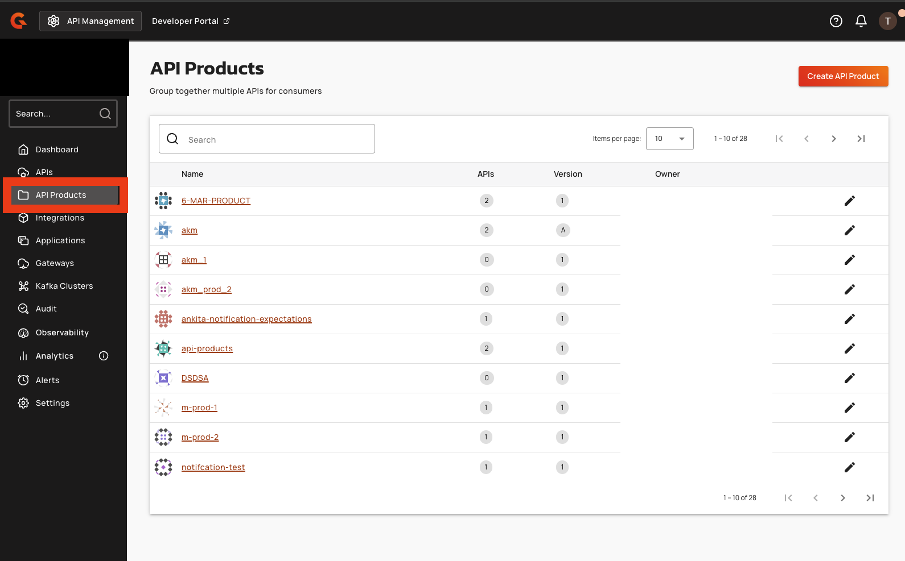
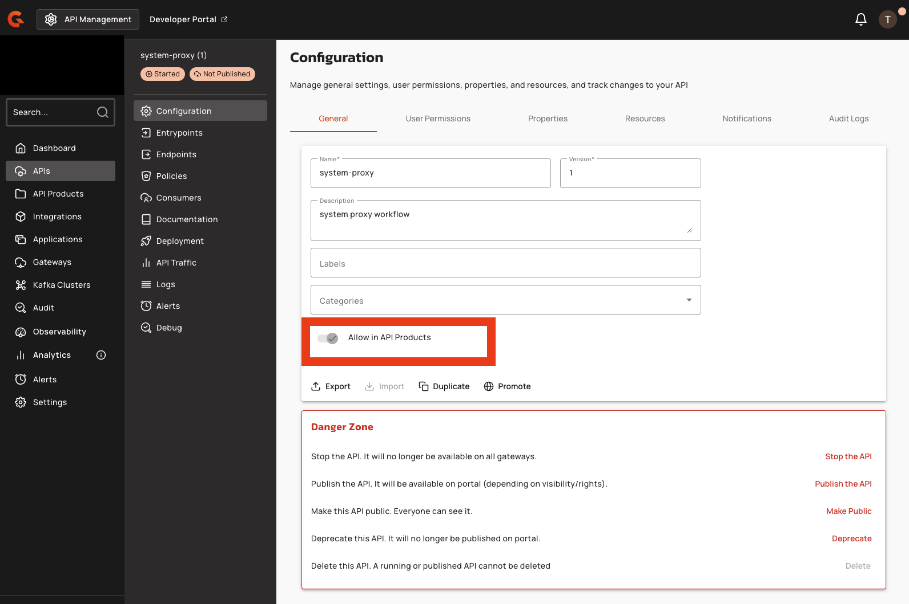
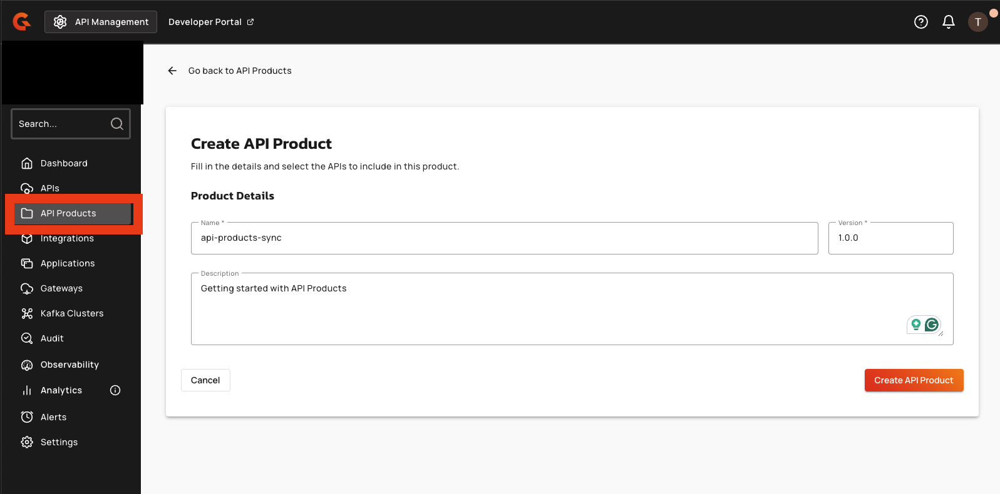
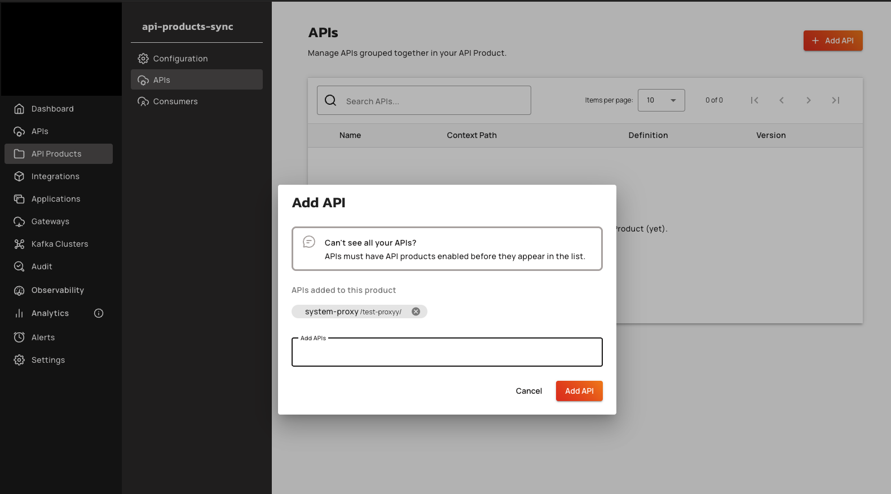
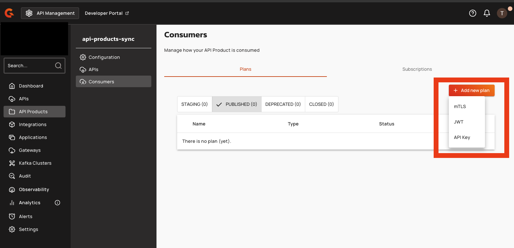
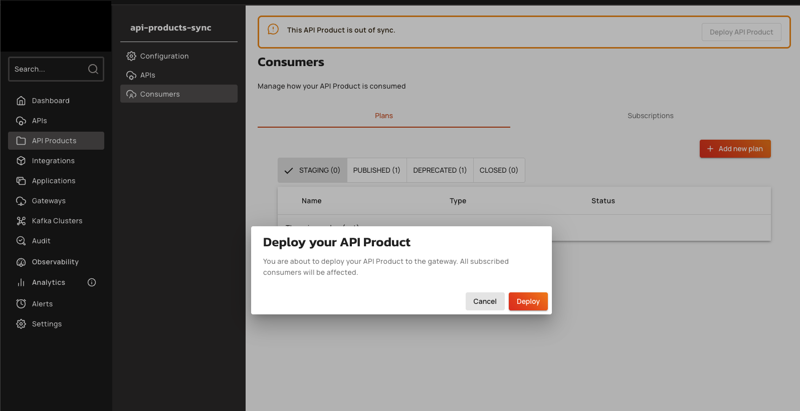

# API Products

## Overview

API Products enable administrators to bundle multiple V4 HTTP Proxy APIs into a single subscribable package with unified access control. Instead of managing subscriptions to individual APIs, organizations define product-level plans that grant access to all APIs within the product.

This feature requires an Enterprise Universe tier license.

<figure><figcaption>
API Products list page in the APIM Console
</figcaption></figure>

## What is an API Product?

An API Product is an environment-level resource that groups V4 HTTP Proxy APIs under a single subscription model. Each product has:

- A unique name within its environment (name comparison is case-sensitive, so "My Product" and "my product" are treated as different names)
- A version
- An optional description
- Product-level plans (API Key, JWT, or mTLS only — Keyless and OAuth plans are not supported)
- Product-level subscriptions

## How APIs, products, plans, and subscriptions relate

An API Product groups one or more V4 HTTP Proxy APIs. Each API Product has its own plans and subscriptions, separate from the plans and subscriptions of the individual APIs it contains.

APIs within a product retain their own plans and subscriptions. Consumers can subscribe to an individual API's plans independently of the product, and existing API-level subscriptions remain active when an API is added to a product.

An API can belong to multiple products simultaneously.

### Gateway subscription validation order

When a request reaches the gateway, the gateway validates subscriptions in the following priority order:

1. The gateway checks the request against the API Product plan subscription first.
2. If no valid API Product subscription exists, the gateway falls back to validating against the individual API plan.

API Product plans take priority, but access through API-level plans is still possible when no product-level subscription applies.

## API eligibility

Only V4 HTTP Proxy APIs with the **Allow in API Products** toggle enabled can be added to API Products. This toggle:

- Only appears on V4 HTTP Proxy APIs — it is not visible on V2 APIs, V4 Message APIs, V4 Kafka APIs, or any other non-HTTP Proxy type
- Defaults to `true` for new V4 HTTP Proxy APIs created in version 4.11.0 or later
- Defaults to `false` for existing V4 HTTP Proxy APIs created before version 4.11.0
- Is unavailable for read-only APIs (for example, Kubernetes-managed APIs)
- Cannot be disabled once an API is included in a product (the toggle is greyed out with the tooltip "API is currently used in API Products")

### Enable an API for use in API Products

1. In the APIM Console, select **APIs** in the left sidebar.
2. Open a V4 HTTP Proxy API.
3. On the **General Info** page, locate the **Allow in API Products** toggle near the bottom of the form.
4. Enable the toggle.
5. Click **Save** to apply the change.

<figure><figcaption>
"Allow in API Products" toggle on the API General Info page
</figcaption></figure>

## Prerequisites

- Gravitee APIM Enterprise license with Universe tier
- Environment-level permissions for API Product management (`api_product-definition-*`)
- V4 HTTP Proxy APIs with the **Allow in API Products** toggle enabled

## Create an API Product

1. In the APIM Console, select **API Products** in the left sidebar.
2. Click **Create API Product**.
3. Enter a unique **Name** for the product. Names are case-sensitive — "My Product" and "my product" are treated as different names.
4. Enter a **Version** number.
5. Optionally, enter a **Description**.
6. Click **Create API Product**.

<figure><figcaption>
Create API Product form
</figcaption></figure>

## Edit an API Product

1. Open the API Product and select **Configuration** in the left sidebar.
2. Update the **Name**, **Version**, or **Description** fields as needed.
3. A save bar appears at the bottom of the page when changes are detected. Click **Save** to apply the changes, or click **Reset** to discard them.

## Add APIs to a product

1. Open the API Product and select **APIs** in the left sidebar.
2. Click **Add API**.
3. In the **Add API** dialog, search for and select the APIs to add. Only V4 HTTP Proxy APIs with the **Allow in API Products** toggle enabled appear in the search results.
4. Click **Add API**.


If an expected API does not appear in the search results, verify that the **Allow in API Products** toggle is enabled on the API's General Info page.


<figure><figcaption>
Add API dialog for an API Product
</figcaption></figure>

## Remove an API from a product

1. Open the API Product and select **APIs** in the left sidebar.
2. In the APIs list, click the trash icon next to the API to remove.
3. In the confirmation dialog, click **Yes, remove it**.

## Remove all APIs from a product

1. Open the API Product and select **Configuration** in the left sidebar.
2. Scroll to the **Danger Zone** section at the bottom of the page.
3. Click **Remove APIs**.
4. In the confirmation dialog, click **Yes, remove them**.

## Create a plan for an API Product

1. Open the API Product and select **Consumers** in the left sidebar, then select the **Plans** tab.
2. Click the **+** button and select a plan type: **API Key**, **JWT**, or **mTLS**.
3. Configure the plan name and settings. The plan creation wizard guides through the required configuration steps. Use the **Next** and **Back** buttons to navigate between steps.
4. Click **Save** on the final step to create the plan.
5. The plan is created in **Staging** status. To activate it, proceed to the next section.

Keyless and OAuth plan types are not available for API Products.

<figure><figcaption>
Plan type selection for an API Product
</figcaption></figure>

## Manage plan lifecycle

Plans for API Products follow a lifecycle: **Staging** → **Published** → **Deprecated** → **Closed**.

### Publish a plan

Publishing a plan makes it available for subscriptions.

1. Open the API Product and select **Consumers > Plans**.
2. On the plan row, select the **Publish** action.
3. In the confirmation dialog, click **Publish**.

### Deprecate a plan

Deprecating a plan prevents new subscriptions while maintaining existing ones.

1. On the plan row, select the **Deprecate** action.
2. In the confirmation dialog, click **Deprecate**.

### Close a plan

Closing a plan is irreversible and removes it from active use.

1. On the plan row, select the **Close** action.
2. In the confirmation dialog, type the plan name to confirm, then click **Yes, close this plan.**

### Reorder plans

To change the order in which plans are evaluated, drag and drop plans in the list to the desired position.

## Deploy an API Product

After creating plans and adding APIs, deploy the API Product to make it available at the gateway. When the product is out of sync, a warning banner displays "This API Product is out of sync." with a **Deploy API Product** button.

1. Click **Deploy API Product** in the banner.
2. In the **Deploy your API Product** dialog, click **Deploy**.

Deployment requires an active Enterprise Universe tier license.

<figure><figcaption>
Deploy API Product confirmation dialog
</figcaption></figure>

## Create a subscription

1. Open the API Product and select **Consumers** in the left sidebar, then select the **Subscriptions** tab.
2. Click **Create a subscription**.
3. Select a published plan and an application.
4. Confirm the subscription.

The subscription is created with a status based on the plan's validation setting:

- **AUTO** validation: the subscription is immediately **Accepted**
- **MANUAL** validation: the subscription is set to **Pending** and requires approval

### Filter subscriptions

The subscription list provides filters to narrow results by:

- **Plan** — filter by one or more plans
- **Application** — search for a specific application
- **Status** — filter by status (Accepted, Paused, Pending, Rejected, or Closed)
- **API Key** — search by API key value

Click **Reset filters** to clear all active filters.

<figure><figcaption>
API Product subscriptions list with filters
</figcaption></figure>

### Manage subscription lifecycle

To manage an existing subscription, click the edit icon on the subscription row. The following actions are available depending on the subscription status:

- **Accept** — approve a pending subscription
- **Reject** — reject a pending subscription
- **Pause** — temporarily suspend an accepted subscription
- **Resume** — reactivate a paused subscription
- **Close** — permanently close a subscription
- **Transfer** — move the subscription to a different plan

## Delete an API Product

Deleting an API Product is irreversible.

1. Open the API Product and select **Configuration** in the left sidebar.
2. Scroll to the **Danger Zone** section at the bottom of the page.
3. Click **Delete API Product**.
4. In the confirmation dialog, type the name of the API Product to confirm, then click **Yes, delete it**.

## P0 limitations

The initial release of API Products has the following limitations:

- No OAuth or Keyless plans
- No policies or flows at the product level

## Next steps

- [Consuming APIs via API Products](consuming-api-products.md)
- [API Products restrictions and licensing](restrictions-and-licensing.md)
- [Managing API Products via Management API](manage-api-products-via-management-api.md)
