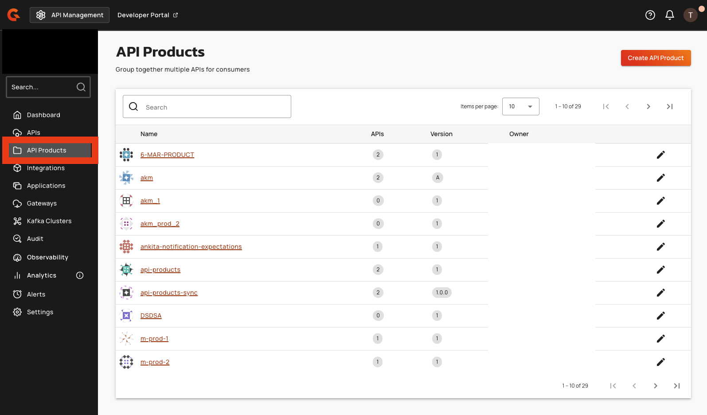
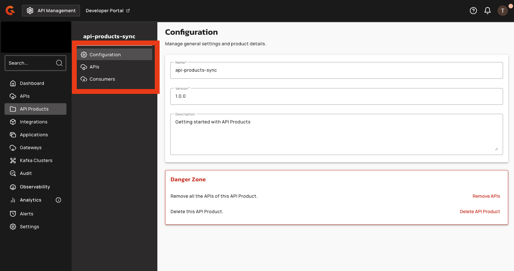

# API Products Console UI reference

## Navigation

An **API Products** navigation item appears in the APIM Console left sidebar. Selecting it opens the API Products list page with the heading "API Products" and the subtitle "Group together multiple APIs for consumers."

<figure><figcaption>
"API Products" navigation item in the APIM Console sidebar
</figcaption></figure>

## API Product detail page

After opening an API Product, the detail page displays a left sidebar with the following menu items:

| Menu item | Description |
|:----------|:------------|
| **Configuration** | Edit the API Product name, version, and description |
| **APIs** | Add or remove APIs from the API Product |
| **Consumers** | Manage plans and subscriptions (contains **Plans** and **Subscriptions** tabs) |

<figure><figcaption>
API Product detail page with navigation menu
</figcaption></figure>

## Configuration tab

The **Configuration** tab displays editable fields for:

- **Name** — required, unique within the environment
- **Version** — required
- **Description** — optional

A danger zone at the bottom of the page provides options to remove all APIs from the API Product or delete the API Product entirely.

## APIs tab

The **APIs** tab lists all APIs included in the API Product with the following columns: Name, Context Path, Definition, and Version.

- Click **Add API** to open the **Add API** dialog and search for eligible APIs.
- The info banner in the dialog states: "APIs must have API products enabled before they appear in the list."
- To remove an API, click the trash icon with the tooltip "Remove from API Product."

## Plans tab

The **Plans** tab (under **Consumers**) lists all plans for the API Product. Available plan types for creation:

- **API Key**
- **JWT**
- **mTLS**

Keyless and OAuth plan types aren't available.

Plan lifecycle actions include **Publish**, **Deprecate**, and **Close**. Plans are reorderable via drag and drop.

## Subscriptions tab

The **Subscriptions** tab (under **Consumers**) lists all subscriptions to the API Product's plans. Each subscription displays:

- Application name
- Plan name
- Security type
- Status badge (Accepted, Closed, Paused, Pending, or Rejected)
- Created date

## Deployment banner

When an API Product has unsaved changes that require redeployment, a warning banner displays: "This API Product is out of sync." with a **Deploy API Product** button. Clicking the button opens the **Deploy your API Product** confirmation dialog.

## Permissions

Access to API Product features is gated by the following permission scopes:

| Permission | Access |
|:-----------|:-------|
| `API_PRODUCT-DEFINITION` READ | View Configuration and APIs tabs |
| `api_product-definition-u` | Edit configuration, deploy |
| `API_PRODUCT-PLAN` READ | View Plans tab |
| `api_product-plan-u` | Create, publish, deprecate, close, reorder plans |
| `api_product-subscription-r` | View Subscriptions tab |
