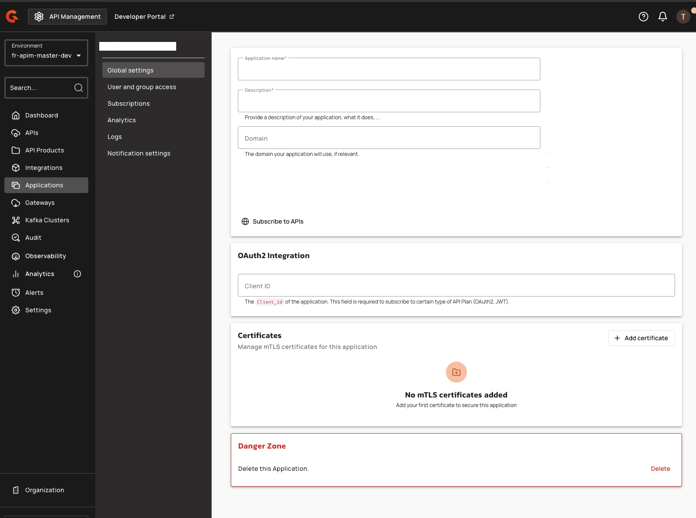

# Global Settings

## Overview

An application's **Global settings** include general application details and a Danger Zone for executing functional and sometimes irreversible actions.

## Configure global settings

To configure global settings, complete the following steps:

1. [create-an-application.md](create-an-application.md "mention").
2. Log in to your APIM Console, and then click **Applications**.
3.  Find the application you want to configure. Use the radio buttons to select either Active or Archived applications. Next, either scroll through the paginated lists of available applications or use the search field to find the application by name.

    <figure><figcaption></figcaption></figure>
4. Click on the application you want to configure.
5.  Click on **Global settings** in the Application menu.

    <figure><figcaption></figcaption></figure>


Some general details are common to all applications, and others vary by application type.


## Certificates

The **Certificates** section of the **Global settings** page lists the client certificates of the application. An application needs at least one active certificate to subscribe to an [mTLS plan](../plans/mtls.md), and it holds several certificates at once so that you rotate them without downtime. For the statuses, the grace period, and the automatic revocation, see [mTLS certificate management for applications](mtls-certificate-management-for-applications-overview-and-concepts.md).

<figure><figcaption>
Certificates section of the Global settings page
</figcaption></figure>

The section shows one row per certificate.

| Column                   | Description                                                                                                                                                   |
| ------------------------ | ------------------------------------------------------------------------------------------------------------------------------------------------------------- |
| **Name**                 | The name given to the certificate when it was added.                                                                                                          |
| **Uploaded**             | When the certificate was added.                                                                                                                               |
| **Expiry date and time** | The expiration date of the certificate itself.                                                                                                                |
| **Status**               | **Active**, **Scheduled**, or **Expired**. An active certificate whose end date is 15 days away or less shows the number of days left instead of **Active**.  |
| **Actions**              | **View details** shows the name, subject, issuer, and expiration of the certificate. **Revoke certificate** deletes the certificate after a confirmation.     |

To add a certificate, click **Add certificate** and follow the steps in [How to add a client certificate](../plans/mtls.md#how-to-add-a-client-certificate). Users who aren't allowed to update the application don't see the **Add certificate** button. When the application is archived or managed by the Gravitee Kubernetes Operator, the section is read-only: neither **Add certificate** nor **Revoke certificate** is shown.

## Application management

Initially, only the application’s creator can view and manage the application. By default, APIM includes three membership roles:

<table><thead><tr><th width="228">Role</th><th>Description</th></tr></thead><tbody><tr><td><strong>Primary owner</strong></td><td>The creator of the application. Can perform all possible API actions.</td></tr><tr><td><strong>Owner</strong></td><td>A lighter version of the primary owner role. Can perform all possible actions except delete the application.</td></tr><tr><td><strong>User</strong></td><td>A person who can access the application in read-only mode and use it to subscribe to an API.</td></tr></tbody></table>


Only users with the required permissions can manage application members. See [User Management](../../configure-and-manage-the-platform/manage-organizations-and-environments/user-management.md).


### Delete and restore applications

To delete an application, the primary owner must:

1. Log in to your APIM Console
2. Select **Applications** from the left nav
3. Select your application
4. Select **Global Settings** from the inner left nav
5.  In the **Danger Zone**, click **Delete**

    <figure><figcaption></figcaption></figure>

* A deleted application has a status of `ARCHIVED`, meaning:
  * The link to the primary owner of the application is deleted.
  * Its subscriptions are closed. In the case of a subscription to an API Key plan, the keys are revoked.
  * Notification settings are deleted.
* An `ADMIN`can restore applications in the APIM Console and will become the primary owner of the application
  * An application’s subscriptions will be restored with `PENDING` status. The API publisher must manually reactivate previous subscriptions.
