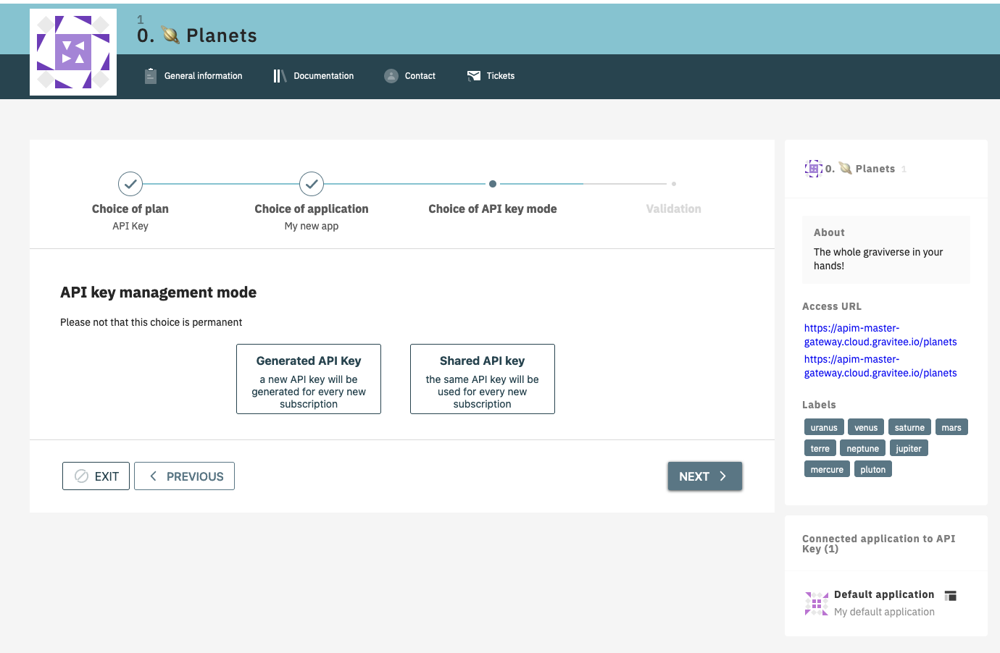
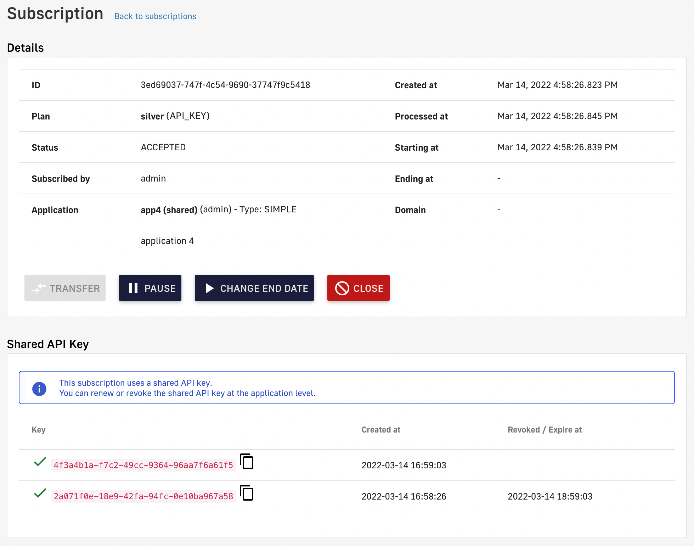
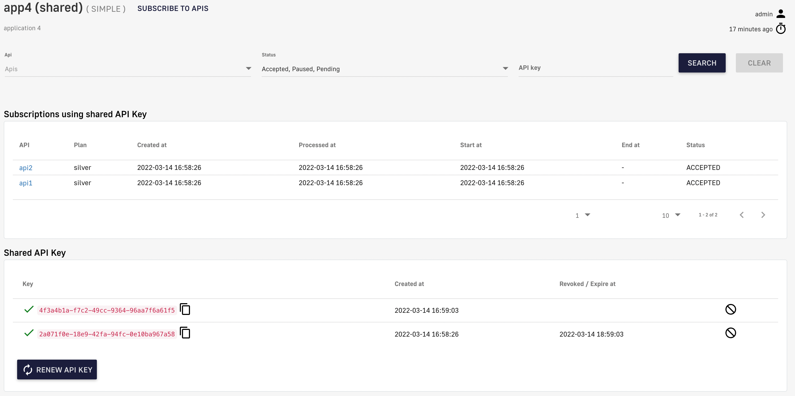
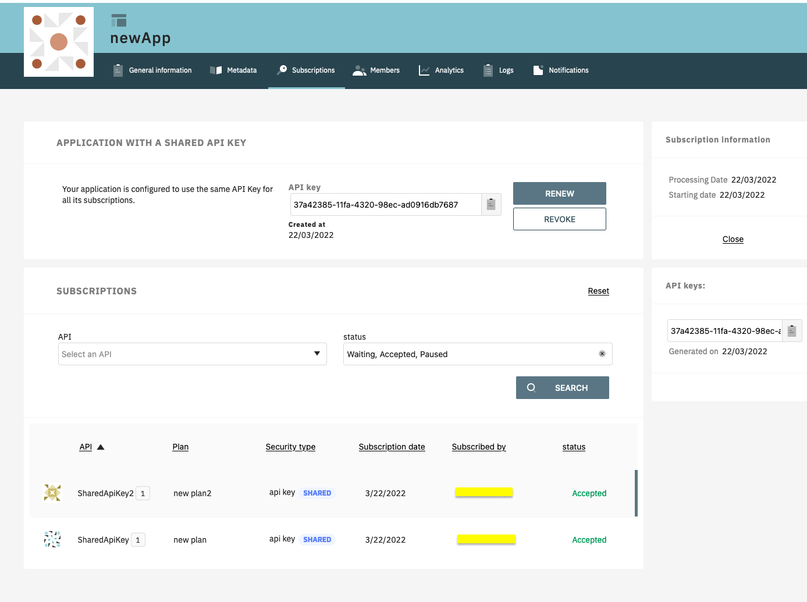

# API Key

## Overview

The API key authentication type enforces verification of API keys during request processing, allowing only applications with approved API keys to access an API. This plan type ensures that API keys are valid, i.e., not revoked or expired, and are approved to consume the specific resources associated with the API.

## Configuration

An API Key plan offers only basic security, acting more like a unique identifier than a security token.

<figure><figcaption></figcaption></figure>

* **Propagate API Key to upstream API:** Toggle ON to ensure the request to the backend API includes the API key header sent by the API consumer. This is useful for backend APIs that already have integrated API key authentication.
* **Additional selection rule:** Allows you to use Gravitee Expression Language (EL) to filter plans of the same type by contextual data (request headers, tokens, attributes, etc.). For example, if there are multiple API key plans, you can set different selection rules on each plan to determine which plan handles each request.

## API Key generation

By default, API keys are generated as random values for each subscription, but Gravitee also offers custom API key generation and shared API key generation. Both of these settings can be enabled at the environment level:

1. Log in to your APIM Console
2. Select Settings from the left nav
3.  Select Settings from the inner left nav:

    <figure><figcaption>
API key generation settings
</figcaption></figure>

### Custom API key

You can specify a custom API key for an API Key plan. This is useful when you want to migrate to APIM without changing a pre-defined API key. When prompted, you can choose to provide your custom API key or let APIM generate one for you by leaving the field empty.

The custom API key must have between 8 and 128 characters and be URL-compliant. `^ # % @ \ / ; = ? | ~ ,`and the 'space' character are invalid.

You can provide a custom API key when:

*   Creating a subscription

    <figure><figcaption>
Manually create a subscription
</figcaption></figure>
* Accepting a subscription
*   Renewing a subscription

    <figure><figcaption>
Renew a subscription
</figcaption></figure>

### Shared API key

The shared API key mode allows consumers to reuse the same API key across all API subscriptions of an application. On their application's second subscription, the consumer is asked to choose between reusing their key across all subscriptions or generating one different API key for each subscription (default).

**API key modes**

Every application has an API key mode that controls this behavior. The mode is exposed as `api_key_mode` in the Portal API and the Management API:

| Mode | Description |
|:-----|:------------|
| `UNSPECIFIED` | The default mode of a new application when shared API key mode is enabled at the environment level. The consumer hasn't chosen a key type yet. |
| `EXCLUSIVE` | Each subscription of the application gets its own API key. This is the default behavior when shared API key mode is disabled at the environment level. |
| `SHARED` | All API Key plan subscriptions of the application use the same API key. |

The mode of an application only changes while it's `UNSPECIFIED`. After the mode is set to `SHARED` or `EXCLUSIVE`, it's locked, and the API rejects any attempt to change it with an HTTP `400` error. Changing the mode to `SHARED` also requires the **Allow to share API Key on an application** environment setting to be enabled.

**Shared API key limitations**

API keys can only be shared across API Key plans that belong to distinct Gateway APIs. If you attempt to subscribe to two API Key plans on the same Gateway API, no prompt will be made to choose the application API key type and the default mode will be used automatically.

<figure><figcaption></figcaption></figure>

<figure><figcaption></figcaption></figure>

To select the API key type, the shared API key mode must be [enabled](api-key.md#api-key-generation) before creating an application. To enable this option, create a new application and subscribe to two API Key plans.

If shared API key mode is disabled, applications that have already been configured to use a shared key will continue to do so, but consumers will no longer be asked to choose between modes on their second subscription.

#### Migrate an application to a shared custom API key

To migrate applications from another platform without changing the API key that consumers already use, combine a custom API key with the shared API key mode. Provide the custom key on the application's first subscription, and the shared mode then reuses that key for every later subscription:

1. Enable **Allow custom API Key** and **Allow to share API Key on an application** in the environment settings, as described in [API Key generation](api-key.md#api-key-generation).
2. Create the application. A new application starts with the `UNSPECIFIED` API key mode when you don't set one.
3. Create the application's first subscription to an API Key plan, and provide the custom API key. Use the Console or the Management API for this step: the Management API v2 create-subscription operation accepts a `customApiKey` field in the request body, and the legacy Management API create-subscription operation accepts a `customApiKey` query parameter. The Portal API doesn't accept a custom API key at subscription time.
4. Update the application's `api_key_mode` from `UNSPECIFIED` to `SHARED`, for example with the Portal API update-application operation.
5. Subscribe the application to other API Key plans. Each new subscription reuses the application's existing key, so the custom API key becomes the application's shared API key.


Renewing a shared API key always generates a new random value, and the renew operations don't accept a custom API key. Set the custom value on the first subscription before you switch the application to the `SHARED` mode.


#### Modifying shared API keys

A shared API key may be used to call APIs that are owned by other API publishers. Consequently:

* Shared API keys cannot be edited from an API publisher's subscriptions
*   API publishers can read shared API keys, but cannot renew or revoke them

    <figure><figcaption>
Shared API key administration limitations
</figcaption></figure>
*   Shared API keys can only be renewed/revoked by the application owner, from the subscription view of their APIM Console or Developer Portal

    <figure><figcaption>
Manage shared API keys in APIM Console
</figcaption></figure>

    <figure><figcaption>
Manage shared API keys in the Developer Portal
</figcaption></figure>
