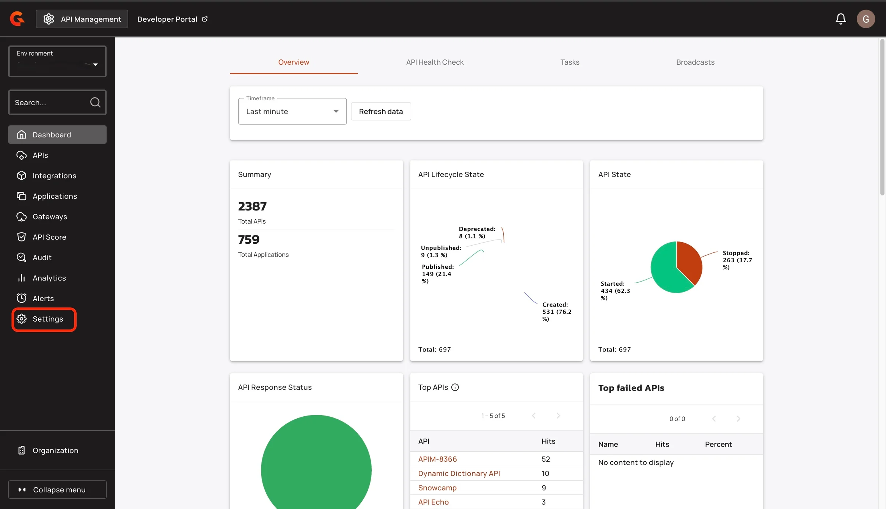
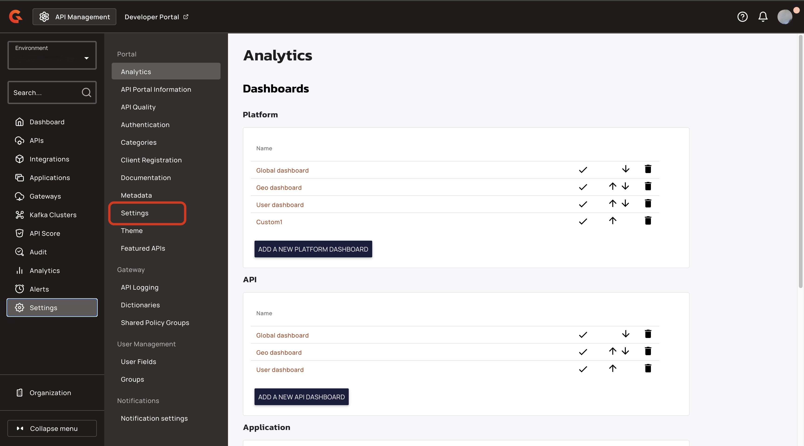
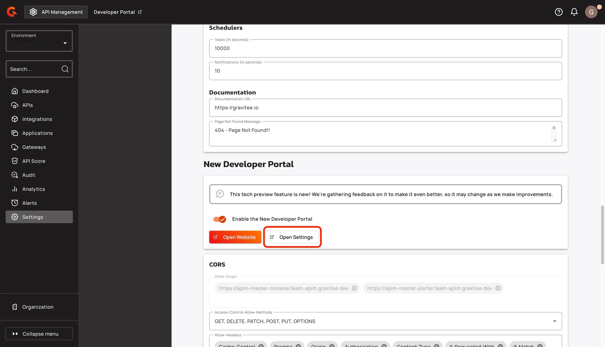
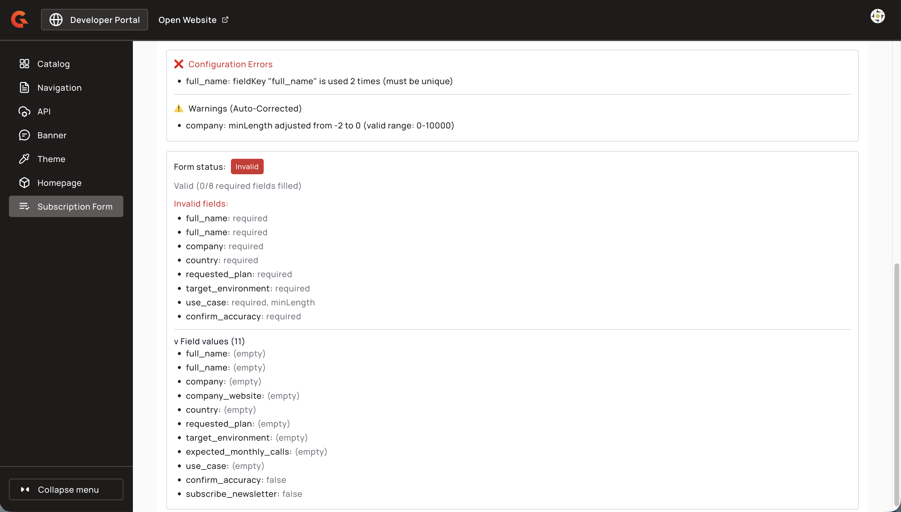
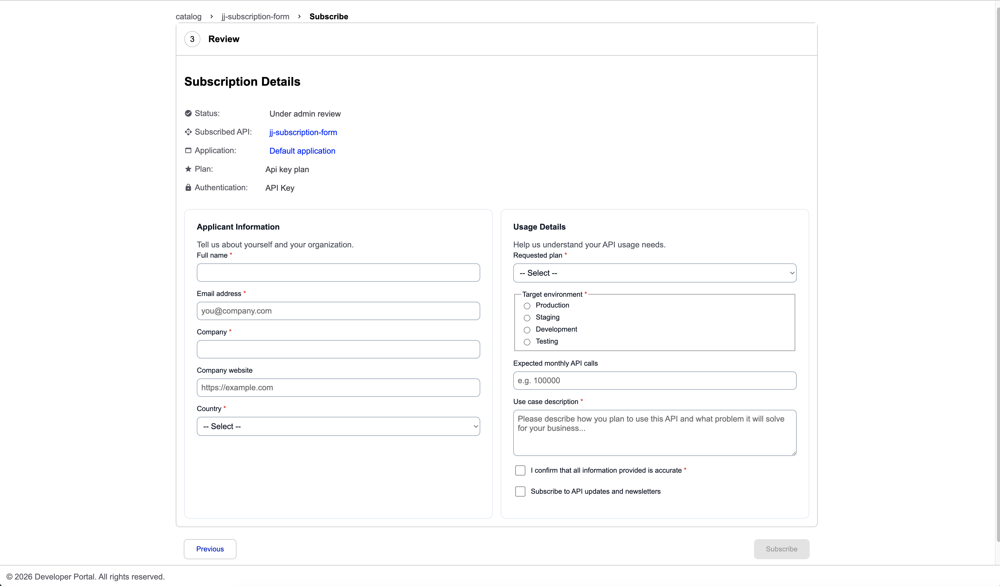

# Creating and managing subscription forms

## Creating subscription forms

1. Navigate to **Portal Settings > Subscription Form** in the Management Console.

    <figure><figcaption></figcaption></figure>

    <figure><figcaption></figcaption></figure>

    <figure><figcaption></figcaption></figure>

    <figure><figcaption></figcaption></figure>

2. Write form content using the GMD form editor. The live preview pane displays the rendered form in real time.

    <figure><figcaption></figcaption></figure>

3. Toggle the **Visible to API consumers** switch to control whether the form appears in the Developer Portal.

    <figure><figcaption></figcaption></figure>

4. Click **Save** to persist changes.

An unsaved changes guard prevents accidental navigation away from unsaved edits. Forms are scoped to the environment level — each environment has one subscription form.


Subscription forms aren't displayed for Keyless plans. The form only appears during the subscription checkout flow when the selected plan requires authentication (API Key, OAuth2, JWT, or mTLS).


<figure><figcaption></figcaption></figure>

## GMD form components

Use the following GMD components to build subscription forms:

- **`gmd-input`** — Single-line text input. Supports `minLength`, `maxLength`, and `pattern` validation.
- **`gmd-textarea`** — Multi-line text input. Supports `minLength`, `maxLength`, and configurable `rows`.
- **`gmd-select`** — Dropdown selection. Define choices with the `options` attribute.
- **`gmd-checkbox`** — Checkbox field.
- **`gmd-radio`** — Radio button selection. Define choices with the `options` attribute.

All components support `fieldKey`, `name`, `label`, `value`, `required`, and `disabled` attributes. The `fieldKey` attribute determines the metadata key stored with the subscription.


`minLength` and `maxLength` validation is only available on `gmd-input` and `gmd-textarea`. Dropdown, checkbox, and radio components don't support length validation.


For a complete attribute reference, see [Subscription form feature overview](subscription-form-feature-overview.md#supported-form-components).

### Verifying the subscription form

To verify the form appears correctly:

1. Enable the form using the **Visible to API consumers** toggle.
2. Open your Developer Portal and navigate to an API.
3. Start a subscription — the custom form should appear on the right side of the subscription checkout flow.

<figure><figcaption></figcaption></figure>

<figure><figcaption></figcaption></figure>

## Managing subscription forms

### Updating form content

1. Edit the GMD content in the form editor.
2. Click **Save** to persist changes.

### Enabling or disabling forms

Toggle the **Visible to API consumers** switch in the Console, or call the following Management API endpoints:

* `POST /environments/{envId}/subscription-forms/{subscriptionFormId}/_enable`
* `POST /environments/{envId}/subscription-forms/{subscriptionFormId}/_disable`

When a form is disabled, it remains accessible via Management API (`GET /environments/{envId}/subscription-forms`) but returns 404 from Portal API (`GET /subscription-form`).

### Subscription metadata

When an API consumer submits a subscription form, the form field values are stored as key-value pairs in the subscription's `metadata` property. Empty values (null, empty strings, whitespace-only) are filtered before storage.

Subscription metadata is displayed in the subscription details pages (both API subscriptions and application subscriptions) using a read-only viewer.

## Management API v2 reference

### GET `/environments/{envId}/subscription-forms`

Retrieves the subscription form for the environment, including disabled forms.

**Response:**

```json
{
  "id": "string",
  "gmdContent": "string",
  "enabled": true
}
```

**Permissions:** `environment-metadata-r`

### PUT `/environments/{envId}/subscription-forms/{subscriptionFormId}`

Updates the subscription form GMD content.

**Request body:**

```json
{
  "gmdContent": "string"
}
```

**Response:** `SubscriptionForm` object

**Permissions:** `environment-metadata-u`

### POST `/environments/{envId}/subscription-forms/{subscriptionFormId}/_enable`

Enables the subscription form for API consumers.

**Response:** `SubscriptionForm` object with `enabled: true`

**Permissions:** `environment-metadata-u`

### POST `/environments/{envId}/subscription-forms/{subscriptionFormId}/_disable`

Disables the subscription form for API consumers.

**Response:** `SubscriptionForm` object with `enabled: false`

**Permissions:** `environment-metadata-u`

### Portal API

#### GET `/subscription-form`

Retrieves the subscription form for the current environment. Only returns the form when it exists and is enabled — returns 404 otherwise. The Portal API response doesn't include the `id` or `enabled` fields.

**Response:**

```json
{
  "gmdContent": "string"
}
```

**Authentication:** Required (Portal auth)
