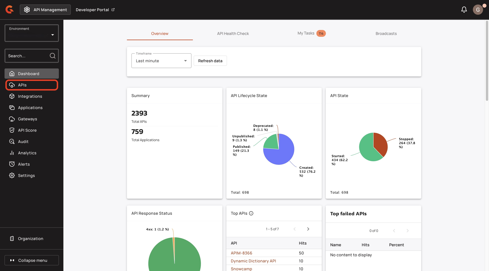
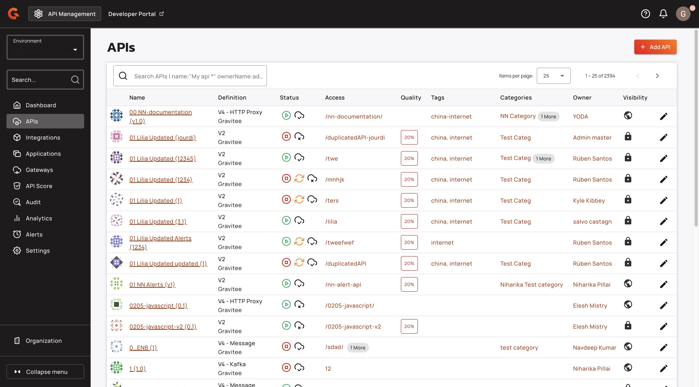
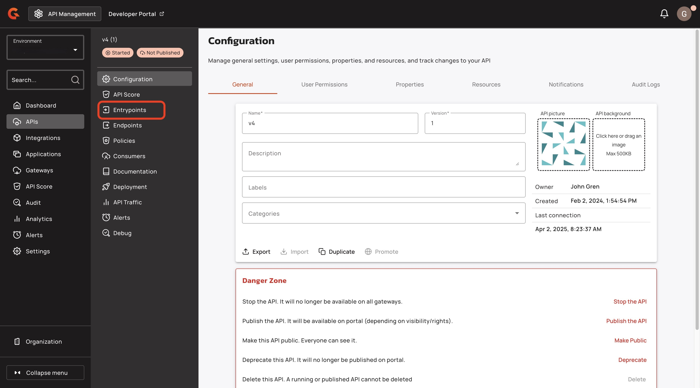
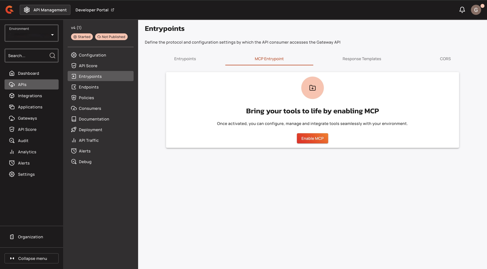
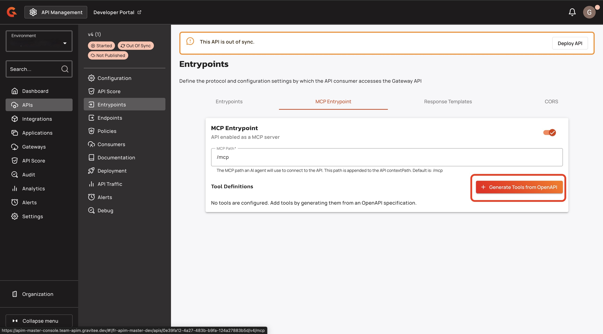
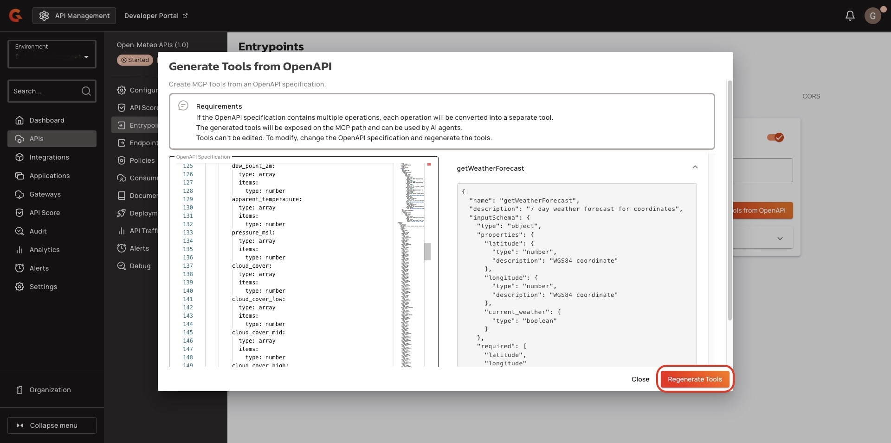
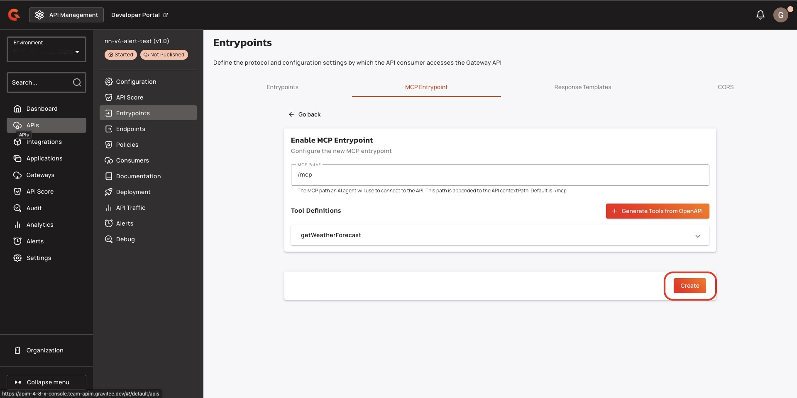
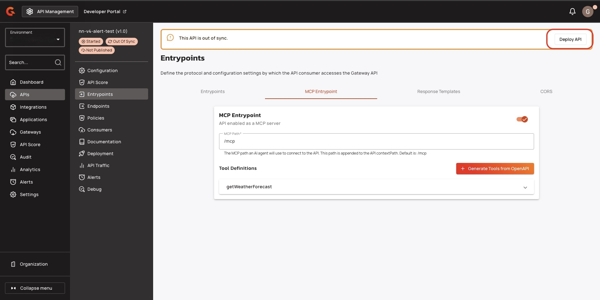
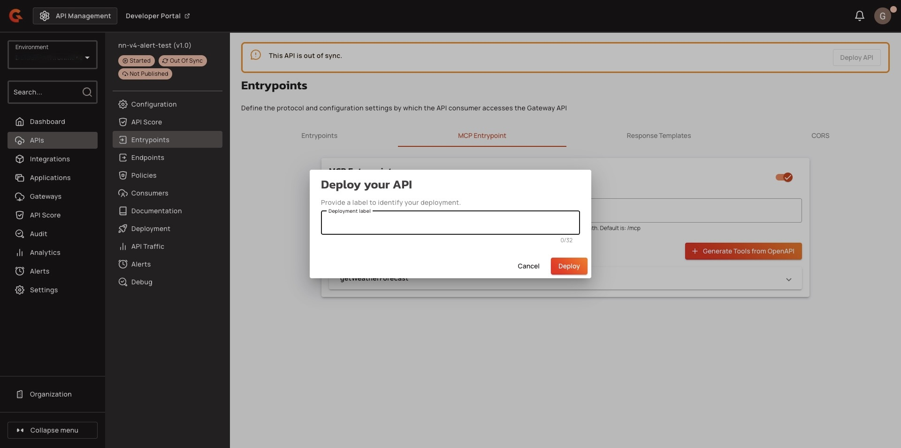

# Convert REST APIs to an MCP Server


This feature only works with v4 proxy APIs.


## Overview


**What is MCP?**\
The Model Context Protocol (MCP) is an emerging standard that enables AI agents to understand and interact with external tools and APIs. It defines a common interface for describing operations, authentication, and capabilities, which connects LLMs to real-world services (APIs).


**Effortlessly transform your existing RESTful APIs into powerful, AI-ready tools for AI agents, without writing a single line of new code.** With just your OpenAPI Specification (OAS) as input, Gravitee automatically interprets and exposes your API operations as structured, actionable tools through the embedded MCP server running at the Gateway level.

This seamless process **allows AI agents to discover and invoke your APIs intelligently**, enabling use cases like automation, data analysis, and decision-making in AI-driven environments. There's no need for custom wrappers or additional configuration; your documented API becomes instantly accessible to AI agents.

In this guide, you’ll learn how to publish and expose your API operations through the Gravitee MCP server, making your APIs discoverable and usable by AI agents while preserving governance, observability, and control.

## Prerequisites

* Create a v4 proxy API. For more information about creating a v4 proxy API, see [v4-api-creation-wizard.md](../create-and-configure-apis/create-apis/v4-api-creation-wizard.md "mention").
* The OpenAPI Specification describing your API, to generate the MCP tools definition.

## Deploy your API as an MCP Server

1.  From the **Dashboard**, click **APIs**.

    <figure><figcaption></figcaption></figure>
2.  Find the API that you want to convert into an MCP Server.

    <figure><figcaption></figcaption></figure>
3.  From the API menu, click **Entrypoints**.

    <figure><figcaption></figcaption></figure>
4. From the **Entrypoints** screen, click **MCP Entrypoint**.
5.  Click **Enable MCP**.

    <figure><figcaption></figcaption></figure>
6.  Click **+ Generate Tools from OpenAPI**.

    <figure><figcaption></figcaption></figure>
7.  In the **Generate Tools from OpenAPI** pop-up window, add your OpenAPI specification, and then click **Regenerate Tools**.

    <figure><figcaption></figcaption></figure>
8.  Click **Create**.

    <figure><figcaption></figcaption></figure>
9.  Click **Deploy API**.

    <figure><figcaption></figcaption></figure>
10. (Optional) In the **Deploy your API** pop-up window, enter a deployment label.
11. Click **Deploy**. You receive the message **API successfully deployed**.

    <figure><figcaption></figcaption></figure>

## How the OpenAPI Specification maps to MCP tools

Gravitee generates one MCP tool for each operation in the OpenAPI Specification. The quality of the generated tools depends on the specification, because AI agents select and call a tool based on its name and description.

Gravitee maps each operation as follows:

<table>
    <thead>
        <tr>
            <th width="220">MCP tool field</th>
            <th>Source in the OpenAPI Specification</th>
        </tr>
    </thead>
    <tbody>
        <tr>
            <td>Tool name</td>
            <td>The operation's <code>operationId</code>. When the operation has no <code>operationId</code>, Gravitee derives the name from the HTTP method and the path.</td>
        </tr>
        <tr>
            <td>Tool description</td>
            <td>The operation's <code>summary</code> and <code>description</code>, joined together. When the operation has neither, Gravitee falls back to a generic description built from the HTTP method and the path.</td>
        </tr>
        <tr>
            <td>Tool input schema</td>
            <td>The operation's path parameters, query parameters, and header parameters, followed by the JSON request body schema. Parameters declared once for a whole path apply to every operation on that path.</td>
        </tr>
        <tr>
            <td>Tool output schema</td>
            <td>The JSON response body schema and the response headers of the successful (<code>2xx</code>) response.</td>
        </tr>
    </tbody>
</table>

Recommended: give every operation an `operationId`, a `summary`, and a `description` in your OpenAPI Specification before you generate the tools. Operations without them produce tools that are named and described only by their HTTP method and path, which gives an AI agent little to reason about.

## Current limitations

* This feature works only with v4 proxy APIs.
* Generating tools replaces the entire set of tools for the API. Gravitee doesn't merge new tools into the tools that already exist.
* The generated tools are read-only in the Console. To change a tool's name, description, or schema, update the source OpenAPI Specification, and then generate the tools again from the updated specification.
* Each tool name is unique. When two operations resolve to the same tool name, Gravitee reports a duplicate name error at generation time. Give those operations distinct `operationId` values in the specification.
