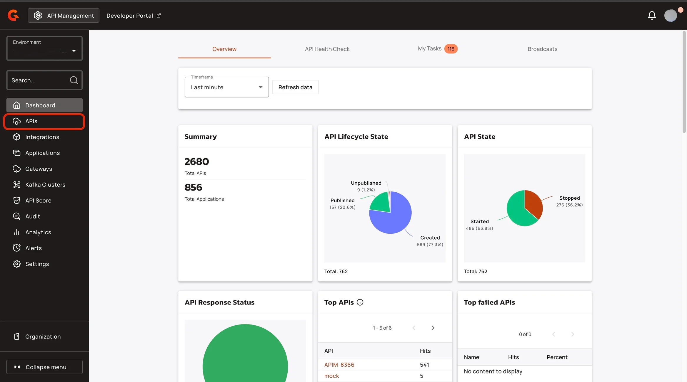
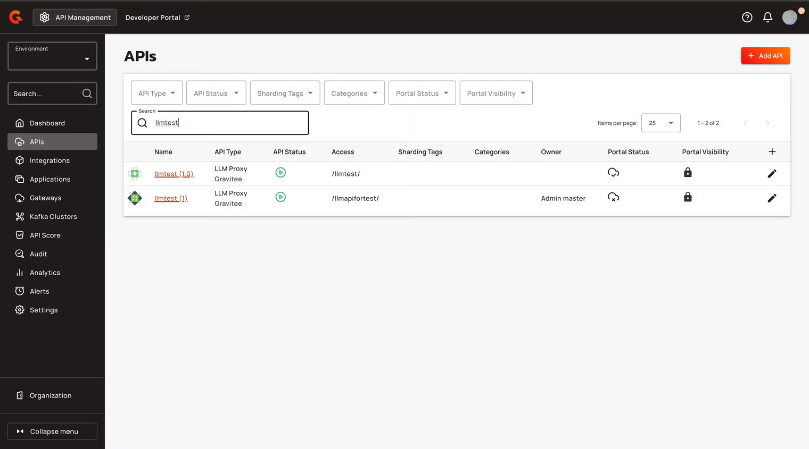
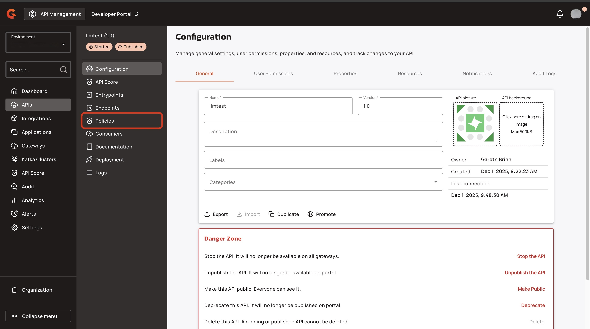
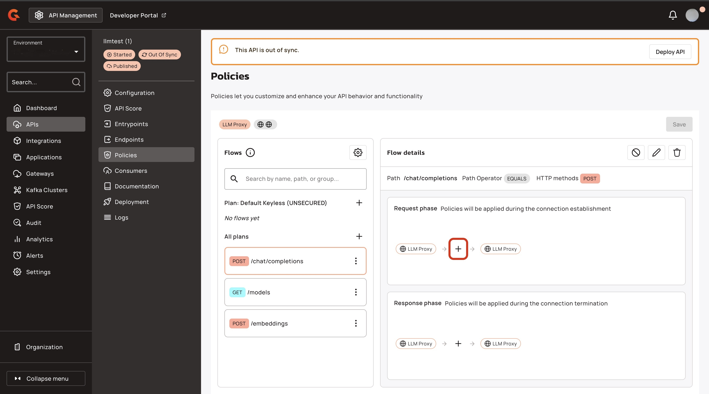
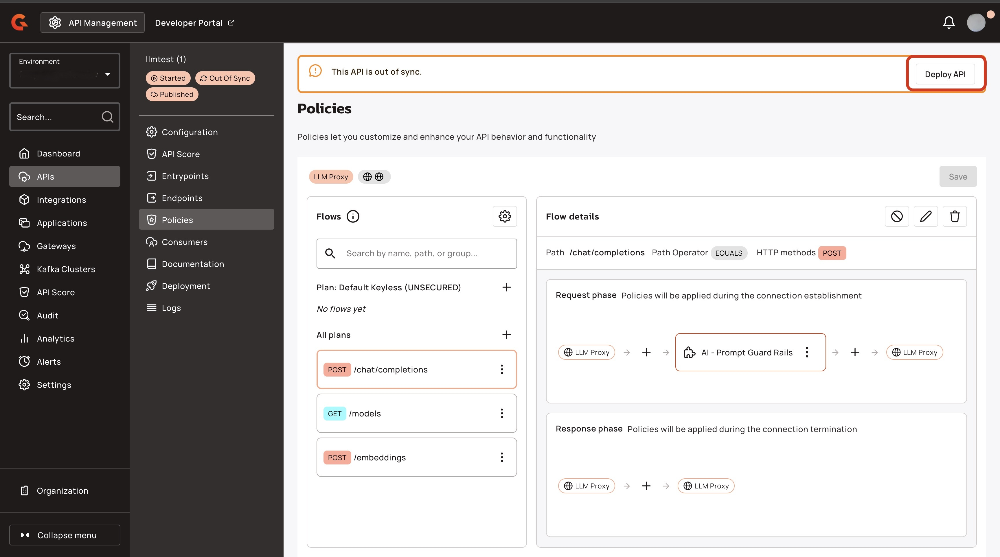
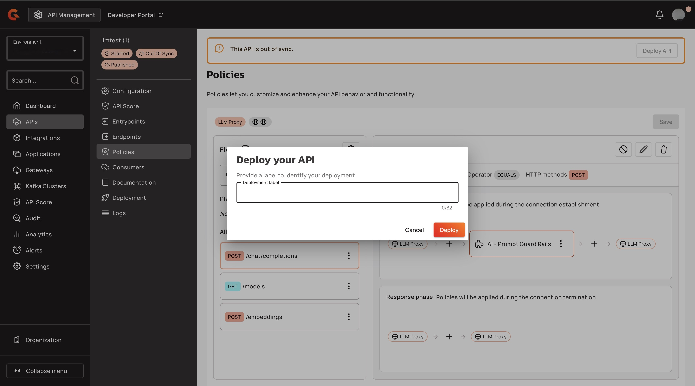

# Override the model at runtime

## Overview

The LLM Proxy routes each request to the model that the client requests. To route a request to a different model without changing the client request, set the `llmproxy.model.override` context attribute in the request phase of a flow. When this attribute is set, the LLM Proxy uses its value instead of the model from the client request. The LLM Proxy routes the request to the endpoint that serves the override model and calls the LLM provider with that model.

The attribute value supports the [Gravitee Expression Language](../../gravitee-expression-language.md), so you can resolve the model at runtime. For example, you can select the model based on a request header.

The LLM Proxy resolves the override as follows:

* If the client request prefixes the model with an endpoint or endpoint group name, for example `llmtest:gpt-5-mini`, the prefix still applies. The override replaces only the model name after the prefix.
* If the resulting model doesn't match any model configured on the API's endpoints, the Gateway returns a `400` response with the error code `model_not_found`.
* If the attribute isn't set, the LLM Proxy uses the model from the client request.

## Prerequisites

* An Enterprise License. For more information about obtaining an Enterprise license, see [enterprise-edition.md](../../introduction/enterprise-edition.md "mention").
* An LLM proxy API. To create one, complete the steps in [proxy-your-llms.md](proxy-your-llms.md "mention").

## Add the Assign attributes policy to your LLM proxy

To override the model at runtime, add the Assign attributes policy to the request phase of your LLM proxy:

1.  From the **Dashboard**, click **APIs**.<br>

    <figure><figcaption></figcaption></figure>
2.  In the **APIs** screen, click your LLM proxy.<br>

    <figure><figcaption></figcaption></figure>
3.  In the **API's menu**, click **Policies**.<br>

    <figure><figcaption></figcaption></figure>
4. In the **Flows** section, select the flow that you want to add the policy to. For example, `POST/chat/completions`.
5.  In the **Request phase** section, click the **+** icon.<br>

    <figure><figcaption></figcaption></figure>
6.  In the **Policies for Request phase** pop-up window, navigate to **Assign attributes**, and then click **Select**.<br>

    <!-- TODO: Screenshot of the Assign attributes policy selected in the Policies for Request phase pop-up window -->
    <figure><figcaption></figcaption></figure>
7. In the **Assign context attributes** section, add an attribute, and then complete the following sub-steps:
   1. In the **Name** field, type `llmproxy.model.override`.
   2.  In the **Value** field, type the name of the model to use, or an Expression Language expression that resolves to it. For example, `{#request.headers['x-target-model']}`.<br>

       <!-- TODO: Screenshot of the Assign attributes policy configured with the llmproxy.model.override attribute -->
       <figure><figcaption></figcaption></figure>
8. Click **Add policy**.
9. Click **Save**.
10. In the **This API is out of sync.** pop-up window, click **Deploy API**.<br>

    <figure><figcaption></figcaption></figure>
11. In the **Deploy your API** pop-up window, click **Deploy**.<br>

    <figure><figcaption></figcaption></figure>

For more information about the policy, see [assign-attributes.md](../../create-and-configure-apis/apply-policies/policy-reference/assign-attributes.md "mention").

## Verification

To verify that the LLM Proxy overrides the model, follow these steps:

1. Call your LLM proxy using the following command:

    ```bash
    curl -X POST \
      https://<GATEWAY_URL>/<CONTEXT_PATH>/chat/completions \
      -H "Content-Type: application/json" \
      -d '{
        "model": "<MODEL_ID>",
        "messages": [
          {
            "role": "user",
            "content": "Hello"
          }
        ]
      }'
    ```

    * Replace `<GATEWAY_URL>` with your Gateway URL.
    * Replace `<CONTEXT_PATH>` with the context path for your LLM proxy. For example, llmtest.
    * Replace `<MODEL_ID>` with a model ID that your LLM proxy serves. For example, `llmtest:gpt-5-mini`.
2. Check the `model` field of the response. The response comes from the override model, and the `model` field contains the model name that the provider returns.

If the LLM Proxy is configured with `injectTokenHeaders` set to `true`, the `X-LLM-Proxy-Model` response header also shows the model that the LLM Proxy resolved. For more information, see [accepted-request-formats.md](accepted-request-formats.md "mention").
