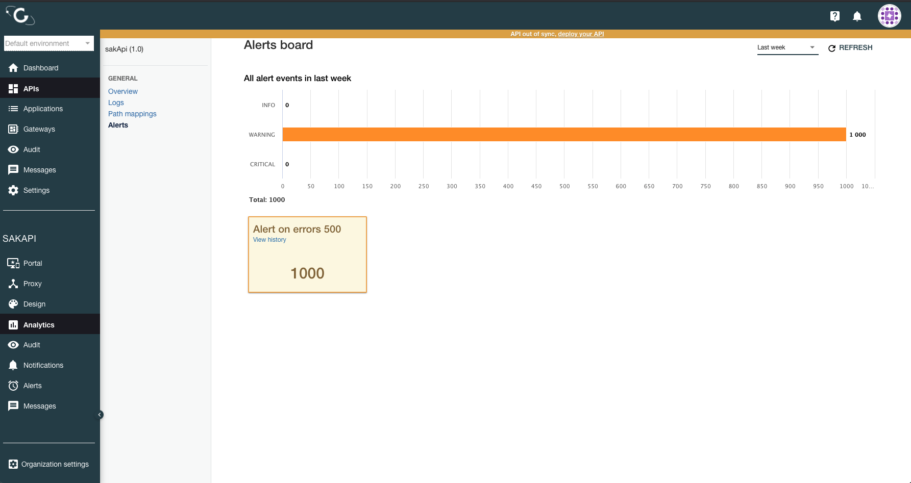

# Gravitee API Management Alerts Dashboard

## Viewing alerts data in Gravitee API Management

You can find the Gravitee API Management (APIM) **Alerts dashboard** in the APIM Console under **Analytics > Alerts**.

It shows alerts for the current API and the selected time period:

* The number of alert events grouped by severity
* The list of alerts with their event counts sorted by severity, then by decreasing event count. You can click on the alert event to view its history.

<figure><figcaption>
Gravitee API Management Alerts Dashboard
</figcaption></figure>
