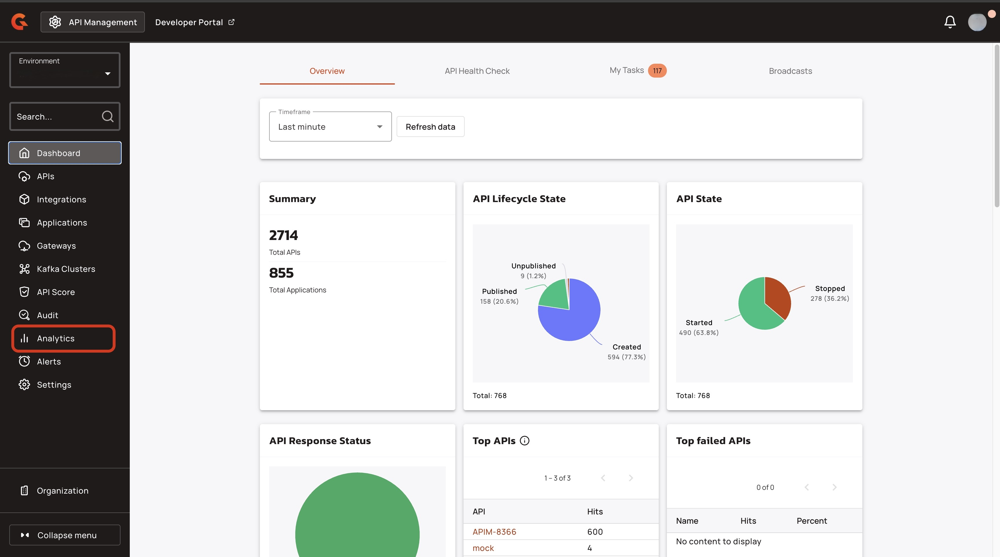
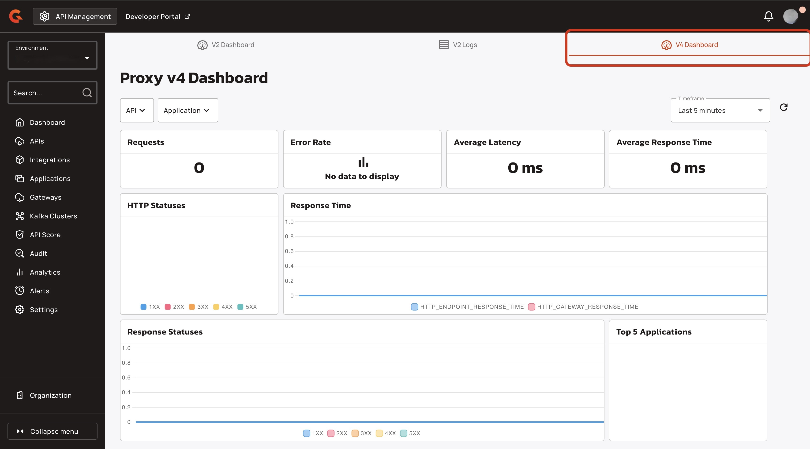
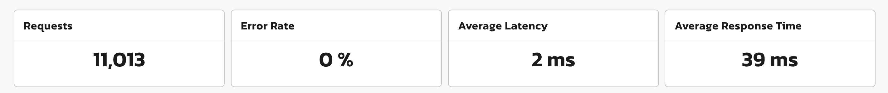
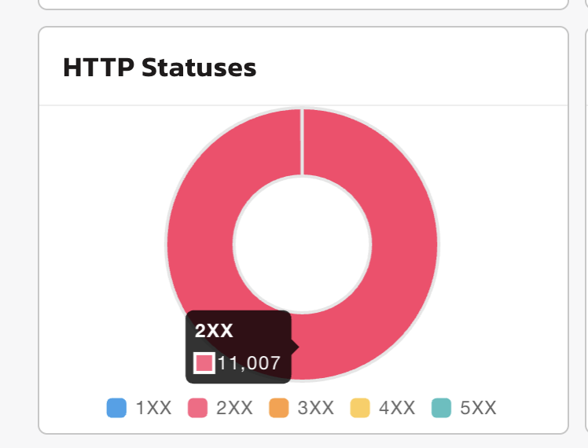
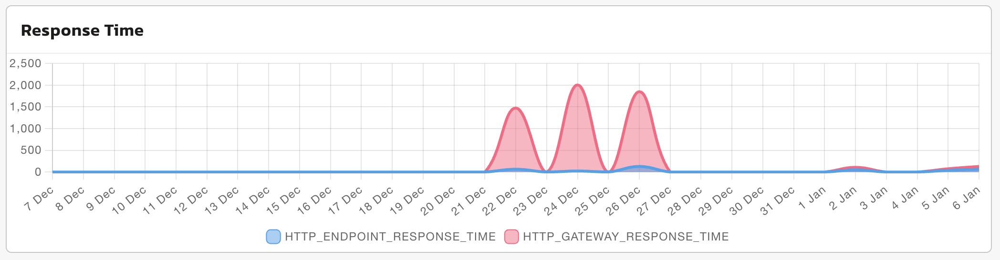
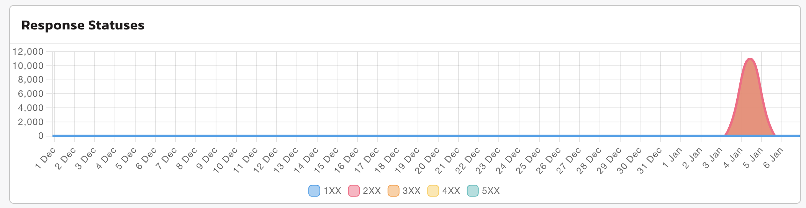
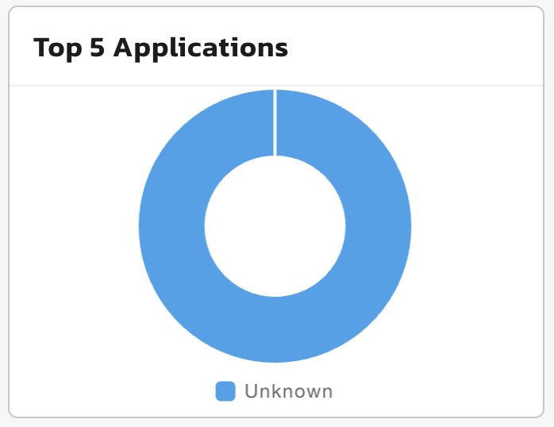

# V4 API analytics dashboard

## Overview


This dashboard displays metrics for v4 proxy APIs only.


The V4 API analytics dashboard provides you with clear visibility into the API performance and traffic patterns for all of your V4 APIs at the environment level. These metrics include request volumes, error rates, response times, and application usage.

## Access the V4 Dashboard

1.  From the **Dashboard**, click **Analytics**. 

    <figure><figcaption></figcaption></figure>
2.  Click the **V4 Dashboard** tab. 

    <figure><figcaption></figcaption></figure>

## Dashboard metrics

You can view the following metrics for your V4 APIs:

* [#key-metrics](v4-api-analytics-dashboard.md#key-metrics "mention")
* [#tables-and-graphs](v4-api-analytics-dashboard.md#tables-and-graphs "mention")

## Management API

The portal analytics dashboard exposes REST endpoints for retrieving dashboard definitions and computing analytics measures, facets, and time-series data. All endpoints are scoped to a single environment and enforce environment isolation.

### List Dashboards

**Endpoint:** `GET /portal/environments/{envId}/analytics/dashboards`

Returns a paginated list of analytics dashboards. Query parameters `page` (default: 1) and `size` (default: 20) control pagination. The response includes an array of dashboard objects and pagination metadata.

### Get Dashboard Detail

**Endpoint:** `GET /portal/environments/{envId}/analytics/dashboards/{dashboardId}`

Returns the full definition of a single dashboard, including all widget configurations. If the dashboard's environment ID does not match the execution context's environment ID, the endpoint returns 404.

### Compute Measures

**Endpoint:** `POST /portal/environments/{envId}/analytics/computation/measures`

Computes aggregated measures (COUNT, SUM, AVG, MIN, MAX) for one or more metrics over a specified time range. The request body includes `timeRange` (from/to timestamps), optional global `filters`, and a `metrics` array. The response returns computed measure values with units.

### Compute Facets

**Endpoint:** `POST /portal/environments/{envId}/analytics/computation/facets`

Computes faceted (grouped) measures by one or more dimensions (API, APPLICATION, HTTP_STATUS_CODE_GROUP, HTTP_STATUS). The request extends the measures request with `by` (grouping dimensions), `limit` (max buckets per dimension), and optional `ranges`. The response returns a hierarchical bucket structure with keys, names, and measures for each group.

### Compute Time-Series

**Endpoint:** `POST /portal/environments/{envId}/analytics/computation/time-series`

Computes time-series data with optional faceting. The request extends the facets request with `interval` (milliseconds or duration shorthand: `5m`, `1h`, `1d`). The response returns buckets keyed by timestamp, each containing measures for that time interval.

### Key Metrics

* **Requests**. This metric is the total number of calls made to your v4 APIs.
* **Error Rate.** This metric is the total number of errors for your v4 APIs displayed in a percentage.
* **Average latency**. This metric is the average latency of your Gateway displayed in milliseconds.
*   **Average response time of the Gateway.** This is the average response time of the Gateway in milliseconds. 

    <figure><figcaption></figcaption></figure>

### Tables and graphs

*   **HTTP Statuses.** This graph shows the number of each HTTP status returned by the Gateway. 

    <figure><figcaption></figcaption></figure>
*   **Response time**. This graph shows the average response time of the endpoint and the Gateway. 

    <figure><figcaption></figcaption></figure>
*   **Response Statuses.** This graph shows the number of response statuses over a period of time. 

    <figure><figcaption></figcaption></figure>
*   **Top 5 Applications**. This graph shows the top five applications by HTTP requests. 

    <figure><figcaption></figcaption></figure>
