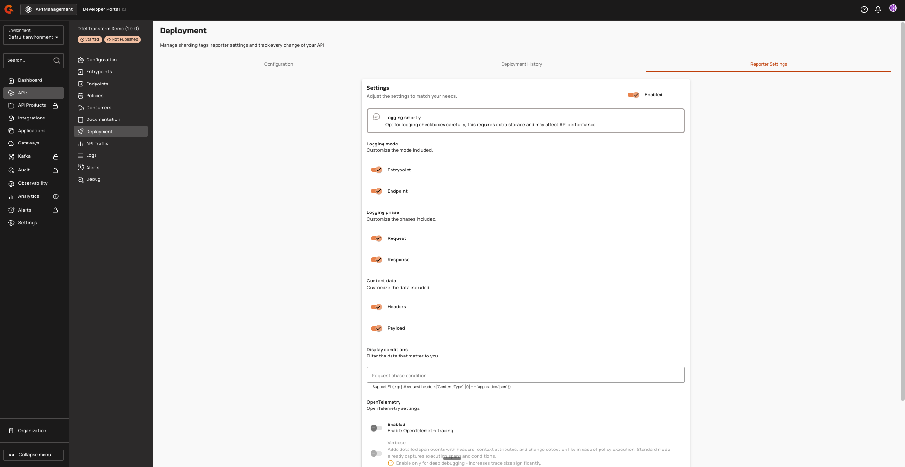
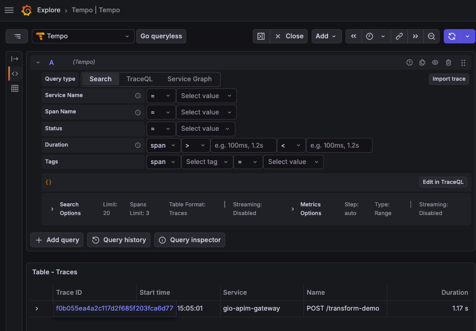
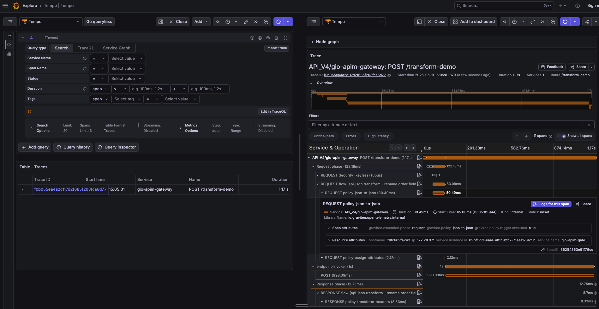
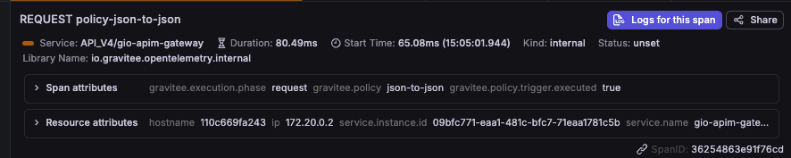
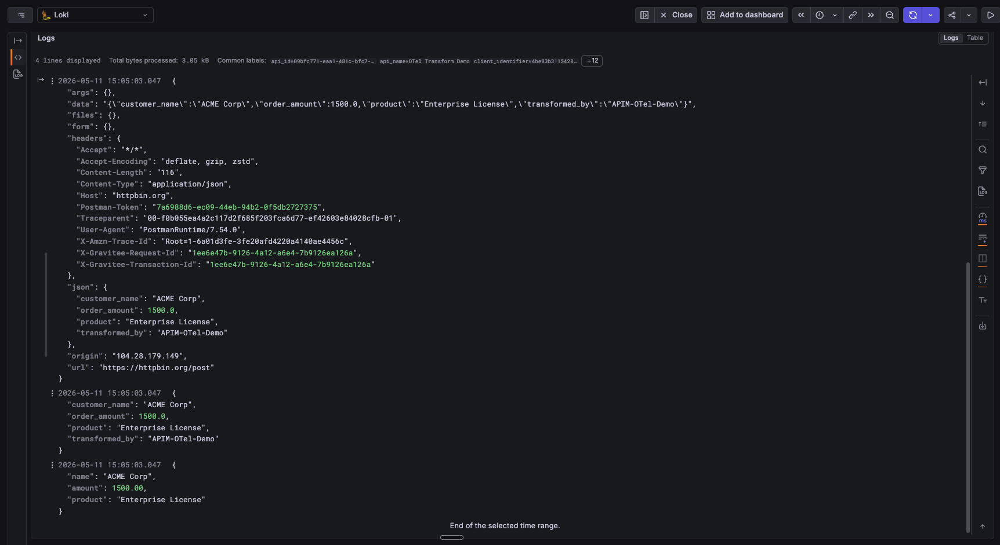
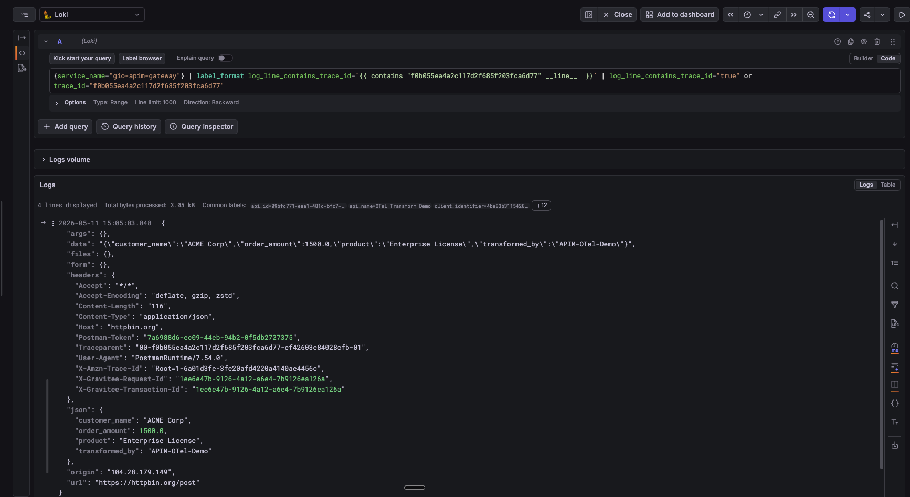

# Enable and Use OpenTelemetry Logs for APIs

## Create an OpeneTelemetry Logs Configuration

1. From the **Dashboard**, click **APIs**.
2. Select the API that you want to enable Opentelemtry for.
3. From the API menu, click **Deployment**, and then click **Reporter Settings**.
4. Navigate to the **OpenTelemetry** section, and then turn on the **Enable OpenTelemetry tracing** toggle.
5. In the **You have unsaved changes** pop-up box, click **Save**.
6. In the **This API is out of sync.** pop-up box, click **Deploy API**.

    <figure><figcaption></figcaption></figure>



The **OpenTelemetry Logs** toggle is disabled when Analytics is disabled or when Tracing is disabled. Disabling Tracing disables OTel Logs.


When you enable OpenTelemetry, log records are exported asynchronously to avoid added latency on the request path. Enabling OpenTelemtry Logs alongside existing logging results in both reporters receiving the same log record.

## View Correlated Logs in Grafana

1. In Grafana, open **Explore**, and then click **Tempo**.
2. Search for traces from your API.

    <figure><figcaption></figcaption></figure>

2. Click a trace.

    <figure><figcaption></figcaption></figure>

3. View the detailed spans of your API.

    <figure><figcaption></figcaption></figure>

4. To the correlated log lines in your log backend, click **Logs for this span** to navigate.

    A pre-filtered log list appears with the detailed payload of all capture points.

    <figure><figcaption></figcaption></figure>

    <figure><figcaption></figcaption></figure>

## End-User Configuration

### Analytics Configuration (V4 APIs)

| Property | Description | Example |
|:---------|:------------|:--------|
| `analytics.enabled` | Enable analytics for the API. When `false`, `otelLogs.enabled` is ignored and no logs are emitted. | `true` |
| `analytics.tracing.enabled` | Enable OpenTelemetry tracing for the API. When `false`, `otelLogs.enabled` is disabled in the UI and forced to `false`. | `true` |
| `analytics.otelLogs.enabled` | Emit request and response payloads as OpenTelemetry log records correlated to the active trace. All requests generate log records when enabled; trace and span IDs are only populated for requests sampled by the tracer. For Message APIs, payload capture is also subject to `analytics.logging.messageSampling`. | `false` |

Here is an example configuration:

```yaml
analytics:
  enabled: true
  tracing:
    enabled: true
  otelLogs:
    enabled: false
```

## Restrictions

- OTel Logs is disabled by default and must be explicitly enabled per API.
- The OTel Logs toggle is only available when OpenTelemetry Tracing is already enabled on the API.
- Disabling Tracing automatically disables OTel Logs.
- When `analytics.enabled = false`, `otelLogs.enabled` is ignored and no logs are emitted.
- When `tracing.enabled = false`, `otelLogs.enabled` is disabled in the UI and forced to `false`.
- Log records are always exported over HTTP/protobuf (not gRPC). The `logsEndpoint` must be an HTTP URL (e.g., `http://localhost:3100/otlp/v1/logs`). The SDK does not append the signal path automatically; the full URL including `/v1/logs` must be provided.
- Header capture is not widened by OTel Logs. When `otelLogs.enabled = true`, only payload capture is automatically enabled for all four directions. Header capture remains controlled by the Elasticsearch logging configuration (`logging.content.headers`).
- Trace ID and span ID are empty strings when tracing is disabled. When `tracing.enabled = false` or no span is active, trace ID and span ID return `""` (empty string).
- Span ID reliability in multiplexed flows: The returned IDs are only guaranteed to reflect the logically active span when spans on the same context are strictly LIFO-nested (e.g., classic request/response HTTP flows). In reactors that multiplex concurrent spans onto a single context — for example the Kafka native reactor, where many in-flight protocol requests share one duplicated context, or any flow that creates spans inside asynchronous operators — the slot can hold a sibling span, be restored to `null` by an out-of-order end, or otherwise not match the span the caller has in mind.
- If OTel is disabled globally on the gateway, the feature has zero overhead.