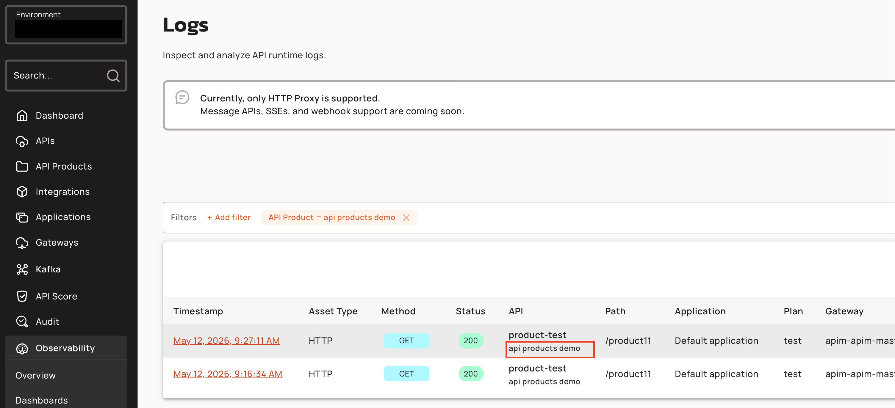
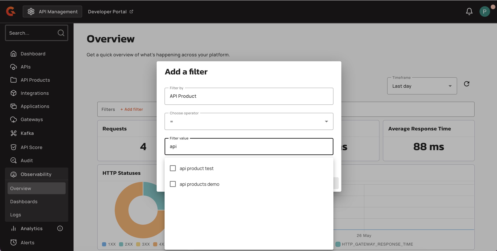
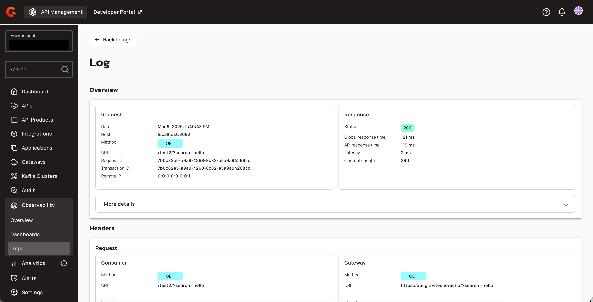

# Configure Environment-level Logs

## Overview

Environment-level logs provide cross-API visibility into the runtime logs for your v4 proxy APIs. You can view request logs across all v4 proxy APIs in a single, centralized page within the APIM Console.

Viewing the environment logs for v4 proxy APIs provides you with the following benefits:

* You can monitor traffic patterns across multiple APIs.
* You can troubleshoot issues that span several APIs.
* You can audit API usage at the environment level.
* You can filter and analyze logs by API Product to track product-level performance and usage.


Environment-level logs are available for v4 proxy APIs only. To view logs for a specific API, including v4 message APIs and webhook logs, see [View API Logs](view-api-logs.md).


## View environment-level logs

To view the logs for your v4 proxy APIs in your environment, complete the following steps:

1. From the **Dashboard**, click **Observability**.
2. From the **Observability** dropdown menu, click **Logs**.

The logs table displays a paginated list of log entries across all v4 proxy APIs in the current environment. Each entry shows the following information:

* **Timestamp:** The date and time of the request.
* **HTTP method:** The HTTP method used in the request.
* **Status:** The HTTP response status code.
* **API:** The name of the API that received the request. The API Product name appears as a subtitle below the API name in lighter text. When no API Product is associated, the subtitle reads "Standalone API".
* **Path:** The request path.
* **Application:** The application that made the request.
* **Plan:** The plan associated with the API call.
* **Gateway:** The Gateway instance that processed the request.
* **Response time:** The time taken to process the request.

<figure><figcaption></figcaption></figure>

<figure><figcaption></figcaption></figure>

## Filter your logs

The **Logs** provide filters that refine the list of log entries. The quick filters filter information based on the following information:

* **Period:** Select a predefined time range to display only logs from that window.
* **API:** Search for and select one or more APIs to display only their logs.
* **Application:** Search for one or more applications, and then select one or more applications to display only their logs.
* **API Product:** Search for and select one or more API Products to display only logs associated with those products. The filter queries the database for all products in the environment when no search term is entered. When a search term is provided, products are filtered by case-insensitive name matching.

The **More** button opens a panel with additional filtering options, which are organized into the following sections:

**Date**

* **From:** Set the start of a custom date and time range.
* **To:** Set the end of a custom date and time range. The "To" value must be after the "From" value.

**Response**

* **Status:** Enter one or more HTTP response status codes (for example, 200, 404, 500) to filter by.

**Request**

* **Entrypoints:** Filter by the entrypoint type used to interact with the API (for example, HTTP Proxy, HTTP GET, SSE, WebSocket).
* **HTTP Methods:** Filter by the HTTP method used in the request (for example, GET, POST, PUT, DELETE).
* **Plan:** Filter by a specific plan. This option is only available when exactly one API is selected in the quick filters above.

**Additional filters**

* **Transaction ID:** Filter by a transaction ID (UUID format) to find all requests associated with a specific transaction.
* **Request ID:** Filter by a specific request ID (UUID format) to locate an individual request.
* **URI:** Filter by request path. For example, `/api/v1/users`.
* **Response time (ms):** Filter for requests with a response time greater than or equal to the specified value, in milliseconds.
* **Error Types:** Filter by specific error types. The available options are dynamically populated based on errors observed within the selected date range.

You can combine multiple filters to refine the results. Applied filters appear after the filter bar. Use the **Reset filters** button to clear all active filters.

<figure><figcaption></figcaption></figure>

<figure><figcaption></figcaption></figure>


API Product filtering is only supported for v4 APIs. API Product IDs are not indexed in analytics log records; the API Product filter always queries the database, not Elasticsearch, even when no query string is provided.


## View the details of your logs

To view the details of any entry in the list of logs, click the entry in the logs table.

<figure><figcaption></figcaption></figure>

The log details page shows the following information:

* The **Overview** section provides general information about the request and response phases, including the timestamp, HTTP method, path, and response status.
* The **More details** dropdown menu shows information about the application, plan, endpoint, Gateway host, Gateway IP, and API Product associated with the request. The **API Product** field displays the product name when available, or `—` when the log is not associated with a product.
* The **Request** panel shows the HTTP method and URI for the Gateway and consumer, the headers sent in the request phase, and the request body.
* The **Response** panel shows the status of the Gateway and consumer, the headers sent in the response phase, and the body returned in the response.

<figure><figcaption></figcaption></figure>


The level of detail available in each log entry depends on the [API-level logging configuration](configure-api-level-logs.md). To capture request and response headers and payloads, you must configure logging at the API level.


## Query logs by API Product

To query logs or metrics by API Product, use the `apiProductIds` query parameter in the Logs API. This parameter accepts an array of API Product IDs and filters results to requests associated with those products. The parameter is only supported for v4 APIs; requests for v2 APIs ignore this filter.

| Parameter | Type | Description | Example |
|:----------|:-----|:------------|:--------|
| `apiProductIds` | array of strings | Filter logs by API Product IDs (v4 APIs only) | `["f5e6a5a0-1234-4b3a-9c1e-aabbccddeeff"]` |

## Restrictions

* API Product filtering (`apiProductIds` query parameter and API Product filter) is only supported for v4 APIs.
* API Product IDs are not indexed in analytics log records; the API Product filter always queries the database, not Elasticsearch, even when no query string is provided.
* When an API Product is deleted, logs referencing its ID will display the ID but no name (the `apiProductName` field will be null).
* The "Standalone API" label is applied to all logs where `apiProductId` is null, regardless of whether the API is actually standalone or the product association was not recorded.
* Streaming APIs (message logs, message metrics) don't support `api-product-id` fields.
* Existing Elasticsearch indices created before version 4.12 won't include the `api-product-id` field until indices are rolled over or reindexed.
* Custom reporter implementations must be recompiled against `gravitee-reporter-api` version 2.2.0 to support the `apiProductId` field.
