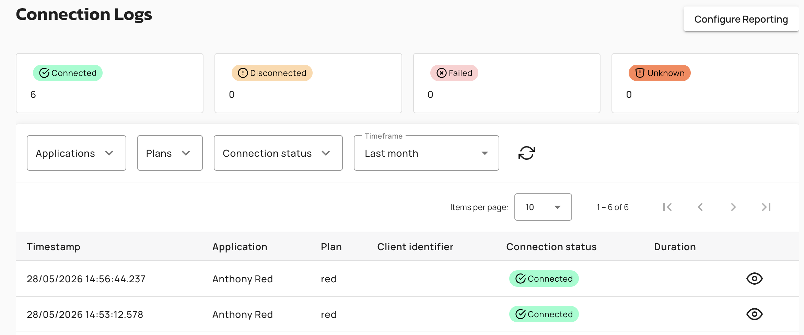
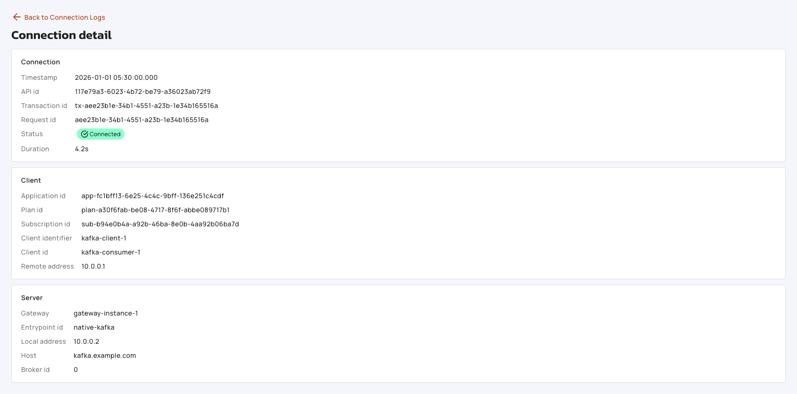
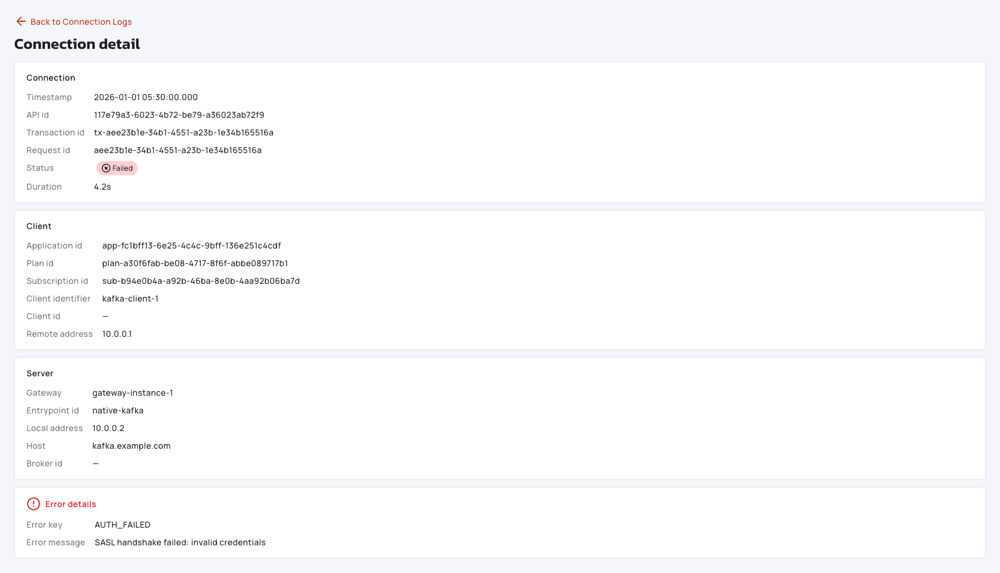

# Configure and View Native Kafka API Connection Logs

## API Gateway Configuration

## Configure Connection Metrics Reporting

To configure connection metrics reporting, complete the following steps:

1. Navigate to a Native Kafka API, and then select **Deployment** and the **Reporter Settings** tab.
2. Toggle **Enable connection metrics reporting** on or off.
3. Click **Save** in the form save bar.

The following table describes the reporter settings:

| Setting | Default | Description |
|:--------|:--------|:------------|
| **Enable Connection Metrics Reporting** | On. This is the default when `analytics.reporterMetricsEnabled` is absent. | Controls whether the API Gateway writes connection-lifecycle records to the configured reporter. When off, no new connection logs are produced. The **Logs** page is gated by a banner, and then the summary widget is hidden. |

The toggle is enabled only when the parent analytics module is enabled. Disabling the parent analytics toggle disables this toggle in the UI. When the toggle is turned off, the **Logs** page on the same API switches to a "Reporting is disabled" banner with guidance pointing back at this setting.

## View Connection Logs

### Logs List Page

To view the logs list, navigate to a Native Kafka API, and then select **Logs**. A **Configure Reporting** button in the page header deep-links to **Deployment** and the **Reporter Settings** tab for fast access to the connection metrics toggle. The page contains the following regions:

* **Summary Widget**. Four cards show counts over the currently selected timeframe. These cards are Connected, Disconnected, Failed, and Unknown. The widget is hidden when connection metrics reporting is disabled. An inline info banner explains that reporting is disabled and data may be stale. Cards show `—` until you select a timeframe, and then they show the live count. On a fetch error, the affected card displays a **Retry** button. This button re-runs the summary query without disturbing the following table.
* **Filter Row**. The filter state is mirrored to the URL query string for shareable links. Refreshing the page rehydrates the filter values.
* **Logs Table**. The table is cleared if a filter request fails. The global HTTP error snackbar surfaces the failure. You are never left looking at the previous result set under a new filter. When no data matches the filter, an empty state displays: "No data to display. More data may be available. Try widening your timeframe or adjusting your filters."

The following table describes the filter row:

| Filter | Type | Notes |
|:-------|:-----|:------|
| **Period** | Predefined ranges and Custom. | Custom requires you to explicitly click **Apply** to fire. This avoids triggering on every date-picker keystroke. |
| **Applications** | Server-paginated search-and-select. | Resolves *Application* names using the existing *Applications* endpoint. |
| **Plans** | *Plan* picker scoped to this API. | Lists all *Plans* on the API. |
| **Connection Status** | Multi-select. | Connected, Disconnected, Failed, or Unknown. |

The following table describes the logs table:

| Column | Source | Notes |
|:-------|:-------|:------|
| **Timestamp** | `timestamp`. | Connection lifecycle event time. This is formatted `dd/MM/yyyy HH:mm:ss.SSS`. |
| **Application** | Resolved name from `applicationId`. | Renders empty when the *Application* is deleted or the resolution call fails. |
| **Plan** | Resolved name from `planId`. | This has the same fallback behavior as *Application*. |
| **Client Identifier** | `clientIdentifier`. | This is the free-form identifier the client provided. |
| **Connection Status** | `connectionStatus`. | Rendered as a colored pill. |
| **Duration** | `connectionDurationMs`. | Formatted with the standard duration pipe. This is empty when not reported. |
| Unlabeled | — | Per-row eye icon (`gio:eye-empty`). Clicking it opens the detail page for that connection. This preserves the current filter state using query params. |

<figure><figcaption>
Connection logs list with status indicators
</figcaption></figure>

### Connection Log Detail Page

To view connection log details, click the eye icon on any row in the connection logs table. The URL pattern is `.../v4/runtime-logs-native/<requestId>?from=...&to=...&<filters>`. This is direct-linkable. The page has a back link and the following stacked cards:

<figure><figcaption>
Connection log detail for a successful connection
</figcaption></figure>

The following table describes the Connection card:

| Field | Source |
|:------|:-------|
| **Timestamp** | `timestamp`. This is formatted `yyyy-MM-dd HH:mm:ss.SSS`. |
| **API ID** | `apiId`. |
| **Transaction ID** | `transactionId`. |
| **Request ID** | `requestId`. |
| **Status** | Connection status pill. This uses the same labels as the logs list page. |
| **Duration** | `connectionDurationMs`. This is formatted and displays `—` when null. |

The following table describes the Client card:

| Field | Source |
|:------|:-------|
| **Application ID** | `applicationId`. |
| **Plan ID** | `planId`. |
| **Subscription ID** | `subscriptionId`. |
| **Client Identifier** | `clientIdentifier`. |
| **Client ID** | `clientId`. |
| **Remote Address** | `remoteAddress`. |

The following table describes the Server card:

| Field | Source |
|:------|:-------|
| **Gateway** | `gateway`. |
| **Entrypoint ID** | `entrypointId`. |
| **Local Address** | `localAddress`. |
| **Host** | `host`. |
| **Broker ID** | `brokerId`. |

The following table describes the Error card. This is visible only when `connectionStatus` is Disconnected, Failed, or Unknown:

| Field | Source |
|:------|:-------|
| **Error Key** | `errorKey`. |
| **Error Message** | `errorMessage`. |

<figure><figcaption>
Connection log detail showing the Error details card for a failed connection
</figcaption></figure>


**Not Found Banner**. Log not found. No log was found for request id {requestId} within the selected time window. The window may be outside the configured retention.



**Load Failed Banner**. Failed to load connection log. An unexpected error occurred while loading the log for request id {requestId}.
