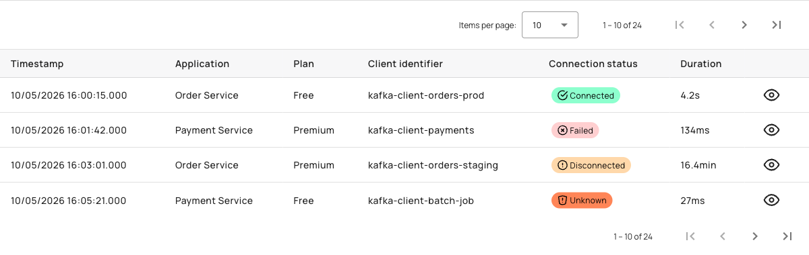

# View and Manage Native API Connection Logs

## Creating Native API Connection Logs

Navigate to the native API's **Logs** menu entry. This menu entry is visible when the API type is `NATIVE` and the user has the `api-native_log-r` permission. The logs interface displays a paginated table of connection attempts with filtering and summary capabilities.

Use the timeframe selector to choose a preset period or define a custom range. Available preset periods include:

* Last 5 minutes
* Last 15 minutes
* Last 1 hour
* Last 3 hours
* Last 6 hours
* Last 12 hours
* Last 1 day
* Last 3 days
* Last 7 days
* Last 14 days
* Last 30 days
* Last 90 days

Apply filters for Applications, Plans, and Connection Status to narrow results. The summary widget at the top shows connection counts grouped by status.

If reporting is disabled, a banner warns that data may be outdated. Click **Configure Reporting** to navigate to reporter settings. When no data matches the query, an empty state message suggests widening the timeframe or adjusting filters.

<figure><figcaption>
Connection logs table displaying timestamp, application, plan, client identifier, connection status, duration, and view icon columns
</figcaption></figure>

The connection logs table includes the following columns:

| Field | Description |
|:------|:------------|
| Timestamp | Connection attempt time (format: `dd/MM/yyyy HH:mm:ss.SSS`) |
| Application | Resolved application name (or empty if resolution fails) |
| Plan | Resolved plan name (or empty if resolution fails) |
| Client Identifier | Kafka client identifier |
| Connection Status | Badge indicating CONNECTED, SESSION_ERROR, CONNECTION_ERROR, or INTERNAL_ERROR |
| Duration | Connection duration in milliseconds (or `—` if null) |
| View | Icon button to open log details (requires `api-native_analytics-r` permission) |

## Managing Connection Logs

### Viewing Log Details

To view the details of a specific connection attempt:

1. Click the View icon in the logs table.

The detail view organizes information into four cards:

* **Connection**: Timestamp, API ID, Transaction ID, Request ID, Status, Duration
* **Client**: Application ID, Plan ID, Subscription ID, Client Identifier, Client ID, Remote Address
* **Server**: Gateway, Entrypoint ID, Local Address, Host, Broker ID
* **Error**: Error Key, Error Message (shown only when connection status is errored)

<figure><figcaption>
Connection detail view showing four cards: Connection, Client, Server, and Error
</figcaption></figure>

If the log is not found within the selected time window, a 404 banner explains that the window may be outside the configured retention. For other errors, a generic failure banner displays.


Viewing individual log details requires the `api-native_analytics-r` permission.


### Configuring Reporter Settings

To configure connection metrics reporting:

1. Navigate to the native API's **Reporter Settings** page.
2. Toggle **Enable connection metrics reporting** to control whether connection events are indexed in Elasticsearch or OpenSearch.

This setting is independent of the **Enable event-metrics reporting** toggle. When enabled, the system reports connection metrics including client identifiers, broker identifiers, connection status, and connection duration. The default value is `true` for new native APIs. Changes are persisted in the `api.analytics.reporterMetricsEnabled` property.
