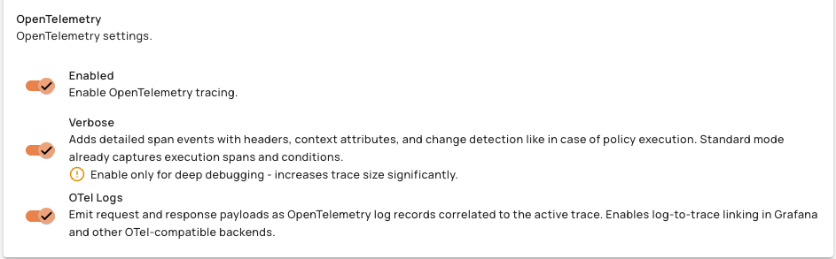
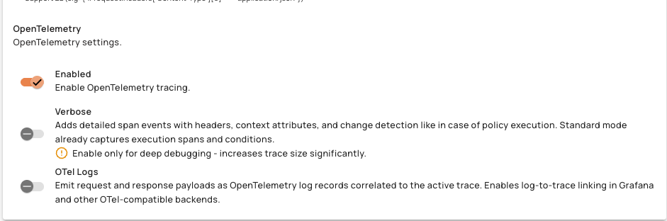

# OpenTelemetry Logs Integration Overview

## Overview

OpenTelemetry Logs Integration injects active trace IDs and span IDs into runtime log records captured during request processing and exports them to the configured OTLP log backend. This enables full log-to-trace correlation in Grafana: each log line carries the trace ID so you can navigate directly from a log to its corresponding trace in Tempo. This applies to v4 HTTP/Proxy APIs and v4 Message APIs.

## Key Concepts

### Log-to-Trace Correlation

When OTel Logs is enabled, every runtime log record captured during request processing includes the active OpenTelemetry trace ID and span ID. These identifiers allow observability backends like Grafana to link log lines to their corresponding distributed traces. The gateway exports log records asynchronously via OTLP/HTTP to avoid adding latency to the request path.

### Capture Points

Each log entry corresponds to one of four capture points in the request lifecycle:

| Capture Point | Log Body Content |
|:--------------|:-----------------|
| entrypoint-request | Request body before any policies (original payload) |
| endpoint-request | Request body after request policies (transformed payload) |
| endpoint-response | Raw backend response body |
| entrypoint-response | Response body after response policies |

### OTel Logs Toggle

The OTel Logs toggle is a per-API setting available in the Console UI under Runtime Logs settings. it's only available when OpenTelemetry Tracing is already enabled on the API. When enabled, all four payload directions (entrypoint request/response, endpoint request/response) are captured regardless of Elasticsearch logging configuration. Header capture remains controlled by the Elasticsearch logging configuration. All requests generate log records when enabled. For Message APIs, payload capture is additionally subject to the message sampling strategy configured in the API analytics settings. Trace and span IDs are only populated for requests sampled by the tracer.

<figure><figcaption></figcaption></figure>

<figure><figcaption></figcaption></figure>

## Prerequisites

Before you enable OpenTelemetry Logs Integration, complete the following steps:

* Install the `gravitee-reporter-otel` plugin on the gateway by copying the plugin `.zip` file into the gateway's `plugins/` directory. The gateway ignores `.jar` files — the plugin must be a `.zip`. Without this plugin, trace and span IDs are captured internally but nothing is exported to the log backend.
* Enable OpenTelemetry globally on the gateway.
* Ensure a compatible log backend is reachable from the gateway (e.g., Loki via an OTel Collector or directly via OTLP/HTTP).
* Verify that the `service.name` used by both the tracer and the OTel logger match in Tempo and Loki for Grafana log-trace correlation to work. Both use `gio-apim-gateway` by default. If they differ, the "Logs for this span" button in Tempo will return no results.

