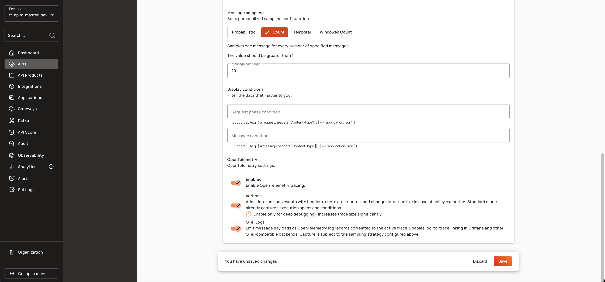

# Span Attribute Redaction Overview and Concepts

## Overview

Span Attribute Redaction masks sensitive metadata in OpenTelemetry traces before export to collectors or tracing backends. The feature protects authorization headers, API keys, tokens, consumer identifiers, query parameters, and other sensitive span attributes by applying configurable masking rules inside the Gateway JVM. Redaction occurs before OTLP export, ensuring that only masked data leaves the Gateway.

## Key Concepts

### Redaction Rules

A redaction rule consists of an attribute name pattern, a masking strategy, and an optional value filter. Rules are evaluated in order: global rules (from YAML configuration) are applied first, followed by API-specific rules. The first matching rule wins — subsequent rules for the same attribute are ignored.


When a non-string attribute is redacted, it is coerced to a string attribute and the original typed key is removed.


### Value Filters

The optional `valuePattern` field applies a Java regex to the attribute value. The rule fires only when the value matches the pattern. Value patterns use partial matching (`Pattern.find()`) and are case-sensitive. Use `^…$` anchors for full-string match.

### Resource Attributes

Resource attributes (e.g., `service.instance.id`, `hostname`) are redacted once at tracer creation time and baked into the `SdkTracerProvider`. They are not visible to per-span redaction.

## Prerequisites

* OpenTelemetry tracing must be enabled (`services.opentelemetry.enabled: true`)

<figure><figcaption></figcaption></figure>

* For API-specific rules, the API must be a v4 HTTP/Proxy or v4 TCP API
* For UI configuration, both `tracing.enabled` and `tracing.verbose` must be `true`

<figure><figcaption></figcaption></figure>
