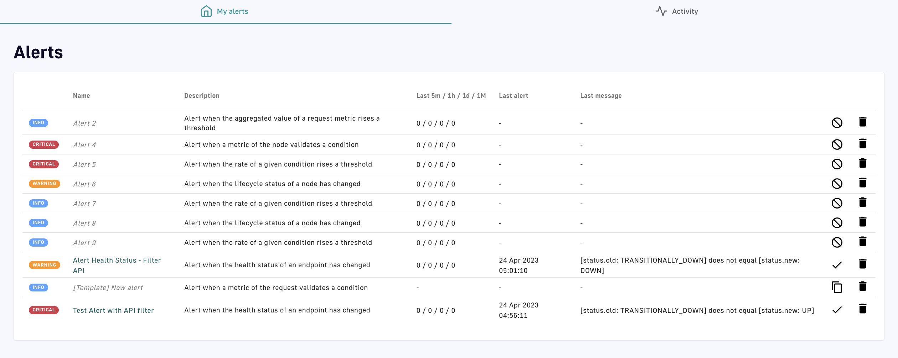
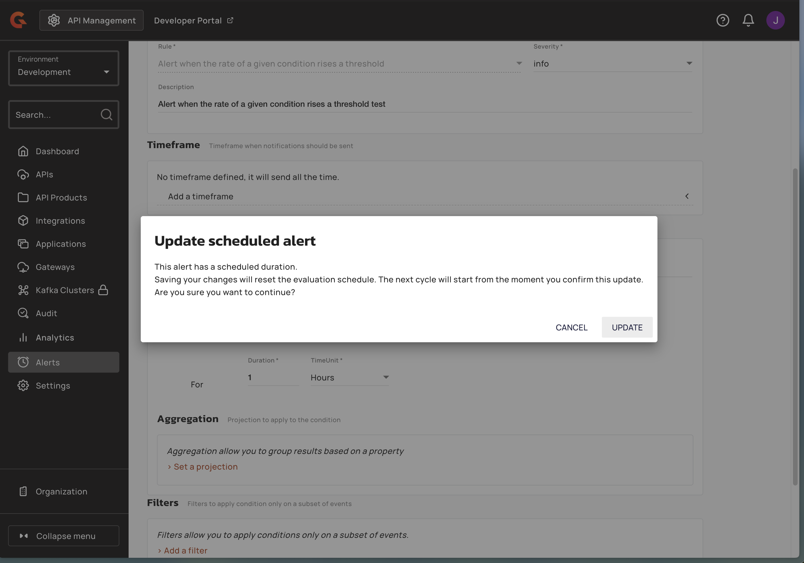
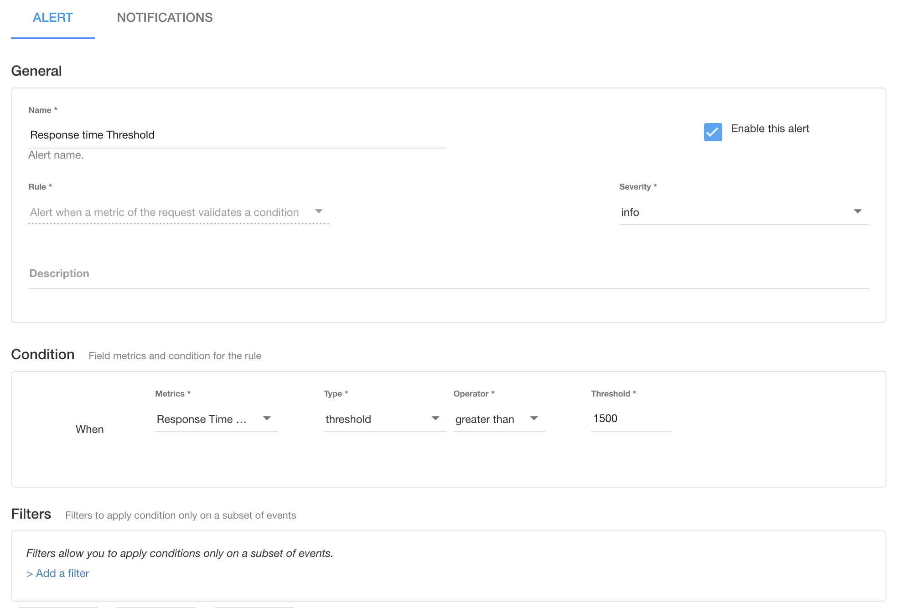
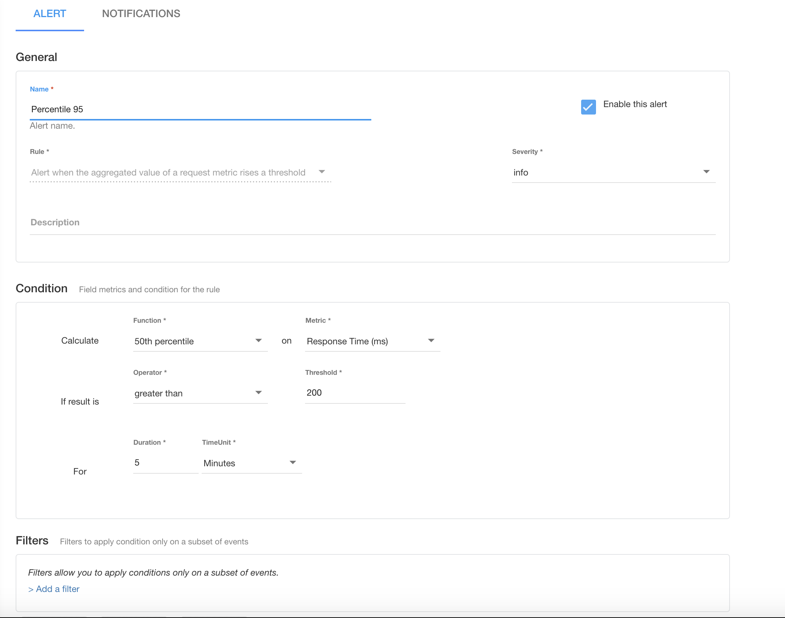
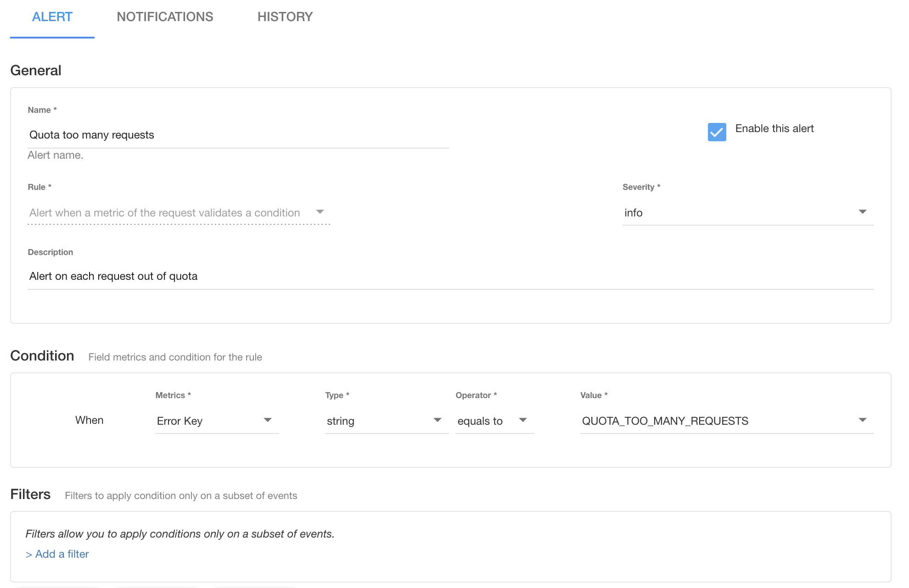
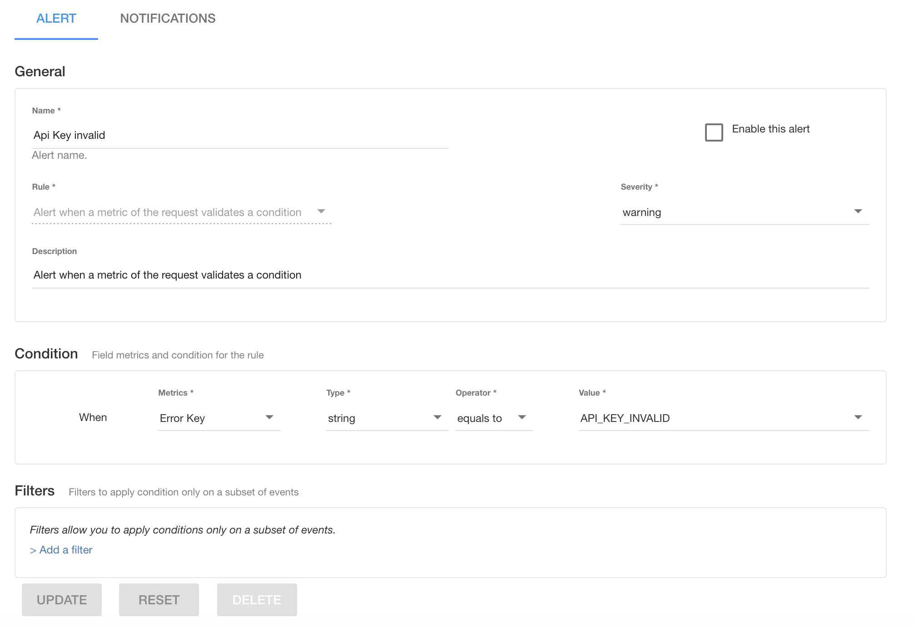
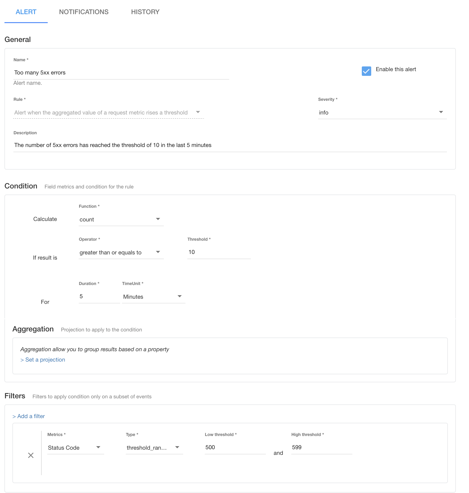
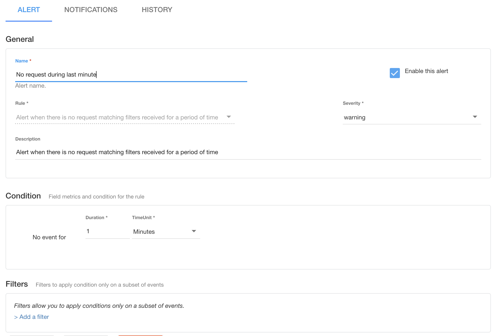
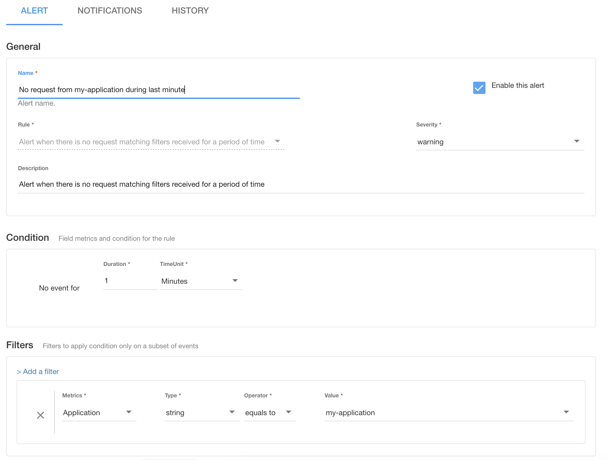

# Alerts


The following documentation is only relevant if you have Gravitee Alert Engine enabled, which is an Enterprise-only capability. To enable the following alerting capabilities, please [contact us](https://www.gravitee.io/contact-us) or reach out to your CSM.


## Overview

When configuring platform settings, you can also set up alerting conditions for the Gateway.

## Configuration

To configure alerts, select **Alerts** from the left nav of your APIM console. If you already have alerts configured, you'll see the configured alerts. If not, you'll see a blank alerts menu and a **+** icon.

<figure><figcaption><p>Alerts</p></figcaption></figure>

Select the **+** icon to create your first alert. On the **Create a new alert** page, configure the following:

* **General settings:** Name, Rule (Gravitee includes several pre-built rules), Severity, Description
* **Timeframe:** Create a timeline for this alerting mechanism
* **Condition:** Set conditions for when your rule should operate and trigger alerts
* **Filters:** Define a subset of events to which your conditions and rules are applied

By default, alerts will show up in your **Dashboard** under the **Alerts** tab and on the **Alerts** page.

<figure><figcaption><p>You can see alerts in the Alerts tab and the Alerts page.</p></figcaption></figure>

You can also configure notifications that are attached to these alerts. This is done on the **Create a new alert** page under the **Notifications** tab. On this page, you can:

* **Define a dampening rule:** Limit the number of notifications if the trigger is fired multiple times for the same condition
* **Add a notification:** Add a notification type to your alerts to trigger notifications when alerts are processed. The available notification channels are email, Slack, system email, and Webhook.

Depending on the notification channel you choose, you will need to configure multiple settings. Please see the tabs below for more information.



For email notifications, you can define the following:

* SMTP Host
* SMTP Port:
* SMTP Username:
* SMTP Password:
* Allowed authentication methods
* The "sender" email addresses
* Recipients
* The subject of the email
* The email body content
* Whether to enable TLS
* Whether to enable SSL trust all
* SSL key store
* SSL key store password

<figure><figcaption><p>Email notifications for email alerting</p></figcaption></figure>



If you choose Slack as your notification channel, you can define the following:

* The Slack channel where you want the alert sent
* The Slack token of the app or the Slackbot
* Whether to use the system proxy
* The content of the Slack message

<figure><figcaption><p>Slack notifications for API alerting</p></figcaption></figure>



If you choose System email, you will need to define:

* The "From" email address
* The recipients of the email
* The subject of the email
* The body content of the email

<figure><figcaption><p>System email notifications</p></figcaption></figure>



If you want to choose Webhook as your notification channel, you will need to define the following:

* **HTTP Method**: this defines the HTTP method used to invoke the Webhook
* **URL**: this defines the url to invoke the webhook
* **Request headers**: add request headers
* **Request body**: the content in the request body
* Whether to use the **system proxy** to call the webhook

<figure><figcaption><p>Webhook notifications</p></figcaption></figure>



## Scheduled alerts


Sometimes time window alert evaluation schedules might calculate differently than expected in Alert Engine versions before 3.0.0. If you are self-hosting Alert Engine and use time window alerts, upgrade to version 3.0.0 or later.


When a condition includes an aggregation or rate within a time window, the window is calculated from the last time the alert configuration was updated.

### Updating a scheduled alert

When you update an existing scheduled alert with a time window, the evaluation schedule restarts from the time of the update. Unless you update the configuration again, the schedule continues at regular intervals based off the new timestamp.

```
Last updated at [timestamp]
```

Also, from 4.11, you receive a warning when you update an alert with a time window, which indicates that the update resets the evaluation schedule.

<figure><figcaption></figcaption></figure>


**Update scheduled alert**

This alert has a scheduled duration. Saving your changes reset the evaluation schedule. The next cycle will start from the moment you confirm this update.


Confirm the update to anchor the schedule to the new timestamp. The next evaluation cycle starts from the moment you confirm.

## Example alerts

To assist with alert configuration, sample alert templates useful to many teams are shown below.

### Alerts for when limits are reached



To configure an alert for response times exceeding a threshold of 1500ms:

<figure><figcaption></figcaption></figure>



To configure an alert for the 50th percentile of response times exceeding 200 ms in the last 5 minutes:

<figure><figcaption><p>Alert for 50th percentile of response time greater than X ms</p></figcaption></figure>



To configure an alert for reaching the quota limit on requests:

<figure><figcaption><p>Alert for reaching the quota limit on requests</p></figcaption></figure>



### Alerts based on errors or low usage



To trigger an alert when an invalid API key is passed to the Gateway:

<figure><figcaption><p>Invalid API key alert</p></figcaption></figure>



To configure an alert for the number of 5xx errors reaching a threshold of 10 in the last 5 minutes:

<figure><figcaption><p>Alert for too many errors in the last five minutes</p></figcaption></figure>



To configure an alert for no requests made to the API during the last minute:

<figure><figcaption><p>Alert for no API requests in the last minute</p></figcaption></figure>



The following example is the same as above, but filters on `my-application`:

<figure><figcaption><p>Alert for no API requests from my application in the last minute</p></figcaption></figure>



### Other conditions to alert on

The examples above cover the most common alerts. The table below lists further conditions teams alert on, with the event and the properties each condition evaluates. For the condition types themselves, see [alerts and conditions](../../alert-engine/guides/alerts-and-conditions.md). For the full property list per event, see [notifications](../../alert-engine/guides/notifications.md).

<table>
    <thead>
        <tr>
            <th width="240">Condition</th>
            <th width="210">Why it matters</th>
            <th>Event and properties</th>
        </tr>
    </thead>
    <tbody>
        <tr>
            <td>Gateway node down</td>
            <td>A Gateway instance stopped or lost contact, reducing capacity.</td>
            <td><code>NODE_LIFECYCLE</code>, where <code>node.event</code> is <code>NODE_STOP</code>. To catch a node that disappears without stopping cleanly, use a missing data condition on <code>NODE_HEARTBEAT</code>.</td>
        </tr>
        <tr>
            <td>High CPU usage</td>
            <td>A saturated node adds latency and eventually drops traffic.</td>
            <td><code>NODE_HEARTBEAT</code>, using <code>os.cpu.percent</code> or <code>process.cpu.percent</code>.</td>
        </tr>
        <tr>
            <td>Heap exhaustion risk</td>
            <td>Warns before the JVM runs out of memory.</td>
            <td><code>NODE_HEARTBEAT</code>, using <code>jvm.mem.heap.percent</code>, or <code>jvm.mem.heap.used</code> against <code>jvm.mem.heap.max</code>.</td>
        </tr>
        <tr>
            <td>Lost connectivity to a datastore</td>
            <td>When the Gateway can't reach its analytics store you lose visibility until it recovers.</td>
            <td><code>NODE_HEALTHCHECK</code>, using <code>node.healthy</code> or a specific <code>node.probe.</code> property. Probes include <code>repository-analytics</code>, <code>management-repository</code>, <code>ratelimit-repository</code>, <code>cpu</code>, <code>memory</code>, <code>gc-pressure</code>, <code>cluster</code>, and <code>sync-process</code>.</td>
        </tr>
        <tr>
            <td>Endpoint health check failure</td>
            <td>A backend has started failing its configured health check.</td>
            <td><code>ENDPOINT_HEALTH_CHECK</code>, evaluating <code>status.new</code> against <code>status.old</code>. The event also carries <code>success</code>, <code>message</code>, <code>endpoint.name</code>, and <code>response_time</code>.</td>
        </tr>
        <tr>
            <td>Backend latency increase</td>
            <td>Shows that the delay sits in the upstream service, not the Gateway.</td>
            <td><code>REQUEST</code>, using <code>response.upstream_response_time</code>, which measures the endpoint response time alone.</td>
        </tr>
        <tr>
            <td>Gateway overhead</td>
            <td>Time spent inside the Gateway, which points to policy cost or an under-resourced node.</td>
            <td><code>REQUEST</code>, using <code>response.latency</code> rather than the end-to-end <code>response.response_time</code>.</td>
        </tr>
        <tr>
            <td>Rate limiting in effect</td>
            <td>Shows how much legitimate traffic is throttled, which tells you whether quotas need raising.</td>
            <td><code>REQUEST</code>, using a rate condition on <code>response.status</code> for 429 responses.</td>
        </tr>
        <tr>
            <td>Unexpected payload size</td>
            <td>An unusually large request body can indicate an injection attempt or a misbehaving client.</td>
            <td><code>REQUEST</code>, using a threshold condition on <code>request.content_length</code>.</td>
        </tr>
        <tr>
            <td>Traffic from an unexpected region</td>
            <td>An API intended for one region starts receiving traffic from another.</td>
            <td><code>REQUEST</code>, using the geographic properties derived from <code>request.ip</code>. The event runs a GeoIP context processor over the caller address.</td>
        </tr>
    </tbody>
</table>

Alert Engine supports the <code>P50</code>, <code>P90</code>, <code>P95</code>, and <code>P99</code> aggregation functions alongside <code>COUNT</code>, <code>AVG</code>, <code>MIN</code>, and <code>MAX</code>, so the percentile example above applies to any numeric property.

## What needs tooling outside Gravitee

Alert Engine evaluates the events the platform emits, so a condition that depends on anything outside those events needs another tool.

<table>
    <thead>
        <tr>
            <th width="260">Condition</th>
            <th>Why Alert Engine doesn't cover it</th>
        </tr>
    </thead>
    <tbody>
        <tr>
            <td>Certificate expiry warning</td>
            <td>The Gateway writes a log warning as a certificate approaches expiry, and doesn't emit an alert event for it. Detect it from your log pipeline or a certificate monitor.</td>
        </tr>
        <tr>
            <td>Comparison against an earlier period</td>
            <td>A compare condition evaluates two properties of the same event, so it can't express a change against last week or yesterday. Use a metrics backend that retains history.</td>
        </tr>
        <tr>
            <td>Service level reporting</td>
            <td>Alerting tells you when a threshold is crossed. A compliance figure across a reporting period is a dashboard concern, so build it on your analytics store.</td>
        </tr>
        <tr>
            <td>Paging and SMS delivery</td>
            <td>Alert Engine notifies through email, system email, Slack, and Webhook. Reach a paging or SMS provider by pointing a Webhook notification at it.</td>
        </tr>
    </tbody>
</table>

## Reduce alert noise

An alert nobody acts on trains people to ignore the ones that matter. Two things keep the signal high:

* **Apply a dampening rule.** Dampening holds an alert until the condition has been true across several evaluations, so a momentary blip that resolves itself doesn't reach anyone. See [dampening](../../alert-engine/guides/dampening.md).
* **Match severity to response.** Reserve the highest severity for conditions someone acts on immediately, such as a node going down or a sustained server error rate, and use a lower severity for conditions that belong in a queue.
