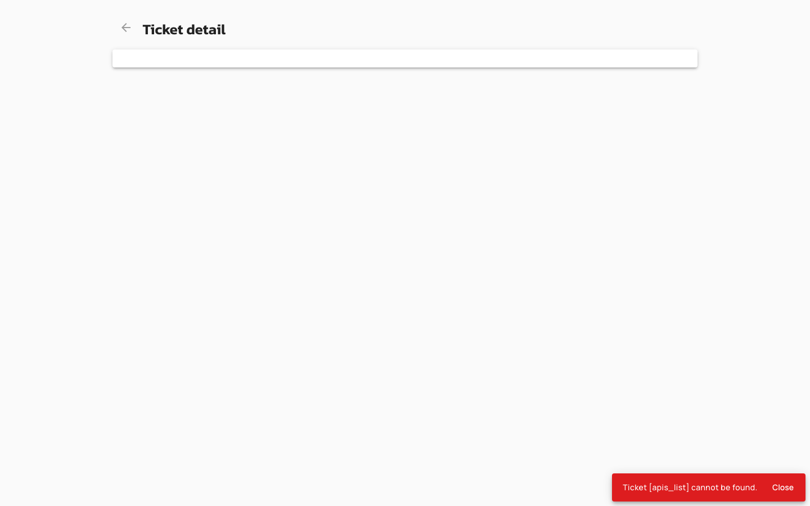

# API Import Configuration (Gateway Configuration Reference)

## Overview

API Import from Remote URL enables administrators to create and update v4 APIs by fetching API definitions from remote HTTP(S) endpoints. The gateway retrieves Gravitee export files or OpenAPI specifications server-side, eliminating browser CORS restrictions and centralizing URL validation. This feature supports both initial API creation and updates to existing APIs.

## Key Concepts

### Remote Import Sources

API Import from Remote URL supports two definition formats fetched from remote endpoints:

- **Gravitee Definition URL**: A JSON export file containing a complete v4 API configuration (listeners, endpoints, flows, policies). The backend fetches the file via HTTP GET and imports it directly.
- **OpenAPI Specification URL**: A remote OpenAPI 2.0 or 3.x descriptor (JSON or YAML). The backend fetches the file and converts it to a Gravitee API definition, optionally importing documentation and adding an OpenAPI validation policy.

Both formats are validated against a configured import whitelist and SSRF protection rules before the backend retrieves the content.

| Import Type | Content-Type | Endpoint | Supported Operations |
|:------------|:-------------|:---------|:---------------------|
| Gravitee Definition | `text/plain` | `POST /apis/_import/definition-url`, `PUT /apis/{apiId}/_import/definition-url` | Create, Update |
| OpenAPI Specification | `application/json` | `POST /apis/_import/swagger`, `PUT /apis/{apiId}/_import/swagger` | Create, Update |

### Server-Side Fetch

The backend retrieves remote URLs using an internal HTTP client. The UI submits the URL to the Management API, which validates the URL against the import whitelist and private-address blocking rules, fetches the content, and parses it into an API definition. This approach eliminates CORS requirements and ensures consistent security enforcement across all import operations.

### URL Validation and SSRF Protection

All remote URLs are validated before the backend fetches them:

- **Import Whitelist**: URLs must match at least one pattern in the configured import whitelist. URLs not in the whitelist are rejected with a `400 Bad Request` error.
- **Private Address Blocking**: By default, URLs resolving to private or link-local addresses (e.g., `http://169.254.169.254/`, `http://10.0.0.1/`) are blocked to prevent Server-Side Request Forgery (SSRF) attacks. This can be overridden via the `importConfiguration.isAllowImportFromPrivate()` setting.

## Prerequisites

- v4 API Management platform (v2 APIs are not supported)
- Remote URL must be accessible from the Management API server
- Remote URL must be permitted by the configured import whitelist
- For Gravitee definitions: remote endpoint must serve a valid Gravitee v4 API export (JSON)
- For OpenAPI specifications: remote endpoint must serve a valid OpenAPI 2.0 or 3.x descriptor (JSON or YAML)
- User must have `ENVIRONMENT_API[CREATE]` permission (create) or `API_DEFINITION[UPDATE]` permission (update)

## Gateway Configuration

## Creating an API from a Remote URL

To create a v4 API from a remote Gravitee definition or OpenAPI specification, navigate to the API import wizard in the Management Console and select the Remote source option. Enter the full HTTP(S) URL of the definition file in the URL field. The URL must start with `http://` or `https://` and must be permitted by the configured import whitelist. For OpenAPI imports, optionally enable documentation import and OpenAPI validation policy enforcement. Review the import settings and submit the form. The backend fetches the definition server-side, validates it, and creates the API. If the URL is blocked by the whitelist or private-address rules, the import fails with an error message indicating the URL is not allowed.

<figure><figcaption></figcaption></figure>

<figure><figcaption></figcaption></figure>

<figure><figcaption></figcaption></figure>

**REST API (Gravitee Definition):**

```
POST /environments/{envId}/apis/_import/definition-url
Content-Type: text/plain

https://example.com/api-definition.json
```

**REST API (OpenAPI Specification):**

```
POST /environments/{envId}/apis/_import/swagger
Content-Type: application/json

{
  "payload": "https://example.com/openapi.yaml",
  "type": "URL",
  "withDocumentation": true,
  "withOASValidationPolicy": false
}
```

## Updating an API from a Remote URL

To update an existing v4 API from a remote URL, navigate to the API's import settings in the Management Console and select the Remote source option. Enter the full HTTP(S) URL of the updated definition file. The backend fetches the definition server-side and applies the changes to the API. All URL validation and SSRF protection rules apply. The update operation requires `API_DEFINITION[UPDATE]` permission.

**REST API (Gravitee Definition):**

```
PUT /environments/{envId}/apis/{apiId}/_import/definition-url
Content-Type: text/plain

https://example.com/api-definition.json
```

**REST API (OpenAPI Specification):**

```
PUT /environments/{envId}/apis/{apiId}/_import/swagger
Content-Type: application/json

{
  "payload": "https://example.com/openapi.yaml",
  "type": "URL",
  "withDocumentation": true,
  "withOASValidationPolicy": false
}
```

## Related Changes

The Authorization header field has been removed from the remote import UI. Users who previously entered an Authorization header for remote imports must now ensure the remote URL is publicly accessible or configure the backend import whitelist to allow the URL. The backend does not forward any Authorization header when fetching remote URLs. The Remote source card is now enabled in update mode for both Gravitee definitions and OpenAPI specifications. Error messages for failed imports now distinguish between network failures (status `0`), validation errors (`400`), permission errors (`403`), and server errors (`500`), displaying the backend-provided message when available.
