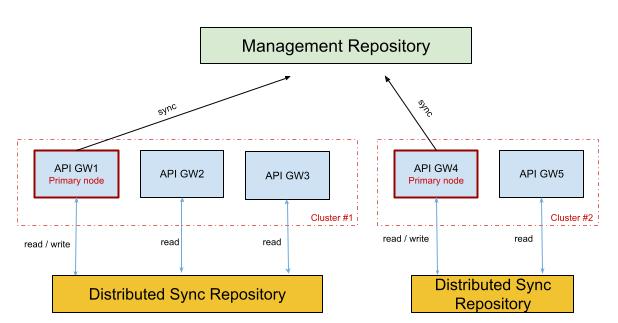

# Gateway Cluster sync with Redis

## Overview

### What is Gateway Cluster sync with Redis?

This guide explains how to enable and configure the Gateway Cluster sync with Redis.

The Gateway Cluster sync uses Redis to synchronize the state of APIs, API Keys, Subscriptions, Dictionaries, and Organizations across your API Gateways. This process maintains the state in memory, which ensures that API Gateways remain resilient and high-performing, even if the main repository is down.

### What issue does it solve?

The Gateway Cluster sync improves both scalability and resilience.

**Scalability**: Without the Gateway Cluster sync, each API Gateway must directly call the repository for synchronization. This configuration is not scalable because adding more API Gateways increases the repository load and slows the bootstrap time for each API Gateway. The Gateway Cluster sync solves this issue by using a primary node to manage the state, which significantly reduces the load.

**Resilience & High Availability**: By maintaining the state in Redis, new API Gateway instances can start and serve API traffic even if the central management repository or control plane is down. This ensures that you do not risk API outages during database maintenance or network disruptions.

### How does it work?

The new repository scope, `Distributed Sync`, is responsible for keeping the sync state for a cluster.

In the repository, the primary node stores information regarding the current synchronization state and what is currently deployed.

This allows another node to take over if the current primary node goes down without doing a full sync again.

When you enable the Gateway Cluster sync on your API Gateways, the primary node fetches the API definitions from the management repository, and then stores them in the Redis distributed sync repository. The other API Gateways read the API definitions from the Redis distributed sync repository.

<figure><figcaption><p>Gateway Cluster sync architecture</p></figcaption></figure>

### Distributed Synchronization State

The Synchronization State tracks the current sync process. It contains the following information:

* Cluster ID.
* Node version.
* Node ID.
* Last successful synchronization timeframe.

### Distributed Synchronization Event

The objects are used to know what needs to be deployed or undeployed across the cluster. They contain the following information:

* `id`. This is the identifier of the object.
* `Type`. This includes `API`, `API_KEY`, `SUBSCRIPTION`, `DICTIONARY`, `ORGANIZATION`, and `LICENSE`.
* `SyncAction`. This is `DEPLOY` or `UNDEPLOY`.
* `Payload`. This is the object to deploy or undeploy.
* `UpdatedAt`. This is the date of the update to allow incremental syncs.

After any business object is deployed, and only if distributed sync is enabled, the primary node stores those objects in the new distributed sync repository.

## Prerequisites

Before you enable the distributed sync with Redis, complete the following steps:


A standard Redis deployment without the Search module appears to connect successfully. However, every distributed-sync write fails with `Unknown command 'FT.CREATE'`, and the API Gateway never reaches a "ready" state.


* Install Redis with the search module. Distributed sync requires the RedisSearch module. To ensure that you have the RedisSearch module, use one of the following Redis modules:
    * The `redis/redis-stack` Docker image, which bundles RediSearch.
    * Redis 8+, which includes the Search module natively.
    * Redis 7 or earlier with the RediSearch module loaded. You can load the module by adding `loadmodule /usr/local/lib/redis/modules/redisearch.so` to your Redis configuration. For more information about Redis and RedisSearch, see [redis.md](../../../prepare-a-production-environment/repositories/redis.md "mention") and the [RedisSearch documentation](https://redis.io/docs/latest/develop/interact/search-and-query/).
* Obtain an Enterprise License. You must mount the license into every API Gateway pod to start the `repository-redis` plugin and load `DISTRIBUTED_SYNC`. For more information about obtaining an enterprise license, see [enterprise-edition.md](../../../readme/enterprise-edition.md "mention").
* Deploy a fully Self-Hosted Installation or a Hybrid Installation of APIM. For more information about self-hosted installation, see [self-hosted-installation-guides](../../../self-hosted-installation-guides/ "mention") or [hybrid-installation-and-configuration-guides](../../../hybrid-installation-and-configuration-guides/ "mention").
* Deploy at least two API Gateway replicas. Distributed sync works only when `gateway.replicaCount` is greater than or equal to 2, and `gateway.autoscaling.enabled` is `false`, because the Helm chart only honors `replicaCount` when the HPA is disabled.

## Enable Distributed sync

To configure Distributed sync with Redis, complete the following steps:

1. [Configure your Hazelcast Cluster for Docker installations](#configure-your-hazelcast-cluster-for-docker-installations)
2. [Configure your Redis Repository for Docker installations](#configure-your-redis-repository-for-docker-installations)
3. [Configure the distributed sync on the APIM Gateway](#configure-the-distributed-sync-on-the-apim-gateway)

### Configure your Hazelcast Cluster for Docker installations

1. In your `gravitee.yml` file, navigate to the `cluster` section, and then add the following configuration:

    
    ```yaml
    cluster:
        type: hazelcast
    ```
    

2. In the `${gravitee.home}/config/hazelcast-cluster.xml` file, add the following configuration:

    
    ```xml
    <hazelcast xmlns="[http://www.hazelcast.com/schema/config](http://www.hazelcast.com/schema/config)"
               xmlns:xsi="[http://www.w3.org/2001/XMLSchema-instance](http://www.w3.org/2001/XMLSchema-instance)"
               xsi:schemaLocation="[http://www.hazelcast.com/schema/config](http://www.hazelcast.com/schema/config)
               [http://www.hazelcast.com/schema/config/hazelcast-config-5.3.xsd](http://www.hazelcast.com/schema/config/hazelcast-config-5.3.xsd)">

        <cluster-name>gio-apim-cluster</cluster-name>
        <network>
            <port auto-increment="true" port-count="100">5701</port>
            <join>
                <auto-detection enabled="true"/>
                <multicast enabled="false"/>
                <tcp-ip enabled="true">
                    <member><gateway_client></member>
                    <member><gateway_client_2></member>
                    <member><gateway_server></member>
                </tcp-ip>
            </join>
        </network>
    </hazelcast>
    ```
    

    Use the following values to replace the variables:
    * `<gateway_client>`. Replace this with the name of your first API Gateway.
    * `<gateway_client_2>`. Replace this with the name of your second API Gateway.
    * `<gateway_server>`. Replace this with the name of your third API Gateway.

### Configure your Redis Repository for Docker installations

To enable your distributed sync repository, enable the Search module on your Redis instance.

1. Enable the Search module using the following command:

    ```bash
    docker run -d --name redis-stack -p 6379:6379 -p 8001:8001 redis/redis-stack:latest
    ```

### Configure the distributed sync on the APIM Gateway

To configure the distributed sync, follow the instructions that are relevant for your installation type:



1. In your Docker Compose file, navigate to the `distributed-sync` section, and then add the following configuration:

    
    ```yaml
    distributed-sync:
     type: redis
     redis:
       # Redis Standalone settings
       host: localhost
       port: 6379
       password:
       # Redis Sentinel settings
       sentinel:
         master: redis-master
         nodes:
           - host: sentinel1
             port: 26379
           - host: sentinel2
             port: 26379
       # SSL settings
       ssl: false
       trustAll: true # default value is true to keep backward compatibility but you should set it to false and configure a truststore for security concerns
       tlsProtocols: # List of TLS protocols to allow comma separated i.e: TLSv1.2, TLSv1.3
       tlsCiphers: # List of TLS ciphers to allow comma separated i.e: TLS_ECDHE_ECDSA_WITH_AES_256_GCM_SHA384, TLS_ECDHE_RSA_WITH_AES_256_GCM_SHA384, TLS_ECDHE_ECDSA_WITH_AES_256_CBC_SHA384, TLS_ECDHE_RSA_WITH_AES_256_CBC_SHA384
       alpn: false
       openssl: false # Used to rely on OpenSSL Engine instead of default JDK SSL Engine
       # Keystore for redis mTLS (client certificate)
       keystore:
         type: pem # Supports jks, pem, pkcs12
         path: ${gravitee.home}/security/redis-keystore.jks # A path is required if certificate's type is jks or pkcs12
         password: secret
         keyPassword:
         alias:
         certificates: # Certificates are required if keystore's type is pem
           - cert: ${gravitee.home}/security/redis-mycompany.org.pem
         key: ${gravitee.home}/security/redis-mycompany.org.key
           - cert: ${gravitee.home}/security/redis-mycompany.com.pem
         key: ${gravitee.home}/security/redis-mycompany.com.key
       truststore:
         type: pem # Supports jks, pem, pkcs12
         path: ${gravitee.home}/security/redis-truststore.jks
         password: secret
         alias:
    ```
    

2. In the `services` section, add the following configuration:

    
    ```yaml
    services:
      # Synchronization daemon used to keep the gateway state in sync with the configuration from the management repository
      # Be aware that, by disabling it, the gateway will not be sync with the configuration done through management API
      # and management UI
      sync:
        # Synchronization is done each 5 seconds
        delay: 5000
        unit: MILLISECONDS
        repository:
          enabled : true
        distributed:
          enabled : true # By enabling this mode, data synchronization process is distributed over clustered API gateways. You must configure distributed-sync repository.
        bulk_items: 100 # Defines the number of items to retrieve during synchronization (events, plans, API Keys, ...).
    ```
    

3. Start the API Gateway using the following command:

    ```bash
    docker compose up -d
    ```



1. In your `values.yaml` file, navigate to the `gateway.additionalPlugins` section, and then add the `gravitee-node-cluster-plugin-hazelcast` plugin. You must download the Hazelcast plugin at pod startup, and it must match the `gravitee-node` version of your APIM release. For example, for 4.10.x, the `gravitee-node` version is 7.26.x, and the URL of the Hazelcast plugin is `https://repo1.maven.org/maven2/io/gravitee/node/gravitee-node-cluster-plugin-hazelcast/7.26.3/gravitee-node-cluster-plugin-hazelcast-7.26.3.zip`. To confirm the bundled `gravitee-node`, check the `gravitee-api-management` `pom.xml` on the matching branch by using `grep gravitee-node.version`. 

    
    ```yaml
    gateway:
      additionalPlugins:
        - [https://repo1.maven.org/maven2/io/gravitee/node/gravitee-node-cluster-plugin-hazelcast/7.26.3/gravitee-node-cluster-plugin-hazelcast-7.26.3.zip](https://repo1.maven.org/maven2/io/gravitee/node/gravitee-node-cluster-plugin-hazelcast/7.26.3/gravitee-node-cluster-plugin-hazelcast-7.26.3.zip)
    ```
    

    
    The Helm chart automatically downloads plugins listed in `additionalPlugins` using an init container at pod startup. Ensure that the pod has outbound access to `repo1.maven.org`, or mirror the file internally and adjust the URL.
    

2. Create the Hazelcast configuration `ConfigMap` using the top-level `extraObjects` value. Hazelcast requires an XML configuration for pods to discover each other. For Kubernetes, use Hazelcast Kubernetes discovery. For more information about Hazelcast Kubernetes discovery, see the [Kubernetes auto discovery documentation](https://docs.hazelcast.com/hazelcast/5.4/kubernetes/kubernetes-auto-discovery).

    
    `<service-port>5701</service-port>` is mandatory. Without the service port, the pod-label discovery of Hazelcast silently fails. Peer pods are discovered, but the cluster never forms because port `5701` is not declared as a `containerPort` on the Gateway deployment. The `<service-port>` element tells Hazelcast which port to use against the discovered pods directly. This bypasses the missing `containerPort` or Service entry.
    

    
    ```yaml
    extraObjects:
      - apiVersion: v1
        kind: ConfigMap
        metadata:
          name: hazelcast-config
        data:
          hazelcast.xml: |
            <?xml version="1.0" encoding="UTF-8"?>
            <hazelcast xmlns="[http://www.hazelcast.com/schema/config](http://www.hazelcast.com/schema/config)"
                       xmlns:xsi="[http://www.w3.org/2001/XMLSchema-instance](http://www.w3.org/2001/XMLSchema-instance)"
                       xsi:schemaLocation="[http://www.hazelcast.com/schema/config](http://www.hazelcast.com/schema/config)
                       [http://www.hazelcast.com/schema/config/hazelcast-config-5.3.xsd](http://www.hazelcast.com/schema/config/hazelcast-config-5.3.xsd)">

                <cluster-name>gio-apim-cluster</cluster-name>

                <properties>
                    <property name="hazelcast.logging.type">slf4j</property>
                    <property name="hazelcast.max.wait.seconds.before.join">20</property>
                    <property name="hazelcast.member.list.publish.interval.seconds">10</property>
                    <property name="hazelcast.socket.client.bind.any">false</property>
                    <property name="hazelcast.max.no.heartbeat.seconds">20</property>
                </properties>

                <network>
                    <port auto-increment="false">5701</port>
                    <join>
                        <multicast enabled="false"/>
                        <tcp-ip enabled="false"/>
                        <kubernetes enabled="true">
                            <namespace>YOUR_NAMESPACE</namespace>
                            <pod-label-name>app.kubernetes.io/component</pod-label-name>
                            <pod-label-value>gateway</pod-label-value>
                            <service-port>5701</service-port>
                        </kubernetes>
                    </join>
                </network>
            </hazelcast>
    ```
    

    To complete the configuration, replace `YOUR_NAMESPACE` with the Kubernetes namespace where your gateways are deployed.

3. Mount the ConfigMap into the API Gateway with `extraVolumes` and `extraVolumeMounts`.

    
    ```yaml
    gateway:
      extraVolumes: |
        - name: hazelcast-config
          configMap:
            name: hazelcast-config
      extraVolumeMounts: |
        - name: hazelcast-config
          mountPath: /opt/graviteeio-gateway/config/hazelcast.xml
          subPath: hazelcast.xml
    ```
    

4. Grant the API Gateway `ServiceAccount` the RBAC permissions it needs to list pods. The Kubernetes discovery plugin for Hazelcast calls the Kubernetes API to list pods. The API Gateway `ServiceAccount` therefore needs `pods`, `endpoints`, `nodes`, and `services` read permissions. The default role of the chart only includes `configmaps` and `secrets`. Append the Hazelcast rules with `apim.roleRules`:

    
    ```yaml
    apim:
      roleRules:
        # Default chart rules — keep these.
        - apiGroups: [""]
          resources: [configmaps, secrets]
          verbs: [get, list, watch]
        # Required for Hazelcast Kubernetes auto-discovery.
        - apiGroups: [""]
          resources: [pods, endpoints, nodes, services]
          verbs: [get, list]
    ```
    

    
    Without these RBAC rules, the Hazelcast plugin starts but fails to discover peers. You see `Forbidden: cannot list resource "pods"` in the gateway logs, and the second API Gateway never joins the cluster.
    

5. Enable clustering and distributed sync by setting the following configuration in your `values.yaml` file:

    
    Do not enable `services.sync.kubernetes.enabled` unless you are running the Gravitee Kubernetes Operator (GKO). That property turns on a parallel sync source that reads API definitions from Kubernetes `ConfigMap`s, not a "use Kubernetes in distributed-sync mode" switch.
    

    
    ```yaml
    gateway:
      replicaCount: 2
      autoscaling:
        enabled: false

      cluster:
        type: hazelcast
        hazelcast:
          configPath: /opt/graviteeio-gateway/config/hazelcast.xml

      distributedSync:
        enabled: true
        type: redis
        redis:
          host: redis
          port: 6379
          # password:                  # if Redis requires auth
          # ssl: false
          # trustAll: true
          # tlsProtocols: TLSv1.2
          # sentinel:                  # uncomment for Sentinel
          #   master: redis-master
          #   nodes:
          #     - host: sentinel1
          #       port: 26379

      services:
        sync:
          repository:
            enabled: true
          distributed:
            enabled: true
          # Do NOT enable services.sync.kubernetes.enabled unless you are running
          # the Gravitee Kubernetes Operator (GKO / dbLess mode). It is unrelated to
          # distributed sync and is a frequent source of failing startup probes
          # on secondary nodes — see the Troubleshooting section.
    ```
    

6. Mount your Enterprise license, and then create the secret using the following configurations:

    
    ```yaml
    license:
      name: licensekey-apim   # K8s secret name holding key 'licensekey'
    ```
    

    ```bash
    kubectl -n gravitee-apim create secret generic licensekey-apim \
      --from-file=licensekey=/path/to/license.key
    ```

    Review the following full `values.yaml` example:

    
    ```yaml
    extraObjects:
      - apiVersion: v1
        kind: ConfigMap
        metadata:
          name: hazelcast-config
        data:
          hazelcast.xml: |
            <?xml version="1.0" encoding="UTF-8"?>
            <hazelcast xmlns="[http://www.hazelcast.com/schema/config](http://www.hazelcast.com/schema/config)"
                       xmlns:xsi="[http://www.w3.org/2001/XMLSchema-instance](http://www.w3.org/2001/XMLSchema-instance)"
                       xsi:schemaLocation="[http://www.hazelcast.com/schema/config](http://www.hazelcast.com/schema/config)
                       [http://www.hazelcast.com/schema/config/hazelcast-config-5.3.xsd](http://www.hazelcast.com/schema/config/hazelcast-config-5.3.xsd)">
                <cluster-name>gio-apim-cluster</cluster-name>
                <properties>
                    <property name="hazelcast.logging.type">slf4j</property>
                    <property name="hazelcast.max.wait.seconds.before.join">20</property>
                    <property name="hazelcast.member.list.publish.interval.seconds">10</property>
                    <property name="hazelcast.socket.client.bind.any">false</property>
                    <property name="hazelcast.max.no.heartbeat.seconds">20</property>
                </properties>
                <network>
                    <port auto-increment="false">5701</port>
                    <join>
                        <multicast enabled="false"/>
                        <tcp-ip enabled="false"/>
                        <kubernetes enabled="true">
                            <namespace>gravitee-apim</namespace>
                            <pod-label-name>app.kubernetes.io/component</pod-label-name>
                            <pod-label-value>gateway</pod-label-value>
                            <service-port>5701</service-port>
                        </kubernetes>
                    </join>
                </network>
            </hazelcast>

    apim:
      roleRules:
        - apiGroups: [""]
          resources: [configmaps, secrets]
          verbs: [get, list, watch]
        - apiGroups: [""]
          resources: [pods, endpoints, nodes, services]
          verbs: [get, list]

    license:
      name: licensekey-apim

    gateway:
      enabled: true
      replicaCount: 2
      autoscaling:
        enabled: false

      additionalPlugins:
        - [https://repo1.maven.org/maven2/io/gravitee/node/gravitee-node-cluster-plugin-hazelcast/7.26.3/gravitee-node-cluster-plugin-hazelcast-7.26.3.zip](https://repo1.maven.org/maven2/io/gravitee/node/gravitee-node-cluster-plugin-hazelcast/7.26.3/gravitee-node-cluster-plugin-hazelcast-7.26.3.zip)

      cluster:
        type: hazelcast
        hazelcast:
          configPath: /opt/graviteeio-gateway/config/hazelcast.xml

      distributedSync:
        enabled: true
        type: redis
        redis:
          host: redis-stack
          port: 6379

      services:
        sync:
          repository:
            enabled: true
          distributed:
            enabled: true

      extraVolumes: |
        - name: hazelcast-config
          configMap:
            name: hazelcast-config
      extraVolumeMounts: |
        - name: hazelcast-config
          mountPath: /opt/graviteeio-gateway/config/hazelcast.xml
          subPath: hazelcast.xml
    ```
    




## Verification



1. Review your API Gateway logs for the following output:

    ```yaml
    11:42:04.001 [main] [] INFO  i.g.n.c.plugin.ClusterPluginHandler - Install plugin: cluster-hazelcast [io.gravitee.node.plugin.cluster.hazelcast.HazelcastClusterManager]
    11:42:04.270 [main] [] WARN  c.h.i.impl.HazelcastInstanceFactory - Hazelcast is starting in a Java modular environment (Java 9 and newer) but without proper access to required Java packages. Use additional Java arguments to provide Hazelcast access to Java internal API. The internal API access is used to get the best performance results. Arguments to be used:
     --add-modules java.se --add-exports java.base/jdk.internal.ref=ALL-UNNAMED --add-opens java.base/java.lang=ALL-UNNAMED --add-opens java.base/sun.nio.ch=ALL-UNNAMED --add-opens java.management/sun.management=ALL-UNNAMED --add-opens jdk.management/com.sun.management.internal=ALL-UNNAMED
    11:42:04.699 [main] [] WARN  com.hazelcast.cp.CPSubsystem - [127.0.0.1]:5701 [gio-apim-gateway] [5.3.6] CP Subsystem is not enabled. CP data structures will operate in UNSAFE mode! Please note that UNSAFE mode will not provide strong consistency guarantees.
    11:42:10.128 [main] [] INFO  i.g.n.c.plugin.ClusterPluginHandler - Cluster manager plugin 'cluster-hazelcast' installed.
    11:42:10.128 [main] [] INFO  i.g.n.c.plugin.ClusterPluginHandler - Plugin 'cluster-hazelcast' installed.

    ...

    11:42:11.746 [main] [] INFO  i.g.p.r.i.RepositoryPluginHandler - Install plugin: repository-redis [io.gravitee.repository.redis.RedisRepositoryProvider]
    11:42:11.746 [main] [] INFO  i.g.p.r.i.RepositoryPluginHandler - Register a new repository: repository-redis [io.gravitee.repository.redis.RedisRepositoryProvider]
    11:42:11.747 [main] [] INFO  i.g.p.r.i.RepositoryPluginHandler - Repository [DISTRIBUTED_SYNC] loaded by redis
    11:42:11.788 [main] [] INFO  i.g.p.r.i.RepositoryPluginHandler - Plugin 'repository-redis' installed.

    ...

    11:42:12.677 [main] [] INFO  i.g.node.container.AbstractNode - Gravitee - API Gateway id[da56a9b0-7e6a-4dec-96a9-b07e6a2decfd] version[4.3.6] pid[17705] build[${env.BUILD_NUMBER}#${env.GIT_COMMIT}] jvm[Eclipse Adoptium/OpenJDK 64-Bit Server VM/17.0.6+10] started in 8687 ms.
    ```




After the `helm upgrade --install ... --wait` command completes, complete the following steps to verify the Gateway cluster sync with Redis:

1. Ensure that both API Gateway pods are `Running` and `Ready` using `kubectl -n gravitee-apim get pods -l app.kubernetes.io/component=gateway`. With distributed sync enabled, the default Helm `startupProbe` queries `/_node/health?probes=http-server,sync-process`.
2. Ensure that the Hazelcast cluster has two members. Exec into either pod, and then grep the log with the following command:

   ```bash
   kubectl -n gravitee-apim logs <pod> -c gravitee-apim-gateway | grep "MembershipEvent"
   ```
   You see `members=[Member [10.x.x.x]:5701 …, Member [10.y.y.y]:5701 …]`.

3. Ensure that the Redis repository is loaded with the `DISTRIBUTED_SYNC` scope. Here is an example output:

   ```text
   INFO  i.g.p.r.i.RepositoryPluginHandler - Repository [DISTRIBUTED_SYNC] loaded by redis
   ```

4. Ensure that the Distributed sync writes to Redis for the primary node only using the following command:

   ```bash
   kubectl -n gravitee-apim exec deploy/redis-stack -- redis-cli FT._LIST
   # Expect at least: idx:distributed-sync-state, idx:distributed-sync-events
   ```

5. Ensure that All probes return `200` with the following command:

   ```bash
   kubectl -n gravitee-apim exec <pod> -c gravitee-apim-gateway -- \
     curl -s "http://admin:<password>@127.0.0.1:18082/_node/health?probes=http-server,sync-process"
   # Expect: {"sync-process":{"healthy":true},"http-server":{"healthy":true}}
   ```


