# Sharding Tags

## Overview

Sharding tags allow you to “tag” Gateways with a keyword and deploy specific APIs to a specific Gateway with a certain tag. You can apply _sharding tags_ on APIM Gateway instances either at the system property level, with Helm `values.yaml` or with `gravitee.yml`.

Gateways can be tagged with one or more sharding tags. Additionally, the `!` symbol can be placed before the tag name to specify exclusion rules.

To learn more about how to deploy APIs to specific Gateways based on sharding tags, refer to [Configure Deployments](../../create-and-configure-apis/configure-v2-apis/proxy-settings.md) (see [Configure API Product Deployment](../../secure-and-expose-apis/api-products/configure-api-product-deployment.md)).

## Tagged Gateway/API behavior

API deployment is impacted by how tags are applied to APIs and Gateways.

### Rules

* Tagged Gateway instances never deploy tagless APIs.
* Tagless Gateway instances retrieve and deploy every API, regardless of how the APIs are tagged.
* An API defined with a specific tag is only deployed on a Gateway that has been assigned that tag.

### Examples

* A tagless API is not be deployed on a Gateway tagged with `x`.
* An API tagged with `x` is deployed on a tagless Gateway.
* A tag-less API will be deployed on a tagless Gateway.
* An API defined with tag `x` is deployed on a Gateway that has been assigned tag `x`.
* An API defined with tag `x` is deployed on a Gateway that has been assigned tag `!y`. The tag `!y` means that the Gateway has been assigned every tag but `y`.

## Configure sharding tags for your internal and external Gateways

If you have an architecture that includes both DMZ Gateways and internal corporate Gateways, you can tag these Gateways as external-only and internal-only, as shown in this diagram:

<figure><figcaption></figcaption></figure>

Before sharding tags can be defined in your APIM Console, you must define the configuration to assign a tag to a Gateway. For example:

```
DMZ Gateways: 
  tags: 'external'
```

```
Internal Network Gateways:
  tags: 'internal'
```

You can also exclude Gateways from tags. For example, the following sharding tag definition configures a Gateway to host APIs that are not dedicated to partners:

```yaml
  tags: 'product,store,!partner'
```

Once Gateways have been tagged, you must define these sharding tags must within API Manager. To navigate to the **Entrypoint & Sharding Tags**, click **Organization**, and then click **Entrypoint & Sharding Tags**.

## Configure sharding tags for your APIs

To configure sharding tags, complete the following steps:

* [#create-a-tag-in-the-apim-console](sharding-tags.md#create-a-tag-in-the-apim-console "mention")
* [#add-sharding-tags-to-your-apis](sharding-tags.md#add-sharding-tags-to-your-apis "mention")
* [#add-the-tag-key-to-values.yaml-gravitee.yml-or-with-environment-variables](sharding-tags.md#add-the-tag-key-to-values.yaml-gravitee.yml-or-with-environment-variables "mention")

### Create a tag in the APIM Console

1.  In the **Dashboard**, click **Organization**.

    <figure>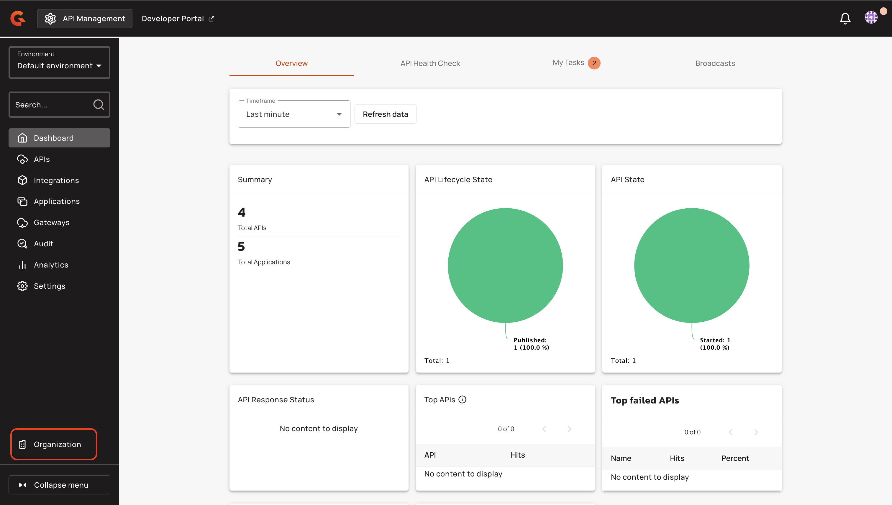<figcaption></figcaption></figure>
2.  In the **Organization** menu, click **Entrypoints & Sharding Tags**.

    <figure>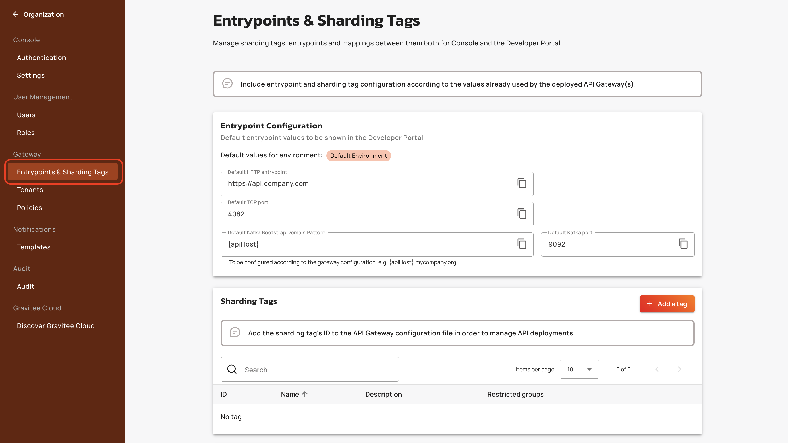<figcaption></figcaption></figure>
3.  Navigate to **Sharding Tags**, and then click **+ Add a tag**.

    <figure>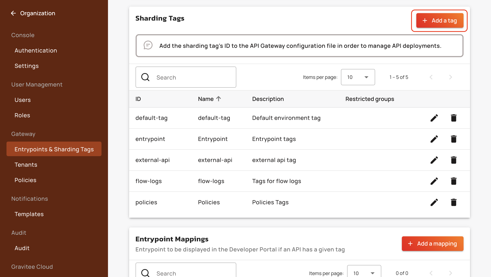<figcaption></figcaption></figure>
4. In the **Create a tag** pop-up window, enter the following information:
   1. In the **Name** field, enter the name of the tag.
   2. In the **Key** field, enter a unique key for the tag. The key accepts 1–64 lowercase alphanumeric characters and hyphens only. The key is immutable after creation and is the value used in `gravitee.yml` and API path parameters.
   3. (Optional) In the **Description** field, enter a description for the tag.
   4.  (Optional) From the **Restricted groups** drop-down menu, select the groups that you want to be able to deploy to this tag.

       <figure>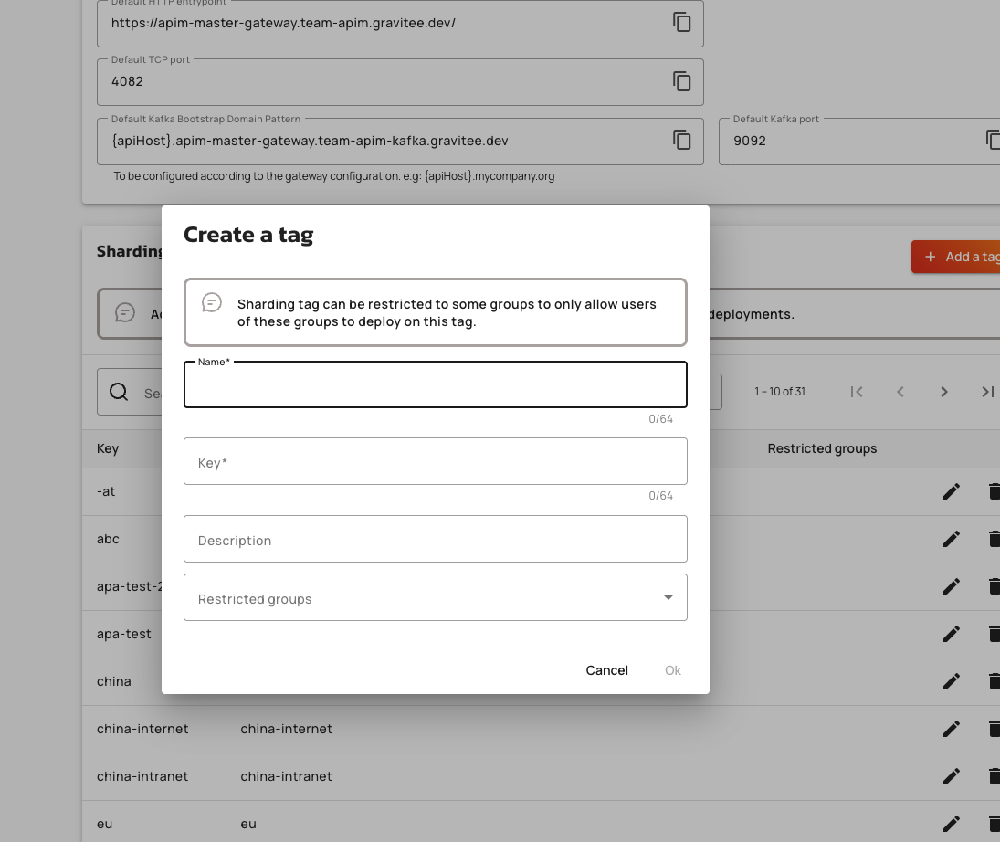<figcaption><p>Create a tag dialog with Name, Key, Description, and Restricted groups fields</p></figcaption></figure>
5. Click **Ok**. The sharding tag now appears in the list of **Sharding Tags**. The **Key** column displays the tag key used for Gateway configuration and API operations.

### Add sharding tags to your APIs

1.  From the **Dashboard**, click **APIs**.

    <figure><figcaption></figcaption></figure>
2.  In the **APIs** screen, select the API to which you want to add a sharding tag.

    <figure>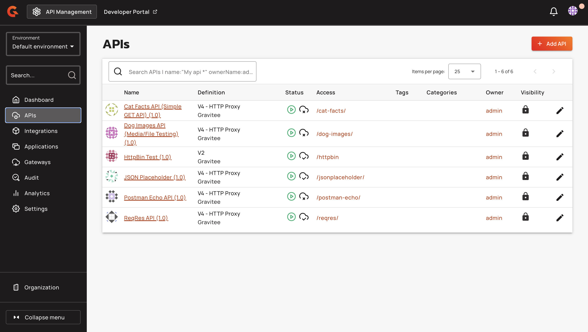<figcaption></figcaption></figure>
3.  In the **APIs** menu, click **Deployment**.

    <figure>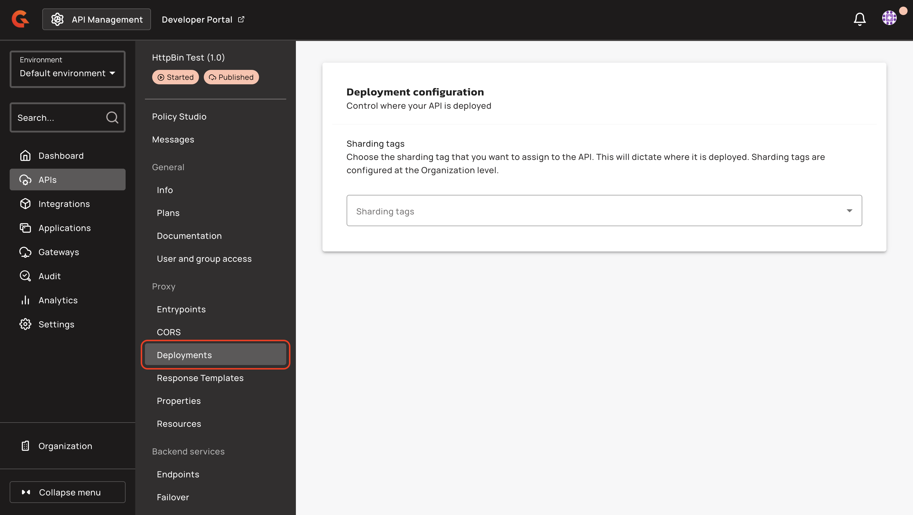<figcaption></figcaption></figure>
4. In the **Deployment** screen, navigate to the **Deployment configuration** section.
5.  From the **Sharding tags** drop-down menu, select the sharding tag that you want to add to the API.

    <figure>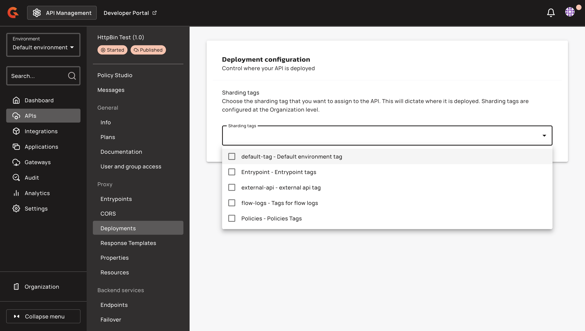<figcaption></figcaption></figure>
6.  In the **You have unsaved changes** pop-up, click **Save**.

    <figure>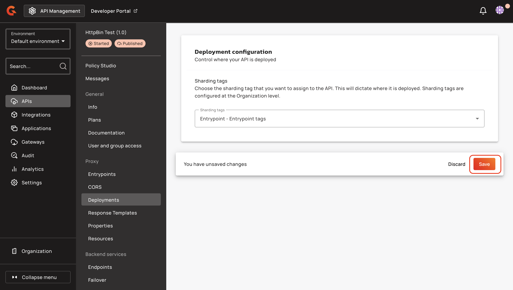<figcaption></figcaption></figure>

### Add the tag key to `values.yaml`, `gravitee.yml` or with environment variables

1. Find the key for your sharding tag(s). To find the key of your sharding tag(s), complete the following substeps:
   1. From the **Dashboard**, click **Organization**.
   2. In the **Organization** menu, click **Entrypoints & Sharding Tags**.
   3. Navigate to the **Sharding Tags** section. The key of your sharding tag is in the **Key** column.
2. Add the key of your sharding tag or tags to either your Helm `values.yaml`, `gravitee.yml` file or as environment variables by completing the set of following steps that match your configuration:



In your `values.yaml` file, add the following configuration:


```yaml
# Sharding tags configuration
# Allows to define inclusion/exclusion sharding tags to only deploy a part of APIs. To exclude just prefix the tag with '!'.
gateway:
  sharding_tags: <tag1>, <tag2>, !<tag3>
```


* Replace `<tag1>, <tag2>, !<tag3>` with a comma-separated list of your sharding tag keys.
* To exclude a tag from a Gateway configuration, add an exclamation mark (!) before the tag.



In your `gravitee.yml` file, add the following configuration:


```yaml
# Sharding tags configuration
# Allows to define inclusion/exclusion sharding tags to only deploy a part of APIs. To exclude just prefix the tag with '!'.
#tags: <tag1>, <tag2>, !<tag3>
```


* Uncomment `#tags: <tag1>, <tag2>, !<tag3>`.
* Replace `<tag1>, <tag2>, !<tag3>` with a comma-separated list of your sharding tag keys.
* To exclude a tag from a Gateway configuration, add an exclamation mark (!) before the tag.



Add the following environment variable:


```bash
gravitee_tags=<tag1>,<tag2>,!<tag3>
```


* Replace `<tag1>, <tag2>, !<tag3>` with a comma-separated list of your sharding tag keys.
* To exclude a tag from a Gateway configuration, add an exclamation mark (!) before the tag.



In your `docker-compose.yml` file, add the following _environment variable_ configuration:


```yaml
# Sharding tags configuration
# Allows to define inclusion/exclusion sharding tags to only deploy a part of APIs. To exclude just prefix the tag with '!'.
gateway:
  environment:
    - gravitee_tags=<tag1>, <tag2>, !<tag3>
```


* Replace `<tag1>, <tag2>, !<tag3>` with a comma-separated list of your sharding tag keys.
* To exclude a tag from a Gateway configuration, add an exclamation mark (!) before the tag.



## Map entrypoints to sharding tags

You can also map different entrypoint URLs to specific sharding tags (for auto-generating the display of full URLS in the Developer Portal. The Portal displays available entrypoints based on an API's tag(s).

For example, to configure Gravitee API Manager to apply the “internal test” tag to all APIs tagged with this entrypoint:

1.  In the **Dashboard**, click **Organization**.

    <figure><figcaption></figcaption></figure>
2.  In the **Organization** menu, click **Entrypoints & Sharding Tags**.

    <figure><figcaption></figcaption></figure>
3.  Navigate to **Entrypoint Mappings**, and then click **+ Add a mapping**.

    <figure>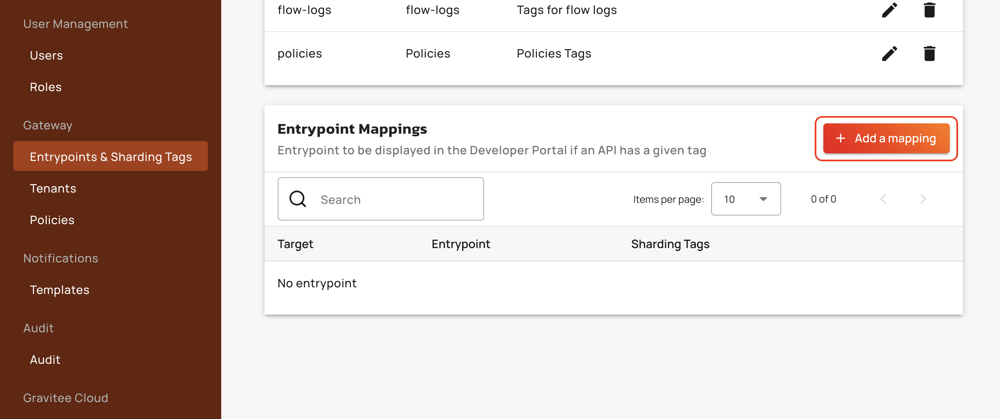<figcaption></figcaption></figure>
4. From the **+ Add a mapping** drop-down menu, select one of the following entrypoints:
   * HTTP
   * TCP
   * Kafka
5. In the **Create an entrypoint** pop-up window, enter the following information based your entrypoint:



1) From the **Sharding tags** drop-down menu, select the sharding tags that you want to map to the entrypoint.
2)  In the **Entrypoint url** field, enter your entrypoint URL.

    <figure>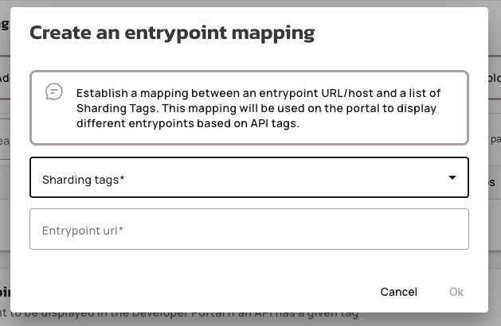<figcaption></figcaption></figure>
3) Click **Ok.**



1. From the **Sharding tags** drop-down menu, select the sharding tags that you want to map to this entrypoint.
2.  In the **Default TCP port** field, type the number of your TCP port.

    <figure>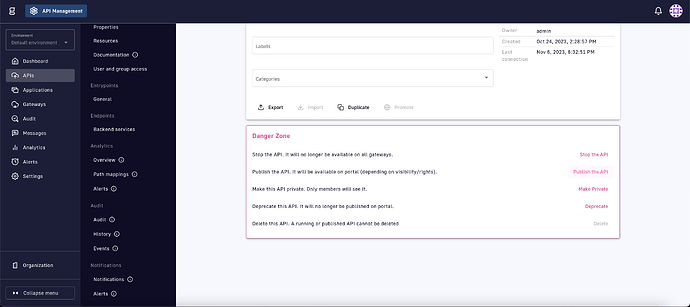<figcaption></figcaption></figure>
3. Click **Ok**.



1. From the **Sharding tags** drop-down menu, select the sharding tags that you want to map to this entrypoint.
2. In the **Default Kafka domain** field, type your Default Kafka domain.
3.  In the **Default Kafka port** field, type your default Kafka port.

    <figure>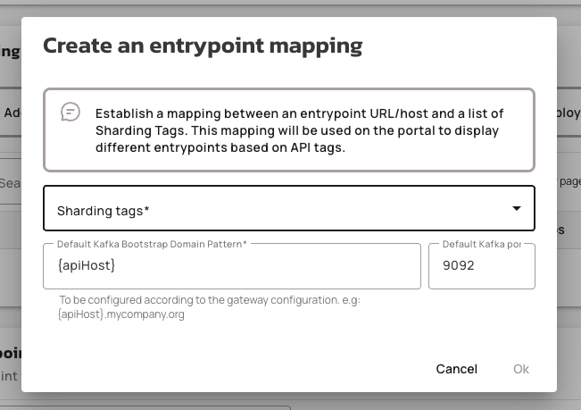<figcaption></figcaption></figure>
4. Click **Ok**.



Your entrypoint mapping is displayed in **Entrypoint Mappings**.


You've just learned how to configure sharding tags for your Gravitee API Gateways. To apply sharding tags to APIs to control where those APIs are deployed, refer to [this documentation](../../create-and-configure-apis/configure-v2-apis/proxy-settings.md).


### Overview

API Product deployment control enables platform administrators to assign sharding tags to API Products and their plans, determining which gateway instances serve each product. By tagging products and plans with organization-level sharding tags, administrators can route API Products to specific geographic regions, environments, or gateway clusters. This capability extends the existing API-level sharding tag model to API Products, ensuring consistent deployment control across both standalone APIs and product-managed APIs.

### Key Concepts

#### Sharding Tags

Sharding tags are organization-level identifiers that control where API Products, plans, and APIs are deployed. Each gateway instance declares one or more sharding tags in its configuration. The gateway indexes and serves only those entities whose tags intersect with its configured tags. Sharding tags defined at the organization level serve as the source of truth; API Product and plan tags must reference keys defined in the organization's sharding tag registry.

#### API Product Tags

API Product tags determine which gateway instances index and serve the product. A product with no tags is eligible on all gateways. A product with one or more tags is indexed only on gateways whose configured tags intersect with the product's tags. Product tags act as the ceiling for plan tags—no plan can be assigned a tag that the product itself does not have. When an API Product's tags are narrowed, any plan tags no longer present in the product tag set are automatically removed from affected plans.

#### Plan Tags

Plan tags refine deployment eligibility within the scope of the parent API Product. Plan tags must be a subset of the API Product's tags. A plan with no tags inherits the product's gateway eligibility—it is indexed on every gateway where the parent product is eligible. A plan with one or more tags is indexed only on gateways where both the product's tags and the plan's tags match the gateway's configured tags. Plan tags enable administrators to deploy different plans to different gateway clusters within the same product.

#### Member API Deployment Eligibility

A member API (an API included in an API Product) is deployed on a gateway if either its own sharding tags match the gateway, or it has at least one published or deprecated API Product plan indexed on that gateway. For the product plan path, the product's tags must match the gateway, and the plan's tags must be empty (inheriting product placement) or match the gateway. This dual-path eligibility model allows APIs without matching tags to run on gateways via product plan inclusion, while standalone APIs continue to deploy only when their own tags match.

### Prerequisites

* Organization-level sharding tags must be defined in **Organization → Entrypoints & Sharding Tags** before they can be assigned to API Products or plans.
* Gateway instances must declare the corresponding sharding tag keys in their configuration files to index and serve tagged products.
* Users assigning sharding tags must have the `API_PRODUCT_DEFINITION:UPDATE` permission for API Products and `API_PRODUCT_PLAN:CREATE` or `API_PRODUCT_PLAN:UPDATE` permission for plans.
* Group-restricted sharding tags can only be assigned by users who are members of the tag's restricted groups.

### Gateway Configuration

Gateway instances must declare sharding tags in their configuration to participate in tag-based deployment filtering. When no sharding tags are configured, the gateway retrieves all API Products, plans, and APIs. When one or more sharding tags are configured, the gateway indexes only entities whose tags intersect with its configured tags.

To configure sharding tags for a gateway, navigate to **Organization > Gateway > Entrypoints & Sharding Tags** in the Console. The **Sharding Tags** section displays all tags available for gateway configuration.

<figure>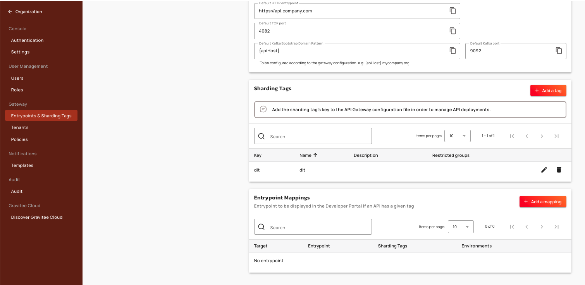<figcaption></figcaption></figure>

After creating or deleting a sharding tag, the Console displays a success notification and updates the sharding tags table to reflect the current state.

<figure><figcaption></figcaption></figure>

Sharding tags can be configured as **restricted** or **external**. To create or edit a restricted tag, click the edit icon next to the tag or click **Add a tag**. In the **Edit a tag** dialog, provide a name, key, and optional description. Select one or more restricted groups from the **Restricted groups** dropdown to limit which users can deploy APIs with this tag.

<figure><figcaption></figcaption></figure>

To create an external tag, provide only a name and key in the **Edit a tag** dialog. External tags do not require restricted group assignment and are available to all users.

<figure><figcaption></figcaption></figure>

Once sharding tags are defined in the Console, add the tag keys to the API Gateway configuration file to enable tag-based filtering. The gateway will then retrieve only API Products, plans, and APIs that match its configured tags.
