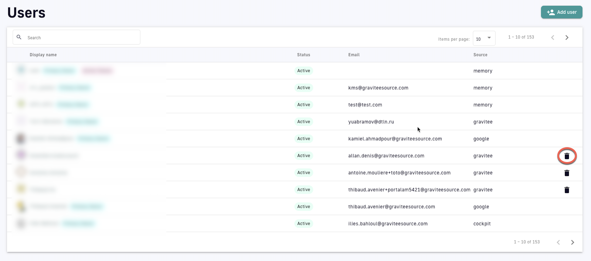

# User Management

## Overview

This article describes how to set up and manage roles, scopes, permissions, users, and user groups in Gravitee.

## Roles

A role is a functional group of permissions. Roles can be defined at the Organization, Environment, API, or Application level.

Gravitee offers pre-built default roles, and also lets you create an unlimited number of custom user roles. Each role has the following characteristics:

* It is associated with a group of permissions.
* It is scoped to define API Management resources available to the user. Gravitee scopes correspond to sets of permissions at the Organization, Environment, API, and Application levels.
* It defines what you can do with APIM UI components and the APIM Management API.


By default, only a System Admin (a role created by Gravitee) can create and edit roles, including custom roles.


The APIM Console lets you add and delete roles for the Organization, Environment, API, and Application scopes. You can also see which users have which roles.

To set up roles, complete the following steps:

1. Log in to your APIM Console
2. Select **Organization** from the left nav
3. Select **Roles** from the **User Management** section
4. Click **+ Add a role** for the desired scope
   * Give the role a name
   * (Optional) Give the role a description
   * (Optional) Toggle **Default role** ON to assign this role to new users by default
   * Set create, read, update, and delete permissions for the role
5. Click **Create**


Custom Roles is an [Enterprise Edition](../../introduction/enterprise-edition.md) capability. To learn more about Gravitee Enterprise and what's included in various enterprise packages, [book a demo](https://app.gitbook.com/o/8qli0UVuPJ39JJdq9ebZ/s/rYZ7tzkLjFVST6ex6Jid/) or [check out the pricing page](https://www.gravitee.io/pricing).


Example: Custom "Writer" role

To create a custom "Writer" role:

1. Log in to the API Management Console
2. Select **Organizations** from the left-hand nav
3. Click **Roles** under **User Management**
4. At the **API** scope, click **+ Add a role**
5. Enter "Writer" in the **Role name** text field
6. Give the role a description, such as "These users can create, update, read, and delete API documentation."
7. (Optional) To make this the default role for new users, toggle **Default role** ON
8. Define the following permissions:\
   \- **`Read`** permissions on **`DEFINITION`** and **`GATEWAY_DEFINITION`**: Allows the user to see the API in the API list\
   \- **`CRUD`** permissions on **`DOCUMENTATION`**: Allows the user to write new API documentation
9. Click **Create**

The "Writer" role now appears in the API scope section.

## Permissions

Every permission grants some combination of four actions:

* **Create**: add new instances of the resource.
* **Read**: view or list the resource.
* **Update**: modify the resource.
* **Delete**: remove the resource.

The Role editor shows all four checkboxes for every permission, but a permission only enforces the actions listed in its **Actions** column below. Ticking an action that a permission doesn't enforce has no effect. For example, a read-only permission enforces only **Read**.

The available permissions differ by scope. The following sections list the permissions for each scope, the actions each one enforces, and the resource it controls. The permission names match the identifiers shown in the Role editor in the APIM Console.

#### Organization permissions

Organization-scoped permissions govern administration that spans every environment: users, roles, identity providers, and platform-level configuration.

| Permission | Actions | Description |
| ---------- | ------- | ----------- |
| `AUDIT` | Read | The organization audit log, a read-only record of configuration changes across the organization. |
| `CUSTOM_USER_FIELDS` | Create, update, delete | Extra profile fields, beyond name and email, that you define and collect on user accounts. |
| `ENTRYPOINT` | Create, read, update, delete | The base URLs the gateway listens on and the Developer Portal uses to build consumer addresses, managed at the organization level. |
| `ENVIRONMENT` | - | The isolated deployment targets, for example dev, test, and prod, within the organization. |
| `IDENTITY_PROVIDER` | Create, read, update, delete | The external authentication sources, such as OIDC, SAML, LDAP, and social logins, used to sign users in. |
| `IDENTITY_PROVIDER_ACTIVATION` | Create, read, update, delete | Controls which configured identity providers are offered on the login screen at the organization level. |
| `INSTALLATION` | Read | The APIM installation as a whole, including its link to Gravitee Cloud. |
| `LICENSE_MANAGEMENT` | - | Viewing and updating the Enterprise Edition license. |
| `NOTIFICATION_TEMPLATES` | Create, read, update | The reusable email and message templates Gravitee sends for platform events such as registration and subscription approval. |
| `POLICIES` | Create, update, delete | Organization-wide policy configuration and which policies are available. |
| `ROLE` | Create, read, update, delete | Roles and their permission sets. Covers creating and editing roles, including custom roles. |
| `SETTINGS` | Create, read, update, delete | The global console configuration values for the organization. |
| `TAG` | Create, read, update, delete | Sharding tags, the labels that match APIs to gateway instances, managed at the organization level. |
| `TENANT` | Create, update, delete | Tenants, the logical partitions used to route calls to tenant-specific backends. |
| `USER` | Create, read, update, delete | User accounts. Covers viewing, creating, editing, and deleting users. |
| `USER_TOKEN` | Create, read, delete | Personal Access Tokens that users generate to authenticate to the Management API in place of interactive login. |

#### Environment permissions

Environment-scoped permissions govern everything within a single environment: the APIs and applications it contains, plus environment-level configuration, analytics, and portal settings.

| Permission | Actions | Description |
| ---------- | ------- | ----------- |
| `AGENT_IDENTITY` | Create, read, update, delete | The registered identity of an AI agent in Agent Management, which lets it act through the gateway. |
| `AI_CATALOG` | Create, read, update, delete | The catalog of AI and LLM services exposed through Gravitee for consumers to discover and subscribe to. |
| `ALERT` | Create, read, update, delete | Environment-level alerting rules that fire a notification when a condition is met. |
| `AM_CONFIGURATION` | Create, read, update | The configuration that links the environment to a Gravitee Access Management instance for authentication. |
| `API` | Create, read, update | APIs in general at the environment level. The **Create** action controls whether the user can create an API. The **Read** action allows the user to request the policy and resource lists. |
| `API_HEADER` | Create, read, update, delete | The labeled metadata fields, for example Team or Version, shown on API cards and detail pages in the Developer Portal. |
| `API_PRODUCT` | Create, read | API Products, bundles of one or more APIs packaged and subscribed to as a single offering. |
| `APPLICATION` | Create, read, update | Applications in general at the environment level. The **Create** action allows creating an application. The **Read** action allows listing applications. |
| `AUDIT` | Read | The environment audit log, a read-only record of configuration changes in the environment. |
| `AUTHORIZATION` | Create, read, delete | The environment's authorization configuration. |
| `AUTHZ_ENTITIES` | Create, read, update, delete | In fine-grained authorization, the entities and objects, such as users and resources, that the authorization model evaluates. |
| `AUTHZ_PDP` | Update | The Policy Decision Point that evaluates an authorization request and returns permit or deny. |
| `AUTHZ_POLICIES` | Create, read, update, delete | The rules the Policy Decision Point evaluates to grant or deny access to a resource. |
| `AUTHZ_SCHEMA` | Read, update, delete | The entity, attribute, and relationship model that authorization policies are written against. |
| `CATEGORY` | Create, read, update, delete | Categories, the labels used to group related APIs so consumers can browse them by theme in the portal. |
| `CLIENT_REGISTRATION_PROVIDER` | Create, read, update, delete | External OAuth and OIDC servers that Gravitee calls to automatically create client credentials through Dynamic Client Registration. |
| `CLUSTER` | Create, read | Clusters, defined groups of Kafka or gateway nodes managed as a single unit within the environment. |
| `DASHBOARD` | Create, read, update, delete | Configurable arrangements of analytics widgets and charts over API traffic. |
| `DICTIONARY` | Create, read, update, delete | Dictionaries, named sets of key-value properties that API definitions reference at runtime through Expression Language. |
| `DOCUMENTATION` | Create, read, update, delete | The Developer Portal documentation content shown to consumers. |
| `EDGE_CONFIGURATION` | - | Gateway edge-level runtime settings applied across the environment. |
| `ENTRYPOINT` | Create, read, update, delete | The base URLs the gateway serves and the portal advertises, scoped to the environment. |
| `GROUP` | Create, read, update, delete | User groups, named collections of users that jointly own APIs and applications. |
| `IDENTITY_PROVIDER_ACTIVATION` | Create, read, update, delete | Controls which identity providers are enabled at the environment level. |
| `INSTANCE` | Read | API Gateway instance information. |
| `INTEGRATION` | Create, read, delete | Integrations for Federation, connections to external API providers such as AWS API Gateway, Solace, or Confluent whose APIs are ingested into Gravitee. |
| `MESSAGE` | Create | Broadcast announcements pushed to API consumers. |
| `METADATA` | Create, read, update, delete | Custom key-value attributes attached at the environment level. |
| `NOTIFICATION` | Read | Environment-level notification configuration. |
| `PLATFORM` | Read | Aggregate monitoring metrics across the environment. |
| `PORTAL` | Create, read, update, delete | The Developer Portal configuration for discovering, subscribing to, and consuming APIs. |
| `QUALITY_RULE` | Create, read, update, delete | Governance checks scored against APIs to enforce documentation and design standards. |
| `SETTINGS` | Create, read, update, delete | The per-environment configuration values. |
| `SHARED_POLICY_GROUP` | Create, read, update, delete | Reusable, centrally managed sequences of policies that multiple APIs include by reference. |
| `TAG` | Create, read, update, delete | Sharding tags, scoped to the environment's tag set. |
| `TENANT` | Create, update, delete | Tenants, scoped to the environment. |
| `THEME` | Create, read, update, delete | The branding and appearance definition applied to the Developer Portal. |
| `TOP_APIS` | Create, read, update, delete | The curated, ordered list of featured APIs highlighted on the portal home page. |

#### API permissions

API-scoped permissions are applied per API to the members of that API. They correspond to the tabs and actions available when editing a single API.

| Permission | Actions | Description |
| ---------- | ------- | ----------- |
| `ALERT` | Create, read, update, delete | Alerting rules for this API that fire a notification when a condition is met. |
| `ANALYTICS` | Read | Traffic metrics collected for this API, such as request counts, response times, and status codes. |
| `AUDIT` | Read | The API audit log, a record of configuration changes to this API. |
| `DEFINITION` | Read, update, delete | The API definition, the full specification of the API including its flows, policies, endpoints, and general settings. Creating an API is governed by the Environment `API` permission. |
| `DOCUMENTATION` | Create, read, update, delete | The documentation pages attached to this API and shown on its portal page. |
| `EVENT` | Read | The API event history, such as deploy, start, and stop records. |
| `GATEWAY_DEFINITION` | Update | The deployed, runtime view of the API, including its context path, endpoints, and backend paths. Updating it changes the context path. |
| `HEALTH` | Read | Health checks, the periodic probes that verify backend availability, and their results. |
| `LOG` | Read | The recorded request and response logs for this API's traffic. |
| `MEMBER` | Create, read, update, delete | The API's members and their roles. |
| `MESSAGE` | Create | Announcements sent to this API's subscribers. |
| `METADATA` | Create, read, update, delete | Custom key-value attributes attached to this API. |
| `NATIVE_ANALYTICS` | Read | Analytics for native Kafka APIs, the equivalent of `ANALYTICS` for native APIs. |
| `NATIVE_LOG` | Read | Logs for native Kafka APIs, the equivalent of `LOG` for native APIs. |
| `NOTIFICATION` | Read | Notification configuration for this API's events. |
| `PLAN` | Create, read, update, delete | Plans, the offers consumers subscribe to, which set the security type and terms such as rate limits. |
| `QUALITY_RULE` | Create, update | The per-API evaluation of the environment's quality rules. |
| `RATING` | Create, read, update, delete | Consumer ratings left on this API in the portal. |
| `RATING_ANSWER` | Create, read, delete | The publisher's replies to consumer ratings. |
| `RESPONSE_TEMPLATES` | - | Custom responses the gateway returns for defined failure conditions. Managed through the API `DEFINITION` permission. |
| `REVIEWS` | Update | The review workflow that requires a publisher's API changes to be reviewed before they can be deployed. |
| `SUBSCRIPTION` | Create, read, update, delete | Subscriptions, the approved links between consumer applications and this API's plans. |

#### Application permissions

Application-scoped permissions are applied per application to the members of that application. An application is a consumer identity that subscribes to APIs.

| Permission | Actions | Description |
| ---------- | ------- | ----------- |
| `ALERT` | Create, read, update, delete | Alerting rules for this application's consumption metrics that fire a notification when a condition is met. |
| `ANALYTICS` | Read | Consumption metrics for this application's calls across the APIs it subscribes to. |
| `DEFINITION` | Create, read, update, delete | The application definition, its core record including name, type, and OAuth client or credential settings. |
| `LOG` | Read | The recorded requests and responses for this application's traffic. |
| `MEMBER` | Create, read, update, delete | The application's members and their roles. |
| `METADATA` | Create, read, update, delete | Custom key-value attributes attached to this application. |
| `NOTIFICATION` | Read, update | Notification configuration for this application's events. |
| `SUBSCRIPTION` | Create, read, update, delete | This application's subscriptions to API plans, including their subscription keys. |


A hyphen (-) in the **Actions** column means the permission appears in the Role editor but isn't enforced by a Management API endpoint in the current release, so setting its actions has no effect on Management API access.



Users with READ-only permissions can only view APIs through the Developer Portal, not in the APIM Console. To view the list of APIs in the Console, a user requires at least UPDATE or CREATE permissions.


### Users and user groups

In Gravitee, a user is a user profile interacting with the platform. User groups are groupings of users who share the same roles in the Environment, Organization, API, and/or Application scopes.

#### Create and manage users

**Create users**

Users are created in one of two ways:

* [System Administrators](user-management.md#system-administrator-flow) can create users
* Users can self-register via a registration form

**System Administrator flow**

To pre-register a user:

1. Log in to your APIM Console
2. Select **Organization** from the left nav
3. Select **Users** under **User Management**
4. Click **+ Add user**
5.  Select **User type:** Choose between **User** and **Service Account**

    **Pre-register a user**

    <figure><figcaption>
Add a User user type
</figcaption></figure>

    * Enter the user's info: **First Name**, **Last Name**, **Email**
    * Using the drop-down menu, select the **Identity Provider** name. See [IdP configuration](README.md#defining-organization-authentication-and-access-settings) for more details.

    **Pre-register a service account:** Set up a user as a service account to enable someone from a Gravitee servicer (for example, a partner or consultant) to subscribe to Gravitee email notifications

    <figure><figcaption>
Add a Service Account user type
</figcaption></figure>

    * Enter a **Service Name** for the service account
    * Enter the service account's email
6. Click **Create**

**Manage users**

To delete a user from your Organization, select the **Delete user** icon from the table on the **Users** page:

<figure><figcaption>
Delete a user
</figcaption></figure>

A user can only be deleted if they are not the Primary Owner of a Gravitee user group, application, or API. If the user is the Primary Owner of any of these Gravitee objects, the trash can icon does not appear until the object is transferred or deleted.


When a user is created in Gravitee, a default application is created for that user.


#### Create and manage user groups

**Create user groups**

To create a user group:

1. Log in to your APIM Console
2. Select **Settings** from the left nav
3. Under **User Management**, select **Groups**
4. Click the plus icon at the bottom of the page
5.  Configure the user group

    <figure><figcaption>
Create a user group
</figcaption></figure>

    * **General:** Enter a name for the user group
    * **Roles & Members:** Define the maximum number of members and choose whether or not to allow:
      * Invitations via user search
      * Email invitations
      * The group admin to change the API role
      * The group admin to change the application role
      * Notifications when members are added to this group
    * **Associations**: Choose whether or not to associate this group to every new API and/or application
    * **Actions:** **CREATE** the user group or **RESET** to the default settings

Once a user group is created, you will be able to:

* Define a default API role by selecting the role from the **Default API Role** drop-down menu
* Define a default application roles by selecting the role from the **Default Application Role** drop-down menu
* Choose to associate the user group with existing APIs or Applications by selecting **Associate to existing APIs** and/or **Associate to existing applications**
* View all members, associated APIs, and associated applications in the **Dependents** section

**Manage user groups**

To manage a user group:

1. Log in to your APIM Console
2. Select **Settings** from the left nav
3.  Under **User Management**, select **Groups**

    <figure><figcaption>
Manage user groups
</figcaption></figure>

    * **Edit a user group:** Click its hyperlink to make changes, and then do either of the following:
      * Reset the user group settings by selecting **RESET** under **Actions**
      * Update the user group to save new settings by selecting **UPDATE** under **Actions**
    * **Delete a user group:** Click the delete icon associated with the user group entry
