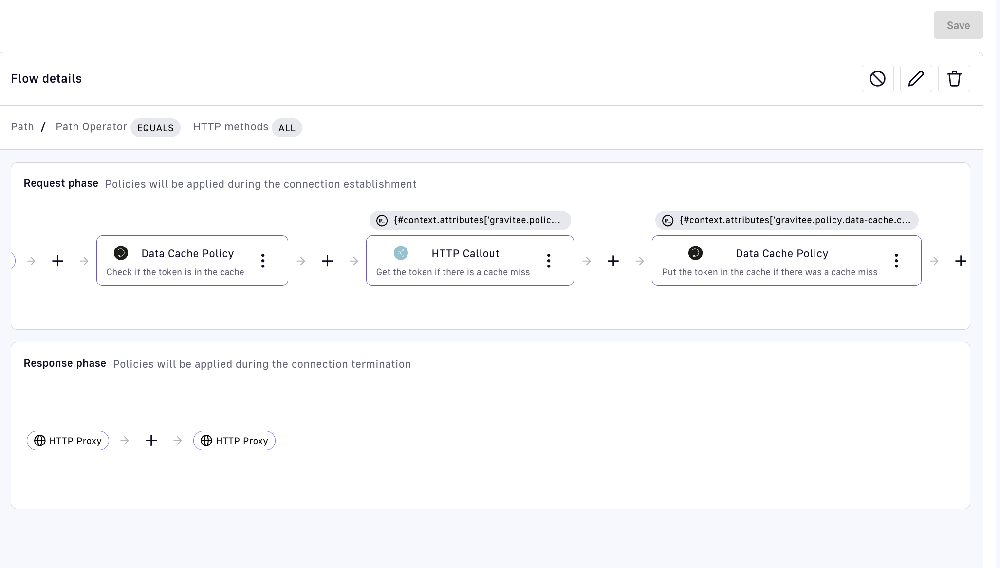
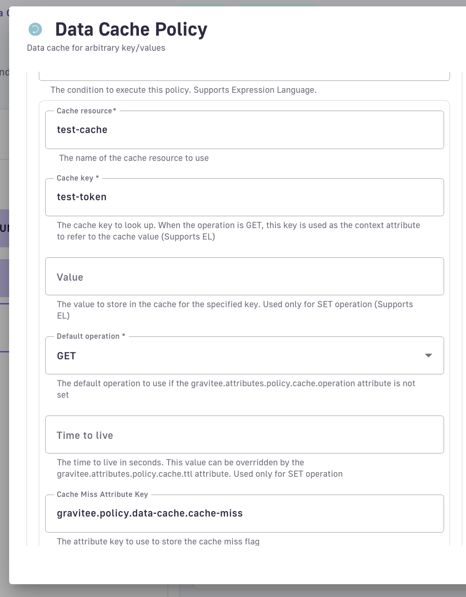
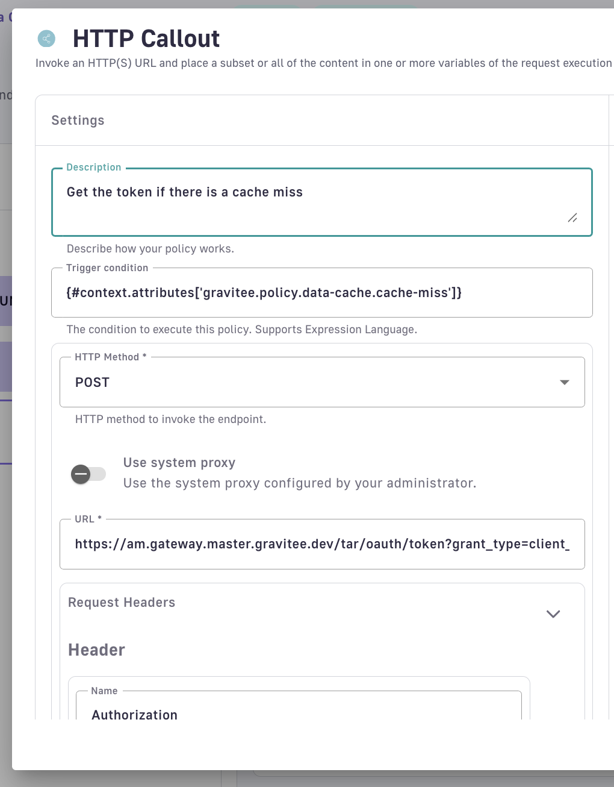
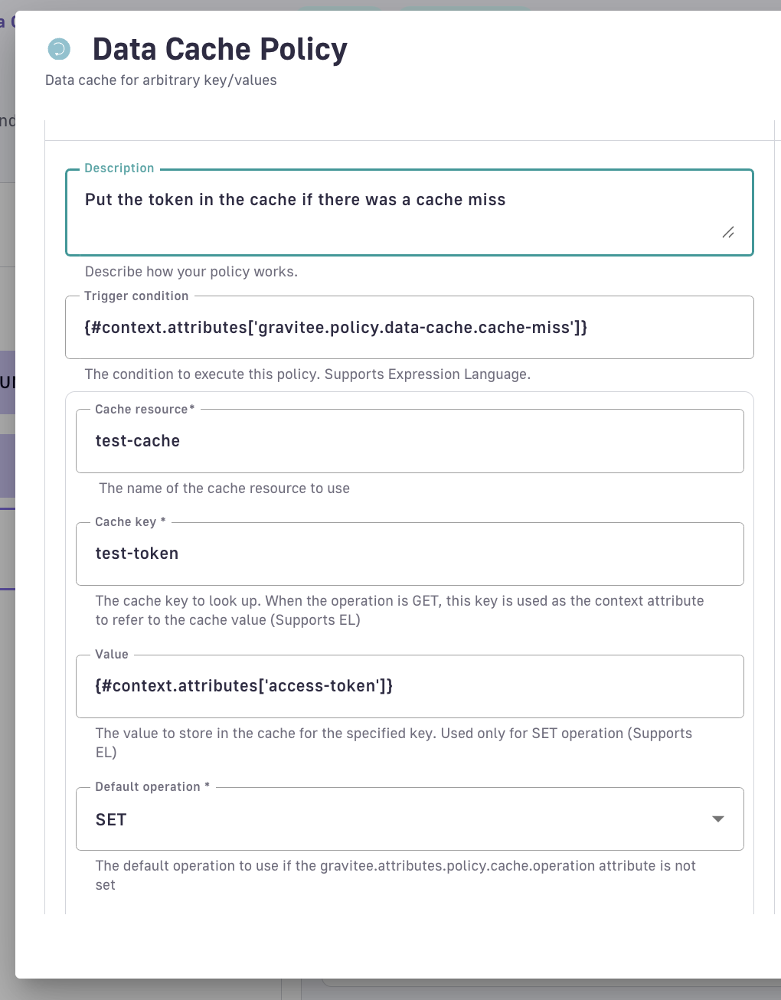

# Data Cache

## Overview

The Data Cache policy allows you to get, set, and expire arbitrary key-value pairs in a cache resource. You can use this policy to:

* Obtain an authentication token and store it in the cache before passing it to the HTTP callout policy, so that you don't have to obtain the token on every call.
* Maintain state in the gateway to track the number of tokens passed to an upstream LLM proxied by the API.
* Restrict the number of ongoing connections to an endpoint in order to protect a legacy backend from overload.

## Prerequisites

Before you configure Redis as a rate limit repository, ensure the following requirements are met:

* Gravitee API Management 4.12 or later
* Java 21 runtime (required for `gravitee-resource-cache-redis` 3.x)
* Redis 3.2 or later (Standalone/Sentinel) or Redis 3.0 or later (Cluster)
* For Redis Cluster rate limiting: All cluster nodes must be reachable from the gateway
* For multi-certificate PEM keystores: Certificate and key file paths must be accessible to the gateway process

## Basic Usage

1. Create a [cache resource](../resources.md#cache) for the policy to use.
2. Specify the cache key to use for getting, setting, or expiring. The key name is dynamic and can be set using expression language.
3. When using the `SET` operation, specify the `value` to set in the cache. The value is also dynamic and supports expression language.

## Manipulating Return Values

Suppose the cache key is named `my-key`. When running the `GET` operation, the value will be accessible in the execution context via the `my-key` context attribute.

For example, in the assign attributes policy, you can modify the value by using `{#context.attributes['my-key']}`. Note that you may need to cast the result to a different data type, as many caches store data in plain text. For example, to increment a value by 1 when it is obtained from Redis, use the expression:

```json
{new Integer(#context.attributes['my-key']) + 1}
```

## Handling Cache Misses

When performing a `GET` operation, the policy will set a context attribute to `true` or `false` depending on whether the key was found in the cache or not. The name of the attribute is defined by the `Cache Miss Attribute Key` field and defaults to `gravitee.policy.data-cache.cache-miss`. You can use this attribute as a condition in other policies. For example:

* In the HTTP Callout policy, you can set the `Trigger condition` field to `{#gravitee.policy.data-cache.cache-miss}`, so as to only trigger the callout when a key is not found in the cache.
* If you want to increment a counter or start at 1 if the value is not found in the cache, you can use the assign attributes policy and set the attribute as:

```json
{#context.attributes['gravitee.policy.data-cache.cache-miss'] ? 1 : new Integer(#context.attributes['my-key']) + 1}
```

## Dynamic Cache Key Names

The name of the cache key is dynamic. For example, if you want to have a key in the cache for every application connecting to the API, then you can set the cache key to `{#context.attributes['application']}`. Later, if you perform a `GET` operation, you can manipulate the return value using `{#context.attributes[#context.attributes['application']}`.

## Shared Connection Pooling

When multiple APIs or resources connect to the same Redis endpoint (matching host, port, credentials, and topology), the gateway creates a single shared Vert.x Redis client with a reference-counted connection pool. The first resource to acquire a connection establishes the pool; subsequent resources reuse it. When the last resource releases its reference, the pool is closed.

Pool sizing parameters are configured gateway-wide in `gravitee.yml` under `resources.cacheRedis.*` or `resources.aiVectorStoreRedis.*`, not per-API. The following parameters control pool behavior:

* **Max Pool Size**
* **Max Pool Waiting**
* **Pool Cleaner Interval**
* **Pool Recycle Timeout**
* **Max Waiting Handlers**
* **Connect Timeout**

### Cache Redis Resource Pool Settings

Configure gateway-wide connection pool parameters for cache-redis resources in `gravitee.yml`:

| Property | Description | Default |
|:---------|:------------|:--------|
| `resources.cacheRedis.maxPoolSize` | Maximum simultaneous connections per Redis endpoint | `6` |
| `resources.cacheRedis.maxPoolWaiting` | Maximum queued requests waiting for a connection | `1024` |
| `resources.cacheRedis.poolCleanerInterval` | Idle-connection cleaner interval (milliseconds) | `30000` |
| `resources.cacheRedis.poolRecycleTimeout` | Idle connection recycle timeout (milliseconds) | `180000` |
| `resources.cacheRedis.maxWaitingHandlers` | Maximum queued commands on a connection | `1024` |
| `resources.cacheRedis.connectTimeout` | TCP connect timeout (milliseconds) | `2000` |

## Deployment Mode Selection

Redis resources support three mutually exclusive deployment modes:

* **Standalone**: Single host/port configuration
* **Sentinel**: High-availability master discovery
* **Cluster**: Horizontal sharding

Standalone mode is the default when neither Sentinel nor Cluster options are configured.

## Example - Caching OAuth Token

Suppose you want to proxy an endpoint that requires an OAuth token, with a different token per client and custom transformation required on the token. So for each client connection to the API, you'll need to get an access token and pass as it in the Authorization header to the upstream endpoint.

You _could_ call the token generation endpoint every time, but if you've already obtained a token for the caller, and the token is still valid, it will be better from a performance point of view to use the same token from the previous request.


The OAuth2 resource already has a built-in caching mechanism, but this example will be relevant if there is custom logic required to modify the access token.


* To start with, add a [cache resource](../resources.md#cache) to the API (Redis or the built-in gateway cache). Then, add a new flow to the API in the policy studio.
* Add a Data Cache policy on the request phase to look up the token in the cache, if it exists.
* If the token does not exist in the cache, make an [HTTP callout](http-callout.md) to the token endpoint.
* Put the new token in the cache (editing it as necessary).
* Add a transform headers policy to set the Authorization header explicitly.

The full example is shown below:



The sequence of policies is as follows:

<figure><figcaption></figcaption></figure>

The configuration for the first data cache policy is:

<figure><figcaption></figcaption></figure>

Then the HTTP Callout policy has a trigger condition representing the attribute. The return value is put in a context variable called `access-token`:

<figure><figcaption></figcaption></figure>

Lastly, if the first policy resulted in a cache miss, put the token from the HTTP callout policy in the cache:

<figure><figcaption></figcaption></figure>



The v4 API definition for the request phase containing the whole flow is as follows, assuming the resource is called `test-cache`:

```json
"request": [
  {
    "name": "Data Cache Policy",
    "description": "Check if the token is in the cache",
    "enabled": true,
    "policy": "data-cache",
    "configuration": {
      "cacheKey": "test-token",
      "resource": "test-cache",
      "cacheMissAttributeKey": "gravitee.policy.data-cache.cache-miss",
      "defaultOperation": "GET"
    }
  },
  {
    "name": "HTTP Callout",
    "description": "Get the token if there is a cache miss",
    "enabled": true,
    "policy": "policy-http-callout",
    "configuration": {
      "headers": [
        {
          "name": "Authorization",
          "value": "Basic {#properties['auth']}"
        }
      ],
      "variables": [
        {
          "name": "access-token",
          "value": "{#jsonPath(#calloutResponse.content, '$.access_token')}"
        }
      ],
      "method": "POST",
      "fireAndForget": false,
      "scope": "REQUEST",
      "errorStatusCode": "500",
      "errorCondition": "{#calloutResponse.status >= 400 and #calloutResponse.status <= 599}",
      "url": "{#properties['token-url']}",
      "exitOnError": false
    },
    "condition": "{#context.attributes['gravitee.policy.data-cache.cache-miss']}"
  },
  {
    "name": "Data Cache Policy",
    "description": "Put the token in the cache if there was a cache miss",
    "enabled": true,
    "policy": "data-cache",
    "configuration": {
      "cacheKey": "test-token",
      "resource": "test-cache",
      "cacheMissAttributeKey": "gravitee.policy.data-cache.cache-miss",
      "defaultOperation": "SET",
      "value": "{#context.attributes['access-token']}"
    },
    "condition": "{#context.attributes['gravitee.policy.data-cache.cache-miss']}"
  },
  {
    "name": "Transform Headers",
    "description": "Set custom authorization header",
    "enabled": true,
    "policy": "transform-headers",
    "configuration": {
      "whitelistHeaders": [],
      "addHeaders": [
        {
          "name": "Authorization",
          "value": "Bearer {#context.attributes['access-token']}"
        }
      ],
      "scope": "REQUEST",
      "removeHeaders": []
    }
  }
]
```



The CRD for the request phase containing the whole flow is as follows, assuming the resource is called `test-cache`:

```yaml
request:
- name: "Data Cache Policy"
  description: "Check if the token is in the cache"
  enabled: true
  policy: "data-cache"
  configuration:
    cacheKey: "test-token"
    resource: "test-cache"
    cacheMissAttributeKey: "gravitee.policy.data-cache.cache-miss"
    defaultOperation: "GET"
- name: "HTTP Callout"
  description: "Get the token if there is a cache miss"
  enabled: true
  policy: "policy-http-callout"
  configuration:
    headers:
    - name: "Authorization"
      value: "Basic {#properties['auth']}"
    variables:
    - name: "access-token"
      value: "{#jsonPath(#calloutResponse.content, '$.access_token')}"
    method: "POST"
    fireAndForget: false
    scope: "REQUEST"
    errorStatusCode: "500"
    errorCondition: "{#calloutResponse.status >= 400 and #calloutResponse.status\
      \ <= 599}"
    url: "{#properties['token-url']}"
    exitOnError: false
  condition: "{#context.attributes['gravitee.policy.data-cache.cache-miss']}"
- name: "Data Cache Policy"
  description: "Put the token in the cache if there was a cache miss"
  enabled: true
  policy: "data-cache"
  configuration:
    cacheKey: "test-token"
    resource: "test-cache"
    cacheMissAttributeKey: "gravitee.policy.data-cache.cache-miss"
    defaultOperation: "SET"
    value: "{#context.attributes['access-token']}"
  condition: "{#context.attributes['gravitee.policy.data-cache.cache-miss']}"
- name: "Transform Headers"
  description: "Set custom authorization header"
  enabled: true
  policy: "transform-headers"
  configuration:
    whitelistHeaders: []
    addHeaders:
    - name: "Authorization"
      value: "Bearer {#context.attributes['access-token']}"
    scope: "REQUEST"
    removeHeaders: []
```



## Technical Reference

### Phases

| onRequest | onResponse | onMessageRequest | onMessageResponse |
| --------- | ---------- | ---------------- | ----------------- |
| X         | X          |                  |                   |

### Description

Policy to get/set arbitrary key-value pairs in the cache resource.

### Compatibility with APIM

| Plugin version | APIM version  |
| -------------- | ------------- |
| 1.x            | 4.5 to latest |

### Configuration

You can configure the policy with the following options:

| Property              | Required | Description                                                                                                                                     | Type    | Default                               |
| --------------------- | -------- | ----------------------------------------------------------------------------------------------------------------------------------------------- | ------- | ------------------------------------- |
| resource              | X        | The name of the cache resource to use.                                                                                                          | string  | \_                                    |
| cacheKey              | X        | The cache key to look up. When the operation is GET, this key is used as the context attribute to refer to the cache value (Supports EL)        | string  | \_                                    |
| value                 | X        | The value to store in the cache for the specified key. Used only for SET operation (Supports EL)                                                | string  | \_                                    |
| defaultOperation      | X        | The default operation to use if the `gravitee.attributes.policy.cache.operation` attribute is not set.                                          | string  | \_                                    |
| timeToLive            |          | The time to live in seconds. This value can be overridden by the `gravitee.attributes.policy.cache.ttl` attribute. Used only for SET operation. | integer | 3600                                  |
| cacheMissAttributeKey |          | The attribute key to set when a cache miss occurs.                                                                                              | string  | gravitee.policy.data-cache.cache-miss |

#### Value

The usage of the value depends on the operation:

* `SET`: The value to store in the cache.
* `GET`: The attribute key to set with the value from the cache.
* `EVICT`: The attribute key to set with the value from the cache before evict.

In all cases, the value supports EL and is optional. In case of value not provided, the policy will use the attribute with the key `gravitee.policy.data-cache.value`.

### Errors

With the provided default implementation, policy will fail if header `X-Template-Policy` value is equal to configured `errorKey` value.

| Phase            | Code                          | Error template key  | Description                                   |
| ---------------- | ----------------------------- | ------------------- | --------------------------------------------- |
| REQUEST/RESPONSE | `500 - INTERNAL SERVER ERROR` | `NO_CACHE`          | The cache is not found in the cache resource. |
| REQUEST/RESPONSE | `500 - INTERNAL SERVER ERROR` | `NO_CACHE_RESOURCE` | The cache resource is not found.              |

