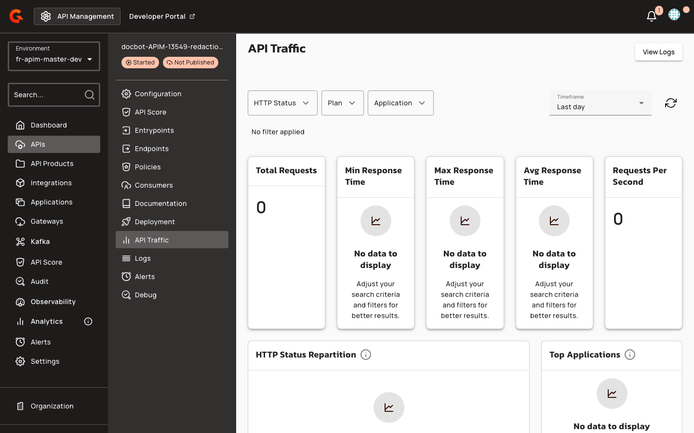
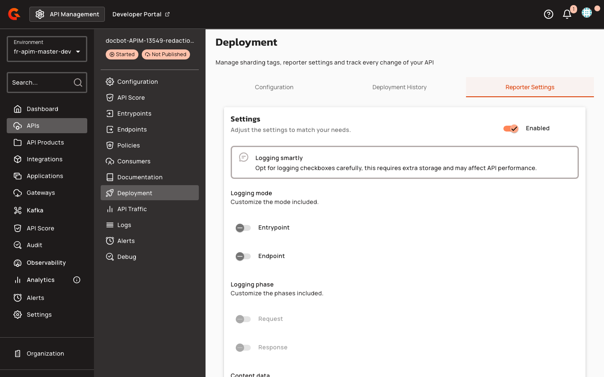

# Configure Span Attribute Redaction Rules in the Console

## Creating Span Attribute Redaction Rules

To create a span attribute redaction rule for a v4 HTTP/Proxy or v4 TCP API:

1. Open the API in the Console.
2. Navigate to **Analytics** and enable **Tracing**, selecting **OpenTelemetry** as the exporter.

    <figure><figcaption></figcaption></figure>

3. Navigate to **Reporter Settings → API Redaction Rules**.

    <figure><figcaption></figcaption></figure>

4. Click **Add rule** to open the redaction rule dialog.
5. Enter an **Attribute Name Pattern** (required). Use glob patterns (`*` for single-segment wildcard, `**` for multi-segment wildcard) or prefix with `regex:` for exact Java regex matching.
6. Select a **Masking Type**: `FULL` or `PARTIAL`.
7. Configure masking options based on the selected type:
   * For **FULL** masking: optionally enter a **Replacement Text** (defaults to `[REDACTED]`).
   * For **PARTIAL** masking:
     * Enter **Visible Prefix (chars)** (defaults to `0`). Must be a non-negative integer.
     * Enter **Visible Suffix (chars)** (defaults to `0`). Must be a non-negative integer.
     * Enter a **Mask Character** (defaults to `*`). Must be exactly one character.
8. (Optional) Enter a **Value Filter** regex to apply the rule only when the attribute value matches the pattern.
9. Click **Add** to save the rule.
10. Deploy the API.


For PARTIAL masking, the dialog displays a live preview showing the masking applied to the sample string `ABCDEFGHIJ1234`.



If you attempt to add a rule with an **Attribute Name Pattern** that already exists for the API, the Console displays the error: `"A rule with this pattern already exists."`


### Managing Redaction Rules

The **API Redaction Rules** table displays all configured rules with the following columns:

* **#**: Rule number
* **Attribute Pattern**: The attribute name pattern
* **Masking**: The masking type and configuration
  * FULL: `"FULL → \"[replacement]\""` (displays the replacement text)
  * PARTIAL: `"PARTIAL prefix N · suffix M · char \"C\""` (displays prefix length, suffix length, and mask character)
* **Value Filter**: The optional value pattern regex
* **Actions**: Edit and Delete icons


Global redaction rules are always applied first. Rules defined here are API-specific and are appended after them.


To edit a rule, click the **Edit** icon in the **Actions** column. To delete a rule, click the **Delete** icon.

Rules are evaluated in order. The first matching rule wins.


For APIs with `definitionContext.origin === 'KUBERNETES'`, redaction rules are displayed in read-only mode.


When no redaction rules are configured, the table displays the message: `"No redaction rules — span attributes are exported as-is."`
