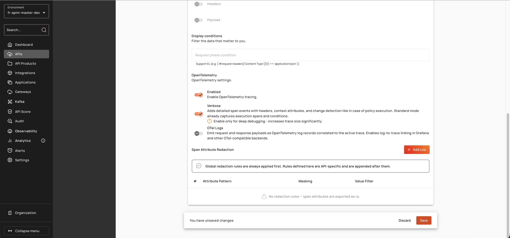
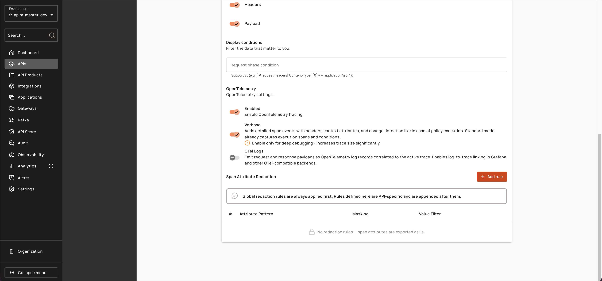
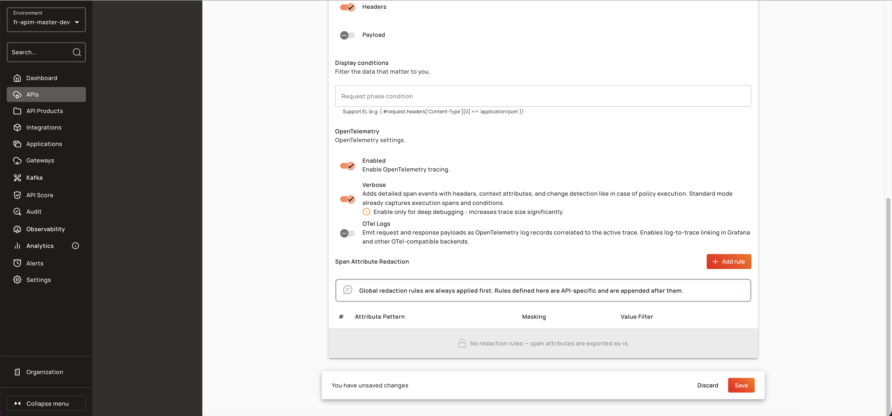

# Configuring API-Specific Redaction Rules in the Console

## Creating API-Specific Redaction Rules

To configure redaction rules for a specific v4 HTTP/Proxy or v4 TCP API:

1. Open the API in the Console and navigate to **Analytics → Tracing**.
2. Enable tracing and select the OpenTelemetry exporter.
3. Navigate to **Reporter Settings → Proxy** to access the Span Attribute Redaction section.


The Span Attribute Redaction section is visible only when both `tracing.enabled` and `tracing.verbose` are `true`.


4. Click **Add Rule** to open the redaction rule dialog.

    <figure><figcaption></figcaption></figure>

5. Enter an **Attribute Name Pattern** (e.g., `http.request.header.authorization`).
6. Select a **Masking Type** (`FULL` or `PARTIAL`).
7. Configure the masking parameters:
    - For FULL masking, optionally specify a **Replacement Text** (defaults to `[REDACTED]`).
    - For PARTIAL masking, specify **Visible Prefix**, **Visible Suffix**, and **Mask Character** (defaults to `*`).
8. Optionally add a **Value Filter** regex to apply the rule only when the attribute value matches the pattern.
9. Save the rule and deploy the API.

API-specific rules are appended after global rules and take precedence for matching attributes.

<figure><figcaption></figcaption></figure>

<figure><figcaption></figcaption></figure>

## Managing Redaction Rules

The Span Attribute Redaction section displays a table of configured rules with the following columns:

| Column | Content |
|:-------|:--------|
| # | Rule index (1-based) |
| Attribute Pattern | `attributeNamePattern` (displayed as code) |
| Masking | Badge with type label and detail string |
| Value Filter | `valuePattern` (displayed as code) or `—` if empty |
| Actions | Edit and Delete buttons |

The masking column shows:
- **FULL**: `FULL` badge + `→ "{replacement}"` detail
- **PARTIAL**: `PARTIAL` badge + `prefix {N} · suffix {N} · char "{char}"` detail

Click **Edit** to modify a rule or **Delete** to remove it.


Global redaction rules are always applied first. Rules defined here are API-specific and are appended after them.


When the API definition context origin is `KUBERNETES`, the section is read-only and no Add/Edit/Delete buttons are displayed.

## End-User Configuration

Navigate to **API Console → Reporter Settings → Proxy** to configure span attribute redaction for a specific API. The Span Attribute Redaction section is visible only when both `tracing.enabled` and `tracing.verbose` are `true`.

1. Click **Add Rule** to open the redaction rule dialog.
2. Enter an **Attribute Name Pattern** in the text field. Use short names (no dots) to match any namespace, `*` for single-segment wildcards, `**` for multi-segment wildcards, or prefix with `regex:` for exact regex matching.
3. Select a **Masking Type** from the dropdown: `FULL` or `PARTIAL`.
4. For FULL masking, optionally enter a **Replacement Text** (leave blank to use the default `[REDACTED]`).
5. For PARTIAL masking, enter a **Visible Prefix** (number of leading characters to keep visible, default `0`).
6. For PARTIAL masking, enter a **Visible Suffix** (number of trailing characters to keep visible, default `0`).
7. For PARTIAL masking, enter a **Mask Character** (single character, default `*`).
8. Optionally enter a **Value Filter** regex. The rule will only fire when the attribute value matches this pattern.
9. Review the live preview (for PARTIAL masking) showing the masking effect on a sample value.
10. Click **Save** to add the rule to the table.

### Redaction Rule Fields

| Field | Description | Example |
|:------|:------------|:--------|
| **Attribute Name Pattern** | Glob-style pattern, short name (no dots), or `regex:`-prefixed Java regex matching the span attribute key | `http.request.header.*` |
| **Masking Type** | `FULL` (replace entire value) or `PARTIAL` (mask middle section) | `FULL` |
| **Replacement Text** (FULL) | Replacement string for FULL masking (defaults to `[REDACTED]`) | `[HIDDEN]` |
| **Visible Prefix** (PARTIAL) | Number of leading characters to keep visible | `2` |
| **Visible Suffix** (PARTIAL) | Number of trailing characters to keep visible | `4` |
| **Mask Character** (PARTIAL) | Single character used to mask the middle section (defaults to `*`) | `*` |
| **Value Filter** | Optional Java regex (partial match). Rule only fires when the attribute value matches this pattern | `^Bearer ` |
