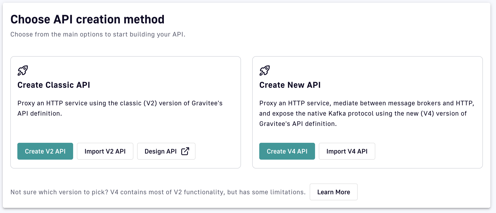

# Kafka

## Overview

The Kafka endpoint **mediates the protocol** between the Kafka cluster and the client that connects over HTTP. The API runtime on the gateway includes an embedded Kafka client that can produce and consume directly to and from the cluster.


This page covers the **Kafka endpoint connector**, which mediates between HTTP-based entrypoints and a Kafka cluster (protocol mediation). The configuration options, record metadata, and attribute keys documented on this page apply to v4 Message APIs that attach this connector.

To proxy a Kafka cluster using the native Kafka protocol (over TCP), use the [Gravitee Kafka Gateway](../../../kafka-gateway/) instead. The attribute keys on this page have no effect on Kafka APIs built on the Kafka Gateway.


This page discusses the [configuration](kafka.md#configuration) and [implementation](kafka.md#implementation) of the Kafka endpoint and includes a [reference](kafka.md#reference) section.

### Routing Modes for Native Kafka APIs

Native Kafka APIs support the following two routing strategies, controlled by the gateway configuration property `kafka.routingMode`:

- **Host routing (SNI-based):** Uses a single bootstrap port for all APIs and routes traffic based on the hostname in the TLS handshake. This is the default mode when `kafka.routingMode` is unset or unrecognized.
- **Port routing:** Assigns each plan a dedicated bootstrap port and broker port range, routing traffic based on the destination port. This mode allows multiple Kafka APIs to coexist on the same gateway instance without requiring distinct hostnames.

Port routing is designed for environments where SNI-based routing is impractical or unavailable. To enable port routing, set `kafka.routingMode=port` in the gateway configuration. For detailed configuration and usage instructions, refer to the [Kafka Gateway documentation](../../../kafka-gateway/).

## Configuration

For the API to connect to the Kafka cluster, it is required to configure a bootstrap server list and, when consuming, a list of topics. You can [override the default configuration](kafka.md#user-content-dynamic-configuration) for the topics at runtime.

### Bootstrap servers

You first define a comma-separated list of host/port pairs to use for establishing the initial connection to the Kafka cluster. This list is used to discover the full set of brokers in the cluster. The client will make use of all discovered brokers, irrespective of which servers are listed in the bootstrap server list.

### Produce, Consume, or Both

You can configure the Kafka client to act as a producer, a consumer, or both a producer and consumer. Choose **Use Consumer**, **Use Producer**, or **Use Consumer and Producer** from the drop-down menu to do one of the following:

* **Use Producer.** The gateway's Kafka client can only produce to the configured topic. Use this option if you want to only allow publishing data to the cluster. This can be used with the HTTP POST and WebSocket entrypoints.
* **Use Consumer.** The gateway's Kafka cluster can only consume messages from the configured topic list. Use this option if you want to allow only consuming data from the cluster. This can be used with the HTTP GET, WebSocket, Webhook, and SSE entrypoints.
* **Use Producer and Consumer.** Clients can both consume from topics and produce messages to topics on the cluster.

### Endpoint security settings

The API client connects to the API proxy through a subscription to a plan, but first, you define the security properties when connecting from the gateway to the cluster. Here, you choose between **PLAINTEXT**, **SASL\_PLAINTEXT**, **SASL\_SSL**, and **SSL** protocols.



No further security configuration is necessary.



Define the following:

1. **SASL mechanism:** Used for client connections. This is GSSAPI, OAUTHBEARER, PLAIN, SCRAM\_SHA-256, or SCRAM-SHA-512.
2. **SASL JAAS Config:** The JAAS login context parameters for SASL connections in the format used by JAAS configuration files.



Define whichever of the following are relevant to your configuration.

**Truststore**

* **PEM with location:** Define the **location of your truststore file**.
* **PEM with certificates:** Define the trusted certificates in the format specified by 'ssl.truststore.type'.
* **JKS with location:** Define the **location of your truststore file** and the **SSL truststore password** for the truststore file.
* **JKS with certificates:** Define the trusted certificates in the format specified by 'ssl.truststore.type' and the **SSL truststore password** for the truststore file.
* **PKCS12 with location:** Define the **location of your truststore file** and the **SSL truststore password** for the truststore file.
* **PKCS12 with certificates:** Define the **trusted certificates** in the format specified by 'ssl.truststore.type' and the **SSL truststore password** for the truststore file.

**Keystore**

* **PEM with location:** Define the **SSL keystore certificate chain** and the location of your keystore file.
* **PEM with key:** Define the **SSL keystore certificate chain** and the **SSL keystore private key** by defining the **Key** and the **Key password**.
* **JKS with location:** Define the **location of your keystore file** and the **SSL keystore password** for the keystore file.
* **JKS with key:** Define the **SSL keystore private key** by defining the **Key** and the **Key password** and the **SSL keystore password** for the keystore file.
* **PKCS12 with location:** Define the **location of your keystore file** and the **SSL keystore password** for the keystore file.
* **PKCS12 with key:** Define the **SSL keystore private key** by defining the **Key** and the **Key password** and the **SSL keystore password** for the keystore file.



### Producer and Consumer Settings

If you chose **Use Producer** or **Use Producer and Consumer**, you define the settings that the gateway's Kafka client will rely on for producing messages to your backend Kafka topic/broker.

If you chose **Use Consumer** or **Use Producer and Consumer**, you define the settings that the gateway's Kafka client will rely on for consuming messages from your backend Kafka topic/broker.



Define the following:

1. **Topics:** The topic that the broker uses to produce messages for each connected client.
2. **Compression type:** Choose the compression type for all data generated by the producer. The options are **none**, **Gzip**, **snappy**, **lz4**, or **zstd**. Anything else throws an exception to the consumer.



Define the following:

1. **Encode message Id:** Toggle this ON or OFF to encode message IDs in base64.
2. **Auto offset reset:** Use the **Auto offset reset** drop-down menu to configure what happens when there is no initial offset in Kafka for the consumer group, or if the current offset no longer exists:
   * **Earliest:** Automatically reset the offset to the earliest offset.
   * **Latest:** Automatically reset the offset to the latest offset.
   * **None:** Throws an exception to the consumer if no previous offset is found for the consumer's group.
   * **Anything else:** Throws an exception to the consumer.
3. **Check Topic Existence:** Choose whether to check if a topic exists before trying to consume messages from it.
4. **Remove Confluent Header:** Choose whether to remove the Confluent header from the message content (for topics linked to a Confluent schema registry).
5. Choose **Specify List of Topics** or **Specify Topic Expression**:
   * **Specify List of Topics:** Provide the topic(s) from which your Gravitee Gateway client will consume messages.
   * **Specify Topic Expression:** Provide a single Java regular expression where only messages from Kafka topics that match the expression will be consumed.



### Kafka record metadata available to EL

Each Kafka record consumed by the gateway carries metadata for the record key, topic, partition, and offset. Extract record metadata with EL using the syntax `{#message.metadata['key']}`. Supported metadata keys are `key`, `topic`, `partition`, and `offset`.


These metadata keys are populated by the connector on every consumed record and exposed to EL through `{#message.metadata}`. For **writable attributes** that the connector reads back to override its runtime behavior, for example, to override the producer topic per message, see [Dynamic configuration](kafka.md#user-content-dynamic-configuration). The Expression Language reference lists every Kafka writable attribute in the [Writable message attributes by endpoint type](../../../gravitee-expression-language.md#writable-message-attributes-by-endpoint-type) section.


### Subscriber Data

For each incoming request, the Kafka endpoint retrieves information from the request to create a dedicated consumer that will persist until the request terminates. The subscription relies on **ConsumerGroup**, **ClientId**, **Topic**, **AutoOffsetReset**, and **Offset selection**.



The consumer group is computed from the request's client identifier and used to load-balance consumption. Kafka doesn't offer a way to manually create a consumer group; a consumer group can only be created through a new consumer instance. See the [Kafka documentation](https://docs.confluent.io/platform/current/clients/consumer.html#concepts) for more information.



A client ID is generated for the consumer per the format `gio-apim-consumer-<first part of uuid>`, for example, `gio-apim-consumer-a0eebc99`.



A topic is retrieved from the API configuration and can be overridden with the attribute `gravitee.attribute.kafka.topics`**.**



The `auto-offset-reset` of the API is managed at the endpoint level and cannot be overridden by request.



By default, the consumer that is created will either resume from where it left off or use the `auto-offset-reset` configuration to position itself at the beginning or end of the topic.

Offsets are determined by partitions, resulting in numerous possible mappings. To mitigate the inherent complexity of offset selection, Gravitee has introduced a mechanism to target a specific position on a Kafka topic.

Given a compatible entrypoint (SSE, HTTP GET), and by using At-Most-Once or At-Least-Once QoS, you can specify a last event ID. The format is encoded by default and follows the pattern:

```yaml
<topic1>@<partition11>#<offset11>,<partition12>#<offset12>;<topic2>@<partition21>#<offset21>,<partition22>#<offset22>...
```

For example, `my-topic@1#0,2#0`.



### Partition on Publish

The only supported method for targeting a specific partition is to define a key and rely on the built-in partitioning mechanism. Kafka's default partitioner strategy uses the key to compute the associated partition: `hash(key) % nm of partition`.

Repeated use of the same key on each message guarantees that messages are relegated to the same partition and order is maintained. Gravitee does not support overriding this mechanism to manually set the partition.

To set a key on a message, the attribute `gravitee.attribute.kafka.recordKey` can be set on the message, in an [Assign Attributes](../../apply-policies/policy-reference/assign-attributes.md) policy in the Publish flow.

A shared producer is created by the endpoint and reused for all requests with that same configuration. The producer configuration includes the **ClientId**, **Topic**, and **Partitioning**. The client ID is generated for the producer in the format `gio-apim-producer-<first part of uuid>`, for example, `gio-apim-producer-a0eebc99`

### Dynamic configuration <a href="#user-content-dynamic-configuration" id="user-content-dynamic-configuration"></a>

The Kafka endpoint includes the dynamic configuration feature, which you can use to complete the following actions:

* Override any configuration parameters using an attribute with the Assign Attribute policy. Your attribute must start with `gravitee.attributes.endpoint.kafka`, and then the property that you want to override. The following are examples of overriding configuration parameters:
  * To override the topic, set `gravitee.attributes.endpoint.kafka.consumer.topics` or `gravitee.attributes.endpoint.kafka.producer.topics` .
  * To override the SASL mechanism, set `gravitee.attributes.endpoint.kafka.security.sasl.saslMechanism` .
* Use EL in any "String" type property. The following example shows how to use EL to populate the consumer autoOffsetReset property:

```json
{
  "name": "default",
  "type": "kafka",
  "weight": 1,
  "inheritConfiguration": false,
  "configuration": {
    "bootstrapServers": "kafka:9092"
  },
  "sharedConfigurationOverride": {
    "consumer": {
      "enabled": true,
      "topics": [ "default_topic" ],
      "autoOffsetReset": "{#request.headers['autoOffsetReset'][0]}"
    }
  }
}
```

Also, you can define specific Kafka client configurations using the [Assign Attributes](../../apply-policies/policy-reference/assign-attributes.md) policy in the Initial Connection-Request/Response phases. Here are examples of defining specific Kafka configurations:

* To override the consumer group, set `gravitee.attribute.kafka.groupId`. If you cannot create consumer groups in your cluster, you may need to set this attribute .
* To override the record key, set `gravitee.attribute.kafka.recordKey`.

## Documentation for Specific Environments

The following situations require special configuration:

* SASL/OAUTHBEARER authentication
* IAM Authentication for MSK
* Azure Event Hubs

The configuration for each case is as follows:



To facilitate support for SASL/OAUTHBEARER, this plugin includes a [login callback handler for token retrieval](https://docs.confluent.io/platform/current/kafka/authentication_sasl/authentication_sasl_oauth.html#login-callback-handler-for-token-retrieval). This handler is configured using the following JAAS configuration:

```bash
"org.apache.kafka.common.security.oauthbearer.OAuthBearerLoginModule required access_token=\"<ACCESS_TOKEN>\";"
```

The access token can be provided using EL to retrieve it from a Gravitee context attribute:

```json
{
  "name": "default",
  "type": "kafka",
  "weight": 1,
  "inheritConfiguration": false,
  "configuration": {
    "bootstrapServers": "kafka:9092"
  },
  "sharedConfigurationOverride": {
    "security" : {
      "protocol" : "SASL_PLAINTEXT",
      "sasl" : {
        "saslMechanism" : "OAUTHBEARER",
        "saslJaasConfig" : "org.apache.kafka.common.security.oauthbearer.OAuthBearerLoginModule required access_token=\"{#context.attributes['gravitee.attribute.kafka.oauthbearer.token']}\";"
      }
    },
    "producer" : {
      "enabled" : true
      "topics" : [ "demo" ],
      "compressionType" : "none",
    },
    "consumer" : {
      "enabled" : true,
      "encodeMessageId" : true,
      "topics" : [ "demo" ],
      "autoOffsetReset" : "latest"
    }
  }
}
```



The Kafka plugin includes the Amazon MSK Library for AWS Identity and Access Management, which enables you to use AWS IAM to connect to their Amazon MSK cluster.

This mechanism is only available with the SASL\_SSL protocol. Once selected, you must provide a valid JAAS configuration. Different options are available depending on the AWS CLI credentials:

* To use the default credential profile, the client can use the following JAAS configuration:

```bash
software.amazon.msk.auth.iam.IAMLoginModule required;
```

* To specify a particular credential profile as part of the client configuration (rather than through the environment variable AWS\_PROFILE), the client can pass the name of the profile in the JAAS configuration:

```bash
software.amazon.msk.auth.iam.IAMLoginModule required  awsProfileName="<Credential Profile Name>";
```

* As another way to configure a client to assume an IAM role and use the role’s temporary credentials, the IAM role’s ARN and, optionally, accessKey and secretKey can be passed in the JAAS configuration:

```bash
software.amazon.msk.auth.iam.IAMLoginModule required awsRoleArn="arn:aws:iam::123456789012:role/msk_client_role" awsRoleAccessKeyId="ACCESS_KEY"  awsRoleSecretAccessKey="SECRET";
```

More details can be found in the library’s [README](https://github.com/aws/aws-msk-iam-auth).



The Kafka endpoint can connect to [Azure Event Hubs](https://azure.microsoft.com/en-us/products/event-hubs) out of the box with no additional installation required. To connect:

* Use the SASL\_SSL as the security protocol, with SASL mechanism `PLAIN`.
* Set the JAAS configuration to the following, replacing `${CONNECTION_STRING}` with the value specified in the next step. Do not change the username value. For more information, see [how to configure the Azure Event Hubs connection string](https://learn.microsoft.com/en-us/azure/event-hubs/event-hubs-get-connection-string).

```bash
org.apache.kafka.common.security.plain.PlainLoginModule required username='$ConnectionString' password='${CONNECTION_STRING}'
```

* The connection string is of the form:

<pre><code><strong>'Endpoint=sb://${TOPIC_NAME}.servicebus.windows.net/;SharedAccessKeyName=RootManageSharedAccessKey;SharedAccessKey=${SHARED_KEY}'
</strong></code></pre>

* To find the connection string value, navigate to **Settings** and then **Shared access policies** in the Azure UI. Click the policy to view its details, and then select **Connection string-primary key**.

<figure><figcaption></figcaption></figure>

* The bootstrap server name is in the format:

```bash
YOUR_NAMESPACE.servicebus.windows.net:9093
```



### Recover Kafka Messages

Kafka messages are acknowledged automatically or manually by the consumer to avoid consuming messages multiple times. To read previous messages requires specifying the offset at which the Kafka consumer should start consuming records. The Kafka entrypoint therefore supports the **at-least-one** or **at-most-one** QoS.

As an example using SSE as an entrypoint, first define the QoS for the entrypoint:

```json
"entrypoints": [
  {
    "type": "sse",
    "qos": "at-least-once",
    "configuration": {
      "heartbeatIntervalInMs": 5000,
      "metadataAsComment": true,
      "headersAsComment": true
    }
  }
]
```

The offset information provided during the Gateway connection must be encoded in base64. It can be passed in plain text by setting the `encodeMessageId` to **false** in the consumer configuration of the Kafka plugin.

The offset information has to respect the convention `<topicName>@<partition-id>#<offset>`.

If the Kafka endpoint manages multiple topics or partitions, you can define multiple offsets using the following convention with a semicolon as the separator:

```
topic1@0#1
topic1@0#1;anotherTopic@1#10
```

Next, initiate SSE consumption by providing the offsets using the `Last-Event-ID` header:

```bash
# generate the Last-Event-ID
LAST_ID=$(echo -n "demo1@0#0" | base64)
# Start the SSE event stream
curl https://${GATEWAY_HOST}:8082/demo/sse/kafka-advanced/plaintext \ 
    -H'Accept: text/event-stream' \
    -H"Last-Event-ID: ${LAST_ID}" 
```

For the HTTP GET entrypoint, the offset can be provided using the `cursor` query parameter:

```bash
curl https://${GATEWAY_HOST}:8082/messages/get?cursor=${LAST_ID}
```

## Technical Reference

Refer to the following sections for additional details.

### Quality Of Service <a href="#user-content-quality-of-service" id="user-content-quality-of-service"></a>

The following table describes the QoS levels supported by the Kafka endpoint:

<table><thead><tr><th width="159.99999999999997">QoS</th><th width="131">Delivery</th><th>Description</th></tr></thead><tbody><tr><td>None</td><td>Unwarranted</td><td>Improve throughput by removing auto commit</td></tr><tr><td>Balanced</td><td>0, 1 or n</td><td>Used well-knowing consumer group and offsets mechanism to balance between performances and quality</td></tr><tr><td>At-Best</td><td>0, 1 or n</td><td>Almost the same as <em>Balanced</em> but doing our best to delivery message once only but depending on entrypoint could rely on extra features to ensure which was the last message sent.</td></tr><tr><td>At-Most-Once</td><td>0 or 1</td><td>Depending on the entrypoint, this level could introduce performance degradation by forcing consumer to commit each message to ensure messages are sent 0 or 1 time.</td></tr><tr><td>At-Least-Once</td><td>1 or n</td><td>Depending on the entrypoint, this level could introduce performance degradation by forcing consumer to acknowledge each message to ensure messages are sent 1 or multiple times.</td></tr></tbody></table>

### Compatibility matrix <a href="#user-content-compatibility-matrix" id="user-content-compatibility-matrix"></a>

The following table shows the compatibility between plugin versions and APIM versions:

| Plugin version | APIM version    |
| -------------- | --------------- |
| 1.x to 2.1.4   | 3.20.x to 4.0.4 |
| 2.2.0 and up   | 4.0.5 to latest |


**Deprecation**

* Gravitee context attribute `gravitee.attribute.kafka.topics` is deprecated and will be removed in future versions. Use `gravitee.attribute.kafka.producer.topics` or `gravitee.attribute.kafka.consumer.topics`.
* Use `gravitee.attribute.kafka.producer.topics` as the message attribute to publish messages to a specific topic.


### Endpoint identifier <a href="#user-content-endpoint-identifier" id="user-content-endpoint-identifier"></a>

To use this plugin, declare the `kafka` identifier when configuring your API endpoints.

### Endpoint configuration <a href="#user-content-endpoint-configuration" id="user-content-endpoint-configuration"></a>

#### General configuration <a href="#user-content-general-configuration" id="user-content-general-configuration"></a>

The following table describes the general configuration attributes for the Kafka endpoint:

<table><thead><tr><th width="179">Attributes</th><th width="100">Default</th><th width="119">Mandatory</th><th>Description</th></tr></thead><tbody><tr><td>bootstrapServers</td><td>N/A</td><td>Yes</td><td>Define the comma-separated list of host/port pairs used to establish the initial connection to the Kafka cluster.</td></tr></tbody></table>

#### Shared Configuration <a href="#user-content-shared-configuration" id="user-content-shared-configuration"></a>



<table><thead><tr><th>Attributes</th><th width="122">Default</th><th width="121">Mandatory</th><th>Description</th></tr></thead><tbody><tr><td>protocol</td><td>PLAINTEXT</td><td>No</td><td>Define your Kafka-specific authentication flow (PLAINTEXT, SASL_PLAINTEXT, SASL_SSL, and SSL).</td></tr><tr><td>sasl.saslMechanism</td><td>N/A</td><td>No</td><td>Define the SASL mechanism (GSSAPI, OAUTHBEARER, PLAIN, SCRAM_SHA-256, or SCRAM-SHA-512).</td></tr><tr><td>sasl.saslJaasConfig</td><td>N/A</td><td>No</td><td>Define the JAAS login context parameters for SASL connections in JAAS configuration file format.</td></tr><tr><td>ssl.trustStore.type</td><td>JKS</td><td>No</td><td>Define the TrustStore type (NONE, PEM, PKCS12, JKS).</td></tr><tr><td>ssl.trustStore.location</td><td>N/A</td><td>No</td><td>Define the TrustStore location.</td></tr><tr><td>ssl.trustStore.password</td><td>N/A</td><td>No</td><td>Define the TrustStore password.</td></tr><tr><td>ssl.trustStore.certificates</td><td>N/A</td><td>No</td><td>Define the TrustStore certificates.</td></tr><tr><td>ssl.keystore.type</td><td>JKS</td><td>No</td><td>Define the KeyStore type (NONE, PEM, PKCS12, JKS).</td></tr><tr><td>ssl.keystore.location</td><td>N/A</td><td>No</td><td>Define the KeyStore location.</td></tr><tr><td>ssl.keystore.password</td><td>N/A</td><td>No</td><td>Define the KeyStore password.</td></tr><tr><td>ssl.keystore.key</td><td>N/A</td><td>No</td><td>Define the KeyStore key.</td></tr><tr><td>ssl.keystore.keyPassword</td><td>N/A</td><td>No</td><td>Define the KeyStore key password.</td></tr><tr><td>ssl.keystore.certificateChain</td><td>N/A</td><td>No</td><td>Define the KeyStore certificate chain.</td></tr></tbody></table>



<table><thead><tr><th>Attributes</th><th width="95">Default</th><th width="124">Mandatory</th><th>Description</th></tr></thead><tbody><tr><td>enabled</td><td>false</td><td>No</td><td>Allow enabling or disabling the producer capability.</td></tr><tr><td>topics</td><td>N/A</td><td>Yes</td><td>List of topics.</td></tr><tr><td>compressionType</td><td>none</td><td>No</td><td>Define the compression type (none, gzip, snappy, lz4, zstd).</td></tr></tbody></table>

The following is an example of how to produce messages:

```json
{
  "name": "default",
  "type": "kafka",
  "weight": 1,
  "inheritConfiguration": false,
  "configuration": {
    "bootstrapServers": "kafka:9092"
  },
  "sharedConfigurationOverride": {
    "producer": {
        "enabled": true,
        "topics" : ["demo"]
    },
    "security": {
      "protocol": "PLAINTEXT"
    }
  }
}
```



<table><thead><tr><th width="189">Attributes</th><th width="101">Default</th><th width="121">Mandatory</th><th>Description</th></tr></thead><tbody><tr><td>enabled</td><td>false</td><td>No</td><td>Allow enabling or disabling the consumer capability.</td></tr><tr><td>topics</td><td>N/A</td><td>No</td><td>The topic(s) from which your Gravitee Gateway client will consume messages.</td></tr><tr><td>topics.pattern</td><td>N/A</td><td>No</td><td>A regex pattern to select topic(s) from which your Gravitee Gateway client will consume messages.</td></tr><tr><td>encodeMessageId</td><td>true</td><td>No</td><td>Allow encoding message IDs in base64.</td></tr><tr><td>autoOffsetReset</td><td>latest</td><td>No</td><td>Define the behavior if no initial offset (earliest, latest, none).</td></tr></tbody></table>

The following is an example of how to consume messages:

```json
{
  "name": "default",
  "type": "kafka",
  "weight": 1,
  "inheritConfiguration": false,
  "configuration": {
    "bootstrapServers": "kafka:9092"
  },
  "sharedConfigurationOverride": {
    "consumer": {
      "enabled": true,
      "topics": [
        "demo"
      ],
      "autoOffsetReset": "earliest"
    }
  }
}
```


