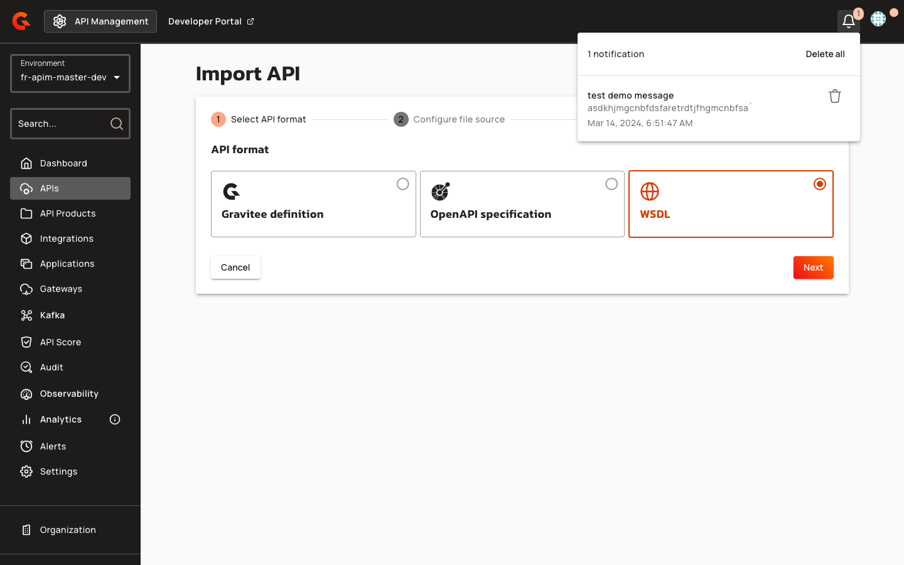
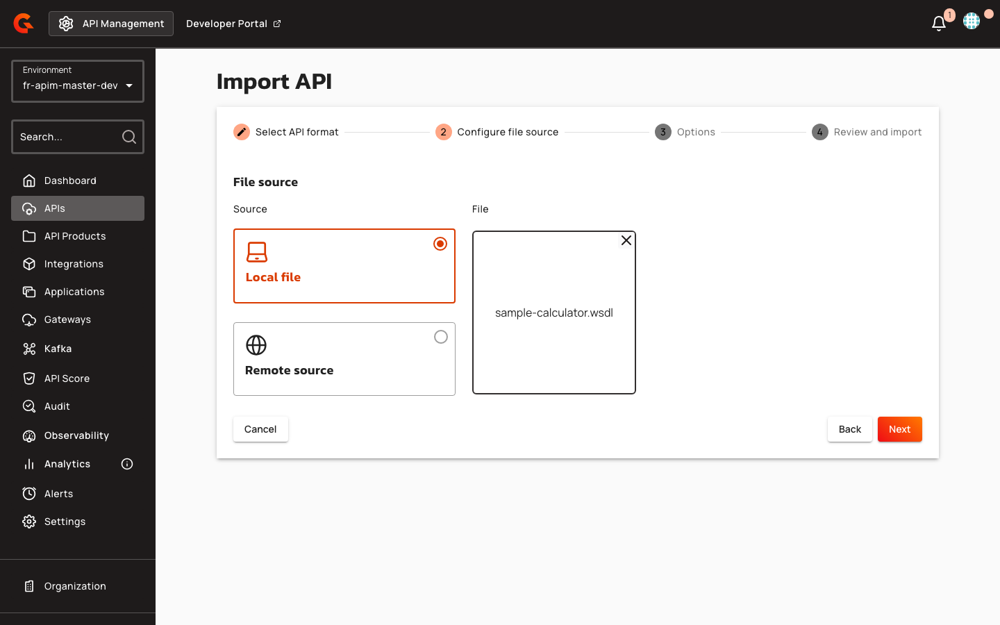
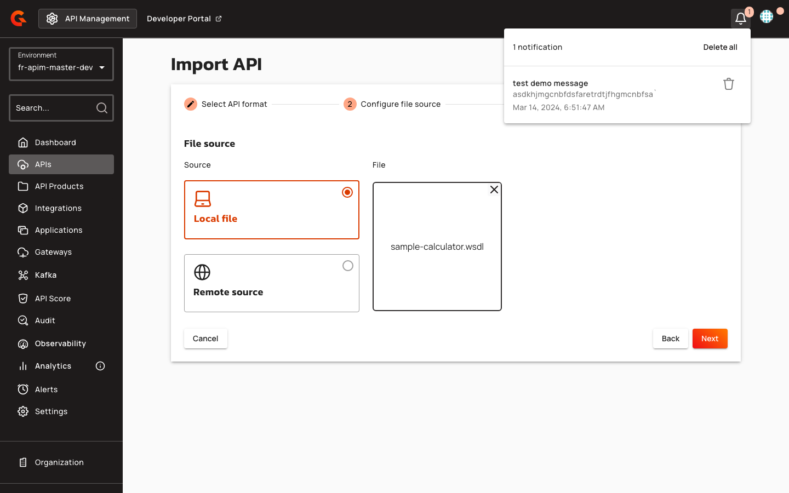

# Creating a v4 API from WSDL in the Console

## Creating a v4 API from WSDL

Navigate to **Import API** in the Console and select the **WSDL** format card. Supported file types are `.wsdl` and `.xml`.

<figure><figcaption></figcaption></figure>

Provide the WSDL content inline (file upload) or as a remote HTTP(S) URL. If using a URL, ensure it is allowed by the import whitelist and private-network settings.

<figure><figcaption></figcaption></figure>

### Import Options

Configure the following import options:

| Option | Description | Default |
|:-------|:------------|:--------|
| **Apply REST to SOAP Transformer policy** | Adds per-operation flows that translate REST/JSON calls to SOAP/XML. Automatically includes the `xml-json` policy. This will overwrite all existing policies. | Enabled (when `rest-to-soap` policy is installed) |
| **Generate a Swagger documentation page** | Publishes a Swagger page from the converted OpenAPI specification (not the raw WSDL). Disabled when REST to SOAP Transformer is off. | Enabled (when REST to SOAP Transformer is on) |
| **Add an OAS Validation policy** | Validates requests and responses against the converted OpenAPI spec. Response validation is ordered after SOAP transformation when policies are enabled. Disabled when REST to SOAP Transformer is off. | Enabled (when REST to SOAP Transformer is on and `oas-validation` policy is installed) |

<figure><figcaption></figcaption></figure>

When the REST to SOAP Transformer toggle is disabled, the dependent options are also disabled:

<figure><figcaption></figcaption></figure>

Review the import settings. The review step displays the REST to SOAP Transformer status as **Enabled** or **Disabled** when the policy is installed.

<figure><figcaption></figcaption></figure>

Click **Import** to create the API.
