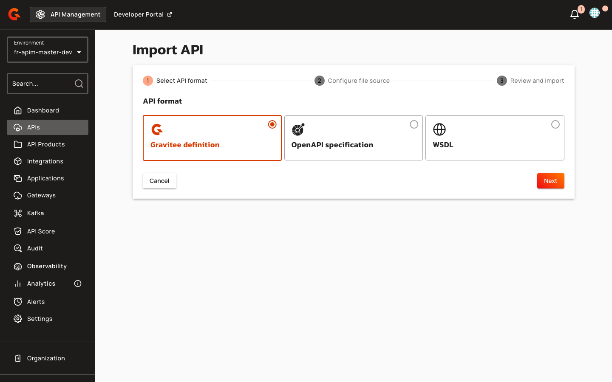

# Import a v4 API from WSDL (Console)

## Creating a v4 API from WSDL

Navigate to **APIs** > **Import API** and select the **WSDL** format card. Supported file types: `.wsdl`, `.xml`.

<figure><figcaption></figcaption></figure>

On the options step, configure the following settings:

1. Toggle **Apply REST to SOAP Transformer policy** to enable or disable REST-to-SOAP transformation. When enabled, this overwrites all existing policies.
2. Toggle **Create documentation page from spec** to generate a Swagger page from the converted OpenAPI specification. This toggle is enabled only when **Apply REST to SOAP Transformer policy** is enabled.
3. Toggle **Add OAS Validation policy** to validate requests and responses against the converted OpenAPI specification. This toggle is enabled only when **Apply REST to SOAP Transformer policy** is enabled and the `oas-validation` policy is installed.

On the review step, verify the **REST to SOAP Transformer** status (Enabled or Disabled) before completing the import.

| Field | Label | Description | Default |
|:------|:------|:------------|:--------|
| `withRestToSoap` | Apply REST to SOAP Transformer policy | This will overwrite all the existing policy. | `true` (when `rest-to-soap` policy installed) |
| `withDocumentation` | Create documentation page from spec | Generate a Swagger documentation page from the converted OpenAPI spec. | `true` (when REST to SOAP Transformer enabled) |
| `withOASValidationPolicy` | Add OAS Validation policy | Add an OAS Validation policy to every flow. | `true` (when REST to SOAP Transformer enabled and `oas-validation` installed) |
