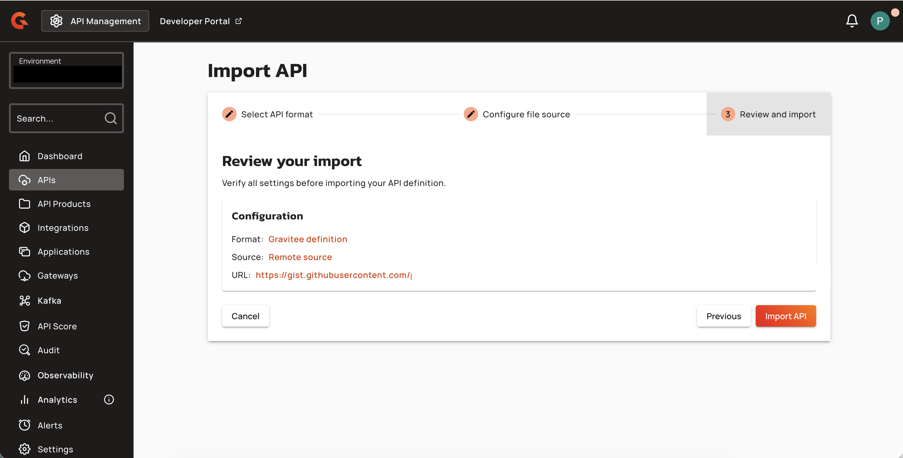
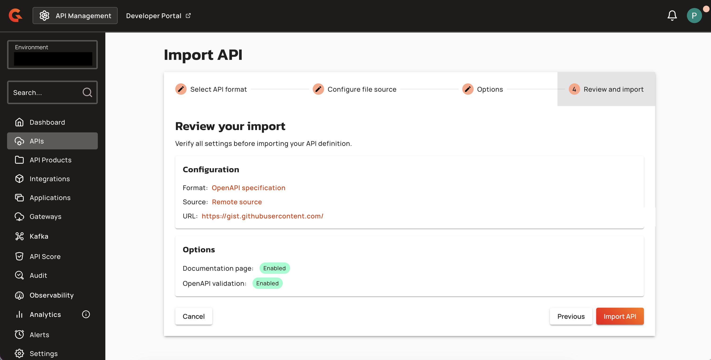

# Import and Update APIs from Remote URLs

## Creating an API from a remote URL

<figure><figcaption></figcaption></figure>

### Gravitee Definition Import

To create an API from a remote Gravitee v4 definition, send a `POST` request to `/environments/{envId}/apis/_import/definition-url` with the URL as a `text/plain` body. The gateway fetches the definition, validates it, and provisions the API. The `ENVIRONMENT_API[CREATE]` permission is required.

<figure><figcaption></figcaption></figure>

**Example request:**

```
POST /environments/DEFAULT/apis/_import/definition-url
Content-Type: text/plain

https://github.com/my-org/api-definitions/raw/main/payment-api.json
```

The response is a `201 Created` with the full `ApiV4` JSON representation.

### OpenAPI/Swagger Import

To create an API from a remote OpenAPI specification, send a `POST` request to `/environments/{envId}/apis/_import/swagger` with an `ImportSwaggerDescriptor` JSON body. Set the `type` field to `'URL'` and provide the specification URL in the `payload` field. Optionally include `withDocumentation` and `withOASValidationPolicy` flags.

<figure><figcaption></figcaption></figure>

<figure><figcaption></figcaption></figure>

**Example request:**

```json
POST /environments/DEFAULT/apis/_import/swagger
Content-Type: application/json

{
  "payload": "https://petstore.swagger.io/v2/swagger.json",
  "type": "URL",
  "withDocumentation": true,
  "withOASValidationPolicy": false
}
```

## Updating an API from a Remote URL

### Gravitee Definition Update

To update an existing API from a remote Gravitee definition, send a `PUT` request to `/environments/{envId}/apis/{apiId}/_import/definition-url` with the URL as a `text/plain` body. The gateway fetches the definition and applies changes to the API identified by `{apiId}`. The `API_DEFINITION[UPDATE]` permission is required. The path parameter `apiId` takes precedence over any `id` field in the fetched definition.

**Example request:**

```
PUT /environments/DEFAULT/apis/my-api-id/_import/definition-url
Content-Type: text/plain

https://github.com/my-org/api-definitions/raw/main/payment-api-v2.json
```

### OpenAPI/Swagger Update

To update an API from a remote OpenAPI specification, send a `PUT` request to `/environments/{envId}/apis/{apiId}/_import/swagger` with an `ImportSwaggerDescriptor` JSON body. Set `type` to `'URL'` and provide the specification URL in `payload`.

**Example request:**

```json
PUT /environments/DEFAULT/apis/my-api-id/_import/swagger
Content-Type: application/json

{
  "payload": "https://petstore.swagger.io/v2/swagger.json",
  "type": "URL"
}
```

## Restrictions

- Remote URL imports support **v4 APIs only**. v2 APIs cannot be created or updated from remote URLs.
- All remote URLs must match at least one pattern in the configured import whitelist.
- Private and link-local IP addresses are rejected unless `allowImportFromPrivate` is enabled.
- The remote endpoint must return valid JSON. Invalid or malformed responses result in an `"Invalid API definition format"` error.
- WSDL remote imports are supported by the backend but not yet exposed in the Console UI for update workflows. Only Gravitee and OpenAPI formats are available in the UI.
- Network failures (e.g., unreachable hosts, timeouts) result in a `TechnicalManagementException` and a user-facing error message: `"Unable to reach the Management API. Please check your network connection and try again."`
