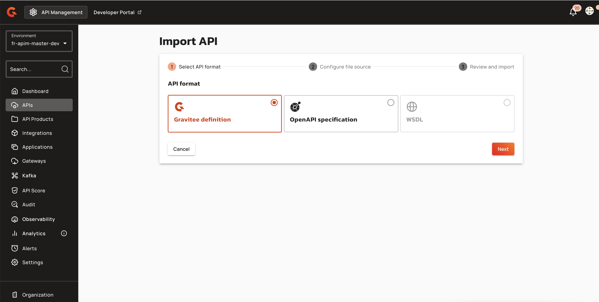
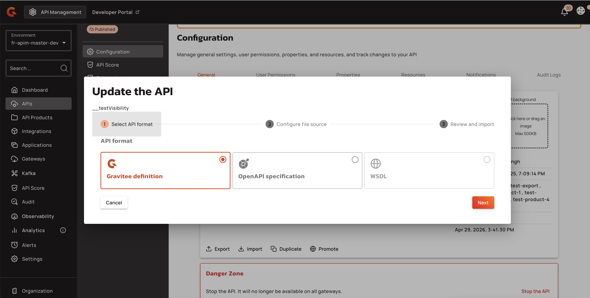
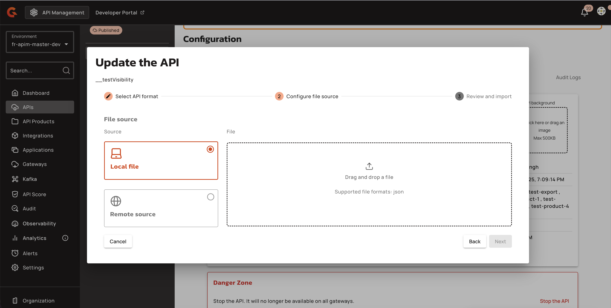
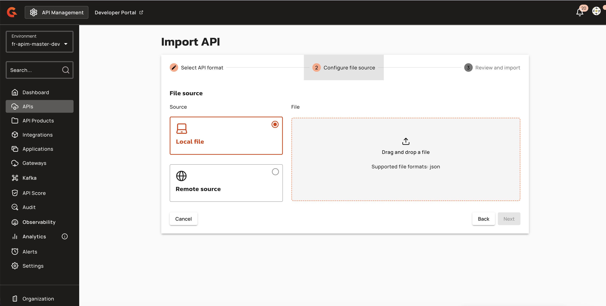
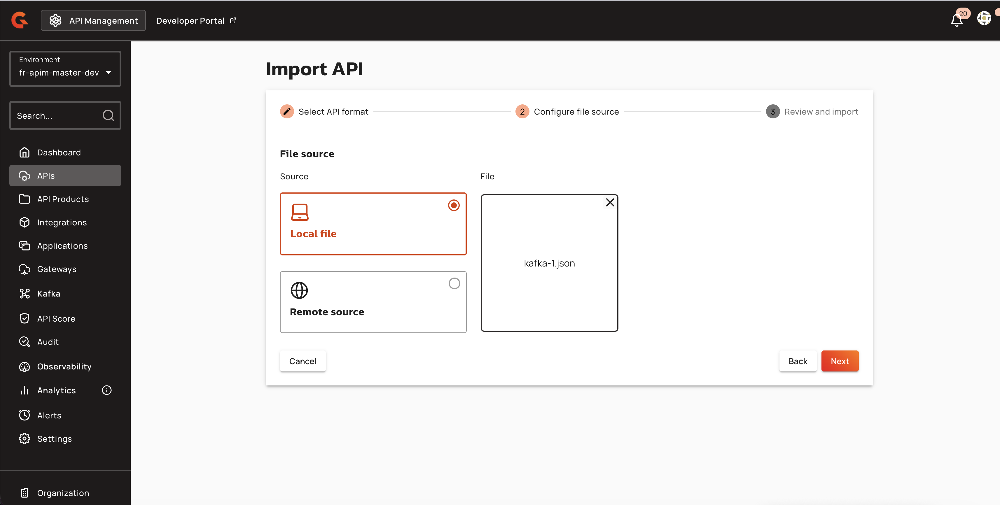
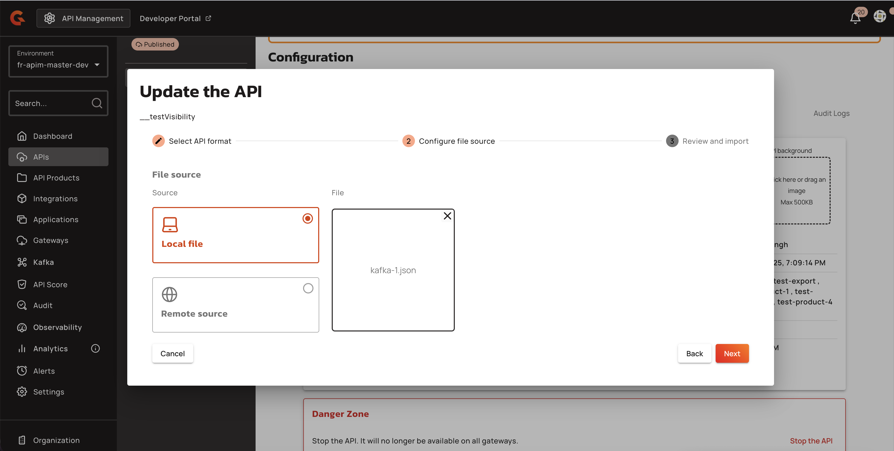
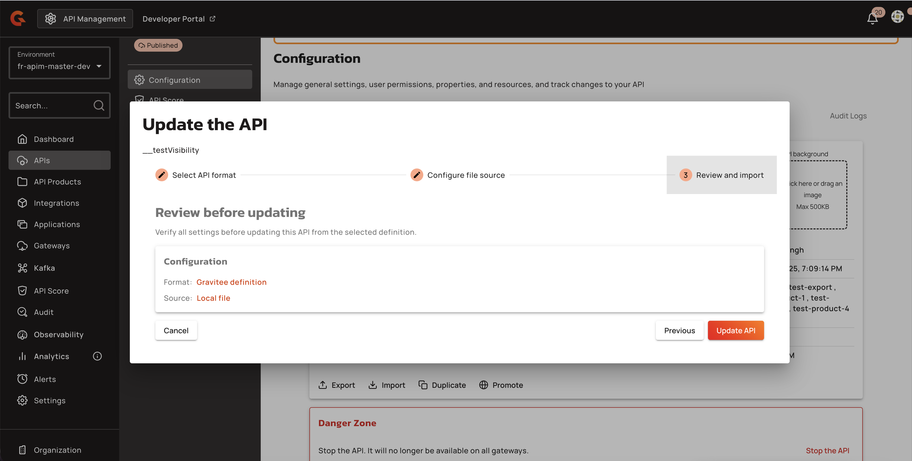

# Import and Update v4 APIs from OpenAPI and Gravitee Definitions

## Overview

API Import/Update enables administrators to create or update v4 APIs by importing a Gravitee v4 API definition or an OpenAPI Specification. The imported file acts as the source of truth and overwrites the API's existing configuration, including endpoints, flows, plans, pages, and metadata. This feature is available for v4 HTTP Proxy, Message, and Native APIs (excluding Federated APIs and Federated A2A agents).

## Key Concepts

### Import Formats

Three import formats are supported in the wizard interface:

* **Gravitee v4 Definition**: Imports a complete API configuration from a JSON or YAML file exported from Gravitee.
* **OpenAPI Specification**: Imports an OpenAPI descriptor (JSON or YAML) and generates flows, endpoints, and optionally documentation and validation policies. Applicable to v4 HTTP Proxy APIs only.
* **WSDL**: Displayed in the wizard but currently disabled (coming soon).

<figure><figcaption></figcaption></figure>

### Import Sources

APIs can be imported from two sources:

* **Local file**: Uploads a definition file from the user's machine via drag-and-drop or file picker.
* **Remote URL**: Fetches the definition from an HTTP or HTTPS endpoint. An optional Authorization header can be provided for authenticated sources. Remote sources require the target URL to allow CORS requests from the Console origin.

### Update Behavior

The import is destructive: the imported file fully overwrites the API's configuration. The API ID, deployment state, and origin metadata are preserved. Plans present in the database but absent from the import are deleted. Pages and flows are matched by identifier or key and updated in place; unmatched items are removed. For OpenAPI imports that contain no Gravitee-specific properties, existing custom properties are preserved. The update is atomic—either fully applied or rejected with validation errors.

## Prerequisites

* User must have `API_DEFINITION[UPDATE]` permission (Management API) or `api-definition-c` permission (Console UI).
* Target API must be a v4 API (v2 APIs use the legacy import dialog).
* API origin must not be Kubernetes (import button is disabled for Kubernetes-managed APIs).
* For OpenAPI imports with OAS Validation policy option: the [OpenAPI Specification Validation policy](../apply-policies/policy-reference/oas-validation.md) must be installed in the gateway.

## Creating or Updating an API

To update an existing v4 API:

1. Open the API in the Gravitee API Console and click **Import** on the API details page.
2. In the **Update API** modal, select the API format:
   * **Gravitee v4 Definition** for a complete Gravitee export.
   * **OpenAPI Specification** for an OpenAPI descriptor.

    <figure><figcaption></figcaption></figure>
3. Choose the file source:
   * **Local file** to upload a `.json`, `.yml`, or `.yaml` file.
   * **Remote URL** to fetch from an HTTP/HTTPS endpoint (optionally providing an Authorization header).

    <figure><figcaption></figcaption></figure>

    <figure><figcaption></figcaption></figure>

    <figure><figcaption></figcaption></figure>

    <figure><figcaption></figcaption></figure>
4. For OpenAPI imports, configure options:
   * Enable **Create documentation page from spec** to generate a Documentation page from the imported specification.
   * Enable **Add OpenAPI Specification Validation policy** to attach the OAS Validation policy to generated flows (enabled by default if the policy is installed).
5. Review the selected format, source, and options.

    <figure><figcaption></figcaption></figure>

    <figure><figcaption></figcaption></figure>
6. Click **Update API**. The API configuration is overwritten atomically; validation errors are surfaced inline and prevent the update.

## Management API

### Update API from Gravitee Definition

**Endpoint**: `PUT /environments/{envId}/apis/{apiId}/_import/definition`

**Request Body**: JSON object conforming to the `ExportApiV4` schema (Gravitee v4 API definition).

**Response**: Updated `ApiV4` object (HTTP 200).

**Permission Required**: `API_DEFINITION[UPDATE]`

### Update API from OpenAPI Specification

**Endpoint**: `PUT /environments/{envId}/apis/{apiId}/_import/swagger`

**Request Body**: `ImportSwaggerDescriptor` object with the following properties:

| Property | Description | Type |
|:---------|:------------|:-----|
| `payload` | OpenAPI specification content (JSON or YAML) | string |
| `withDocumentation` | Create a documentation page from the specification | boolean |
| `withOASValidationPolicy` | Add an OpenAPI Specification Validation policy to generated flows | boolean |
| `withPolicies` | Policy visitor IDs to apply during import | array of strings (unique) |
| `withPolicyPaths` | Create a flow for each path declared in the OpenAPI specification | boolean |

**Response**: Updated `ApiV4` object (HTTP 200).

**Permission Required**: `API_DEFINITION[UPDATE]`

## Restrictions

* WSDL import is displayed in the wizard but currently disabled (coming soon).
* OpenAPI updates are applicable to v4 HTTP Proxy APIs only; other v4 API types (Message, Native) must use Gravitee v4 Definition format.
* Gravitee v4 Definition updates are not supported for Federated APIs or Federated A2A agents.
* Remote URL sources require the target server to allow CORS requests from the Console origin; if CORS is not allowed, the fetch fails with status `0` and the error message: "Could not fetch the remote URL. Check that the URL is reachable and allows CORS requests from this Console."
* Flow ID preservation applies only to HTTP flows with `HttpSelector`; flows are matched by the key `{path}|{sorted_methods}`.
* Plans absent from the import definition are deleted (mimics v2 promotion behavior); closed plans are not yet supported in import/update.
* A second import cannot be started while the first is in progress (enforced by UI state management).
* Image validation is applied only to `apiPicture` and `apiBackground` in the Gravitee definition import endpoint; OpenAPI imports do not validate images.
* The imported definition's type must match the existing API's type (Proxy, Message, or Native); a type mismatch is rejected with HTTP 400.
* File format must match the selected API format: Gravitee v4 Definition requires `.json` files with `MAPI_V2` import type; OpenAPI Specification requires `.yml` or `.yaml` files with `SWAGGER` import type; mismatches trigger the error "The file does not match the selected API format".

## Related Changes

The Import button on the v4 API details page is now enabled and opens a new **Update API** modal that reuses the v4 Import Wizard stepper. For v2 APIs, the button continues to open the legacy import dialog. The wizard includes four steps: Select API Format, Configure File Source, Options (shown only for OpenAPI and WSDL), and Review and Import. The file picker clears the selected file when the API format changes, but preserves it when navigating back within the same format or toggling options. After a successful update, the API configuration reflects the imported definition; for OpenAPI imports with documentation enabled, a new page appears under Documentation → Pages, and with OAS Validation enabled, the OpenAPI Specification Validation policy appears on generated flows in Policy Studio. The gateway sync indicator shows the API as out-of-sync until redeployed, and an audit log entry is recorded for the update action.
